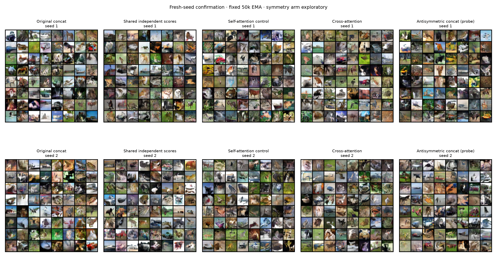
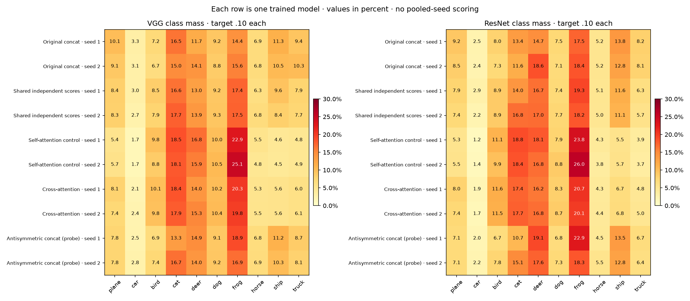
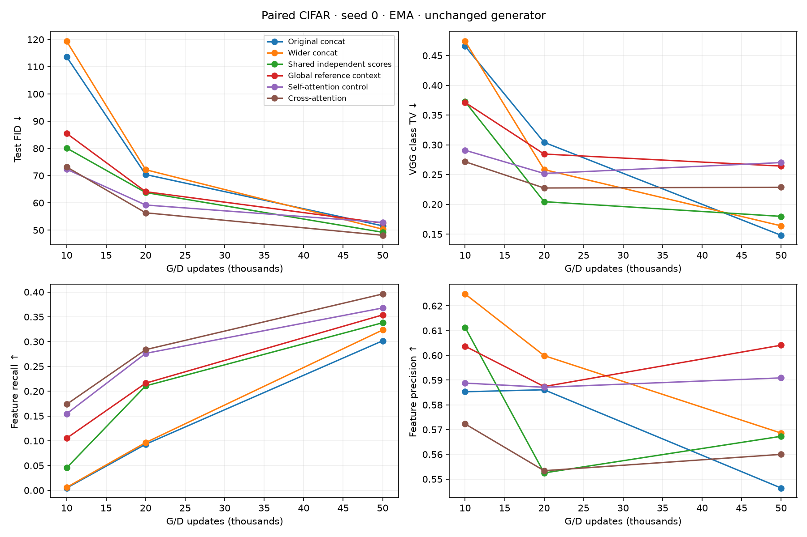
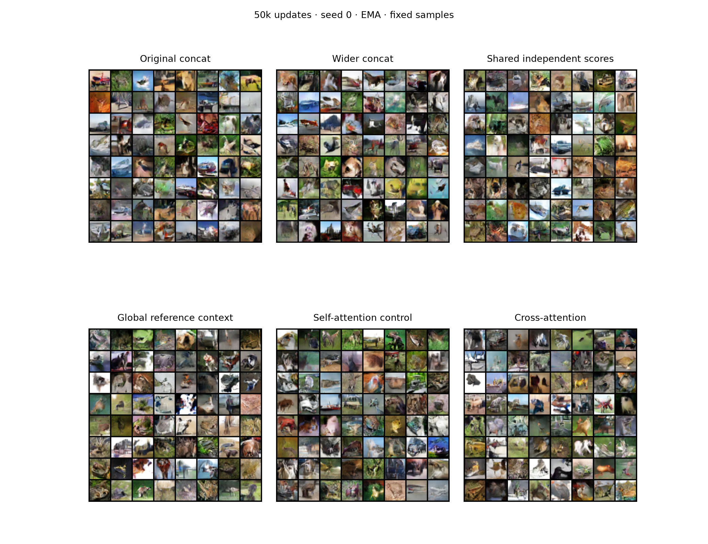

# Paired CIFAR architecture comparisons (#38)

## Result

Cross-attention improves mean FID and feature recall over original paired, but worsens class balance. It beats its matched self-attention control on FID in both fresh seeds. Its mean FID is almost identical to the cheaper independent shared-scoring control. This is evidence of a quality/recall tradeoff, not a demonstrated solution to mode collapse.

Fresh seeds 1 and 2, fixed 50k EMA; means of individual-seed scores. Tuned seed 0 is excluded from this table.

| Architecture | Train FID ↓ | Test FID ↓ | KID ↓ | Precision ↑ | Recall ↑ | VGG TV ↓ | ResNet TV ↓ | Training min/seed |
|---|---:|---:|---:|---:|---:|---:|---:|---:|
| Original concat | 51.95 | 51.68 | 0.03558 | 0.555 | 0.321 | 0.148 | 0.204 | 11.33 |
| Shared independent scores | 49.25 | 48.99 | 0.03690 | 0.574 | 0.353 | 0.180 | 0.223 | 14.77 |
| Self-attention control | 53.68 | 53.69 | 0.03884 | 0.595 | 0.376 | 0.289 | 0.314 | 20.62 |
| Cross-attention | 49.12 | 49.06 | 0.03371 | 0.549 | 0.385 | 0.231 | 0.260 | 21.28 |
| Antisymmetric concat (probe) | 50.91 | 50.68 | 0.03513 | 0.550 | 0.331 | 0.180 | 0.249 | 15.05 |

Cross-attention essentially ties original paired on seed 1 (FID 50.27 vs 50.31), but improves substantially on seed 2 (47.85 vs 53.06). It improves recall in both, while both classifiers report worse class balance. VGG assigns only 2.1–2.4% to cars and about 20% to frogs in the cross-attention runs, versus 3.1–3.3% and 14.4–15.6% respectively for original paired; the target is 10% per class. These are classifier predictions, not ground-truth generated labels.

Independent shared scoring improves FID, precision and recall over original paired in both seeds and has less FID variation in these two runs. Relative to cross-attention it has higher precision and better class balance, but lower recall and worse KID. Its mean KID is also slightly worse than original paired, so its FID gain is not an across-metric win. None of the tested variants improves original paired class TV on either fresh seed.

The targeted symmetry probe is inconsistent: it worsens FID and recall on seed 1, improves both on seed 2, and worsens class TV on both. Its seed-0 probe was also worse than original concat. Enforcing correct slot antisymmetry alone did not produce a reliable improvement in these runs. Self-attention increases recall but has worse FID and much worse class balance than original paired.

EMA improves FID over raw weights for every 50k endpoint in the confirmation set. The raw/EMA table below is descriptive; EMA was fixed before these runs, and class TV does not always improve with EMA.

Cross-attention takes 1.88× the original paired training time and 1.44× independent shared scoring on the measured A10 runs. All deploy the identical one-pass generator, so generator parameter count and inference work are unchanged.

The diagnostics confirm a reference-dependent gradient direction in cross-attention, while shared independent scoring and self-attention have additive logits. Original concat also strongly depends on its reference, so the result cannot be explained by cross-attention merely starting to use the second image. The useful architectural change is not isolated to interaction: shared encoding and relative scoring also change the discriminator. These experiments support retaining independent shared scoring as a strong control and cross-attention as a recall-oriented variant, rather than claiming that richer comparisons solved class underrepresentation.

All fixed sample grids and class-mass plots were inspected. Images remain small and often ambiguous; the grids do not establish a dramatic visual improvement or within-class coverage. Two fresh seeds and previously used data references make this an exploratory result, not untouched validation.

Collected 58 evaluations. 6/6 seed-0 primary endpoints available.

Primary comparison: fresh training for 50k updates, EMA weights, train-reference FID for architecture selection. Raw weights and earlier checkpoints are descriptive. Same generator, BCE, Adam settings, batches, real draws and evaluation noise. Training compute differs and is measured. Held-out reference scores are exploratory, not an untouched final test.

## Seed-0 primary comparison

| Architecture | Train FID ↓ | Test FID ↓ | KID ↓ | Precision ↑ | Recall ↑ | VGG TV ↓ | ResNet TV ↓ |
|---|---:|---:|---:|---:|---:|---:|---:|
| Cross-attention | 48.17080 | 48.08272 | 0.03312 | 0.56000 | 0.39610 | 0.22870 | 0.24660 |
| Shared independent scores | 49.32384 | 49.18964 | 0.03445 | 0.56730 | 0.33810 | 0.17980 | 0.21540 |
| Wider concat | 50.59734 | 50.33014 | 0.03440 | 0.56860 | 0.32350 | 0.16390 | 0.22170 |
| Original concat | 51.78318 | 51.55566 | 0.03484 | 0.54640 | 0.30170 | 0.14800 | 0.21160 |
| Global reference context | 52.67851 | 52.58117 | 0.03809 | 0.60410 | 0.35390 | 0.26430 | 0.26490 |
| Self-attention control | 52.86391 | 52.80322 | 0.03787 | 0.59090 | 0.36790 | 0.27020 | 0.28950 |

## Frozen fresh-seed confirmation

Cross-attention was selected from the six seed-0 arms by train-reference FID. The following recipes, 50k endpoint, EMA weights and evaluation noise were fixed before seeds 1 and 2 ran. No checkpoint or weight selection is made on these seeds. Antisymmetric concat is a separate, targeted exploratory probe. Means below average individual-seed metrics; distributions are never pooled before scoring.

| Architecture | Seed | Train FID ↓ | Test FID ↓ | KID ↓ | Precision ↑ | Recall ↑ | VGG TV ↓ | ResNet TV ↓ |
|---|---:|---:|---:|---:|---:|---:|---:|---:|
| Original concat | 1 | 50.55608 | 50.30728 | 0.03415 | 0.54010 | 0.33430 | 0.14050 | 0.19390 |
| Original concat | 2 | 53.34301 | 53.06266 | 0.03701 | 0.56980 | 0.30670 | 0.15510 | 0.21460 |
| Original concat | mean ± SD | 51.94955 ± 1.97066 | 51.68497 ± 1.94835 | 0.03558 ± 0.00202 | 0.55495 ± 0.02100 | 0.32050 ± 0.01952 | 0.14780 ± 0.01032 | 0.20425 ± 0.01464 |
| Shared independent scores | 1 | 48.98318 | 48.75079 | 0.03684 | 0.56510 | 0.35500 | 0.17030 | 0.21530 |
| Shared independent scores | 2 | 49.51379 | 49.23512 | 0.03696 | 0.58370 | 0.35200 | 0.19000 | 0.23070 |
| Shared independent scores | mean ± SD | 49.24848 ± 0.37519 | 48.99296 ± 0.34247 | 0.03690 ± 0.00009 | 0.57440 ± 0.01315 | 0.35350 ± 0.00212 | 0.18015 ± 0.01393 | 0.22300 ± 0.01089 |
| Self-attention control | 1 | 53.05294 | 53.11492 | 0.03844 | 0.59290 | 0.37120 | 0.28270 | 0.31740 |
| Self-attention control | 2 | 54.31538 | 54.26101 | 0.03923 | 0.59690 | 0.38000 | 0.29590 | 0.31150 |
| Self-attention control | mean ± SD | 53.68416 ± 0.89268 | 53.68797 ± 0.81041 | 0.03884 ± 0.00056 | 0.59490 ± 0.00283 | 0.37560 ± 0.00622 | 0.28930 ± 0.00933 | 0.31445 ± 0.00417 |
| Cross-attention | 1 | 50.27754 | 50.26913 | 0.03461 | 0.53260 | 0.37120 | 0.22860 | 0.25940 |
| Cross-attention | 2 | 47.96034 | 47.84933 | 0.03281 | 0.56590 | 0.39810 | 0.23360 | 0.26020 |
| Cross-attention | mean ± SD | 49.11894 ± 1.63851 | 49.05923 ± 1.71106 | 0.03371 ± 0.00127 | 0.54925 ± 0.02355 | 0.38465 ± 0.01902 | 0.23110 ± 0.00354 | 0.25980 ± 0.00057 |
| Antisymmetric concat (probe) | 1 | 52.90403 | 52.71066 | 0.03616 | 0.53750 | 0.31010 | 0.18250 | 0.26100 |
| Antisymmetric concat (probe) | 2 | 48.91691 | 48.65140 | 0.03411 | 0.56270 | 0.35110 | 0.17790 | 0.23700 |
| Antisymmetric concat (probe) | mean ± SD | 50.91047 ± 2.81932 | 50.68103 ± 2.87033 | 0.03513 ± 0.00145 | 0.55010 ± 0.01782 | 0.33060 ± 0.02899 | 0.18020 ± 0.00325 | 0.24900 ± 0.01697 |

Two fresh seeds measure some initialization sensitivity; they are not a precise estimate of the full seed distribution. Class TV measures classifier label balance, not within-class diversity. Feature recall uses the existing reference/evaluation protocol. Neither metric alone establishes absence of mode collapse.

### Matched changes relative to original concat

EMA at 50k; differences are candidate minus original within each training seed. Negative FID/TV and positive recall favor the candidate.

| Architecture | Seed | Δ train FID | Δ test FID | Δ recall | Δ VGG TV | Δ ResNet TV |
|---|---:|---:|---:|---:|---:|---:|
| Shared independent scores | 1 | -1.57290 | -1.55649 | +0.02070 | +0.02980 | +0.02140 |
| Shared independent scores | 2 | -3.82922 | -3.82754 | +0.04530 | +0.03490 | +0.01610 |
| Self-attention control | 1 | +2.49686 | +2.80764 | +0.03690 | +0.14220 | +0.12350 |
| Self-attention control | 2 | +0.97237 | +1.19835 | +0.07330 | +0.14080 | +0.09690 |
| Cross-attention | 1 | -0.27855 | -0.03816 | +0.03690 | +0.08810 | +0.06550 |
| Cross-attention | 2 | -5.38267 | -5.21333 | +0.09140 | +0.07850 | +0.04560 |
| Antisymmetric concat (probe) | 1 | +2.34795 | +2.40337 | -0.02420 | +0.04200 | +0.06710 |
| Antisymmetric concat (probe) | 2 | -4.42610 | -4.41126 | +0.04440 | +0.02280 | +0.02240 |

### Raw versus EMA at the same endpoint

Descriptive only; the primary weights remain EMA even when raw happens to win.

| Architecture | Seed | Raw FID | EMA FID | Raw recall | EMA recall | Raw VGG TV | EMA VGG TV |
|---|---:|---:|---:|---:|---:|---:|---:|
| Original concat | 0 | 52.34207 | 51.55566 | 0.30400 | 0.30170 | 0.14570 | 0.14800 |
| Original concat | 1 | 52.34923 | 50.30728 | 0.30090 | 0.33430 | 0.15710 | 0.14050 |
| Original concat | 2 | 54.92648 | 53.06266 | 0.28510 | 0.30670 | 0.16190 | 0.15510 |
| Shared independent scores | 0 | 51.25477 | 49.18964 | 0.32730 | 0.33810 | 0.19710 | 0.17980 |
| Shared independent scores | 1 | 51.13964 | 48.75079 | 0.35440 | 0.35500 | 0.19810 | 0.17030 |
| Shared independent scores | 2 | 50.17895 | 49.23512 | 0.33170 | 0.35200 | 0.20180 | 0.19000 |
| Self-attention control | 0 | 56.59718 | 52.80322 | 0.35120 | 0.36790 | 0.27920 | 0.27020 |
| Self-attention control | 1 | 55.90550 | 53.11492 | 0.36820 | 0.37120 | 0.29660 | 0.28270 |
| Self-attention control | 2 | 58.46516 | 54.26101 | 0.37440 | 0.38000 | 0.28800 | 0.29590 |
| Cross-attention | 0 | 49.47837 | 48.08272 | 0.36440 | 0.39610 | 0.22110 | 0.22870 |
| Cross-attention | 1 | 54.12873 | 50.26913 | 0.35410 | 0.37120 | 0.24970 | 0.22860 |
| Cross-attention | 2 | 49.87172 | 47.84933 | 0.39370 | 0.39810 | 0.23570 | 0.23360 |
| Antisymmetric concat (probe) | 0 | 55.10444 | 52.98067 | 0.27380 | 0.27760 | 0.18860 | 0.17670 |
| Antisymmetric concat (probe) | 1 | 55.46468 | 52.71066 | 0.26470 | 0.31010 | 0.19260 | 0.18250 |
| Antisymmetric concat (probe) | 2 | 50.78093 | 48.65140 | 0.34280 | 0.35110 | 0.16800 | 0.17790 |

The symmetry probe's seed-0 50k EMA endpoint: train FID 53.116, test FID 52.981, recall 0.278, VGG TV 0.177. This targeted follow-up is separate from the original six-arm selection.

The probe evaluates 0.5 × (D(A,B) − D(B,A)) with the original concat CNN and unchanged parameter count/initialization. It isolates slot antisymmetry from shared encoders and attention at additional D compute cost. The copied training loop has explicit parity tests and includes the new source in its resume signature.

### Fixed confirmation samples

All 64 saved samples per run, with no filtering. Each column is one frozen architecture; rows are independent training seeds. The fixed latent noise is shared across architectures within this phase, but semantic content is not aligned.

### Predicted class mass by individual seed

## Seed-0 training trajectories

## Reference interaction diagnostics

Hold fake pixels fixed and change the real reference. Additive unary scoring has the same raw-logit gradient direction even though BCE can rescale it. A lower direction cosine or a nonzero four-pair interaction residual shows reference dependence, not necessarily useful comparison or diversity.

| Architecture | Step | Direction cosine | Interaction RMS | Logit RMS | Swap error |
|---|---:|---:|---:|---:|---:|
| Original concat (seed 0) | 10,000 | 0.40123 | 0.48429 | 2.23541 | 5.9238 |
| Original concat (seed 0) | 20,000 | 0.39838 | 0.33612 | 2.08036 | 11.095 |
| Original concat (seed 0) | 50,000 | 0.32487 | 0.55404 | 3.33832 | 22.673 |
| Original concat (seed 1) | 50,000 | 0.10688 | 0.51897 | 3.03899 | 25.54 |
| Original concat (seed 2) | 50,000 | 0.80710 | 0.53158 | 1.93142 | 10.767 |
| Wider concat (seed 0) | 10,000 | 0.41848 | 0.63843 | 2.14571 | 7.993 |
| Wider concat (seed 0) | 20,000 | 0.37982 | 0.42610 | 1.54757 | 6.559 |
| Wider concat (seed 0) | 50,000 | 0.17675 | 0.45181 | 3.09934 | 17.295 |
| Shared independent scores (seed 0) | 10,000 | 1.00000 | 0.00000 | 1.91313 | 0 |
| Shared independent scores (seed 0) | 20,000 | 1.00000 | 0.00000 | 1.69598 | 0 |
| Shared independent scores (seed 0) | 50,000 | 1.00000 | 0.00000 | 4.89137 | 0 |
| Shared independent scores (seed 1) | 50,000 | 1.00000 | 0.00000 | 3.81677 | 0 |
| Shared independent scores (seed 2) | 50,000 | 1.00000 | 0.00000 | 5.39425 | 0 |
| Global reference context (seed 0) | 10,000 | 0.94822 | 0.71198 | 5.43955 | 0 |
| Global reference context (seed 0) | 20,000 | 0.90056 | 0.68742 | 5.37261 | 0 |
| Global reference context (seed 0) | 50,000 | 0.90303 | 0.92055 | 8.33270 | 0 |
| Self-attention control (seed 0) | 10,000 | 1.00000 | 0.00000 | 4.11776 | 0 |
| Self-attention control (seed 0) | 20,000 | 1.00000 | 0.00000 | 5.22706 | 0 |
| Self-attention control (seed 0) | 50,000 | 1.00000 | 0.00000 | 7.03934 | 0 |
| Self-attention control (seed 1) | 50,000 | 1.00000 | 0.00000 | 7.28272 | 0 |
| Self-attention control (seed 2) | 50,000 | 1.00000 | 0.00000 | 7.86328 | 0 |
| Cross-attention (seed 0) | 10,000 | 0.93036 | 0.94208 | 3.24704 | 0 |
| Cross-attention (seed 0) | 20,000 | 0.92695 | 0.73699 | 3.70556 | 0 |
| Cross-attention (seed 0) | 50,000 | 0.90467 | 1.06557 | 4.68398 | 0 |
| Cross-attention (seed 1) | 50,000 | 0.94860 | 0.89963 | 5.10875 | 0 |
| Cross-attention (seed 2) | 50,000 | 0.90259 | 0.99368 | 5.79488 | 0 |
| Antisymmetric concat (probe) (seed 0) | 50,000 | 0.56563 | 0.92100 | 2.35858 | 0 |
| Antisymmetric concat (probe) (seed 1) | 50,000 | 0.72111 | 0.45466 | 2.52918 | 0 |
| Antisymmetric concat (probe) (seed 2) | 50,000 | 0.78046 | 0.49799 | 3.06493 | 0 |

## Cost and provenance

Recorded training 4.69 GPU-hours + evaluation 0.54 = 5.23 GPU-hours. Excludes startup, checkpoint/volume I/O, short verification jobs, untimed diagnostics and coordinator CPU time.

| Architecture | D parameters | Completed steps | Training minutes |
|---|---:|---:|---:|
| concat_seed0 | 666,049 | 50,000 | 11.21 |
| concat_seed1 | 666,049 | 50,000 | 11.20 |
| concat_seed2 | 666,049 | 50,000 | 11.46 |
| concat_wide_seed0 | 707,983 | 50,000 | 14.12 |
| cross_attention_seed0 | 712,770 | 50,000 | 21.42 |
| cross_attention_seed1 | 712,770 | 50,000 | 20.99 |
| cross_attention_seed2 | 712,770 | 50,000 | 21.58 |
| global_context_seed0 | 712,770 | 50,000 | 17.84 |
| self_attention_seed0 | 712,770 | 50,000 | 20.39 |
| self_attention_seed1 | 712,770 | 50,000 | 20.51 |
| self_attention_seed2 | 712,770 | 50,000 | 20.74 |
| shared_difference_seed0 | 662,977 | 50,000 | 14.87 |
| shared_difference_seed1 | 662,977 | 50,000 | 14.83 |
| shared_difference_seed2 | 662,977 | 50,000 | 14.71 |
| symmetric_concat_seed0 | 666,049 | 50,000 | 15.22 |
| symmetric_concat_seed1 | 666,049 | 50,000 | 15.26 |
| symmetric_concat_seed2 | 666,049 | 50,000 | 14.83 |

Orchestration deviation: Modal preempted the confirmation coordinator; its restart stopped at the duplicate-dispatch guard. A CPU-only recovery collector rejoined the 11 saved job IDs without launching training. The original training calls and source signatures were preserved. The GPU budget excludes coordinator CPU time. Details are saved in confirmation_recovery.json and confirmation_recovery_launch.json.

Shared CNN weights are initialized identically across the shared-encoder arms. Self-attention and cross-attention have identical initial parameters; only their source of keys/values differs. Global conditioning has the same total parameter count. All shared arms have an antisymmetric output. Independent shared scoring and self-attention remain additive unary controls.

Attention runs over 8×8 tokens with four heads. Residual scale starts at 0.1 and is learned. The wider concatenation control has about 0.7% fewer parameters than the interaction arms. All methods draw 128 real and fake images for D and another 128 real references and fake images for G each update. At 50k this is 12.8M real draws per arm. Generator architecture and one-pass inference cost are unchanged.

## Fixed samples at the primary endpoint

All 64 fixed samples; no filtering. A comparison across architectures uses the same latent noise, but this does not align generated semantic content.

## Verification and phase status

Complete: 58/58 evaluations, 17/17 complete endpoints; 7/7 CUDA resume checks recorded.

First-batch replay, frozen sources/specs, common dataset, classifier/reference identities and noise protocol are recorded in [verification_report.json](verification_report.json). All required checks passed.
