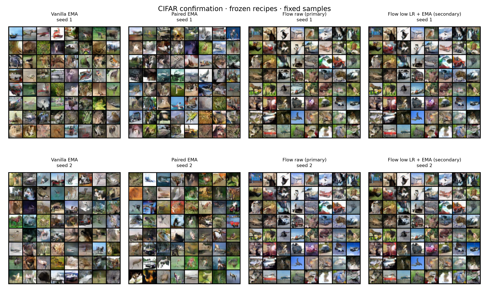
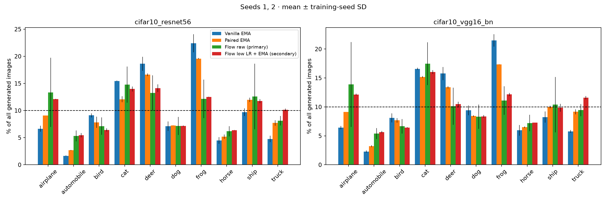

# CIFAR optimization: frozen recipes on new seeds (#37)

Completed optimizer/EMA screening, refinement and confirmation. Seed0 selected recipes; independent training seeds1,2 test those fixed recipes with new evaluation noise99274. No checkpoint, seed or weight selection on confirmation results. Unconditional, uniform sampling; unchanged architectures and adversarial/flow objectives.

## Findings

Weight averaging is the clearest reproducible improvement from this search. The frozen secondary flow recipe (quarter learning rate plus EMA) reaches FID 42.78 and 42.81 on the two new seeds. The primary raw-flow recipe is less reliable: 49.50 and 43.74, versus 42.11 on the tuning seed. We retain both frozen choices rather than changing the primary recipe after seeing confirmation results.

Paired GAN with EMA beats vanilla GAN with EMA on both FID and class TV in both new seeds: mean FID 49.03 versus 51.38 and VGG class TV 0.160 versus 0.238. Its mean feature recall is slightly lower (0.343 versus 0.352), so this supports better category balance without establishing better coverage in every sense.

Vanilla also exposes a limitation of the frozen schedule: its extra 10k updates worsen FID in both seeds. The earlier 50k EMA bases average FID 49.39, compared with 51.38 after the branch. We keep the prescribed endpoint in the primary comparison, but this limits any claim of a large paired-versus-vanilla FID advantage. The paired and flow EMA recipes improve over their corresponding earlier EMA bases in both seeds.

The learning-rate changes do not show a convincing independent benefit. For flow, the same-checkpoint control EMA diagnostic reaches 42.57 and 42.86, essentially matching the quarter-rate EMA recipe. For both GANs the original optimizer remained strongest in screening. Additional flow training and EMA helped; the seed-0 raw-flow improvement did not reproduce consistently.

## Confirmation — fixed choices, seeds1 and2

| Recipe | FID ↓ | KID ↓ | Precision ↑ | Recall ↑ | VGG class TV ↓ | ResNet class TV ↓ |
|---|---:|---:|---:|---:|---:|---:|
| Vanilla EMA | 51.3821 ± 1.1123 | 0.03739 ± 0.00272 | 0.5890 ± 0.0139 | 0.3516 ± 0.0115 | 0.2384 ± 0.0015 | 0.2660 ± 0.0057 |
| Paired EMA | 49.0330 ± 0.4040 | 0.03432 ± 0.00022 | 0.5688 ± 0.0146 | 0.3428 ± 0.0076 | 0.1598 ± 0.0023 | 0.2025 ± 0.0021 |
| Flow raw (primary) | 46.6211 ± 4.0750 | 0.03833 ± 0.00668 | 0.6197 ± 0.0006 | 0.3544 ± 0.0092 | 0.1661 ± 0.0181 | 0.1771 ± 0.0056 |
| Flow low LR + EMA (secondary) | 42.7949 ± 0.0250 | 0.03352 ± 0.00005 | 0.6278 ± 0.0004 | 0.3743 ± 0.0047 | 0.1257 ± 0.0031 | 0.1459 ± 0.0062 |

Mean ± sample SD of two training seeds; this small confirmation is not a strong significance test. Feature recall and predicted class balance are incomplete coverage measures and do not prove within-class diversity. All reference images and classifier identities match earlier reports. Shared data-reference history means this is exploratory, not an untouched test-set claim.

### Individual seeds

| Recipe | Seed | FID | KID | Precision | Recall | VGG TV | VGG acceptance |
|---|---:|---:|---:|---:|---:|---:|---:|
| Vanilla EMA | 1 | 50.5956 | 0.0355 | 0.5792 | 0.3598 | 0.2394 | 0.7674 |
| Vanilla EMA | 2 | 52.1686 | 0.0393 | 0.5988 | 0.3435 | 0.2373 | 0.7572 |
| Paired EMA | 1 | 49.3186 | 0.0342 | 0.5585 | 0.3482 | 0.1581 | 0.7437 |
| Paired EMA | 2 | 48.7473 | 0.0345 | 0.5791 | 0.3374 | 0.1614 | 0.7451 |
| Flow raw (primary) | 1 | 49.5025 | 0.0431 | 0.6201 | 0.3609 | 0.1533 | 0.7229 |
| Flow raw (primary) | 2 | 43.7396 | 0.0336 | 0.6192 | 0.3479 | 0.1789 | 0.7267 |
| Flow low LR + EMA (secondary) | 1 | 42.7772 | 0.0336 | 0.6281 | 0.3709 | 0.1235 | 0.7315 |
| Flow low LR + EMA (secondary) | 2 | 42.8126 | 0.0335 | 0.6276 | 0.3776 | 0.1279 | 0.7382 |

### EMA versus raw at the same checkpoint

| Method / LR | Seed | Raw FID | EMA FID | Raw VGG TV | EMA VGG TV |
|---|---:|---:|---:|---:|---:|
| vanilla / control | 1 | 52.860 | 50.596 | 0.2324 | 0.2394 |
| vanilla / control | 2 | 54.694 | 52.169 | 0.2502 | 0.2373 |
| paired / control | 1 | 50.766 | 49.319 | 0.1599 | 0.1581 |
| paired / control | 2 | 50.118 | 48.747 | 0.1439 | 0.1614 |
| flow / control | 1 | 49.503 | 42.573 | 0.1533 | 0.1244 |
| flow / control | 2 | 43.740 | 42.857 | 0.1789 | 0.1273 |
| flow / lr5e5 | 1 | 46.651 | 42.777 | 0.1180 | 0.1235 |
| flow / lr5e5 | 2 | 41.774 | 42.813 | 0.1504 | 0.1279 |

### Change from each fresh base

The base and branch use the same evaluation noise. This comparison includes extra training and an Adam reset; it does not isolate either intervention. Base raw and EMA scores are both shown to distinguish weight averaging from further training.

| Recipe | Seed | Base raw FID | Base EMA FID | Final recipe FID | Base raw VGG TV | Final recipe VGG TV |
|---|---:|---:|---:|---:|---:|---:|
| Vanilla EMA | 1 | 50.210 | 48.728 | 50.596 | 0.2098 | 0.2394 |
| Vanilla EMA | 2 | 51.801 | 50.049 | 52.169 | 0.2025 | 0.2373 |
| Paired EMA | 1 | 52.859 | 50.764 | 49.319 | 0.1673 | 0.1581 |
| Paired EMA | 2 | 55.050 | 53.434 | 48.747 | 0.1629 | 0.1614 |
| Flow raw (primary) | 1 | 49.637 | 44.975 | 49.503 | 0.1801 | 0.1533 |
| Flow raw (primary) | 2 | 46.412 | 45.065 | 43.740 | 0.1259 | 0.1789 |
| Flow low LR + EMA (secondary) | 1 | 49.637 | 44.975 | 42.777 | 0.1801 | 0.1235 |
| Flow low LR + EMA (secondary) | 2 | 46.412 | 45.065 | 42.813 | 0.1259 | 0.1279 |

## What was tested

- Six GAN optimizer settings per method: original Adam2e-4, half both learning rates, half D only, half G only, cosine decay, lazy gradient penalty.
- Four flow settings: Adam2e-4,1e-4,5e-5, cosine decay; saved flow EMA at50k/80k/100k.
- Screen10k branch updates on seed0; refine each winner and control through30k. Rank by training-reference FID, inspect diversity diagnostics.
- Freeze primary vanilla control/EMA at50k+10k; paired control/EMA at50k+20k; flow control/raw at80k+30k. Freeze quarter-LR flow/EMA at80k+30k as secondary tradeoff.
- Train fresh bases on seeds1,2, branch identically, evaluate fixed choices. All branches reset Adam and explicit sampling RNG, including controls.

EMA decay.999 averages model weights and floating BatchNorm buffers; integer buffers copied. No architectural feature sweep was performed: this bounded search prioritized confirming optimizer/EMA evidence. R1 gamma1 was applied every16D updates with interval scaling; paired penalized all paired-input coordinates. Original GAN controls matched the original implementation in local tests. Fresh flow retains500-step warmup.

## Seed0 discovery versus the previous baseline

| Method | Previous raw best FID (#36) | Selected tuning FID | Selected tuning VGG TV |
|---|---:|---:|---:|
| Vanilla EMA | 49.851 | 49.584 | 0.2462 |
| Paired EMA | 48.371 | 48.232 | 0.1617 |
| Flow raw (primary) | 47.018 | 42.112 | 0.1453 |
| Flow low LR + EMA (secondary) | 47.018 | 43.328 | 0.1194 |

This table is discovery-only: unequal training duration and selection history. In particular flow received30k updates after an80k warm start with optimizer reset; it is not a pure learning-rate improvement. The GAN learning-rate and tested gradient-penalty changes did not beat the original-setting EMA controls.

## Samples

All64 fixed samples from each confirmation seed. No filtering by confidence or appearance.

## Predicted category representation

Bars average the two seeds, with training-seed SD; all TV scores above average individual seed TVs, not pooled distributions.

## Budget and verification

Recorded training 4.94 GPU-hours + evaluation 1.56 = 6.50 GPU-hours. Excludes container startup, checkpoint/commit I/O and tiny verification runs. Parent checkpoints reused from earlier experiments are not charged again.

All79 evaluations have exact first-batch replay flags and matching source/classifier/reference identity; all30 training jobs have matching trainer and dataset provenance. Three CUDA split-run checks and five local tests passed. Weights and data remain in Modal volumes; source, metrics and plots are saved here.

No compute-matching claim: GANs use one D and one G optimization/update; flow one velocity optimization. Paired also consumes real references in G updates. EMA adds no deployment network passes. GAN sampling remains one generator forward; flow remains64 midpoint steps,128 velocity evaluations/image. The tuning work changes neither architecture nor inference cost.

[All candidates](ALL_CANDIDATES.md) · [Machine-readable summary](confirmation_summary.json)

### Cost of reproducing each fixed recipe

Per-seed totals include the fresh base plus its selected branch. Training minutes exclude evaluations. Real-image draws count draws with replacement, not distinct images.

| Recipe | Updates | Real draws | Training minutes, seeds 1 / 2 | Sampling seconds per 10k, seeds 1 / 2 |
|---|---:|---:|---:|---:|
| Vanilla EMA | 60,000 | 7,680,000 | 16.36 / 15.84 | 0.17 / 0.17 |
| Paired EMA | 70,000 | 17,920,000 | 14.05 / 16.03 | 0.18 / 0.17 |
| Flow raw (primary) | 110,000 | 14,080,000 | 56.99 / 61.46 | 93.09 / 92.55 |
| Flow low LR + EMA (secondary) | 110,000 | 14,080,000 | 56.96 / 61.83 | 92.54 / 93.58 |