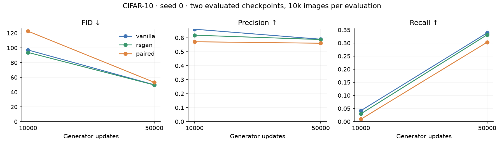
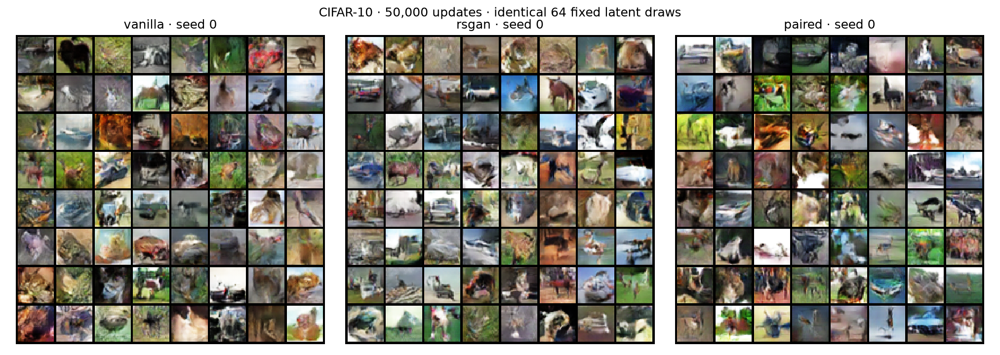

# CIFAR-10 extension: 10k → 50k updates

Same three seed-0 trajectories, resumed from their 10k model/optimizer/RNG checkpoints. No training setting, source, or evaluation protocol changed. Original 10k artifacts are preserved. This is still one seed, not evidence of general superiority.

Each metric uses 10,000 generated images and the same fixed 10,000-real-image training subset. Thus the 50k-update endpoint is still FID-10k, not FID-50k. Precision and recall are Inception feature-space metrics, not class coverage.

| Method | FID 10k → 50k ↓ | KID ×1000 10k → 50k ↓ | Precision 10k → 50k ↑ | Recall 10k → 50k ↑ |
|---|---:|---:|---:|---:|
| vanilla | 97.14 → 49.99 | 85.91 → 37.09 | 0.661 → 0.589 | 0.042 → 0.339 |
| rsgan | 93.83 → 49.70 | 79.62 → 35.65 | 0.618 → 0.587 | 0.030 → 0.331 |
| paired | 122.64 → 53.27 | 108.48 → 35.99 | 0.571 → 0.561 | 0.009 → 0.303 |

Lines connect only the two evaluated checkpoints; intermediate metric values were not measured.

## Fixed samples at 50k

## Fixed samples at 10k

## Verification

All 300 original training-log rows match exactly, including timing. The original generator checkpoint, sample grid, evaluation JSON, source, dependency manifests, and run metadata are unchanged for every method. The earlier CPU and A10 tests separately established exact interrupted-versus-uninterrupted resume for all three methods.

[Full metrics and diagnostics](REPORT.md) · [Protocol](CIFAR10.md) · [Verification](extension_verification.json)
