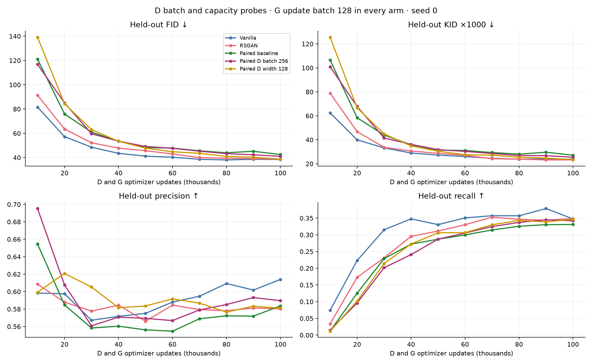
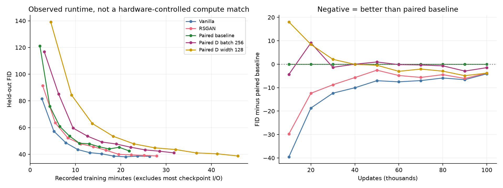
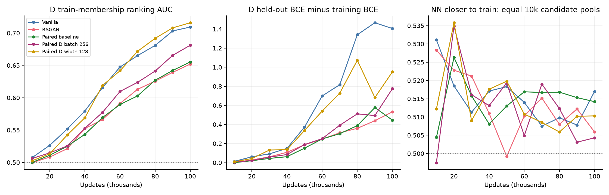
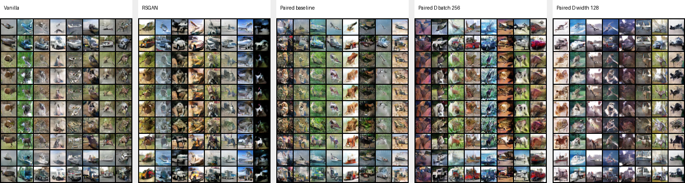

# CIFAR-10: larger D batch and wider D

Two new paired trajectories, seed 0; reuse the three integrity-study baselines. All arms run 100k D and 100k G optimizer updates. G architecture and update batch (128) are unchanged. New paired arms change only D batch or D width, with the BatchNorm side effect documented below.

[Protocol](../../docs/CIFAR10_CAPACITY.md) · [Baseline report](../cifar10-integrity-v1/REPORT.md) · [All metrics](metrics.csv)

## Findings

Doubling only D batch gives a modest final gain: FID 41.05 versus paired baseline 42.53. Its early advantage is inconsistent; 20k and 50k are worse than baseline.

Wider D starts worse at 10k, then improves the later trajectory. At 100k it reaches FID 38.72, nearly matching RSGAN (38.74) and approaching vanilla (38.44). Its KID, precision and recall also closely match RSGAN. This supports capacity as a contributing limitation in this setup, without establishing that it explains the entire optimization gap.

The gains cost more: recorded training time is 31.7 minutes for batch256 and 45.8 for wider D, versus 21.8 for paired baseline, 26.4 for vanilla and 27.9 for RSGAN. Wider D is about four times the original D parameters. No equal-compute advantage is established.

D train/held-out separation grows: final membership-ranking AUC is 0.655 for paired baseline, 0.681 for batch256, and 0.716 for wider D. Better G metrics coexist with more D overfitting. Across all 20 new evaluations, zero exact generated training-image matches were found; approximate memorization is not excluded.

These are single-seed interventions with fixed learning rates. Projection dimension and score scale change when widening, and extra no-gradient G forwards update running BatchNorm statistics in the batch256 arm. More seeds and architectural controls would be needed to establish a general mechanism.

## Endpoints

| Arm | Steps | Held-out FID ↓ | KID ×1000 ↓ | Precision ↑ | Recall ↑ |
|---|---:|---:|---:|---:|---:|
| Vanilla | 10k | 81.611 | 62.511 | 0.5984 | 0.0744 |
| RSGAN | 10k | 91.371 | 78.893 | 0.6085 | 0.0339 |
| Paired baseline | 10k | 121.120 | 106.587 | 0.6546 | 0.0119 |
| Paired D batch 256 | 10k | 116.804 | 100.983 | 0.6952 | 0.0147 |
| Paired D width 128 | 10k | 139.150 | 125.584 | 0.5993 | 0.0116 |
| Vanilla | 50k | 41.192 | 27.232 | 0.5751 | 0.3305 |
| RSGAN | 50k | 45.688 | 28.690 | 0.5661 | 0.3113 |
| Paired baseline | 50k | 48.236 | 31.387 | 0.5562 | 0.2869 |
| Paired D batch 256 | 50k | 49.175 | 31.791 | 0.5694 | 0.2870 |
| Paired D width 128 | 50k | 47.794 | 30.442 | 0.5835 | 0.3061 |
| Vanilla | 100k | 38.436 | 23.738 | 0.6140 | 0.3474 |
| RSGAN | 100k | 38.736 | 23.239 | 0.5804 | 0.3484 |
| Paired baseline | 100k | 42.526 | 27.132 | 0.5837 | 0.3309 |
| Paired D batch 256 | 100k | 41.053 | 25.422 | 0.5896 | 0.3422 |
| Paired D width 128 | 100k | 38.722 | 23.347 | 0.5811 | 0.3468 |

## Budget and integrity

| Arm | D batch | D parameters | G parameters | Recorded training min | Actual GPU |
|---|---:|---:|---:|---:|---|
| Vanilla | 128 real + 128 fake | 661,697 | 1,191,683 | 26.36 | NVIDIA A10 |
| RSGAN | 128 real + 128 fake | 661,697 | 1,191,683 | 27.92 | NVIDIA A10 |
| Paired baseline | 128 pairs | 664,769 | 1,191,683 | 21.84 | NVIDIA A10 |
| Paired D batch 256 | 256 pairs | 664,769 | 1,191,683 | 31.71 | NVIDIA A10 |
| Paired D width 128 | 128 pairs | 2,640,257 | 1,191,683 | 45.83 | NVIDIA A10 |

D batch256 consumes 256 real and 256 fake examples for D, but only 128 fresh generated examples and 128 references for the G update. D width128 keeps both update batches at 128. G uses the same initial weights in both arms; batch256 also preserves initial D weights. Wider D projection dimension and score scale change along with capacity.

The batch256 arm generates D fakes in two no-gradient batches of 128, keeping G forward batch size unchanged. G BatchNorm running statistics consequently update three times per iteration instead of two; there is still only one G optimizer update. The larger D batch also advances the shared slot RNG differently. These are not matched-total-compute experiments.

| Arm at 100k | D train BCE | D held-out BCE | D train acceptance | D held-out acceptance | Membership AUC | Feature NN closer to train | Pixel NN closer to train | Exact copies |
|---|---:|---:|---:|---:|---:|---:|---:|---:|
| Vanilla | 0.099 | 1.504 | 0.975 | 0.550 | 0.709 | 0.517 | 0.541 | 0 |
| RSGAN | 0.102 | 0.635 | 0.961 | 0.771 | 0.652 | 0.506 | 0.538 | 0 |
| Paired baseline | 0.207 | 0.653 | 0.919 | 0.754 | 0.655 | 0.514 | 0.528 | 0 |
| Paired D batch 256 | 0.132 | 0.908 | 0.956 | 0.728 | 0.681 | 0.504 | 0.525 | 0 |
| Paired D width 128 | 0.089 | 1.041 | 0.968 | 0.754 | 0.716 | 0.510 | 0.541 | 0 |

D scores and acceptance tasks are not identically scaled across methods. AUC measures ranking of training versus held-out examples, not calibrated membership-attack accuracy. NN fractions use equal candidate pools of 10,000. Full-train 50k neighbors are retained for copy inspection. No exact copies does not exclude approximate memorization.

## Final class grids

Rows: airplane, automobile, bird, cat, deer, dog, frog, horse, ship, truck. Eight fixed noise vectors repeat across rows and arms. Requested-label rows are not an independent measurement of semantic class accuracy.

## Final nearest-neighbor panels

Each panel shows generated queries with their nearest training and held-out images. Candidate pools in these inspection panels are train50k and held-out10k; the preference statistics above use equal 10k pools.

- D batch256: [Inception neighbors](d_batch256_seed0/nn_inception_100000.png), [pixel neighbors](d_batch256_seed0/nn_pixel_rms_100000.png).
- D width128: [Inception neighbors](d_width128_seed0/nn_inception_100000.png), [pixel neighbors](d_width128_seed0/nn_pixel_rms_100000.png).

## All held-out checkpoints

| Arm | Updates | FID | KID ×1000 | Precision | Recall |
|---|---:|---:|---:|---:|---:|
| Vanilla | 10000 | 81.611 | 62.511 | 0.5984 | 0.0744 |
| Vanilla | 20000 | 57.267 | 39.907 | 0.5975 | 0.2230 |
| Vanilla | 30000 | 48.603 | 33.237 | 0.5672 | 0.3151 |
| Vanilla | 40000 | 43.505 | 28.903 | 0.5717 | 0.3477 |
| Vanilla | 50000 | 41.192 | 27.232 | 0.5751 | 0.3305 |
| Vanilla | 60000 | 40.346 | 26.000 | 0.5880 | 0.3506 |
| Vanilla | 70000 | 38.620 | 24.518 | 0.5947 | 0.3571 |
| Vanilla | 80000 | 38.083 | 23.779 | 0.6093 | 0.3569 |
| Vanilla | 90000 | 38.625 | 24.075 | 0.6018 | 0.3786 |
| Vanilla | 100000 | 38.436 | 23.738 | 0.6140 | 0.3474 |
| RSGAN | 10000 | 91.371 | 78.893 | 0.6085 | 0.0339 |
| RSGAN | 20000 | 63.558 | 46.769 | 0.5880 | 0.1729 |
| RSGAN | 30000 | 52.192 | 33.682 | 0.5776 | 0.2312 |
| RSGAN | 40000 | 47.860 | 30.589 | 0.5845 | 0.2953 |
| RSGAN | 50000 | 45.688 | 28.690 | 0.5661 | 0.3113 |
| RSGAN | 60000 | 43.035 | 27.020 | 0.5845 | 0.3303 |
| RSGAN | 70000 | 39.972 | 24.174 | 0.5794 | 0.3527 |
| RSGAN | 80000 | 39.521 | 23.813 | 0.5780 | 0.3463 |
| RSGAN | 90000 | 39.152 | 23.155 | 0.5812 | 0.3437 |
| RSGAN | 100000 | 38.736 | 23.239 | 0.5804 | 0.3484 |
| Paired baseline | 10000 | 121.120 | 106.587 | 0.6546 | 0.0119 |
| Paired baseline | 20000 | 75.961 | 58.384 | 0.5847 | 0.1253 |
| Paired baseline | 30000 | 60.958 | 43.895 | 0.5583 | 0.2289 |
| Paired baseline | 40000 | 53.560 | 35.808 | 0.5604 | 0.2721 |
| Paired baseline | 50000 | 48.236 | 31.387 | 0.5562 | 0.2869 |
| Paired baseline | 60000 | 47.863 | 31.057 | 0.5546 | 0.2997 |
| Paired baseline | 70000 | 45.610 | 29.331 | 0.5689 | 0.3146 |
| Paired baseline | 80000 | 43.977 | 27.975 | 0.5723 | 0.3256 |
| Paired baseline | 90000 | 45.238 | 29.593 | 0.5719 | 0.3304 |
| Paired baseline | 100000 | 42.526 | 27.132 | 0.5837 | 0.3309 |
| Paired D batch 256 | 10000 | 116.804 | 100.983 | 0.6952 | 0.0147 |
| Paired D batch 256 | 20000 | 85.060 | 67.816 | 0.6077 | 0.0960 |
| Paired D batch 256 | 30000 | 59.623 | 41.440 | 0.5608 | 0.2016 |
| Paired D batch 256 | 40000 | 53.566 | 36.146 | 0.5708 | 0.2408 |
| Paired D batch 256 | 50000 | 49.175 | 31.791 | 0.5694 | 0.2870 |
| Paired D batch 256 | 60000 | 47.682 | 30.267 | 0.5668 | 0.3054 |
| Paired D batch 256 | 70000 | 45.280 | 28.507 | 0.5790 | 0.3247 |
| Paired D batch 256 | 80000 | 43.277 | 26.829 | 0.5852 | 0.3371 |
| Paired D batch 256 | 90000 | 42.301 | 26.703 | 0.5932 | 0.3448 |
| Paired D batch 256 | 100000 | 41.053 | 25.422 | 0.5896 | 0.3422 |
| Paired D width 128 | 10000 | 139.150 | 125.584 | 0.5993 | 0.0116 |
| Paired D width 128 | 20000 | 84.407 | 66.651 | 0.6208 | 0.1018 |
| Paired D width 128 | 30000 | 63.031 | 44.907 | 0.6053 | 0.2141 |
| Paired D width 128 | 40000 | 53.496 | 34.853 | 0.5816 | 0.2724 |
| Paired D width 128 | 50000 | 47.794 | 30.442 | 0.5835 | 0.3061 |
| Paired D width 128 | 60000 | 44.818 | 27.501 | 0.5917 | 0.3064 |
| Paired D width 128 | 70000 | 43.541 | 27.102 | 0.5868 | 0.3300 |
| Paired D width 128 | 80000 | 41.013 | 25.429 | 0.5765 | 0.3431 |
| Paired D width 128 | 90000 | 40.344 | 24.740 | 0.5833 | 0.3385 |
| Paired D width 128 | 100000 | 38.722 | 23.347 | 0.5811 | 0.3468 |

## Reproducibility and limits

58 local tests passed, including actual G/D forward batch assertions, exact baseline replay, and resume. CUDA checks establish exact resume for both arms and exact unchanged-setting replay. All 50 evaluation records use identical references; the new evaluator differs only in its model-factory import. See `verification.json` and `cuda_resume_verification.json`.

Both training runs used A10 GPUs. The final wider-D evaluation allowed fallback GPU types after allocation stalled and was ultimately assigned NVIDIA A10 too; evaluator, weights, references and seeds were unchanged. See its evaluation_runtime_100000.json. A warm-container volume-view issue was corrected with an explicit refresh before the final evaluation.

One seed, no learning-rate retuning, and no confidence interval over training runs. KID subset standard deviation is not a training-run uncertainty estimate. Official test images are excluded from training but repeatedly used for diagnostics. Late checkpoints are correlated; observed minimum FID is descriptive, not an independently validated selection. Historical files and baseline checkpoints are unchanged.
