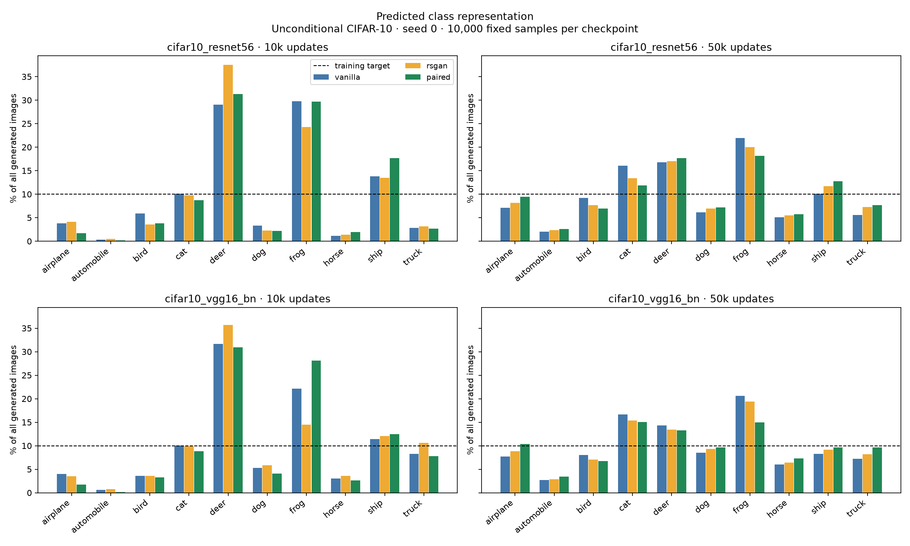
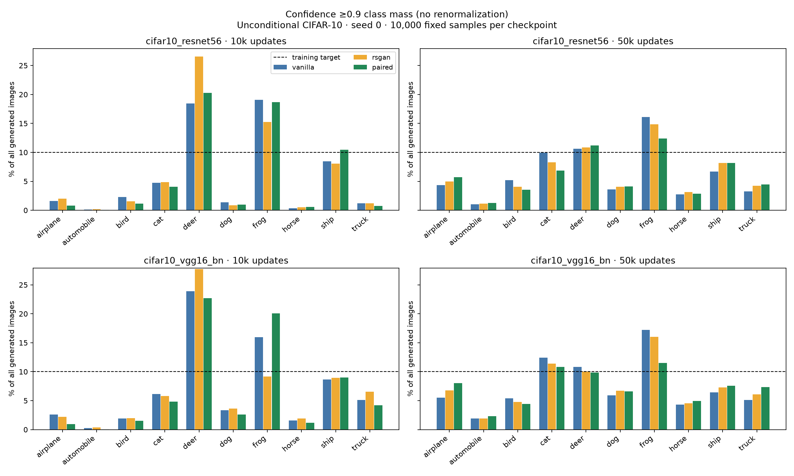

# Unconditional CIFAR-10: retrospective class representation

Existing vanilla, RSGAN and paired checkpoints, seed 0, at 10k and 50k updates. No GAN training or checkpoint changes.

## Interpretation

At 50k, both classifiers rank paired best on raw class TV, followed by RSGAN and vanilla; at 10k, paired ranks worst. All three methods cover all ten predicted classes at the 1% threshold at 50k; at 10k, automobile is below 1% for every method under both classifiers. This is a late class-balance signal that the FID comparison did not expose, not proof of a general quality advantage or the proposed reference-comparison mechanism.

The confidence-filtered result is mixed: at 50k, VGG ranks paired best on augmented TV, while ResNet ranks RSGAN best and paired only slightly ahead of vanilla. Paired has lower confidence acceptance than both baselines under both evaluators. Classifier agreement on generated images at 50k is only 55.82–59.24%, versus 93.93% on real test images. Many gallery images are ambiguous. Thus the agreement on the aggregate raw-TV ranking is encouraging but does not establish accurate semantic proportions. One training seed limits inference.

## Protocol

Regenerate the original FID evaluation draw: 10,000 samples, CPU noise seed 99174, batches of 128, G in eval mode, rounded to uint8. The same noise is used across models and endpoints. CIFAR-10 training classes are exactly balanced (10% each).

Two frozen pretrained classifiers are used as a sensitivity check, not an ensemble: ResNet56 and VGG16-BN from [chenyaofo/pytorch-cifar-models](https://github.com/chenyaofo/pytorch-cifar-models), pinned to commit `786c16252c0fc58ee9adac063f8337cc4a7a497a`. Inputs retain native 32×32 resolution; RGB/255 is normalized by mean [0.4914, 0.4822, 0.4465] and std [0.2023, 0.1994, 0.2010], following the author’s [configuration](https://github.com/chenyaofo/image-classification-codebase/blob/master/conf/cifar10.conf). Official test images are used only for evaluator diagnostics.

Class TV = ½ Σᵢ |qᵢ − 0.1|, where qᵢ is predicted class frequency. Coverage requires ≥1% of all generated samples in a class. Confidence-filtered mass aᵢ counts predictions with max softmax ≥0.9, divided by ALL samples. Augmented TV = ½(Σᵢ |aᵢ − 0.1| + rejected fraction). No accepted-sample renormalization. Threshold sensitivity at 0.5, 0.7, 0.9 and 0.95 is retained in metrics.json.

## Evaluator checks

| Classifier | Real-test accuracy | Real-test class TV | Confidence ≥0.9 |
|---|---:|---:|---:|
| cifar10_resnet56 | 94.37% | 0.0045 | 94.41% |
| cifar10_vgg16_bn | 94.16% | 0.0054 | 96.54% |

## Results

| Classifier | Updates | Method | Class TV ↓ | Classes ≥1% | Acceptance ≥0.9 | Augmented TV ↓ |
|---|---:|---|---:|---:|---:|---:|
| cifar10_resnet56 | 10000 | vanilla | 0.4265 | 9 | 57.7% | 0.5985 |
| cifar10_vgg16_bn | 10000 | vanilla | 0.3523 | 9 | 69.5% | 0.5035 |
| cifar10_resnet56 | 50000 | vanilla | 0.2488 | 10 | 63.6% | 0.4315 |
| cifar10_vgg16_bn | 50000 | vanilla | 0.2163 | 10 | 75.0% | 0.3546 |
| cifar10_resnet56 | 10000 | rsgan | 0.4530 | 9 | 61.1% | 0.6075 |
| cifar10_vgg16_bn | 10000 | rsgan | 0.3281 | 9 | 68.2% | 0.4947 |
| cifar10_resnet56 | 50000 | rsgan | 0.2214 | 10 | 63.8% | 0.4196 |
| cifar10_vgg16_bn | 50000 | rsgan | 0.1818 | 10 | 75.6% | 0.3194 |
| cifar10_resnet56 | 10000 | paired | 0.4874 | 9 | 57.8% | 0.6162 |
| cifar10_vgg16_bn | 10000 | paired | 0.4150 | 9 | 67.0% | 0.5577 |
| cifar10_resnet56 | 50000 | paired | 0.2038 | 10 | 60.6% | 0.4296 |
| cifar10_vgg16_bn | 50000 | paired | 0.1361 | 10 | 73.4% | 0.2897 |

## Limits and inspection

One GAN seed; endpoints share a training trajectory. Classifier accuracy on real images does not establish accuracy on generated images. Softmax confidence is uncalibrated and is not proof that an image is recognizable. The two evaluators share a training dataset and may share errors. These metrics do not measure within-class diversity. No evaluator was selected based on the GAN ranking.

Per-image probabilities and generated uint8 arrays are retained locally and on Modal (ignored by Git). Manifest records source, checkpoint, generated-image and classifier-weight hashes, GPU and software version, real-test confusion matrices, and classifier agreement. Galleries show the first ten samples per predicted class in fixed draw order, without confidence ranking.

- vanilla, 10k: classifier agreement 52.9%; [cifar10_resnet56](vanilla_010000_cifar10_resnet56.png), [cifar10_vgg16_bn](vanilla_010000_cifar10_vgg16_bn.png)
- vanilla, 50k: classifier agreement 58.1%; [cifar10_resnet56](vanilla_050000_cifar10_resnet56.png), [cifar10_vgg16_bn](vanilla_050000_cifar10_vgg16_bn.png)
- rsgan, 10k: classifier agreement 52.7%; [cifar10_resnet56](rsgan_010000_cifar10_resnet56.png), [cifar10_vgg16_bn](rsgan_010000_cifar10_vgg16_bn.png)
- rsgan, 50k: classifier agreement 59.2%; [cifar10_resnet56](rsgan_050000_cifar10_resnet56.png), [cifar10_vgg16_bn](rsgan_050000_cifar10_vgg16_bn.png)
- paired, 10k: classifier agreement 53.5%; [cifar10_resnet56](paired_010000_cifar10_resnet56.png), [cifar10_vgg16_bn](paired_010000_cifar10_vgg16_bn.png)
- paired, 50k: classifier agreement 55.8%; [cifar10_resnet56](paired_050000_cifar10_resnet56.png), [cifar10_vgg16_bn](paired_050000_cifar10_vgg16_bn.png)
