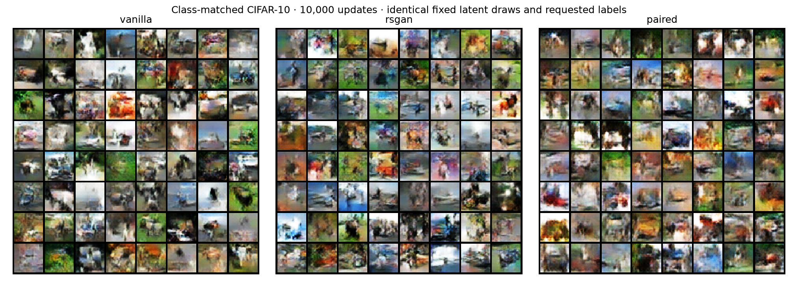
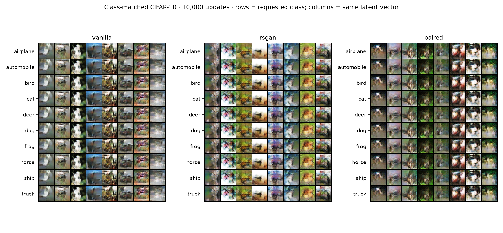
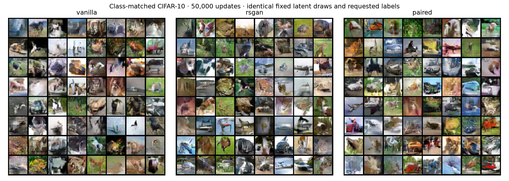
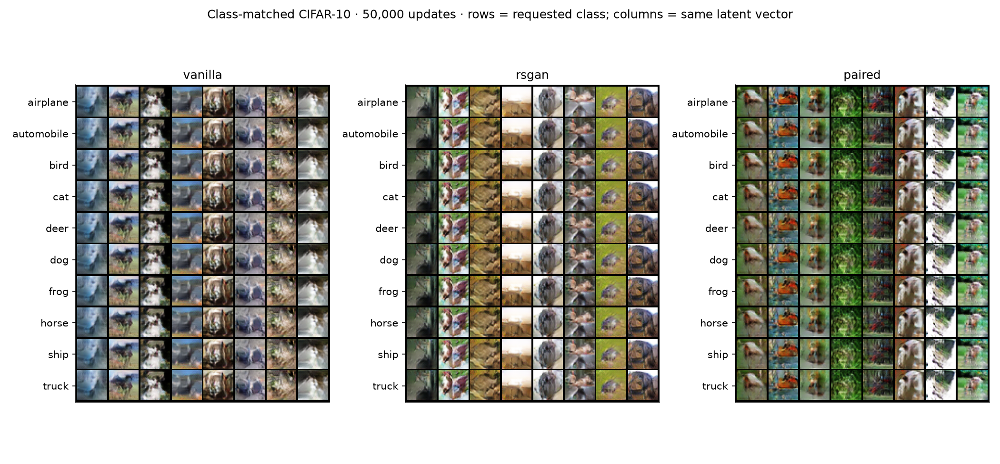

# Class-matched CIFAR-10: seed 0

All three generators receive a one-hot class label. Real references match the requested class for RSGAN and paired; vanilla sees the same class-balanced image batches. Discriminators receive images only, without labels or auxiliary classification losses.

Both 10k and 50k checkpoints come from a single trajectory per method. Each evaluation uses 10,000 generated images (1,000 requested per class) and the same fixed real reference and metrics as before. Lower FID/KID and higher precision/recall are better. These remain FID-10k measurements.

| Updates | Method | FID ↓ | KID ×1000 ↓ | Precision ↑ | Recall ↑ |
|---:|---|---:|---:|---:|---:|
| 10,000 | vanilla | 98.94 | 87.12 | 0.651 | 0.046 |
| 10,000 | rsgan | 100.86 | 87.35 | 0.584 | 0.087 |
| 10,000 | paired | 119.62 | 107.31 | 0.568 | 0.018 |
| 50,000 | vanilla | 51.24 | 37.30 | 0.599 | 0.334 |
| 50,000 | rsgan | 48.60 | 32.98 | 0.555 | 0.347 |
| 50,000 | paired | 50.59 | 35.20 | 0.567 | 0.303 |

## Context: unconditional → class-matched at 50k

This changes generator conditioning/initialization and sampling as well as pair selection; it does not isolate matching alone. Same seed number does not make this a statistically replicated result.

| Method | FID ↓ | KID ×1000 ↓ | Precision ↑ | Recall ↑ |
|---|---:|---:|---:|---:|
| vanilla | 49.99 → 51.24 | 37.09 → 37.30 | 0.589 → 0.599 | 0.339 → 0.334 |
| rsgan | 49.70 → 48.60 | 35.65 → 32.98 | 0.587 → 0.555 | 0.331 → 0.347 |
| paired | 53.27 → 50.59 | 35.99 → 35.20 | 0.561 → 0.567 | 0.303 → 0.303 |

## Interpretation limits

Matching is by requested label; G may ignore that label. Marginal metrics do not measure semantic label adherence. The class grids below repeat identical latent vectors down each column while changing the requested class. Differences across rows show label sensitivity, but only correct class-specific content would demonstrate adherence. One training seed cannot establish a reliable ranking.

[Protocol](CIFAR10_CLASSMATCHED.md) · [All metrics CSV](comparison.csv)

## Label sensitivity in the fixed grids

Mean absolute RGB-pixel difference on a [0,1] scale, measured from the saved grids. Changing labels holds noise fixed; changing noise holds the label fixed. Only eight fixed latent vectors are used. This diagnoses sensitivity, not semantic correctness or conditional accuracy.

| Updates | Method | Change label | Change noise |
|---:|---|---:|---:|
| 10,000 | vanilla | 0.0128 | 0.2485 |
| 10,000 | rsgan | 0.0286 | 0.2751 |
| 10,000 | paired | 0.0234 | 0.2531 |
| 50,000 | vanilla | 0.0179 | 0.2474 |
| 50,000 | rsgan | 0.0329 | 0.2573 |
| 50,000 | paired | 0.0289 | 0.2541 |

A generator that ignores y and samples the real marginal makes the randomized real/fake pair distribution symmetric, so this image-only discriminator has no way to penalize label ignorance at that solution. See the protocol for the density argument.

## 10,000 updates

## 50,000 updates

