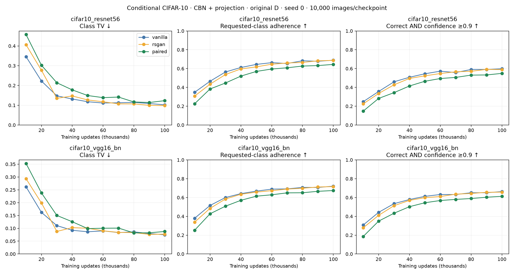
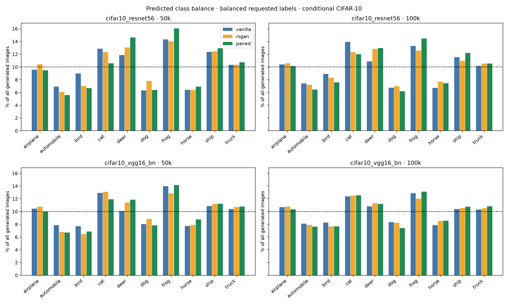

# Conditional CIFAR-10: class representation and adherence

Frozen conditional BatchNorm G + projection D checkpoints from the integrity study, seed 0: vanilla, RSGAN, original paired. Every 10k through 100k; no GAN retraining. D width 64 and batch 128 throughout; the wider-D and doubled-D-batch arms are excluded.

## Findings

Paired has the lowest requested-class adherence at every evaluated checkpoint under both classifiers. At 100k it reaches 64.41% / 67.43% (ResNet / VGG), versus vanilla 68.89% / 72.07% and RSGAN 68.72% / 71.60%. Confident-correct fractions at 100k also favor the baselines. Longer training substantially improves all methods, and paired continues improving through 100k.

At 50k and 100k, vanilla has better marginal class TV than paired under both classifiers. At 100k RSGAN also beats paired under both. Paired has a small VGG-only TV win at 80k, but there is no consistent class-balance advantage across the trajectory. All methods have ten predicted classes above 1% by 50k and at 100k. Thus the unconditional late class-balance ranking does not carry over cleanly to this conditional setup.

At 100k the classifiers agree on 74.30% of vanilla, 74.40% of RSGAN and 71.67% of paired images, versus 93.93% on real test images. This is better agreement than the unconditional audit but still a substantial limitation. Birds and dogs are among the difficult requested classes for all methods; galleries and confusion matrices show ambiguity and class confusion. This result does not test the wider paired D or larger D batch.

## Protocol

10,000 generated images per checkpoint, with 1,000 requests per class (`arange(10000) % 10`), CPU noise seed 99174, batches of 128, G in eval mode, rounded uint8. Generated-image hashes match the earlier integrity evaluation exactly at all 30 checkpoints. The model factory is from `cifar_integrity.py`.

Reuse the two frozen [CIFAR classifiers](https://github.com/chenyaofo/pytorch-cifar-models) from the unconditional audit: ResNet56 and VGG16-BN, pinned commit `786c16252c0fc58ee9adac063f8337cc4a7a497a`, verified weight hashes. Normalization and native 32×32 images unchanged. Neither evaluator provides a GAN training signal.

Class TV = ½Σ|predicted class frequency − 0.1|. Coverage means ≥1% of ALL images assigned to a class. Adherence is the fraction with predicted class equal to requested class; its per-class breakdown and requested/predicted count matrix are retained. Confident-correct is the fraction of ALL images both correctly classified for the request and max softmax ≥0.9. Accepted class mass is likewise divided by ALL images. Augmented TV = ½(Σ|accepted class mass − 0.1| + rejected fraction). Thresholds 0.5/0.7/0.9/0.95 are retained.

Balanced requests prescribe the intended class mix; marginal balance alone cannot establish adherence (even systematically swapped labels can be balanced). Neither class balance nor adherence measures within-class diversity.

## Evaluator diagnostics

| Evaluator | Real-test accuracy | Real-test class TV |
|---|---:|---:|
| cifar10_resnet56 | 94.37% | 0.0045 |
| cifar10_vgg16_bn | 94.16% | 0.0054 |

Real-test classifier agreement: 93.93%. Softmax confidence is uncalibrated. Real-image accuracy does not establish generated-image accuracy.

## Endpoint results

| Updates | Evaluator | Method | Class TV ↓ | Adherence ↑ | Confident-correct ↑ | Acceptance ≥0.9 |
|---:|---|---|---:|---:|---:|---:|
| 10000 | cifar10_resnet56 | vanilla | 0.3460 | 34.8% | 24.8% | 61.8% |
| 10000 | cifar10_vgg16_bn | vanilla | 0.2618 | 38.0% | 30.8% | 73.0% |
| 50000 | cifar10_resnet56 | vanilla | 0.1178 | 64.4% | 54.5% | 74.3% |
| 50000 | cifar10_vgg16_bn | vanilla | 0.0865 | 66.8% | 61.3% | 84.3% |
| 100000 | cifar10_resnet56 | vanilla | 0.1021 | 68.9% | 59.8% | 77.2% |
| 100000 | cifar10_vgg16_bn | vanilla | 0.0747 | 72.1% | 66.3% | 86.0% |
| 10000 | cifar10_resnet56 | rsgan | 0.4062 | 30.8% | 22.5% | 63.3% |
| 10000 | cifar10_vgg16_bn | rsgan | 0.2934 | 33.9% | 27.8% | 73.9% |
| 50000 | cifar10_resnet56 | rsgan | 0.1268 | 61.8% | 52.3% | 73.5% |
| 50000 | cifar10_vgg16_bn | rsgan | 0.1001 | 65.8% | 59.9% | 83.0% |
| 100000 | cifar10_resnet56 | rsgan | 0.0981 | 68.7% | 58.9% | 76.4% |
| 100000 | cifar10_vgg16_bn | rsgan | 0.0772 | 71.6% | 65.7% | 85.4% |
| 10000 | cifar10_resnet56 | paired | 0.4580 | 22.6% | 14.8% | 56.6% |
| 10000 | cifar10_vgg16_bn | paired | 0.3528 | 25.2% | 18.6% | 66.8% |
| 50000 | cifar10_resnet56 | paired | 0.1492 | 57.0% | 46.5% | 70.4% |
| 50000 | cifar10_vgg16_bn | paired | 0.0989 | 61.4% | 54.4% | 80.2% |
| 100000 | cifar10_resnet56 | paired | 0.1232 | 64.4% | 54.9% | 74.6% |
| 100000 | cifar10_vgg16_bn | paired | 0.0876 | 67.4% | 61.3% | 83.9% |

## Confusion matrices

- [10k requested-versus-predicted classes](confusion_010000.png)
- [50k requested-versus-predicted classes](confusion_050000.png)
- [100k requested-versus-predicted classes](confusion_100000.png)

## Galleries and agreement

Galleries take the first ten samples per predicted class in fixed draw order, without confidence selection. Existing integrity class grids show fixed noise across requested classes.

- vanilla, 10k, classifier agreement 56.0%: [cifar10_resnet56](vanilla_010000_cifar10_resnet56.png), [cifar10_vgg16_bn](vanilla_010000_cifar10_vgg16_bn.png); [requested-class grid](../cifar10-integrity-v1/vanilla_seed0/class_grid_010000.png).
- vanilla, 50k, classifier agreement 71.7%: [cifar10_resnet56](vanilla_050000_cifar10_resnet56.png), [cifar10_vgg16_bn](vanilla_050000_cifar10_vgg16_bn.png); [requested-class grid](../cifar10-integrity-v1/vanilla_seed0/class_grid_050000.png).
- vanilla, 100k, classifier agreement 74.3%: [cifar10_resnet56](vanilla_100000_cifar10_resnet56.png), [cifar10_vgg16_bn](vanilla_100000_cifar10_vgg16_bn.png); [requested-class grid](../cifar10-integrity-v1/vanilla_seed0/class_grid_100000.png).
- rsgan, 10k, classifier agreement 58.1%: [cifar10_resnet56](rsgan_010000_cifar10_resnet56.png), [cifar10_vgg16_bn](rsgan_010000_cifar10_vgg16_bn.png); [requested-class grid](../cifar10-integrity-v1/rsgan_seed0/class_grid_010000.png).
- rsgan, 50k, classifier agreement 69.7%: [cifar10_resnet56](rsgan_050000_cifar10_resnet56.png), [cifar10_vgg16_bn](rsgan_050000_cifar10_vgg16_bn.png); [requested-class grid](../cifar10-integrity-v1/rsgan_seed0/class_grid_050000.png).
- rsgan, 100k, classifier agreement 74.4%: [cifar10_resnet56](rsgan_100000_cifar10_resnet56.png), [cifar10_vgg16_bn](rsgan_100000_cifar10_vgg16_bn.png); [requested-class grid](../cifar10-integrity-v1/rsgan_seed0/class_grid_100000.png).
- paired, 10k, classifier agreement 50.9%: [cifar10_resnet56](paired_010000_cifar10_resnet56.png), [cifar10_vgg16_bn](paired_010000_cifar10_vgg16_bn.png); [requested-class grid](../cifar10-integrity-v1/paired_seed0/class_grid_010000.png).
- paired, 50k, classifier agreement 66.7%: [cifar10_resnet56](paired_050000_cifar10_resnet56.png), [cifar10_vgg16_bn](paired_050000_cifar10_vgg16_bn.png); [requested-class grid](../cifar10-integrity-v1/paired_seed0/class_grid_050000.png).
- paired, 100k, classifier agreement 71.7%: [cifar10_resnet56](paired_100000_cifar10_resnet56.png), [cifar10_vgg16_bn](paired_100000_cifar10_vgg16_bn.png); [requested-class grid](../cifar10-integrity-v1/paired_seed0/class_grid_100000.png).

## Limits and reproducibility

One GAN training seed; checkpoints and fixed evaluation draws are correlated. Two classifiers share training data and can share biases. Confidence is not a validity oracle; interpret differences alongside galleries and existing FID/KID. No causal claim about how D uses its pair follows.

Run `uv run --extra cifar modal run --detach modal_conditional_representation.py::main` with the existing CIFAR volumes (classifier weights already cached). Download `/cifar10-conditional-representation-v1` from the run volume, then run `uv run python -m paired_discriminator.cifar_conditional_representation_report results/cifar10-conditional-representation-v1 results/cifar10-integrity-v1`. Report generation verifies all 60 records, 30 checkpoint hashes, original image hashes, classifier weights and source snapshot. Large arrays/checkpoints remain local and on Modal, ignored by Git.
