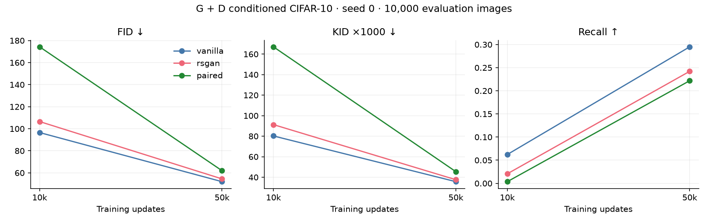
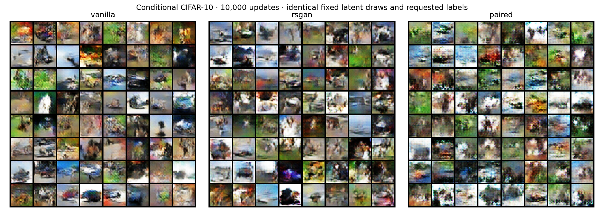
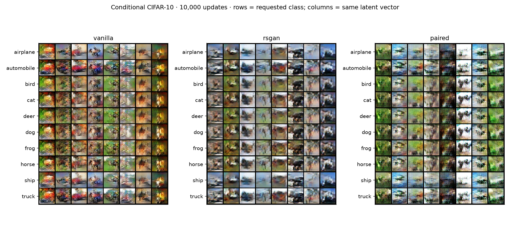
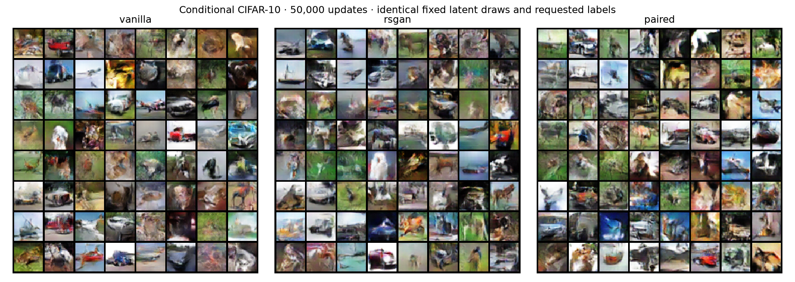
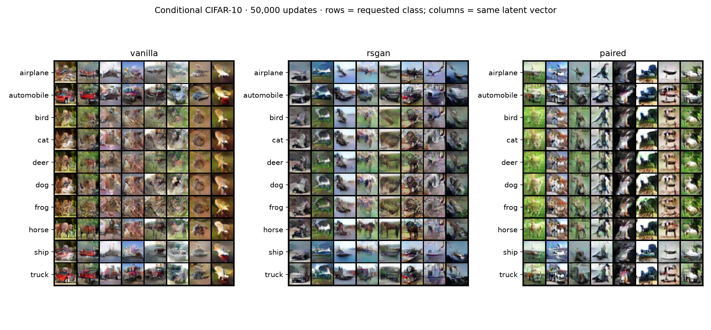

# Conditional CIFAR-10: seed 0

All three generators receive a one-hot class label. Real references match the requested class for RSGAN and paired; vanilla sees the same class-balanced image batches. All discriminators also receive a spatially broadcast one-hot label. There are no auxiliary classification losses.

Both 10k and 50k checkpoints come from a single trajectory per method. Each evaluation uses 10,000 generated images (1,000 requested per class) and the same fixed real reference and metrics as before. Lower FID/KID and higher precision/recall are better. These remain FID-10k measurements.

| Updates | Method | FID ↓ | KID ×1000 ↓ | Precision ↑ | Recall ↑ |
|---:|---|---:|---:|---:|---:|
| 10,000 | vanilla | 96.54 | 80.25 | 0.657 | 0.062 |
| 10,000 | rsgan | 106.52 | 91.28 | 0.570 | 0.021 |
| 10,000 | paired | 174.29 | 167.07 | 0.408 | 0.004 |
| 50,000 | vanilla | 52.00 | 35.70 | 0.560 | 0.295 |
| 50,000 | rsgan | 54.52 | 37.60 | 0.552 | 0.242 |
| 50,000 | paired | 61.96 | 45.45 | 0.523 | 0.222 |

## Context: unconditional → conditional at 50k

This changes generator and discriminator conditioning, initialization, and sampling as well as pair selection; it does not isolate matching alone. Same seed number does not make this a statistically replicated result.

| Method | FID ↓ | KID ×1000 ↓ | Precision ↑ | Recall ↑ |
|---|---:|---:|---:|---:|
| vanilla | 49.99 → 52.00 | 37.09 → 35.70 | 0.589 → 0.560 | 0.339 → 0.295 |
| rsgan | 49.70 → 54.52 | 35.65 → 37.60 | 0.587 → 0.552 | 0.331 → 0.242 |
| paired | 53.27 → 61.96 | 35.99 → 45.45 | 0.561 → 0.523 | 0.303 → 0.222 |

## Previous G-only conditioning → G and D conditioning at 50k

Generator initial weights, class sampling, and optimization settings are unchanged. Adding the label input changes discriminator weights and architecture. This is a single-seed comparison.

| Method | FID ↓ | KID ×1000 ↓ | Precision ↑ | Recall ↑ |
|---|---:|---:|---:|---:|
| vanilla | 51.24 → 52.00 | 37.30 → 35.70 | 0.599 → 0.560 | 0.334 → 0.295 |
| rsgan | 48.60 → 54.52 | 32.98 → 37.60 | 0.555 → 0.552 | 0.347 → 0.242 |
| paired | 50.59 → 61.96 | 35.20 → 45.45 | 0.567 → 0.523 | 0.303 → 0.222 |

## Hardware provenance

All jobs requested Modal A10. The recorded devices are vanilla: NVIDIA A10, rsgan: NVIDIA A10, paired: NVIDIA A10G. Runtime versions match, but device names differ, so timing is not a controlled same-device comparison.

## Inspection of class control

The paired 50k grid shows stronger label effects than the G-only pilot, including recognizable changes for airplanes, horses, and ships. However, several same-latent columns remain similar across animal classes. This is visual evidence of partial class control, not a measured conditional accuracy or a guarantee of semantically matched pairs.

Paired improves substantially from its 10k checkpoint but its 50k marginal scores are worse than its G-only run. One seed and incomplete label adherence limit conclusions about the closer-reference hypothesis.

## Interpretation limits

Matching is by requested label; G may ignore that label. Marginal metrics do not measure semantic label adherence. The class grids below repeat identical latent vectors down each column while changing the requested class. Differences across rows show label sensitivity, but only correct class-specific content would demonstrate adherence. One training seed cannot establish a reliable ranking.

[Protocol](CIFAR10_CONDITIONAL.md) · [All metrics CSV](comparison.csv)

## Label sensitivity in the fixed grids

Mean absolute RGB-pixel difference on a [0,1] scale, measured from the saved grids. Changing labels holds noise fixed; changing noise holds the label fixed. Only eight fixed latent vectors are used. This diagnoses sensitivity, not semantic correctness or conditional accuracy.

| Updates | Method | Change label | Change noise |
|---:|---|---:|---:|
| 10,000 | vanilla | 0.1016 | 0.2138 |
| 10,000 | rsgan | 0.0974 | 0.2366 |
| 10,000 | paired | 0.1039 | 0.2712 |
| 50,000 | vanilla | 0.1284 | 0.2142 |
| 50,000 | rsgan | 0.1273 | 0.2325 |
| 50,000 | paired | 0.1311 | 0.2931 |

Giving y to the discriminator lets it detect label-content mismatches. It does not guarantee label adherence; inspect semantic content in the class grids. The previous G-only experiment lacked this signal.

## 10,000 updates

## 50,000 updates

