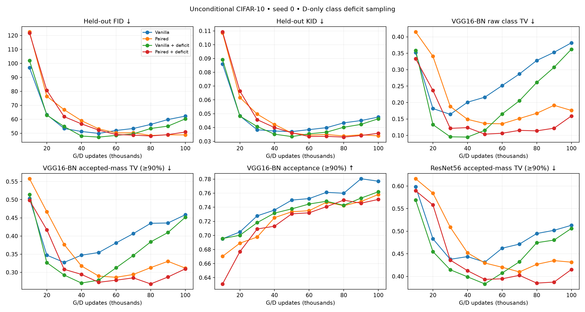
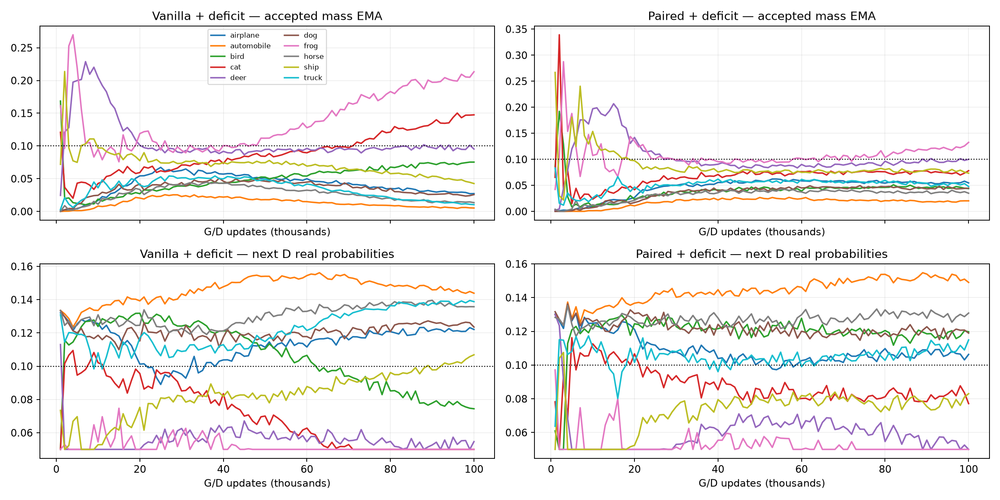
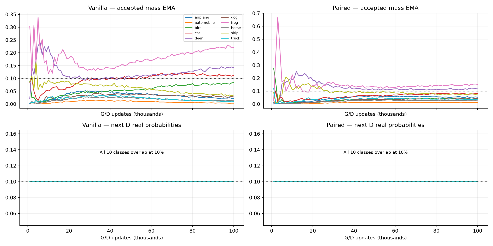
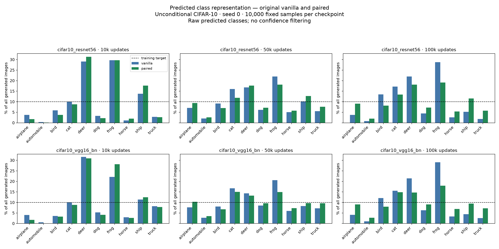
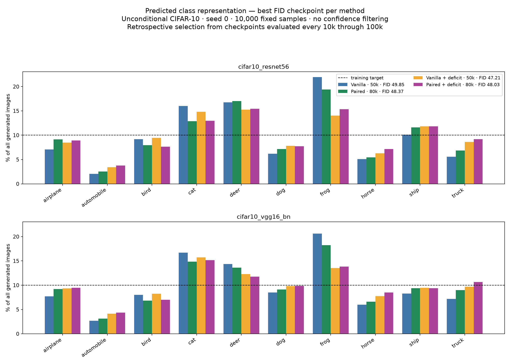
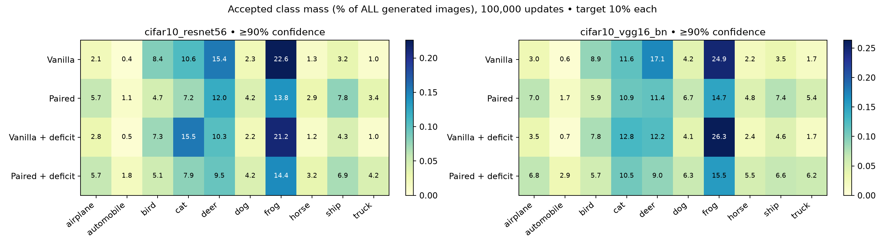
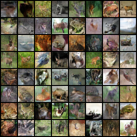
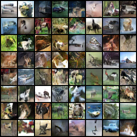
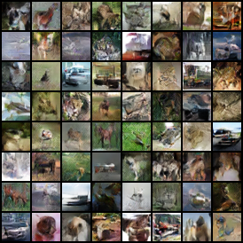
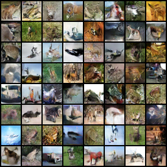

# CIFAR-10 class deficit pilot

40/40 endpoint evaluations available. Seed 0 only.

[Protocol](../../docs/CIFAR_DEFICIT_PROTOCOL.md). Original unconditional networks; G batch 128; D receives 128 real + 128 fake images per update. Adaptive arms only change D real sampling.

ResNet56 controls sampling; VGG16-BN is a separate evaluator. Confidence is not ground-truth image validity. FID/KID/precision/recall use the official held-out test split.

Best checkpoints below are selected retrospectively by minimum held-out FID, separately for each method.

## Latest common endpoint: 100,000 updates

| Method | Held-out FID ↓ | KID ↓ | Precision ↑ | Recall ↑ | VGG raw class TV ↓ | VGG accepted TV ↓ | VGG acceptance ↑ |
|---|---:|---:|---:|---:|---:|---:|---:|
| Vanilla | 62.23 | 0.0475 | 0.637 | 0.339 | 0.382 | 0.459 | 77.7% |
| Paired | 48.79 | 0.0340 | 0.568 | 0.332 | 0.176 | 0.312 | 75.8% |
| Vanilla + deficit | 60.23 | 0.0463 | 0.621 | 0.314 | 0.362 | 0.452 | 76.2% |
| Paired + deficit | 50.85 | 0.0358 | 0.572 | 0.350 | 0.159 | 0.310 | 75.1% |

Accepted TV includes rejected mass as an extra category. Coverage of ten predicted classes does not establish within-class diversity.

### Vanilla

### Paired

### Vanilla + deficit

### Paired + deficit

