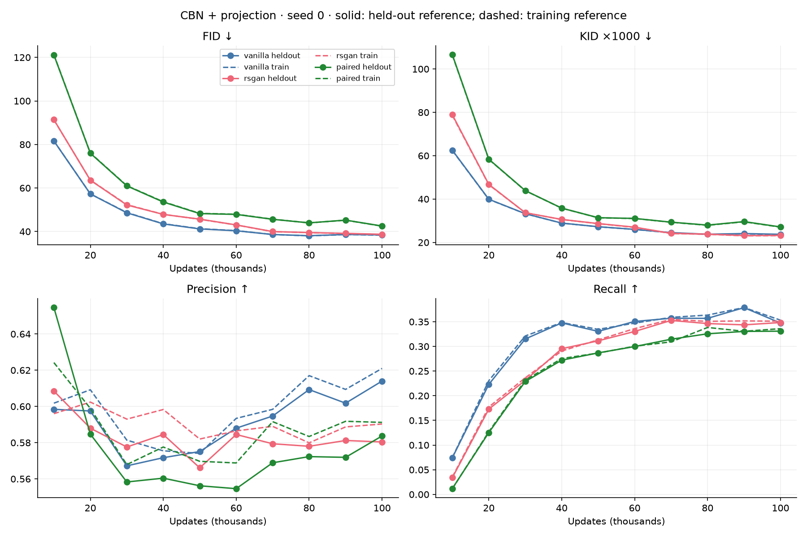
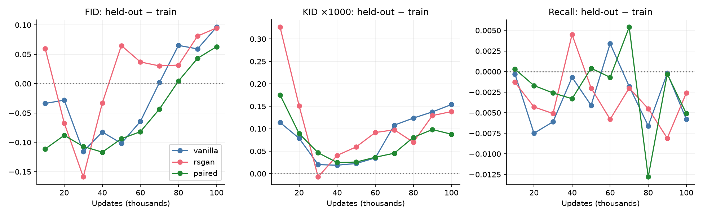
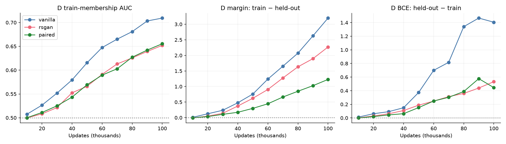
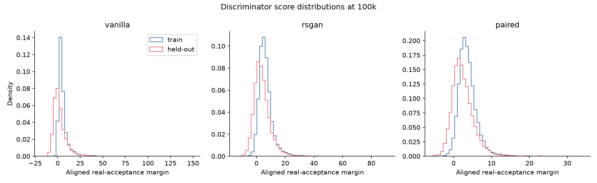
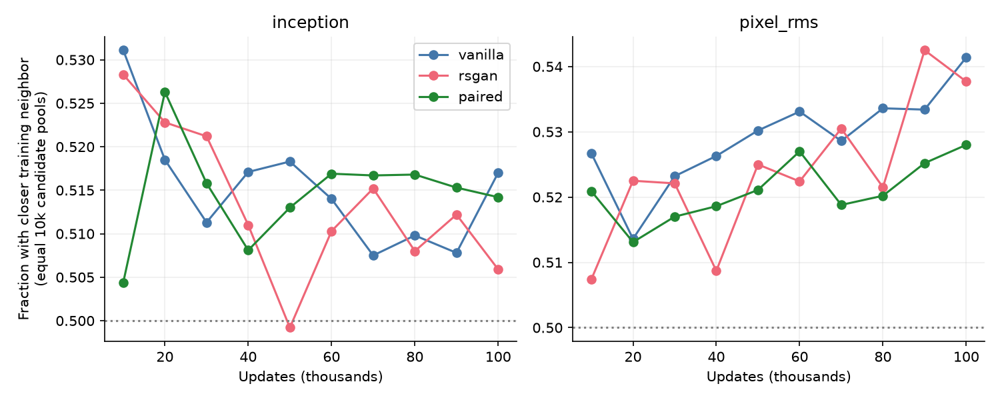
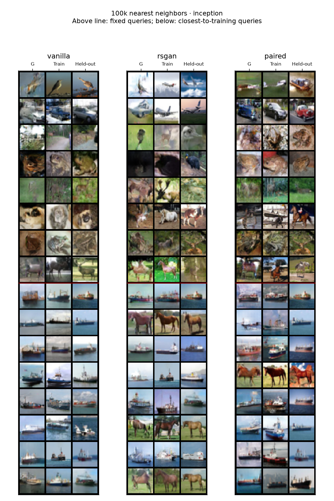
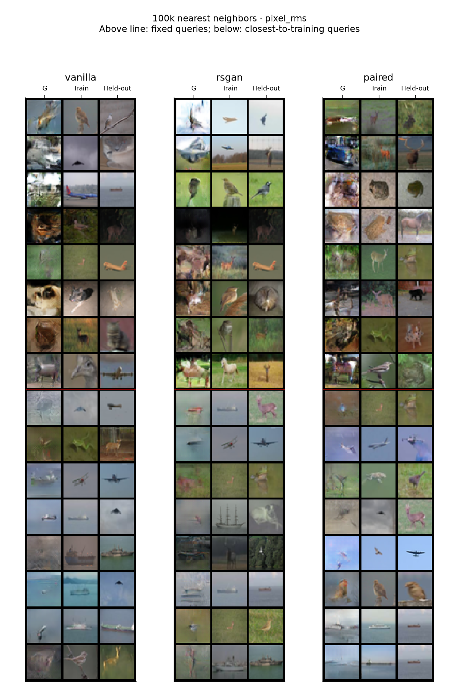

# CIFAR-10 integrity study: 10k–100k

CBN/projection, seed 0, unchanged training settings; all three methods evaluated every 10k. Held-out references are the official CIFAR-10 test images, never used in GAN updates. Training-reference scores remain available for comparison. All metrics use 10,000 generated samples and 10,000 reference images.

## Main findings

- Discriminator overfitting is visible: at 100k vanilla accepts 97.5% of training real images versus 55.0% of held-out real images. RSGAN and paired also develop gaps. Train-membership AUC reaches 0.709, 0.652, and 0.655 respectively.
- Generator FID/KID improve beyond 50k with diminishing average returns and late fluctuations. Vanilla has its lowest observed held-out FID at 80k (38.08); RSGAN and paired reach their lowest observed FID at 100k (38.74 and 42.53). These are descriptive minima of one fixed sweep, not selected-model claims.
- Train-reference and held-out FID differ by less than 0.16 at every checkpoint, despite the growing D gap. Held-out distribution metrics alone do not expose discriminator overfitting.
- No exact uint8 generated/training matches occur at any evaluated checkpoint. At 100k, equal-pool training-neighbor preference is 50.6–51.7% in Inception space and 52.8–54.1% in pixel space. These modest preferences and selected neighbor panels do not rule out approximate memorization.

[Protocol](CIFAR10_INTEGRITY.md) · [All metrics](metrics.csv)

## Held-out learning curves

| Updates | Method | Held-out FID ↓ | KID ×1000 ↓ | Precision ↑ | Recall ↑ |
|---:|---|---:|---:|---:|---:|
| 10k | vanilla | 81.61 | 62.51 | 0.598 | 0.074 |
| 10k | rsgan | 91.37 | 78.89 | 0.609 | 0.034 |
| 10k | paired | 121.12 | 106.59 | 0.655 | 0.012 |
| 20k | vanilla | 57.27 | 39.91 | 0.598 | 0.223 |
| 20k | rsgan | 63.56 | 46.77 | 0.588 | 0.173 |
| 20k | paired | 75.96 | 58.38 | 0.585 | 0.125 |
| 30k | vanilla | 48.60 | 33.24 | 0.567 | 0.315 |
| 30k | rsgan | 52.19 | 33.68 | 0.578 | 0.231 |
| 30k | paired | 60.96 | 43.90 | 0.558 | 0.229 |
| 40k | vanilla | 43.51 | 28.90 | 0.572 | 0.348 |
| 40k | rsgan | 47.86 | 30.59 | 0.585 | 0.295 |
| 40k | paired | 53.56 | 35.81 | 0.560 | 0.272 |
| 50k | vanilla | 41.19 | 27.23 | 0.575 | 0.331 |
| 50k | rsgan | 45.69 | 28.69 | 0.566 | 0.311 |
| 50k | paired | 48.24 | 31.39 | 0.556 | 0.287 |
| 60k | vanilla | 40.35 | 26.00 | 0.588 | 0.351 |
| 60k | rsgan | 43.04 | 27.02 | 0.585 | 0.330 |
| 60k | paired | 47.86 | 31.06 | 0.555 | 0.300 |
| 70k | vanilla | 38.62 | 24.52 | 0.595 | 0.357 |
| 70k | rsgan | 39.97 | 24.17 | 0.579 | 0.353 |
| 70k | paired | 45.61 | 29.33 | 0.569 | 0.315 |
| 80k | vanilla | 38.08 | 23.78 | 0.609 | 0.357 |
| 80k | rsgan | 39.52 | 23.81 | 0.578 | 0.346 |
| 80k | paired | 43.98 | 27.97 | 0.572 | 0.326 |
| 90k | vanilla | 38.62 | 24.07 | 0.602 | 0.379 |
| 90k | rsgan | 39.15 | 23.15 | 0.581 | 0.344 |
| 90k | paired | 45.24 | 29.59 | 0.572 | 0.330 |
| 100k | vanilla | 38.44 | 23.74 | 0.614 | 0.347 |
| 100k | rsgan | 38.74 | 23.24 | 0.580 | 0.348 |
| 100k | paired | 42.53 | 27.13 | 0.584 | 0.331 |

## Train/held-out reference gaps

These differences use the same generated images and equal reference counts. Small differences can reflect the fixed reference samples and are not, by themselves, evidence of overfitting.

## Discriminator generalization

Fake images and labels are fixed across train/held-out comparisons. Paired averages both slot orientations after aligning signs. Higher margin means stronger acceptance of the real input. AUC above 0.5 indicates a tendency to score training examples higher; it is not a measured training-membership attack success rate. Absolute margins differ in scale across models.

| Updates | Method | Train BCE | Held-out BCE | Train acceptance | Held-out acceptance | Membership AUC |
|---:|---|---:|---:|---:|---:|---:|
| 10k | vanilla | 0.520 | 0.533 | 0.709 | 0.688 | 0.507 |
| 10k | rsgan | 0.191 | 0.193 | 0.937 | 0.934 | 0.500 |
| 10k | paired | 0.439 | 0.439 | 0.793 | 0.793 | 0.500 |
| 50k | vanilla | 0.389 | 0.762 | 0.801 | 0.589 | 0.616 |
| 50k | rsgan | 0.284 | 0.471 | 0.875 | 0.780 | 0.566 |
| 50k | paired | 0.389 | 0.541 | 0.822 | 0.746 | 0.569 |
| 100k | vanilla | 0.099 | 1.504 | 0.975 | 0.550 | 0.709 |
| 100k | rsgan | 0.102 | 0.635 | 0.961 | 0.771 | 0.652 |
| 100k | paired | 0.207 | 0.653 | 0.919 | 0.754 | 0.655 |

## Nearest-neighbor checks

Equal candidate pools contain 10k training and 10k held-out images. A separate full-50k training search is used to inspect possible copies; its larger pool is not a fair distance comparator to 10k held-out images. Distances use raw Inception features or RGB pixel RMS. Similarity alone does not prove copying; absence of exact copies does not establish novelty.

Exact test images also present in the training split: 0. Real train10k versus test10k baseline: FID 5.20, KID ×1000 -0.04.

| Method | Exact generated/train matches at 100k | Unique generated images / 10k | Feature-space training preference | Pixel-space training preference |
|---|---:|---:|---:|---:|
| vanilla | 0 | 10000 | 0.517 | 0.541 |
| rsgan | 0 | 10000 | 0.506 | 0.538 |
| paired | 0 | 10000 | 0.514 | 0.528 |

### 100k nearest-neighbor panels

Columns: generated / nearest of all 50k training / nearest of 10k held-out. First eight rows are fixed queries; last eight select the closest generated-to-training distances in that space. These selected rows are not representative quality samples. Query IDs and every neighbor index/distance are retained in per-checkpoint files.

## 50k to 100k: additional training return

| Method | Held-out FID 50k → 100k | Held-out KID ×1000 50k → 100k | Recall 50k → 100k | Lowest observed held-out FID (descriptive) |
|---|---:|---:|---:|---|
| vanilla | 41.19 → 38.44 | 27.23 → 23.74 | 0.331 → 0.347 | 38.08 at 80k |
| rsgan | 45.69 → 38.74 | 28.69 → 23.24 | 0.311 → 0.348 | 38.74 at 100k |
| paired | 48.24 → 42.53 | 31.39 → 27.13 | 0.287 → 0.331 | 42.53 at 100k |

All checkpoints are reported. The observed minimum is a description of this fixed sweep, not an independently tested selected model.

## Limits

One seed, no tuning, and correlated checkpoints. Held-out FID/KID are distributional diagnostics, not memorization detectors. Neighbor searches are restricted to the chosen feature spaces and comparisons. No independently validated class-adherence score is included. Repeated inspection of this held-out set means it is a diagnostic reference, not a pristine final benchmark for later decisions based on these results.
