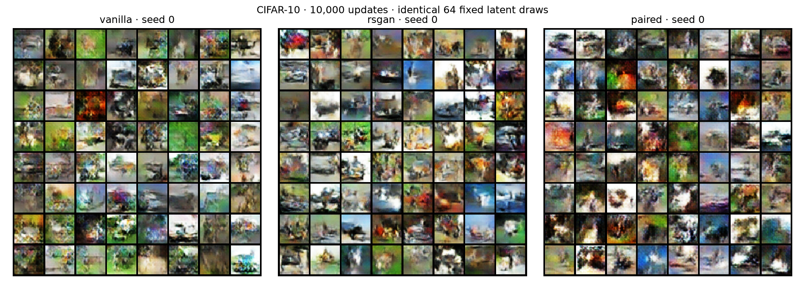
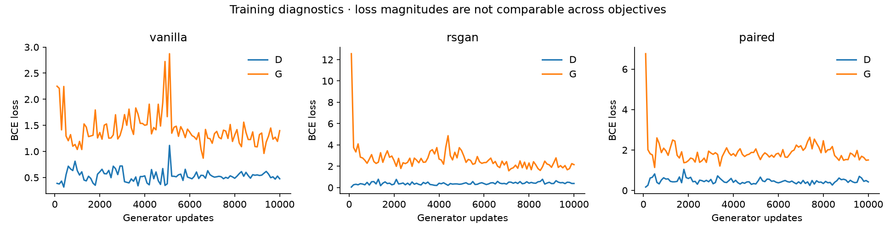

# CIFAR-10: initial Modal pilot

One matched training seed per method; fixed settings, no method-specific tuning. All runs used NVIDIA A10, float32, TF32 disabled. The objective here is to validate the image experiment and obtain an initial comparison, not to establish superiority.

## Evaluation

10,000 generated images versus the same fixed 10,000-image training subset. FID/KID and precision/recall use torch-fidelity's Inception-v3-compatible 2048-D features. This is FID-10k, not a standard FID-50k result. Higher precision/recall is better; lower FID/KID is better. KID below is multiplied by 1,000.

| Method | Seed | Updates | FID ↓ | KID ×1000 ↓ | Precision ↑ | Recall ↑ |
|---|---:|---:|---:|---:|---:|---:|
| vanilla | 0 | 10,000 | 97.14 | 85.91 | 0.661 | 0.042 |
| rsgan | 0 | 10,000 | 93.83 | 79.62 | 0.618 | 0.030 |
| paired | 0 | 10,000 | 122.64 | 108.48 | 0.571 | 0.009 |

Precision and recall are feature-space diagnostics, not literal class coverage. No seed uncertainty can be estimated from this pilot. The evaluation uses a training-set reference; it does not independently test memorization.

## Runtime and architecture

| Method | D parameters | G parameters | Training seconds | Evaluation seconds |
|---|---:|---:|---:|---:|
| vanilla | 662,977 | 1,183,619 | 159.4 | 47.4 |
| rsgan | 662,977 | 1,183,619 | 184.8 | 29.9 |
| paired | 666,049 | 1,183,619 | 135.9 | 29.2 |

Training time excludes checkpoint I/O, sample grids, setup, and evaluation. It is not a Modal billing report. All methods see the same number of real/fake images per D update; computation differs. Full protocol: [CIFAR10.md](CIFAR10.md).

## Samples

## Training diagnostics

Loss magnitudes have different meanings across objectives and are not a ranking metric.
