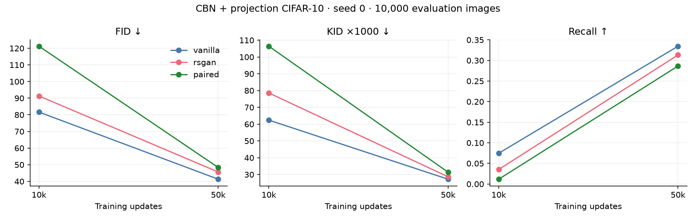
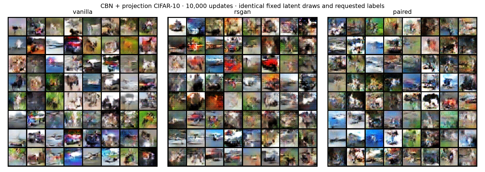
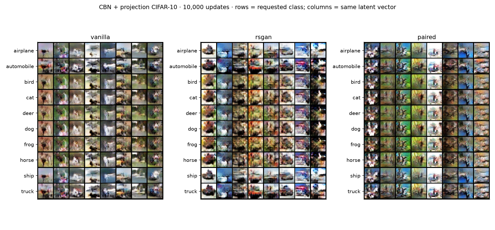
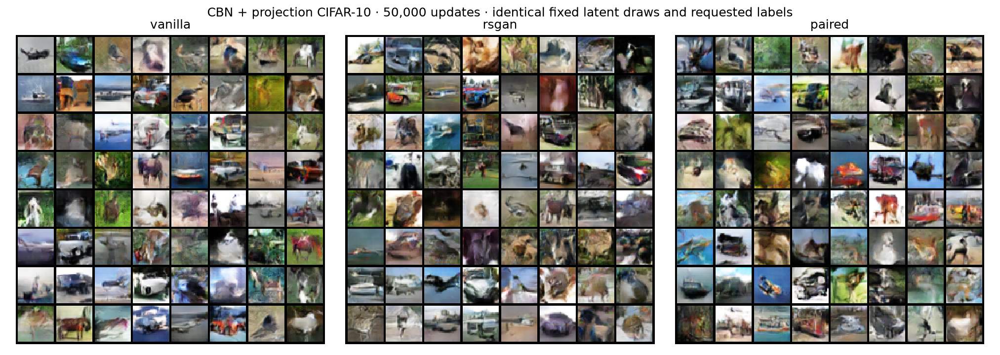
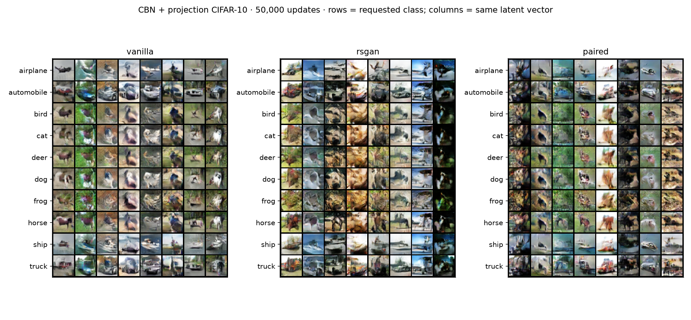

# CBN + projection CIFAR-10: seed 0

All generators use class-conditioned BatchNorm in every hidden block; all discriminators use global-sum-pooled features with a class embedding projection. Paired projects joint A/B features. Same-requested-class references, sampling, BCE losses, and optimizer settings are unchanged. There is no auxiliary class loss.

Both 10k and 50k checkpoints come from a single trajectory per method. Each evaluation uses 10,000 generated images (1,000 requested per class) and the same fixed real reference and metrics as before. Lower FID/KID and higher precision/recall are better. These remain FID-10k measurements.

| Updates | Method | FID ↓ | KID ×1000 ↓ | Precision ↑ | Recall ↑ |
|---:|---|---:|---:|---:|---:|
| 10,000 | vanilla | 81.64 | 62.40 | 0.602 | 0.075 |
| 10,000 | rsgan | 91.31 | 78.57 | 0.596 | 0.035 |
| 10,000 | paired | 121.23 | 106.41 | 0.624 | 0.012 |
| 50,000 | vanilla | 41.29 | 27.21 | 0.574 | 0.335 |
| 50,000 | rsgan | 45.62 | 28.63 | 0.582 | 0.313 |
| 50,000 | paired | 48.33 | 31.36 | 0.570 | 0.287 |

## Context: input conditioning → CBN + projection at 50k

This changes both architectures and initialization; sampling and losses are unchanged. It does not isolate G conditioning from D conditioning. Same seed number does not make this a statistically replicated result.

| Method | FID ↓ | KID ×1000 ↓ | Precision ↑ | Recall ↑ |
|---|---:|---:|---:|---:|
| vanilla | 52.00 → 41.29 | 35.70 → 27.21 | 0.560 → 0.574 | 0.295 → 0.335 |
| rsgan | 54.52 → 45.62 | 37.60 → 28.63 | 0.552 → 0.582 | 0.242 → 0.313 |
| paired | 61.96 → 48.33 | 45.45 → 31.36 | 0.523 → 0.570 | 0.222 → 0.287 |

## Previous G-only conditioning → CBN + projection at 50k

Class sampling and optimization settings are unchanged, but both architectures and initialization change. This is a single-seed comparison.

| Method | FID ↓ | KID ×1000 ↓ | Precision ↑ | Recall ↑ |
|---|---:|---:|---:|---:|
| vanilla | 51.24 → 41.29 | 37.30 → 27.21 | 0.599 → 0.574 | 0.334 → 0.335 |
| rsgan | 48.60 → 45.62 | 32.98 → 28.63 | 0.555 → 0.582 | 0.347 → 0.313 |
| paired | 50.59 → 48.33 | 35.20 → 31.36 | 0.567 → 0.570 | 0.303 → 0.287 |

## Hardware provenance

All jobs requested Modal A10. The recorded devices are vanilla: NVIDIA A10, rsgan: NVIDIA A10, paired: NVIDIA A10. Consult these device names when comparing timing; all jobs share the same requested GPU class.

## Observations

All three methods improve 50k FID and KID relative to the previous input-conditioned G+D run. Paired improves FID from 61.96 to 48.33, but vanilla (41.29) and RSGAN (45.62) remain ahead. At 50k paired also has lower precision and recall than both baselines.

Class grids show label-dependent object changes, especially for vehicles and horses, but substantial ambiguity remains across animal labels. Reliable semantic adherence is not established. Paired label-change pixel MAE at 50k is 0.1333 versus 0.1311 previously, so the marginal quality improvement does not establish substantially stronger class control. No independent classifier accuracy was measured.

This is a joint architecture intervention at one seed, not a separate ablation of conditional BatchNorm and projection. It improves these marginal scores but does not show a paired advantage or resolve the reference-proximity hypothesis.

## Interpretation limits

Matching is by requested label; G may ignore that label. Marginal metrics do not measure semantic label adherence. The class grids below repeat identical latent vectors down each column while changing the requested class. Differences across rows show label sensitivity, but only correct class-specific content would demonstrate adherence. One training seed cannot establish a reliable ranking.

[Protocol](CIFAR10_PROJECTION.md) · [All metrics CSV](comparison.csv)

## Label sensitivity in the fixed grids

Mean absolute RGB-pixel difference on a [0,1] scale, measured from the saved grids. Changing labels holds noise fixed; changing noise holds the label fixed. Only eight fixed latent vectors are used. This diagnoses sensitivity, not semantic correctness or conditional accuracy.

| Updates | Method | Change label | Change noise |
|---:|---|---:|---:|
| 10,000 | vanilla | 0.1138 | 0.2318 |
| 10,000 | rsgan | 0.1451 | 0.2789 |
| 10,000 | paired | 0.0880 | 0.2548 |
| 50,000 | vanilla | 0.1443 | 0.2206 |
| 50,000 | rsgan | 0.1624 | 0.3005 |
| 50,000 | paired | 0.1333 | 0.2616 |

Giving y to the discriminator lets it detect label-content mismatches. It does not guarantee label adherence; inspect semantic content in the class grids. The previous G-only experiment lacked this signal.

## 10,000 updates

## 50,000 updates

