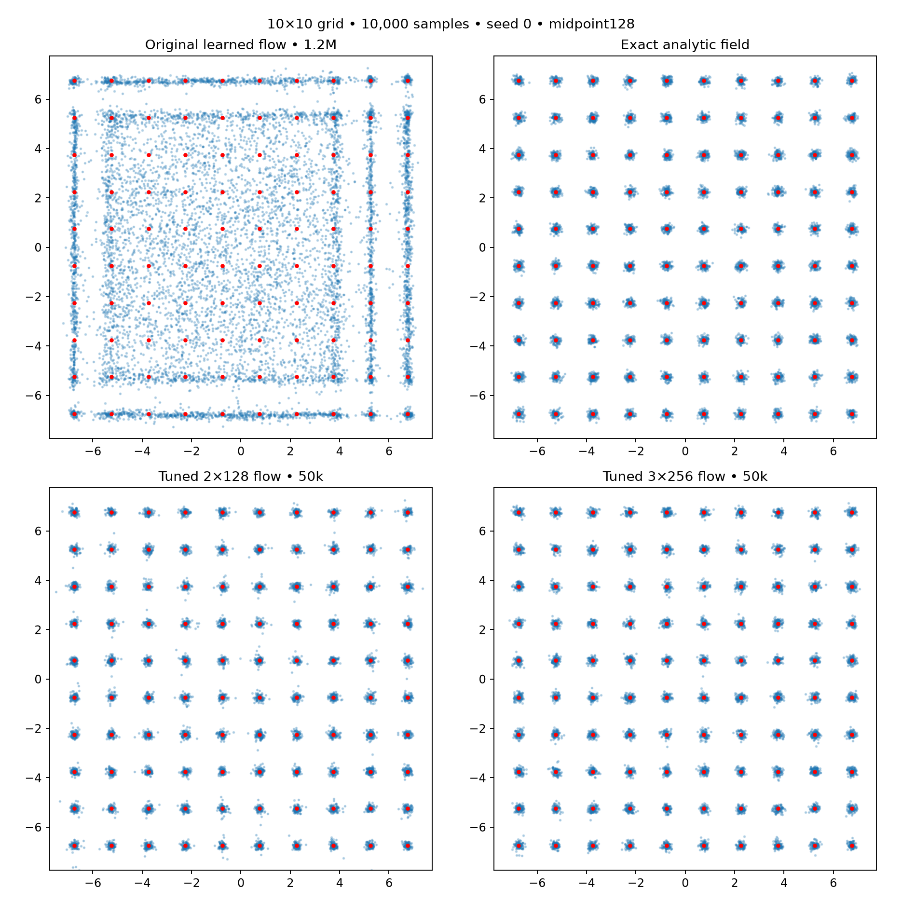
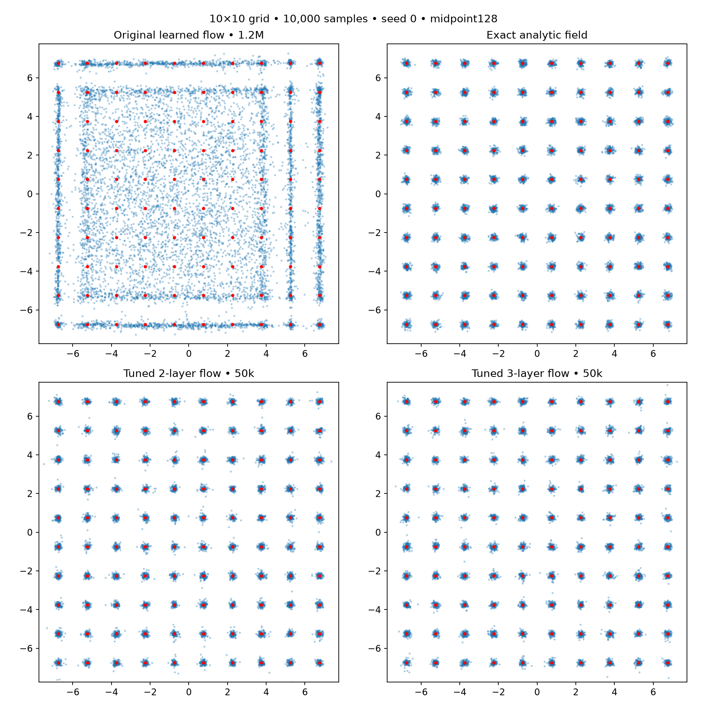

# Flow matching tuning: near-analytic sample quality

The learned model now resolves all 100 modes after 50k updates. The analytic oracle remains slightly better on aggregate mass allocation; agreement is close on these measured distributional metrics, not an assertion of identical fields. No oracle targets, mode identities, grid spacing or component variance enter the confirmed learned models.

## Final comparison

Five-seed means on independent 10k-sample noise per seed, midpoint128. The exact same fresh noise is used across the tuned models and analytic oracle.

| Model | Mode TV ↓ | Fine TV ↓ | Valid mass ↑ | Half-target modes ↑ |
|---|---:|---:|---:|---:|
| Analytic oracle | 0.0470 | 0.3642 | 98.89% | 100.0/100 |
| Tuned 2×128, 50k | 0.0585 | 0.3725 | 97.40% | 100.0/100 |
| Tuned 3×128, 50k | 0.0553 | 0.3697 | 98.01% | 100.0/100 |
| Tuned 3×128, 100k | 0.0525 | 0.3686 | 98.05% | 100.0/100 |
| Tuned 3×256, 50k | 0.0519 | 0.3698 | 98.68% | 100.0/100 |

All learned models in this table reach half-target coverage 100/100 on every seed. See summary.json for SDs and solver256 results. Original flow (#31) at 1.2M was mode TV .6166, fine TV .7753, valid mass 38.45%, half-target coverage 24.8/100, evaluated with the earlier fixed-noise seeds.

## What the search established

1. Generic Fourier position/time features were the largest observed improvement in the controlled seed-0 screen. Increasing depth or adjusting the optimizer alone was much less effective at 20k.
2. Scaling coordinates by their expected time-dependent spread and predicting a residual around a Gaussian base field improved the Fourier model further. Only a data standard deviation estimated from a 100k-sample pilot is needed.
3. Cosine learning-rate decay stabilizes final quality. Two hidden layers already work; width256 brings valid mass closer to the analytic field.
4. Low-rate refinement of width128 modestly improves mode TV, without much change in valid mass. Higher solver resolution has negligible effect.

This is an adaptive, problem-specific tuning study. Seed 0 drove initial selection; other seeds confirmed the initial choice. Later refinement and wider-model confirmation are additional adaptive steps. It is not a benchmark-wide claim or a matched-parameter/compute GAN comparison. Generation still costs 256 network evaluations at midpoint128.

## Follow-up validation

All five 50k→100k resume boundaries and hashes passed. All 20 final learned checkpoints (two initial architectures, refinement, wider architecture) replay saved samples exactly. Optimizer step counts and source snapshots verified. Three focused analytic/feature tests passed. Raw weights are used throughout the final table; EMA outcomes remain in the full trial logs.

31 short training jobs total: 8 screening, 6 refinement screens, 8 initial confirmation, 5 low-rate continuations, 4 wider-model confirmation. Two screening jobs use oracle supervision and are diagnostic only. All trial logs and checkpoints retained.

## Reproduction

`uv run python -m paired_discriminator.flow_ablation` (round 1)  
`uv run python -m paired_discriminator.flow_ablation_r2` (round 2)  
`uv run python -m paired_discriminator.flow_ablation_validate` (initial confirmation)  
`uv run python -m paired_discriminator.flow_ablation_refine` (low-rate continuation)  
`uv run python -m paired_discriminator.flow_ablation_wide` (wider confirmation)

Commands intentionally refuse to overwrite result directories. Full configurations and frozen source accompany each experiment.

---

## Model size and measured training cost

| Model | Parameters | Cumulative train seconds (mean) | Real draws per run |
|---|---:|---:|---:|
| Tuned 2×128, 50k | 24962 | 23.32 | 12,800,000 + shared 100k pilot |
| Tuned 3×128, 50k | 41474 | 30.44 | 12,800,000 + shared 100k pilot |
| Tuned 3×128, 100k | 41474 | 57.74 | 25,600,000 + shared 100k pilot |
| Tuned 3×256, 50k | 148482 | 53.40 | 12,800,000 + shared 100k pilot |

Timing depends on concurrent workloads. Higher model capacity and sampling cost are part of the tradeoff.
# Learned flow matching approaches the analytic sampler

All trials retained. Sample-only training remains independent-coupling straight-line flow matching. Known mixture parameters are used only for oracle diagnostics and evaluation. Model choices selected on seed 0; seeds 1–4 are confirmation runs. Raw (not EMA) weights chosen before confirmation. Fresh evaluation noise is independent of model-selection noise.

## Independent-noise results at 50k updates

Five-seed mean ± sample SD. Identical 10k noise draws per seed across models and solvers.

| Model | Midpoint steps | Mode TV ↓ | Fine TV ↓ | Valid mass ↑ | Half-target coverage ↑ |
|---|---:|---:|---:|---:|---:|
| Exact analytic field | 128 | 0.0470 ± 0.0021 | 0.3642 ± 0.0033 | 0.9889 ± 0.0006 | 100.0000 ± 0.0000 |
| Exact analytic field | 256 | 0.0469 ± 0.0021 | 0.3641 ± 0.0032 | 0.9891 ± 0.0005 | 100.0000 ± 0.0000 |
| Learned, 2 hidden layers | 128 | 0.0585 ± 0.0015 | 0.3725 ± 0.0054 | 0.9740 ± 0.0025 | 100.0000 ± 0.0000 |
| Learned, 2 hidden layers | 256 | 0.0584 ± 0.0016 | 0.3724 ± 0.0052 | 0.9741 ± 0.0025 | 100.0000 ± 0.0000 |
| Learned, 3 hidden layers | 128 | 0.0553 ± 0.0027 | 0.3697 ± 0.0017 | 0.9801 ± 0.0037 | 100.0000 ± 0.0000 |
| Learned, 3 hidden layers | 256 | 0.0553 ± 0.0027 | 0.3696 ± 0.0016 | 0.9801 ± 0.0038 | 100.0000 ± 0.0000 |

## What changed

Estimate scalar data standard deviation from 100k pilot samples. At each time provide x/s_t, where s_t²=(1-t)²+t²s_data², together with raw t and sinusoidal features of both. Ten generic frequencies from .5 to 16 cycles per input coordinate. Predict a residual added to Gaussian base velocity [t s_data²-(1-t)]x/s_t². This base uses only estimated data scale; it contains no mode centers, labels, spacing or component sigma.

Two/three width128 SiLU hidden layers; Adam (.9,.999), lr .001 decayed by cosine to .0001 over 50k updates; batch256; uniform times and independent noise–real pairs. No oracle labels, OT coupling or late-time reweighting in confirmed models.

| Model | Parameters | Mean training seconds | Real draws per run |
|---|---:|---:|---:|
| Learned, 2 hidden layers | 24962 | 23.32 | 12.8M + shared 100k pilot |
| Learned, 3 hidden layers | 41474 | 30.44 | 12.8M + shared 100k pilot |

Wall times vary with concurrent workloads; these are measurements, not rigorous throughput benchmarks. Generation uses 256/512 network evaluations at 128/256 midpoint steps. GAN generation is one pass.

## Screening (seed 0 only)

Round 1 uses 4k evaluation samples; round 2 uses 10k. Fine TV is sample-size sensitive: do not compare its values across rounds without calibration. Oracle-supervised trials are diagnostics, not learned baselines.

| Round | Arm | Updates | Raw/EMA | Mode TV | Fine TV | Valid | Half-target |
|---|---|---:|---|---:|---:|---:|---:|
| 1 | adam | 20000 | raw | 0.8380 | 0.9476 | 0.1620 | 1 |
| 1 | adam | 20000 | ema | 0.8335 | 0.9437 | 0.1665 | 0 |
| 1 | deep | 20000 | raw | 0.8040 | 0.9409 | 0.1960 | 5 |
| 1 | deep | 20000 | ema | 0.7920 | 0.9225 | 0.2080 | 2 |
| 1 | fourier | 20000 | raw | 0.1640 | 0.6028 | 0.8670 | 99 |
| 1 | fourier | 20000 | ema | 0.1555 | 0.5779 | 0.8658 | 100 |
| 1 | normalized | 20000 | raw | 0.8285 | 0.9406 | 0.1715 | 4 |
| 1 | normalized | 20000 | ema | 0.8297 | 0.9442 | 0.1703 | 0 |
| 1 | oracle_fourier (ORACLE SUPERVISION) | 20000 | raw | 0.0707 | 0.5369 | 0.9858 | 100 |
| 1 | oracle_fourier (ORACLE SUPERVISION) | 20000 | ema | 0.0705 | 0.5311 | 0.9828 | 100 |
| 1 | oracle_small (ORACLE SUPERVISION) | 20000 | raw | 0.7530 | 0.9080 | 0.2472 | 10 |
| 1 | oracle_small (ORACLE SUPERVISION) | 20000 | ema | 0.7590 | 0.9054 | 0.2410 | 7 |
| 1 | precond_fourier | 20000 | raw | 0.0940 | 0.5459 | 0.9675 | 100 |
| 1 | precond_fourier | 20000 | ema | 0.0880 | 0.5403 | 0.9643 | 100 |
| 1 | precond | 20000 | raw | 0.7818 | 0.9165 | 0.2183 | 4 |
| 1 | precond | 20000 | ema | 0.7670 | 0.9112 | 0.2330 | 5 |
| 2 | batch1024 | 50000 | raw | 0.0521 | 0.3705 | 0.9810 | 100 |
| 2 | batch1024 | 50000 | ema | 0.0512 | 0.3683 | 0.9822 | 100 |
| 2 | cosine | 50000 | raw | 0.0529 | 0.3684 | 0.9830 | 100 |
| 2 | cosine | 50000 | ema | 0.0537 | 0.3716 | 0.9779 | 100 |
| 2 | late_time | 50000 | raw | 0.0507 | 0.3737 | 0.9830 | 100 |
| 2 | late_time | 50000 | ema | 0.0489 | 0.3737 | 0.9844 | 100 |
| 2 | reference | 50000 | raw | 0.0718 | 0.3962 | 0.9784 | 100 |
| 2 | reference | 50000 | ema | 0.0560 | 0.3806 | 0.9823 | 100 |
| 2 | two_layers | 50000 | raw | 0.0592 | 0.3742 | 0.9741 | 100 |
| 2 | two_layers | 50000 | ema | 0.0588 | 0.3740 | 0.9747 | 100 |
| 2 | wide256 | 50000 | raw | 0.0517 | 0.3699 | 0.9876 | 100 |
| 2 | wide256 | 50000 | ema | 0.0512 | 0.3731 | 0.9856 | 100 |

## Samples

Seed 0 fixed in advance. New analytic/tuned models use identical fresh noise. Original flow is the retained 1.2M seed-0 sample for context; original latent draws differ.

## Limits

This establishes near-oracle distributional fit on this grid and these metrics, not equality of velocity fields everywhere. The architecture was tuned on this problem. Five seeds include the development seed; four confirmation seeds are identified above. Oracle teacher trials use privileged information and are excluded from confirmed learned results. Source hashes, final samples and optimizer counts verified.
