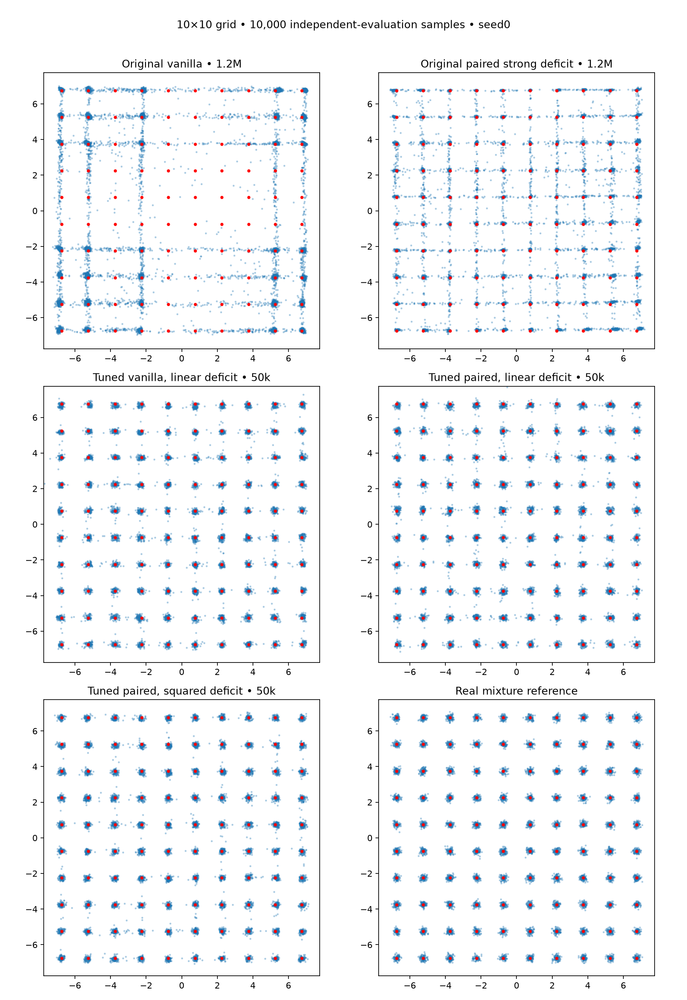

# GAN features, optimizer and deficit sampling (#33)

Original BCE losses throughout; no reconstruction, matching loss, oracle velocity, or inference-time snapping. Screening uses seed0; confirmatory runs use seeds1–4. Vanilla linear-sampler follow-up was selected after seeing the paired confirmation results. Final noise (932000+seed) is independent of screening noise. Primary comparison uses raw G; EMA is a separately reported option, never selected independently per seed.

## Final fresh-noise results

Five seeds, 10k samples per seed; mean ± sample SD. Coverage counts modes with accepted mass ≥0.5% (half the 1% target).

| Model | Output | Mode TV ↓ | Fine TV ↓ | Valid mass ↑ | Half-target modes | Full coverage seeds |
|---|---|---:|---:|---:|---:|---:|
| Original vanilla • 1.2M | raw | 0.5628 ± 0.0514 | 0.7445 ± 0.0186 | 0.7973 ± 0.0256 | 39.4/100 | 0/5 |
| Original paired strong deficit • 1.2M | raw | 0.2121 ± 0.0416 | 0.6148 ± 0.0333 | 0.7934 ± 0.0403 | 91.4/100 | 0/5 |
| Paired • squared deficit, fast estimator | raw | 0.0889 ± 0.0205 | 0.4130 ± 0.0151 | 0.9571 ± 0.0117 | 99.0/100 | 2/5 |
| Paired • squared deficit, fast estimator | ema | 0.0854 ± 0.0209 | 0.3839 ± 0.0072 | 0.9640 ± 0.0110 | 99.0/100 | 2/5 |
| Paired • linear deficit | raw | 0.0702 ± 0.0134 | 0.4260 ± 0.0087 | 0.9661 ± 0.0062 | 100.0/100 | 5/5 |
| Paired • linear deficit | ema | 0.0663 ± 0.0134 | 0.3894 ± 0.0129 | 0.9735 ± 0.0042 | 100.0/100 | 5/5 |
| Vanilla • squared deficit, fast estimator | raw | 0.0707 ± 0.0049 | 0.4208 ± 0.0105 | 0.9632 ± 0.0044 | 100.0/100 | 5/5 |
| Vanilla • squared deficit, fast estimator | ema | 0.0662 ± 0.0060 | 0.3791 ± 0.0029 | 0.9711 ± 0.0037 | 100.0/100 | 5/5 |
| Vanilla • linear deficit | raw | 0.0674 ± 0.0076 | 0.4265 ± 0.0089 | 0.9641 ± 0.0064 | 100.0/100 | 5/5 |
| Vanilla • linear deficit | ema | 0.0635 ± 0.0065 | 0.3932 ± 0.0045 | 0.9714 ± 0.0020 | 100.0/100 | 5/5 |
| Real mixture reference | raw | 0.0432 ± 0.0017 | 0.3623 ± 0.0030 | 0.9891 ± 0.0011 | 100.0/100 | 5/5 |

## Interpretation

Both linear-deficit GANs reach all 100 half-target modes in every seed at 50k updates. Paired mode TV .0702 versus vanilla .0674 does not establish a paired advantage: the large representation/optimization gains transfer to both objectives. Fine-density error remains above the real finite-sample reference and the tuned flow models in experiment 32. The original 1.2M baselines above were re-evaluated on fresh noise, so their numbers differ slightly from earlier reports. Seed0 was used for development and is included in the five-seed summaries; they are not five untouched confirmation seeds.

## Architecture and training

Tuned G takes two normal latent values, adds Fourier features at ten generic log-spaced frequencies .5–16 cycles, and uses two width128 LeakyReLU hidden layers. Output is s_data*(z + MLP(features(z))). s_data is the standard deviation estimated from a shared independent 100k-point real-data pilot. No target mode centers or spacings enter these features.

D uses raw coordinates divided by s_data plus the same type of Fourier features, introduced from low to high over the first 25k updates. Two width128 LeakyReLU hidden layers; paired input has four raw coordinates, vanilla two.

50k updates; D real256/fake256, G fake256; paired G references uniform256. Adam (.5,.999), both lrs .001 for 25k then cosine to .0001. Generator EMA .999 retained but raw is primary. Linear deficit uses alpha=.9,p=1, mass EMA .99. Fast-estimator squared deficit uses alpha=.9,p=2, mass EMA .9. Deficit uses known mode identities exactly as in prior grid experiments.

| Model | G params | D params | Mean train seconds | D real draws | G references used |
|---|---:|---:|---:|---:|---:|
| Paired • squared deficit, fast estimator | 22274 | 27521 | 63.79 | 12.8M | 12.8M |
| Paired • linear deficit | 22274 | 27521 | 63.48 | 12.8M | 12.8M |
| Vanilla • squared deficit, fast estimator | 22274 | 22145 | 55.09 | 12.8M | 0 |
| Vanilla • linear deficit | 22274 | 22145 | 55.23 | 12.8M | 0 |

A shared 100k-point scale pilot is additional. The implementation draws unused G real batches for vanilla to maintain RNG parity, but those values do not affect its gradients. Training time depends on concurrent workloads. One G forward pass per generated sample; parameter count differs from the old G/D. Equal update count does not mean equal compute.

## Search record

53 short jobs: 35 seed0 screening, 13 initial confirmation, 5 matched vanilla-linear follow-up. Every raw/EMA intermediate and final metric is retained in all_trials.json, including failures to improve. Rounds1–3 use 4k evaluation samples, later rounds10k; fine TV floors differ with sample count.

R1: D features alone did not solve coverage. Gradually introduced features sharpened points while still losing modes. R2: Gaussian skip alone did not solve it either. R3: adding G Fourier features made the large observed improvement. R4: sampler/learning-rate adjustments improved balance and density fit. Confirmation showed a seed0 winner can be less reliable than another candidate. These are adaptive findings on this grid, not evidence of universal superiority.

## Plots

Fixed seed0, not selected for visual quality; raw generators. Blue dots are generated samples, red marks are target centers.

## Verification

40 exact checkpoint/sample replays; 5 matched paired/vanilla RNG checks; source snapshot hashes and optimizer step counts verified. Control two-update regression test matches the original trainer exactly. No reconstruction loss was introduced.
