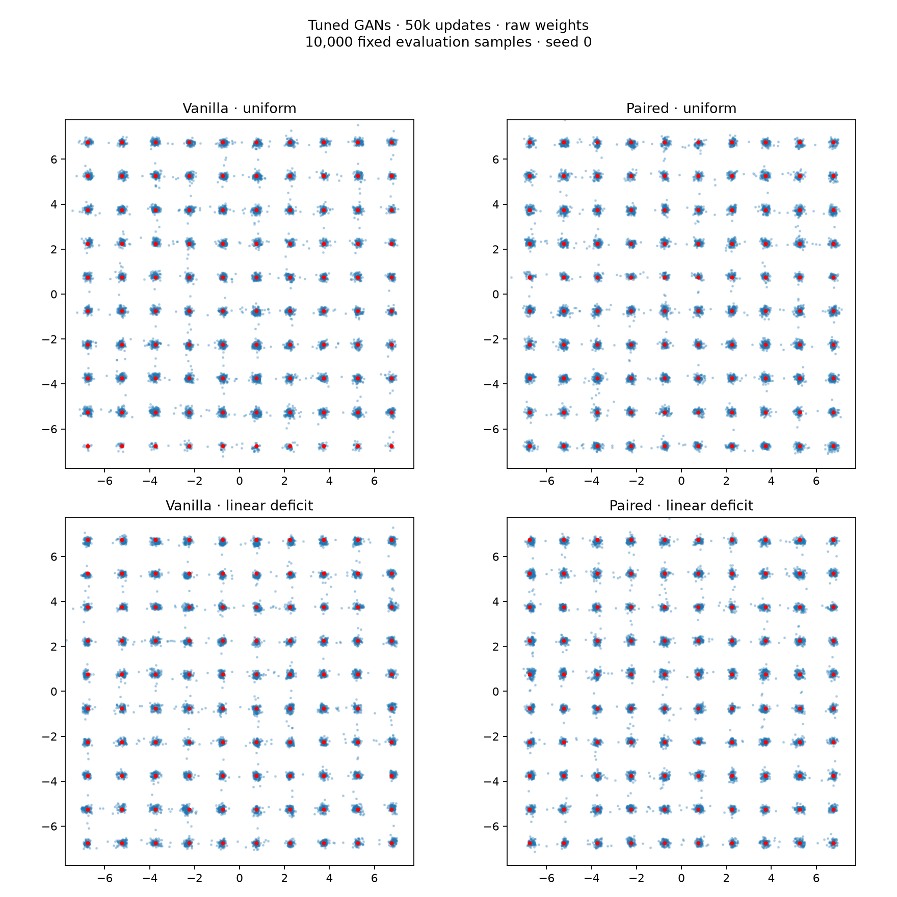

# Uniform versus deficit sampling for tuned GANs (#34)

All four arms use the frozen successful architecture and optimizer from #33 at 50k updates. No reconstruction loss. Nine new jobs: four paired seeds plus five vanilla seeds. Paired-uniform seed0 is reused from its exact #33 screen; all deficit checkpoints are reused. This confirms uniform sampling under the selected settings, not a separate search optimized for uniform sampling.

Raw weights are primary; generator EMA is a separately reported option for every seed. Five-seed means include development seed0. Evaluation uses the same 10k latent draws per seed as #33, independent of training and of the saved development-evaluation noise.

## Results

Mean ± sample SD. Half-target coverage requires at least 0.5% of all samples within radius .3 of each target center; invalid samples remain in the denominator.

| Method | Output | Mode TV ↓ | Fine TV ↓ | Valid mass ↑ | Half-target modes | Full coverage seeds |
|---|---|---:|---:|---:|---:|---:|
| Vanilla · uniform | raw | 0.1228 ± 0.0230 | 0.4071 ± 0.0082 | 0.9643 ± 0.0060 | 96.6/100 | 1/5 |
| Vanilla · uniform | ema | 0.1199 ± 0.0232 | 0.3884 ± 0.0073 | 0.9712 ± 0.0069 | 96.6/100 | 1/5 |
| Paired · uniform | raw | 0.1373 ± 0.0286 | 0.4187 ± 0.0162 | 0.9634 ± 0.0038 | 95.4/100 | 1/5 |
| Paired · uniform | ema | 0.1340 ± 0.0298 | 0.3902 ± 0.0133 | 0.9705 ± 0.0034 | 95.4/100 | 1/5 |
| Vanilla · linear deficit | raw | 0.0674 ± 0.0076 | 0.4265 ± 0.0089 | 0.9641 ± 0.0064 | 100.0/100 | 5/5 |
| Vanilla · linear deficit | ema | 0.0635 ± 0.0065 | 0.3932 ± 0.0045 | 0.9714 ± 0.0020 | 100.0/100 | 5/5 |
| Paired · linear deficit | raw | 0.0702 ± 0.0134 | 0.4260 ± 0.0087 | 0.9661 ± 0.0062 | 100.0/100 | 5/5 |
| Paired · linear deficit | ema | 0.0663 ± 0.0134 | 0.3894 ± 0.0129 | 0.9735 ± 0.0042 | 100.0/100 | 5/5 |
| Real reference | raw | 0.0432 ± 0.0017 | 0.3623 ± 0.0030 | 0.9891 ± 0.0011 | 100.0/100 | 5/5 |

## Interpretation

The strong feature-based fit survives uniform sampling: both methods retain about 96% valid mass. Linear deficit lowers mode TV in every matched seed for both objectives and raises full half-target coverage from one of five to five of five seeds. Uniform raw generators have slightly lower mean fine TV, so the deficit gain is specifically in mode allocation rather than a uniform win on distributional metrics. Vanilla-uniform has lower mean mode/fine TV than paired-uniform, with overlapping seed variation; this gives no evidence of a paired advantage under these settings. No additional uniform-specific tuning was done.

## Individual seeds (raw)

| Method | Seed | Mode TV | Fine TV | Valid mass | Half-target modes |
|---|---:|---:|---:|---:|---:|
| Vanilla · uniform | 0 | 0.1408 | 0.4159 | 0.9640 | 90 |
| Paired · uniform | 0 | 0.1145 | 0.4032 | 0.9604 | 99 |
| Vanilla · linear deficit | 0 | 0.0737 | 0.4343 | 0.9618 | 100 |
| Paired · linear deficit | 0 | 0.0753 | 0.4218 | 0.9607 | 100 |
| Vanilla · uniform | 1 | 0.1341 | 0.4104 | 0.9545 | 99 |
| Paired · uniform | 1 | 0.1570 | 0.4198 | 0.9613 | 94 |
| Vanilla · linear deficit | 1 | 0.0630 | 0.4342 | 0.9647 | 100 |
| Paired · linear deficit | 1 | 0.0606 | 0.4410 | 0.9738 | 100 |
| Vanilla · uniform | 2 | 0.1019 | 0.3941 | 0.9707 | 97 |
| Paired · uniform | 2 | 0.1714 | 0.4452 | 0.9603 | 86 |
| Vanilla · linear deficit | 2 | 0.0578 | 0.4146 | 0.9688 | 100 |
| Paired · linear deficit | 2 | 0.0915 | 0.4203 | 0.9647 | 100 |
| Vanilla · uniform | 3 | 0.1429 | 0.4101 | 0.9669 | 97 |
| Paired · uniform | 3 | 0.1027 | 0.4084 | 0.9677 | 100 |
| Vanilla · linear deficit | 3 | 0.0762 | 0.4198 | 0.9544 | 100 |
| Paired · linear deficit | 3 | 0.0608 | 0.4263 | 0.9713 | 100 |
| Vanilla · uniform | 4 | 0.0941 | 0.4049 | 0.9652 | 100 |
| Paired · uniform | 4 | 0.1410 | 0.4170 | 0.9673 | 98 |
| Vanilla · linear deficit | 4 | 0.0665 | 0.4297 | 0.9707 | 100 |
| Paired · linear deficit | 4 | 0.0626 | 0.4206 | 0.9601 | 100 |

## Budgets and settings

G: two width128 LeakyReLU layers, 2D Gaussian latent, generic Fourier features, and residual output scaled by the shared independent 100k-real-point pilot. D: two width128 LeakyReLU layers with Fourier features introduced over the first 25k updates. Adam (.5,.999), lr .001 for 25k then cosine to .0001. Linear deficit alpha=.9,p=1, mass EMA=.99; uniform alpha=0. G weight EMA=.999.

D consumes 12.8M real draws and 12.8M fake draws per run. G consumes 12.8M latent draws. Paired additionally uses 12.8M uniform G real references; vanilla draws but does not use these references to preserve RNG parity. Paired has a larger D. Equal updates are not equal compute.

Nine new training jobs finished in 110.0 seconds elapsed, including their training/evaluation and launch overhead, with up to eight concurrent workers.

Uniform sampling uses no deficit-derived weights. The existing trainer calculates an unused mode-mass estimate, but it does not affect sampling, losses, or gradients when alpha=0. Known mode labels are still used for evaluation. Generic features contain no mode centers or spacing.

## Samples

Seed0 was fixed in advance, not chosen for appearance; raw generators.

## Verification

40 exact checkpoint/sample replays; 20 matched RNG comparison groups; all source snapshot hashes, config/spec matches, optimizer counts and completion metadata passed. Training code is unchanged from #33.
