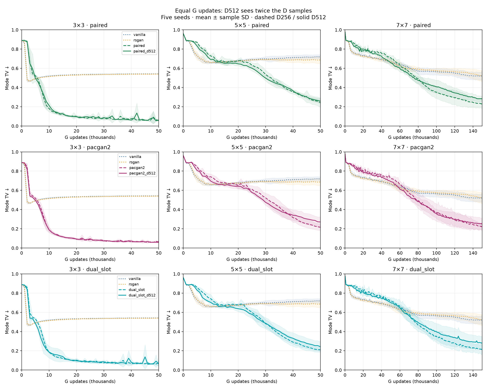
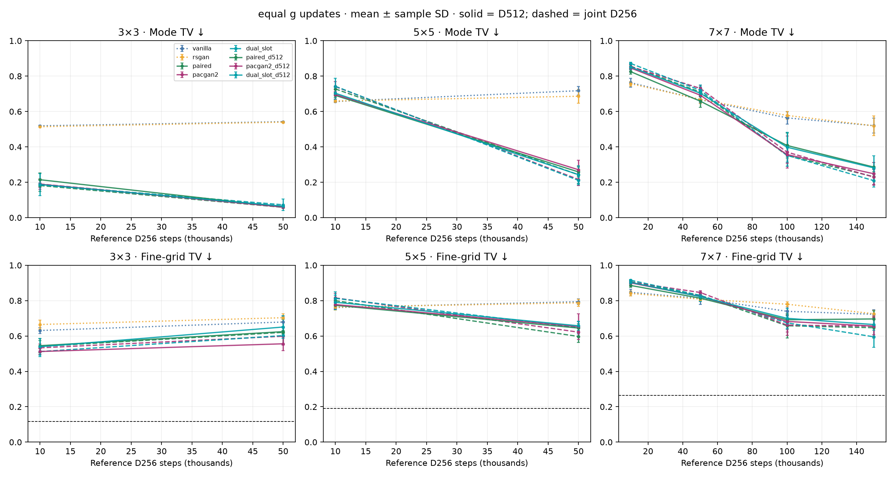
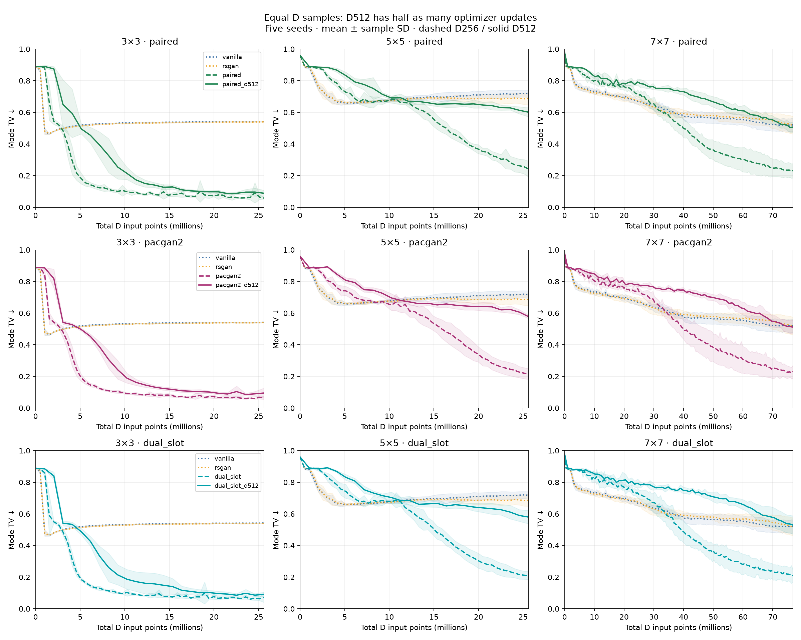
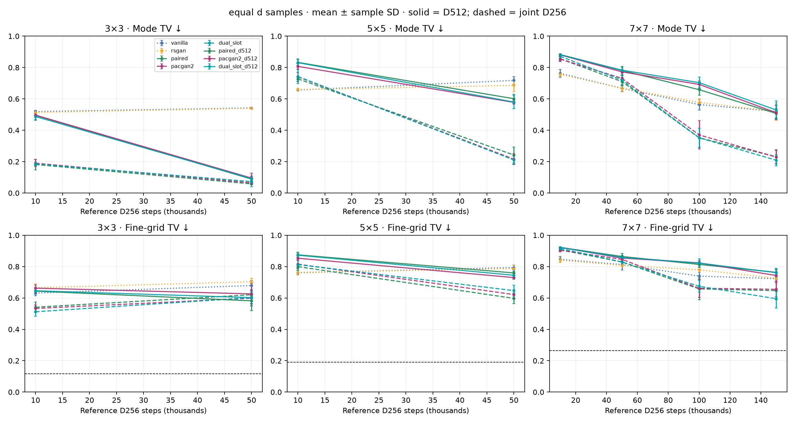
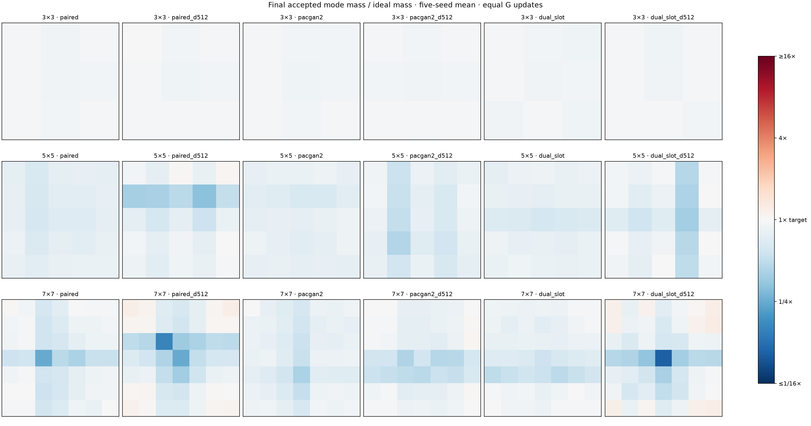

# Doubling only discriminator batch on Gaussian grids

45 new trajectories: paired, PacGAN2 and two-output × seeds 0–4 × 3×3/5×5/7×7. D batch increases from 256 real + 256 generated to 512 real + 512 generated points. G continues to train on 256 fresh generated points with each method’s original objective and reference pairing. Same architectures, initial weights, learning rates, Adam betas, grid geometry and one D/G update per step. 3×3/5×5 run to 50k; 7×7 to 150k. Existing five-method baselines are reused. Eight local CPU workers, one torch thread each.

## Findings

Doubling D’s batch does not remove the joint models’ characteristic early disadvantage or produce a reliable speedup. There are modest early improvements on the larger grids, but no consistent benefit at the final budgets. The hypothesis that simply giving D more examples per update would fix the lag is not supported by this intervention.

At equal G updates on 5×5 at 10k, D512 improves mean mode TV from 0.728→0.691 (paired), 0.741→0.696 (PacGAN2), and 0.743→0.703 (two-output), but all remain behind vanilla/RSGAN at 0.657/0.659. Original-threshold coverage is 13.6/14.2/13.6 modes, versus 15.2/14.6 for unary methods. On 7×7 at 50k there is a qualification: paired D512 reaches 0.659 mode TV, slightly better than vanilla/RSGAN at 0.667/0.668, while PacGAN2/two-output remain behind at 0.692/0.704. Paired’s fine-grid TV and original-threshold coverage still trail the unary baselines there. Thus the early gap narrows in some settings rather than remaining completely unchanged.

At the final budgets, all three D512 arms have worse mean mode TV than their own D256 baselines on both 5×5 and 7×7. At 5×5/50k the changes are 0.242→0.258 paired, 0.216→0.271 PacGAN2, and 0.211→0.243 two-output; each loses in 4/5 matched seeds. At 7×7/150k they are 0.231→0.286, 0.229→0.248, and 0.209→0.281. Fine-grid TV at that endpoint changes from 0.647→0.696, 0.655→0.656, and 0.595→0.665; paired and two-output lose on fine-grid TV in all five matched seeds. Original-threshold coverage falls from 41.4→35.2, 43.2→38.6, and 44.8→34.6 of 49 modes. All three still beat vanilla/RSGAN on mean final mode TV. On 3×3 the result is mixed and all runs cover all nine modes; PacGAN2 improves mean fine-grid TV while two-output worsens it.

At equal cumulative D samples, mean mode TV is worse with D512 in all 24 reported method/grid/reference-budget combinations versus the same D256 method. This comparison gives D512 half as many G/D optimizer updates, so it tests sample efficiency rather than equal optimization effort. For the 7×7 budget corresponding to D256 at 150k, D512 runs 75k and scores 0.507/0.512/0.529, versus 0.231/0.229/0.209 for its D256 counterparts. More D examples in fewer updates do not substitute for the original training trajectory.

Interpretation: the slower start and stronger late mode allocation of joint models largely survive the intervention; extra D batch data does not explain them away. A more difficult learned function remains a plausible hypothesis, not an established mechanism. Batch size changes gradient noise and optimization dynamics while leaving representational capacity fixed; this result does not rule out capacity limitations. The same learning rate was intentionally retained, so these findings concern this controlled change rather than the best achievable larger-batch configuration. These are finite-budget endpoints, not demonstrated convergence plateaus, and none establishes full density recovery.

## Workloads and random streams

| Per optimizer update | Paired D512 | PacGAN2 D512 | Two-output D512 |
|---|---:|---:|---:|
| D real / generated points | 512 / 512 | 512 / 512 | 512 / 512 |
| D input pairs | 512 RF/FR | 256 RR + 256 FF | 128 each RR/RF/FR/FF |
| D BCE decisions | 512 | 512 | 1,024 |
| G generated points | 256 | 256 | 256 |
| G real references used | 256 | 0 | 128 |
| D input pairs during G update | 256 | 128 | 192 |

Losses retain mean reduction; D receives one larger update, not two smaller updates. G’s optimizer batch stays at 256, but its no-gradient forward pass for D produces 512 fake points instead of 256. All G sampling streams and slot assignments are preserved exactly. Larger D batches necessarily change D stream consumption; D slots use a separate seed+80000 stream while unused original D-slot draws preserve the original G-slot sequence. This keeps G’s optimization workload fixed, but changes D sample exposure, gradient noise and compute together. It does not solely test network capacity or functional complexity.

## Budget accounting

Equal G updates compares the same number of optimizer steps and generated training points; D512 sees twice as many D points. Equal cumulative D samples compares D512 at t updates to D256 at 2t updates: both see 1,024t total D input points, but D512 has half as many G and D optimizer updates. Neither comparison matches FLOPs or wall time. Curves at equal D samples show only the overlapping budget range.

Extra 5k/25k/75k checkpoints support exact equal-D-sample endpoint comparisons. Fixed 10,000-sample evaluations use the original seed-specific noise. Coarse metrics every 1k. Coverage uses ≥1% of all generated samples and ≥8% of ideal mode mass; validity radius 0.3. Mode TV penalizes invalid mass and allocation errors. Fine-grid TV uses exact Gaussian mixture probabilities in 0.05-wide cells over [-5.5,5.5]² plus an outside category. Real-sample calibration remains the same.

## Equal g updates

Mean ± sample SD over five seeds. The budget column is the D256 reference update count; actual updates explicitly show the D512 difference.

| Modes | Reference budget | Method | Actual updates | Mode TV ↓ | Fine-grid TV ↓ | Valid | Coverage ≥1% | Relative coverage |
|---:|---:|---|---:|---:|---:|---:|---:|---:|
| 9 | 10k | vanilla | 10k | 0.519 ± 0.003 | 0.631 ± 0.017 | 86.4% | 4.8/9 | 6.8/9 |
| 9 | 10k | rsgan | 10k | 0.514 ± 0.002 | 0.665 ± 0.025 | 85.3% | 6.4/9 | 7.4/9 |
| 9 | 10k | paired | 10k | 0.181 ± 0.034 | 0.541 ± 0.033 | 81.9% | 9.0/9 | 9.0/9 |
| 9 | 10k | pacgan2 | 10k | 0.190 ± 0.022 | 0.533 ± 0.022 | 81.0% | 9.0/9 | 9.0/9 |
| 9 | 10k | dual_slot | 10k | 0.185 ± 0.010 | 0.512 ± 0.028 | 81.5% | 9.0/9 | 9.0/9 |
| 9 | 10k | paired_d512 | 10k | 0.214 ± 0.039 | 0.545 ± 0.040 | 78.6% | 9.0/9 | 9.0/9 |
| 9 | 10k | pacgan2_d512 | 10k | 0.189 ± 0.031 | 0.512 ± 0.016 | 81.1% | 9.0/9 | 9.0/9 |
| 9 | 10k | dual_slot_d512 | 10k | 0.187 ± 0.062 | 0.539 ± 0.048 | 82.4% | 9.0/9 | 9.0/9 |
| 9 | 50k | vanilla | 50k | 0.542 ± 0.001 | 0.679 ± 0.031 | 94.9% | 4.0/9 | 4.0/9 |
| 9 | 50k | rsgan | 50k | 0.540 ± 0.002 | 0.703 ± 0.022 | 94.3% | 4.0/9 | 4.0/9 |
| 9 | 50k | paired | 50k | 0.058 ± 0.006 | 0.621 ± 0.010 | 94.3% | 9.0/9 | 9.0/9 |
| 9 | 50k | pacgan2 | 50k | 0.064 ± 0.010 | 0.599 ± 0.050 | 93.7% | 9.0/9 | 9.0/9 |
| 9 | 50k | dual_slot | 50k | 0.073 ± 0.032 | 0.602 ± 0.052 | 92.9% | 9.0/9 | 9.0/9 |
| 9 | 50k | paired_d512 | 50k | 0.060 ± 0.005 | 0.625 ± 0.069 | 94.1% | 9.0/9 | 9.0/9 |
| 9 | 50k | pacgan2_d512 | 50k | 0.059 ± 0.004 | 0.556 ± 0.040 | 94.3% | 9.0/9 | 9.0/9 |
| 9 | 50k | dual_slot_d512 | 50k | 0.065 ± 0.005 | 0.651 ± 0.063 | 93.7% | 9.0/9 | 9.0/9 |
| 25 | 10k | vanilla | 10k | 0.657 ± 0.005 | 0.761 ± 0.013 | 37.5% | 15.2/25 | 19.6/25 |
| 25 | 10k | rsgan | 10k | 0.659 ± 0.009 | 0.763 ± 0.016 | 38.2% | 14.6/25 | 17.6/25 |
| 25 | 10k | paired | 10k | 0.728 ± 0.017 | 0.800 ± 0.013 | 27.2% | 12.4/25 | 24.2/25 |
| 25 | 10k | pacgan2 | 10k | 0.741 ± 0.029 | 0.815 ± 0.026 | 25.9% | 11.0/25 | 23.4/25 |
| 25 | 10k | dual_slot | 10k | 0.742 ± 0.045 | 0.813 ± 0.037 | 25.8% | 11.4/25 | 24.0/25 |
| 25 | 10k | paired_d512 | 10k | 0.691 ± 0.013 | 0.773 ± 0.004 | 30.9% | 13.6/25 | 23.6/25 |
| 25 | 10k | pacgan2_d512 | 10k | 0.696 ± 0.027 | 0.778 ± 0.025 | 30.4% | 14.2/25 | 23.8/25 |
| 25 | 10k | dual_slot_d512 | 10k | 0.703 ± 0.035 | 0.791 ± 0.041 | 29.7% | 13.6/25 | 24.2/25 |
| 25 | 50k | vanilla | 50k | 0.718 ± 0.023 | 0.794 ± 0.015 | 73.7% | 7.2/25 | 15.8/25 |
| 25 | 50k | rsgan | 50k | 0.686 ± 0.039 | 0.787 ± 0.020 | 73.5% | 7.8/25 | 17.8/25 |
| 25 | 50k | paired | 50k | 0.242 ± 0.050 | 0.597 ± 0.034 | 75.8% | 24.4/25 | 25.0/25 |
| 25 | 50k | pacgan2 | 50k | 0.216 ± 0.034 | 0.622 ± 0.028 | 78.4% | 24.6/25 | 25.0/25 |
| 25 | 50k | dual_slot | 50k | 0.211 ± 0.026 | 0.647 ± 0.035 | 79.0% | 24.0/25 | 25.0/25 |
| 25 | 50k | paired_d512 | 50k | 0.258 ± 0.028 | 0.645 ± 0.025 | 75.4% | 19.4/25 | 24.4/25 |
| 25 | 50k | pacgan2_d512 | 50k | 0.271 ± 0.053 | 0.653 ± 0.073 | 73.6% | 22.6/25 | 25.0/25 |
| 25 | 50k | dual_slot_d512 | 50k | 0.243 ± 0.049 | 0.658 ± 0.027 | 77.8% | 20.4/25 | 24.8/25 |
| 49 | 10k | vanilla | 10k | 0.763 ± 0.025 | 0.847 ± 0.019 | 23.8% | 3.6/49 | 46.8/49 |
| 49 | 10k | rsgan | 10k | 0.757 ± 0.012 | 0.841 ± 0.013 | 24.3% | 3.8/49 | 45.6/49 |
| 49 | 10k | paired | 10k | 0.856 ± 0.013 | 0.907 ± 0.008 | 14.4% | 0.0/49 | 45.0/49 |
| 49 | 10k | pacgan2 | 10k | 0.854 ± 0.015 | 0.904 ± 0.010 | 14.6% | 0.0/49 | 43.0/49 |
| 49 | 10k | dual_slot | 10k | 0.871 ± 0.006 | 0.915 ± 0.005 | 12.9% | 0.0/49 | 42.4/49 |
| 49 | 10k | paired_d512 | 10k | 0.825 ± 0.014 | 0.886 ± 0.010 | 17.5% | 0.2/49 | 46.2/49 |
| 49 | 10k | pacgan2_d512 | 10k | 0.846 ± 0.019 | 0.900 ± 0.012 | 15.4% | 0.2/49 | 41.2/49 |
| 49 | 10k | dual_slot_d512 | 10k | 0.851 ± 0.015 | 0.903 ± 0.009 | 14.9% | 0.0/49 | 42.4/49 |
| 49 | 50k | vanilla | 50k | 0.667 ± 0.017 | 0.813 ± 0.035 | 37.2% | 11.8/49 | 37.8/49 |
| 49 | 50k | rsgan | 50k | 0.668 ± 0.024 | 0.808 ± 0.007 | 38.8% | 12.8/49 | 38.2/49 |
| 49 | 50k | paired | 50k | 0.710 ± 0.028 | 0.829 ± 0.019 | 29.1% | 6.8/49 | 48.4/49 |
| 49 | 50k | pacgan2 | 50k | 0.731 ± 0.017 | 0.846 ± 0.011 | 26.9% | 4.8/49 | 46.8/49 |
| 49 | 50k | dual_slot | 50k | 0.720 ± 0.031 | 0.829 ± 0.018 | 28.0% | 5.4/49 | 47.6/49 |
| 49 | 50k | paired_d512 | 50k | 0.659 ± 0.036 | 0.814 ± 0.018 | 34.3% | 8.8/49 | 46.4/49 |
| 49 | 50k | pacgan2_d512 | 50k | 0.692 ± 0.022 | 0.824 ± 0.016 | 30.8% | 6.8/49 | 45.6/49 |
| 49 | 50k | dual_slot_d512 | 50k | 0.704 ± 0.036 | 0.822 ± 0.028 | 29.9% | 6.0/49 | 46.0/49 |
| 49 | 100k | vanilla | 100k | 0.564 ± 0.035 | 0.739 ± 0.025 | 66.8% | 18.2/49 | 38.6/49 |
| 49 | 100k | rsgan | 100k | 0.578 ± 0.022 | 0.780 ± 0.013 | 66.1% | 16.8/49 | 37.0/49 |
| 49 | 100k | paired | 100k | 0.352 ± 0.062 | 0.658 ± 0.070 | 65.5% | 33.6/49 | 47.6/49 |
| 49 | 100k | pacgan2 | 100k | 0.370 ± 0.091 | 0.662 ± 0.058 | 63.3% | 34.0/49 | 48.4/49 |
| 49 | 100k | dual_slot | 100k | 0.352 ± 0.060 | 0.674 ± 0.038 | 65.5% | 38.0/49 | 46.8/49 |
| 49 | 100k | paired_d512 | 100k | 0.408 ± 0.070 | 0.692 ± 0.029 | 64.0% | 25.0/49 | 46.0/49 |
| 49 | 100k | pacgan2_d512 | 100k | 0.357 ± 0.050 | 0.682 ± 0.060 | 66.2% | 33.0/49 | 47.2/49 |
| 49 | 100k | dual_slot_d512 | 100k | 0.398 ± 0.085 | 0.700 ± 0.056 | 65.4% | 28.2/49 | 45.2/49 |
| 49 | 150k | vanilla | 150k | 0.520 ± 0.042 | 0.723 ± 0.026 | 76.3% | 21.0/49 | 34.4/49 |
| 49 | 150k | rsgan | 150k | 0.519 ± 0.056 | 0.726 ± 0.018 | 74.8% | 21.0/49 | 35.0/49 |
| 49 | 150k | paired | 150k | 0.231 ± 0.045 | 0.647 ± 0.058 | 78.2% | 41.4/49 | 47.8/49 |
| 49 | 150k | pacgan2 | 150k | 0.229 ± 0.042 | 0.655 ± 0.048 | 77.7% | 43.2/49 | 48.4/49 |
| 49 | 150k | dual_slot | 150k | 0.209 ± 0.036 | 0.595 ± 0.059 | 80.1% | 44.8/49 | 46.6/49 |
| 49 | 150k | paired_d512 | 150k | 0.286 ± 0.027 | 0.696 ± 0.047 | 76.1% | 35.2/49 | 47.0/49 |
| 49 | 150k | pacgan2_d512 | 150k | 0.248 ± 0.064 | 0.656 ± 0.057 | 78.4% | 38.6/49 | 46.8/49 |
| 49 | 150k | dual_slot_d512 | 150k | 0.281 ± 0.068 | 0.665 ± 0.033 | 79.8% | 34.6/49 | 42.2/49 |

## Equal d samples

Mean ± sample SD over five seeds. The budget column is the D256 reference update count; actual updates explicitly show the D512 difference.

| Modes | Reference budget | Method | Actual updates | Mode TV ↓ | Fine-grid TV ↓ | Valid | Coverage ≥1% | Relative coverage |
|---:|---:|---|---:|---:|---:|---:|---:|---:|
| 9 | 10k | vanilla | 10k | 0.519 ± 0.003 | 0.631 ± 0.017 | 86.4% | 4.8/9 | 6.8/9 |
| 9 | 10k | rsgan | 10k | 0.514 ± 0.002 | 0.665 ± 0.025 | 85.3% | 6.4/9 | 7.4/9 |
| 9 | 10k | paired | 10k | 0.181 ± 0.034 | 0.541 ± 0.033 | 81.9% | 9.0/9 | 9.0/9 |
| 9 | 10k | pacgan2 | 10k | 0.190 ± 0.022 | 0.533 ± 0.022 | 81.0% | 9.0/9 | 9.0/9 |
| 9 | 10k | dual_slot | 10k | 0.185 ± 0.010 | 0.512 ± 0.028 | 81.5% | 9.0/9 | 9.0/9 |
| 9 | 10k | paired_d512 | 5k | 0.496 ± 0.031 | 0.644 ± 0.014 | 50.4% | 8.0/9 | 8.2/9 |
| 9 | 10k | pacgan2_d512 | 5k | 0.496 ± 0.009 | 0.663 ± 0.020 | 50.4% | 8.0/9 | 8.2/9 |
| 9 | 10k | dual_slot_d512 | 5k | 0.487 ± 0.021 | 0.646 ± 0.022 | 51.3% | 8.4/9 | 8.4/9 |
| 9 | 50k | vanilla | 50k | 0.542 ± 0.001 | 0.679 ± 0.031 | 94.9% | 4.0/9 | 4.0/9 |
| 9 | 50k | rsgan | 50k | 0.540 ± 0.002 | 0.703 ± 0.022 | 94.3% | 4.0/9 | 4.0/9 |
| 9 | 50k | paired | 50k | 0.058 ± 0.006 | 0.621 ± 0.010 | 94.3% | 9.0/9 | 9.0/9 |
| 9 | 50k | pacgan2 | 50k | 0.064 ± 0.010 | 0.599 ± 0.050 | 93.7% | 9.0/9 | 9.0/9 |
| 9 | 50k | dual_slot | 50k | 0.073 ± 0.032 | 0.602 ± 0.052 | 92.9% | 9.0/9 | 9.0/9 |
| 9 | 50k | paired_d512 | 25k | 0.089 ± 0.019 | 0.582 ± 0.063 | 91.1% | 9.0/9 | 9.0/9 |
| 9 | 50k | pacgan2_d512 | 25k | 0.095 ± 0.031 | 0.626 ± 0.065 | 90.6% | 9.0/9 | 9.0/9 |
| 9 | 50k | dual_slot_d512 | 25k | 0.091 ± 0.014 | 0.602 ± 0.037 | 90.9% | 9.0/9 | 9.0/9 |
| 25 | 10k | vanilla | 10k | 0.657 ± 0.005 | 0.761 ± 0.013 | 37.5% | 15.2/25 | 19.6/25 |
| 25 | 10k | rsgan | 10k | 0.659 ± 0.009 | 0.763 ± 0.016 | 38.2% | 14.6/25 | 17.6/25 |
| 25 | 10k | paired | 10k | 0.728 ± 0.017 | 0.800 ± 0.013 | 27.2% | 12.4/25 | 24.2/25 |
| 25 | 10k | pacgan2 | 10k | 0.741 ± 0.029 | 0.815 ± 0.026 | 25.9% | 11.0/25 | 23.4/25 |
| 25 | 10k | dual_slot | 10k | 0.742 ± 0.045 | 0.813 ± 0.037 | 25.8% | 11.4/25 | 24.0/25 |
| 25 | 10k | paired_d512 | 5k | 0.833 ± 0.022 | 0.875 ± 0.017 | 16.7% | 4.8/25 | 23.2/25 |
| 25 | 10k | pacgan2_d512 | 5k | 0.807 ± 0.017 | 0.853 ± 0.013 | 19.3% | 6.4/25 | 24.4/25 |
| 25 | 10k | dual_slot_d512 | 5k | 0.831 ± 0.018 | 0.872 ± 0.013 | 16.9% | 4.0/25 | 23.8/25 |
| 25 | 50k | vanilla | 50k | 0.718 ± 0.023 | 0.794 ± 0.015 | 73.7% | 7.2/25 | 15.8/25 |
| 25 | 50k | rsgan | 50k | 0.686 ± 0.039 | 0.787 ± 0.020 | 73.5% | 7.8/25 | 17.8/25 |
| 25 | 50k | paired | 50k | 0.242 ± 0.050 | 0.597 ± 0.034 | 75.8% | 24.4/25 | 25.0/25 |
| 25 | 50k | pacgan2 | 50k | 0.216 ± 0.034 | 0.622 ± 0.028 | 78.4% | 24.6/25 | 25.0/25 |
| 25 | 50k | dual_slot | 50k | 0.211 ± 0.026 | 0.647 ± 0.035 | 79.0% | 24.0/25 | 25.0/25 |
| 25 | 50k | paired_d512 | 25k | 0.601 ± 0.029 | 0.760 ± 0.020 | 40.0% | 15.8/25 | 23.6/25 |
| 25 | 50k | pacgan2_d512 | 25k | 0.578 ± 0.012 | 0.730 ± 0.011 | 42.2% | 18.6/25 | 24.8/25 |
| 25 | 50k | dual_slot_d512 | 25k | 0.580 ± 0.042 | 0.745 ± 0.024 | 42.2% | 16.8/25 | 24.0/25 |
| 49 | 10k | vanilla | 10k | 0.763 ± 0.025 | 0.847 ± 0.019 | 23.8% | 3.6/49 | 46.8/49 |
| 49 | 10k | rsgan | 10k | 0.757 ± 0.012 | 0.841 ± 0.013 | 24.3% | 3.8/49 | 45.6/49 |
| 49 | 10k | paired | 10k | 0.856 ± 0.013 | 0.907 ± 0.008 | 14.4% | 0.0/49 | 45.0/49 |
| 49 | 10k | pacgan2 | 10k | 0.854 ± 0.015 | 0.904 ± 0.010 | 14.6% | 0.0/49 | 43.0/49 |
| 49 | 10k | dual_slot | 10k | 0.871 ± 0.006 | 0.915 ± 0.005 | 12.9% | 0.0/49 | 42.4/49 |
| 49 | 10k | paired_d512 | 5k | 0.882 ± 0.002 | 0.922 ± 0.002 | 11.8% | 0.0/49 | 36.2/49 |
| 49 | 10k | pacgan2_d512 | 5k | 0.881 ± 0.005 | 0.922 ± 0.003 | 11.9% | 0.0/49 | 41.8/49 |
| 49 | 10k | dual_slot_d512 | 5k | 0.882 ± 0.005 | 0.922 ± 0.003 | 11.8% | 0.0/49 | 37.6/49 |
| 49 | 50k | vanilla | 50k | 0.667 ± 0.017 | 0.813 ± 0.035 | 37.2% | 11.8/49 | 37.8/49 |
| 49 | 50k | rsgan | 50k | 0.668 ± 0.024 | 0.808 ± 0.007 | 38.8% | 12.8/49 | 38.2/49 |
| 49 | 50k | paired | 50k | 0.710 ± 0.028 | 0.829 ± 0.019 | 29.1% | 6.8/49 | 48.4/49 |
| 49 | 50k | pacgan2 | 50k | 0.731 ± 0.017 | 0.846 ± 0.011 | 26.9% | 4.8/49 | 46.8/49 |
| 49 | 50k | dual_slot | 50k | 0.720 ± 0.031 | 0.829 ± 0.018 | 28.0% | 5.4/49 | 47.6/49 |
| 49 | 50k | paired_d512 | 25k | 0.781 ± 0.027 | 0.864 ± 0.019 | 21.9% | 3.2/49 | 48.2/49 |
| 49 | 50k | pacgan2_d512 | 25k | 0.772 ± 0.007 | 0.854 ± 0.009 | 22.8% | 3.6/49 | 47.0/49 |
| 49 | 50k | dual_slot_d512 | 25k | 0.783 ± 0.018 | 0.859 ± 0.013 | 21.7% | 3.2/49 | 47.8/49 |
| 49 | 100k | vanilla | 100k | 0.564 ± 0.035 | 0.739 ± 0.025 | 66.8% | 18.2/49 | 38.6/49 |
| 49 | 100k | rsgan | 100k | 0.578 ± 0.022 | 0.780 ± 0.013 | 66.1% | 16.8/49 | 37.0/49 |
| 49 | 100k | paired | 100k | 0.352 ± 0.062 | 0.658 ± 0.070 | 65.5% | 33.6/49 | 47.6/49 |
| 49 | 100k | pacgan2 | 100k | 0.370 ± 0.091 | 0.662 ± 0.058 | 63.3% | 34.0/49 | 48.4/49 |
| 49 | 100k | dual_slot | 100k | 0.352 ± 0.060 | 0.674 ± 0.038 | 65.5% | 38.0/49 | 46.8/49 |
| 49 | 100k | paired_d512 | 50k | 0.659 ± 0.036 | 0.814 ± 0.018 | 34.3% | 8.8/49 | 46.4/49 |
| 49 | 100k | pacgan2_d512 | 50k | 0.692 ± 0.022 | 0.824 ± 0.016 | 30.8% | 6.8/49 | 45.6/49 |
| 49 | 100k | dual_slot_d512 | 50k | 0.704 ± 0.036 | 0.822 ± 0.028 | 29.9% | 6.0/49 | 46.0/49 |
| 49 | 150k | vanilla | 150k | 0.520 ± 0.042 | 0.723 ± 0.026 | 76.3% | 21.0/49 | 34.4/49 |
| 49 | 150k | rsgan | 150k | 0.519 ± 0.056 | 0.726 ± 0.018 | 74.8% | 21.0/49 | 35.0/49 |
| 49 | 150k | paired | 150k | 0.231 ± 0.045 | 0.647 ± 0.058 | 78.2% | 41.4/49 | 47.8/49 |
| 49 | 150k | pacgan2 | 150k | 0.229 ± 0.042 | 0.655 ± 0.048 | 77.7% | 43.2/49 | 48.4/49 |
| 49 | 150k | dual_slot | 150k | 0.209 ± 0.036 | 0.595 ± 0.059 | 80.1% | 44.8/49 | 46.6/49 |
| 49 | 150k | paired_d512 | 75k | 0.507 ± 0.033 | 0.763 ± 0.020 | 50.8% | 18.2/49 | 44.8/49 |
| 49 | 150k | pacgan2_d512 | 75k | 0.512 ± 0.043 | 0.743 ± 0.036 | 49.5% | 20.2/49 | 45.0/49 |
| 49 | 150k | dual_slot_d512 | 75k | 0.529 ± 0.058 | 0.761 ± 0.029 | 48.9% | 19.4/49 | 43.6/49 |

## Samples and mode mass

- [3×3, 10k: all seeds, D256 versus D512](samples_grid3_10k.png)
- [3×3, 50k: all seeds, D256 versus D512](samples_grid3_50k.png)
- [5×5, 10k: all seeds, D256 versus D512](samples_grid5_10k.png)
- [5×5, 50k: all seeds, D256 versus D512](samples_grid5_50k.png)
- [7×7, 10k: all seeds, D256 versus D512](samples_grid7_10k.png)
- [7×7, 150k: all seeds, D256 versus D512](samples_grid7_150k.png)

## Verification and reproduction

All 425 retained endpoints were recalculated and verified, including 225 new D512 endpoints and 200 reused baseline endpoints. Every new endpoint regenerates bit-for-bit from its checkpoint, and optimizer counters match its update budget. G reference/noise/slot/evaluation RNG states match the corresponding baseline at all 75 mutually retained checkpoints. Old sample hashes match the previous verified report. All training source hashes and configurations verified. Tests include exact original-trainer reproduction at D256 and D-only workload doubling with unchanged G streams.

`uv run python -m paired_discriminator.grid_d_batch_run` refuses existing result directories. Rebuild with `uv run python -m paired_discriminator.grid_d_batch_report results/grid-d512-comparison-v1`. Full metrics, matched-seed differences and mean/SD summaries for both accounting schemes are retained as CSV/JSON. Checkpoints are kept locally and ignored by Git; source, plots, metrics and small sample arrays are retained for Git.
