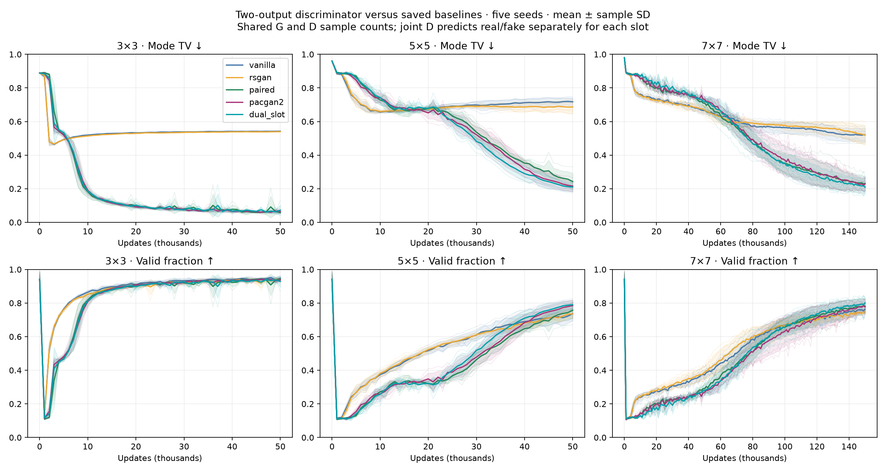
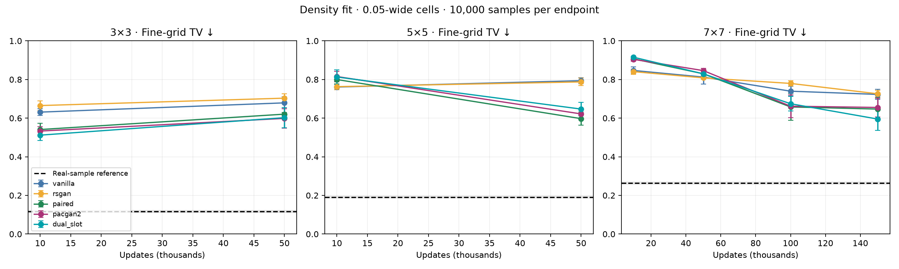
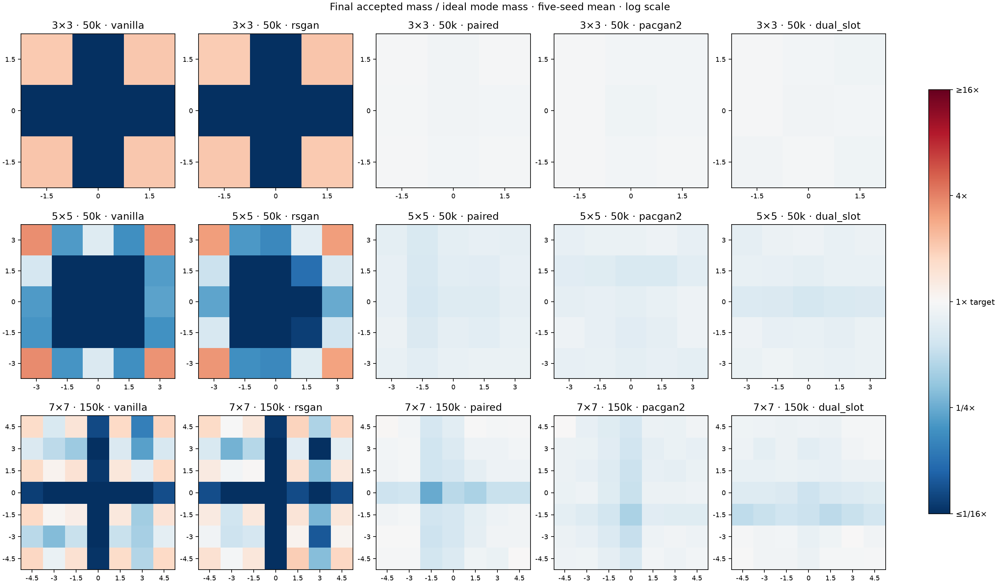
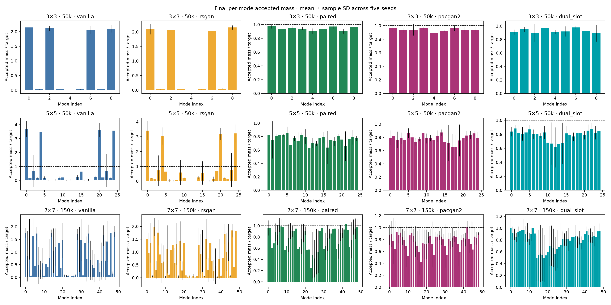

# Two-output discriminator on fixed-spacing grids

Fifteen new dual_slot trajectories: seeds 0–4, 3×3 and 5×5 through 50k, 7×7 through 150k. Reuse vanilla, RSGAN, paired and PacGAN2 from #15–17. Endpoints at 10k/50k on all grids, plus 100k/150k on 7×7. Endpoints share training trajectories and are not independent trials.

## Findings

The two-output model retains the large final mode-TV advantage over vanilla and RSGAN in every seed on all three grids. Its learning curves broadly track paired and PacGAN2, including slow early progress on the larger grids. It does not establish a consistent winner among the three joint-input methods across grids, budgets and metrics.

At 50k on 3×3, mode TV is 0.073 ± 0.032, compared with 0.058 paired and 0.064 PacGAN2. All five seeds cover all nine modes; one seed has notably worse validity, widening the variation. On 5×5, mean mode TV is 0.211 versus 0.242 paired and 0.216 PacGAN2, but fine-grid TV is worse: 0.647 versus 0.597 and 0.622. Paired wins fine-grid TV in all five matched seeds there. Two-output covers all 25 modes under the relative threshold in every seed, and under the original 1% threshold in four seeds (20/25 in seed 2).

The strongest new result is 7×7 at 150k. Mode TV is 0.209 ± 0.036, versus 0.231 paired and 0.229 PacGAN2. Fine-grid TV is 0.595 ± 0.059, versus 0.647 ± 0.058 paired and 0.655 ± 0.049 PacGAN2: two-output wins this metric in 4/5 matched seeds against paired and 5/5 against PacGAN2. It wins mode TV in 4/5 and 3/5, respectively. Validity is 80.1%, and original-threshold coverage averages 44.8/49 (all 49 in two seeds), versus 41.4 paired and 43.2 PacGAN2. However, lenient relative coverage averages only 46.6/49 versus 47.8 and 48.4: more substantial mass in represented modes does not mean fewer nearly absent modes. Full density recovery remains incomplete; fine-grid TV is still well above the real-sample reference of 0.264, and sample panels show narrow clusters and bridges.

Interpretation: the benefits in this suite survive replacing the relative/pack-level decision with separate per-slot classification. This supports investigating joint-input training more broadly, rather than attributing all gains to a particular comparison objective. It does not isolate the mechanism: shared features, gradient interactions and different compute remain coupled, and no hyperparameters were tuned. The late 7×7 density improvement warrants replication rather than a universal superiority claim.

## Objective and controls

D receives concatenated samples (A,B), emits two logits s_A and s_B, and predicts each slot’s real/fake identity. D minimizes mean BCE over both outputs. All four source combinations occur equally often: RR→(1,1), RF→(1,0), FR→(0,1), FF→(0,0). Source identities are factorially balanced; points within each combination are independent draws without Gaussian-mode matching. Fixed block order does not reveal labels to this per-example MLP: there are no batch-dependent layers or position inputs.

G uses FF, FR and RF pairs, targets real only for generated slots, and averages BCE over generated-slot predictions. In FF pairs both heads contribute and each generated member can receive gradients through both heads. In FR/RF pairs the real slot’s prediction contributes no loss, although its input can influence the fake slot’s prediction. D parameters are frozen during the G update.

| Per training step | Vanilla | RSGAN | Paired | PacGAN2 | Two-output |
|---|---:|---:|---:|---:|---:|
| D real / fake points | 256 / 256 | 256 / 256 | 256 / 256 | 256 / 256 | 256 / 256 |
| D input rows | 512 unary | 512 unary | 256 pairs | 256 packs | 256 pairs |
| D BCE decisions | 512 | 256 | 256 | 256 | 512 |
| G generated points with gradients | 256 | 256 | 256 | 256 | 256 |
| D input rows during G update | 256 unary | 512 unary | 256 pairs | 128 packs | 192 pairs |
| G real references used | 0 | 256 | 256 | 0 | 128 |
| D parameters | 17,025 | 17,025 | 17,281 | 17,281 | 17,410 |

Two-output D: 64 RR + 64 FF + 64 FR + 64 RF pairs, mean over 512 slot losses. G: 64 FF + 64 FR + 64 RF pairs, mean over 256 generated-slot losses. Every generated point appears exactly once in its phase; no reuse to inflate pair counts. Draw 256 real-G points but use only 128, and retain unused slot draws, so all sampling RNG streams remain identical to earlier experiments. One D and one G Adam update per step. Total compute is not exactly matched.

G remains 16→128→128→2 (18,946 parameters). D is 4→128→128→2, exactly matching paired/PacGAN2 hidden-layer initialization per seed with a freshly initialized two-logit output layer. Hidden activations LeakyReLU(0.2); Adam lr 0.0002, betas (0.5,0.999); no normalization or regularization. Grid spacing 1.5, sigma 0.1, unscaled coordinates. Four CPU workers, one torch thread each. Fixed 10,000-point evaluation noise; coarse metrics every 1k.

## Results

Mean ± sample SD over five seeds. Mode TV = ½(Σ|accepted mode mass−1/K| + invalid mass), with acceptance radius 0.3 and all generated samples in the denominator. True Gaussian tails prevent perfect validity. Coverage counts mass ≥1% of all samples, or ≥8% of ideal 1/K (the lenient relative threshold). Fine-grid TV compares sample frequencies with exact mixture probabilities in 0.05-wide cells over [-5.5,5.5]² plus an outside category. Real-sample references account for finite-sample noise, not training uncertainty.

| Modes | Updates | Method | Mode TV ↓ | Fine-grid TV ↓ | Valid | Coverage ≥1% | Relative coverage |
|---:|---:|---|---:|---:|---:|---:|---:|
| 9 | 10k | vanilla | 0.519 ± 0.003 | 0.631 ± 0.017 | 86.4% | 4.8/9 | 6.8/9 |
| 9 | 10k | rsgan | 0.514 ± 0.002 | 0.665 ± 0.025 | 85.3% | 6.4/9 | 7.4/9 |
| 9 | 10k | paired | 0.181 ± 0.034 | 0.541 ± 0.033 | 81.9% | 9.0/9 | 9.0/9 |
| 9 | 10k | pacgan2 | 0.190 ± 0.022 | 0.533 ± 0.022 | 81.0% | 9.0/9 | 9.0/9 |
| 9 | 10k | dual_slot | 0.185 ± 0.010 | 0.512 ± 0.028 | 81.5% | 9.0/9 | 9.0/9 |
| 9 | 50k | vanilla | 0.542 ± 0.001 | 0.679 ± 0.031 | 94.9% | 4.0/9 | 4.0/9 |
| 9 | 50k | rsgan | 0.540 ± 0.002 | 0.703 ± 0.022 | 94.3% | 4.0/9 | 4.0/9 |
| 9 | 50k | paired | 0.058 ± 0.006 | 0.621 ± 0.010 | 94.3% | 9.0/9 | 9.0/9 |
| 9 | 50k | pacgan2 | 0.064 ± 0.010 | 0.599 ± 0.050 | 93.7% | 9.0/9 | 9.0/9 |
| 9 | 50k | dual_slot | 0.073 ± 0.032 | 0.602 ± 0.052 | 92.9% | 9.0/9 | 9.0/9 |
| 25 | 10k | vanilla | 0.657 ± 0.005 | 0.761 ± 0.013 | 37.5% | 15.2/25 | 19.6/25 |
| 25 | 10k | rsgan | 0.659 ± 0.009 | 0.763 ± 0.016 | 38.2% | 14.6/25 | 17.6/25 |
| 25 | 10k | paired | 0.728 ± 0.017 | 0.800 ± 0.013 | 27.2% | 12.4/25 | 24.2/25 |
| 25 | 10k | pacgan2 | 0.741 ± 0.029 | 0.815 ± 0.026 | 25.9% | 11.0/25 | 23.4/25 |
| 25 | 10k | dual_slot | 0.742 ± 0.045 | 0.813 ± 0.037 | 25.8% | 11.4/25 | 24.0/25 |
| 25 | 50k | vanilla | 0.718 ± 0.023 | 0.794 ± 0.015 | 73.7% | 7.2/25 | 15.8/25 |
| 25 | 50k | rsgan | 0.686 ± 0.039 | 0.787 ± 0.020 | 73.5% | 7.8/25 | 17.8/25 |
| 25 | 50k | paired | 0.242 ± 0.050 | 0.597 ± 0.034 | 75.8% | 24.4/25 | 25.0/25 |
| 25 | 50k | pacgan2 | 0.216 ± 0.034 | 0.622 ± 0.028 | 78.4% | 24.6/25 | 25.0/25 |
| 25 | 50k | dual_slot | 0.211 ± 0.026 | 0.647 ± 0.035 | 79.0% | 24.0/25 | 25.0/25 |
| 49 | 10k | vanilla | 0.763 ± 0.025 | 0.847 ± 0.019 | 23.8% | 3.6/49 | 46.8/49 |
| 49 | 10k | rsgan | 0.757 ± 0.012 | 0.841 ± 0.013 | 24.3% | 3.8/49 | 45.6/49 |
| 49 | 10k | paired | 0.856 ± 0.013 | 0.907 ± 0.008 | 14.4% | 0.0/49 | 45.0/49 |
| 49 | 10k | pacgan2 | 0.854 ± 0.015 | 0.904 ± 0.010 | 14.6% | 0.0/49 | 43.0/49 |
| 49 | 10k | dual_slot | 0.871 ± 0.006 | 0.915 ± 0.005 | 12.9% | 0.0/49 | 42.4/49 |
| 49 | 50k | vanilla | 0.667 ± 0.017 | 0.813 ± 0.035 | 37.2% | 11.8/49 | 37.8/49 |
| 49 | 50k | rsgan | 0.668 ± 0.024 | 0.808 ± 0.007 | 38.8% | 12.8/49 | 38.2/49 |
| 49 | 50k | paired | 0.710 ± 0.028 | 0.829 ± 0.019 | 29.1% | 6.8/49 | 48.4/49 |
| 49 | 50k | pacgan2 | 0.731 ± 0.017 | 0.846 ± 0.011 | 26.9% | 4.8/49 | 46.8/49 |
| 49 | 50k | dual_slot | 0.720 ± 0.031 | 0.829 ± 0.018 | 28.0% | 5.4/49 | 47.6/49 |
| 49 | 100k | vanilla | 0.564 ± 0.035 | 0.739 ± 0.025 | 66.8% | 18.2/49 | 38.6/49 |
| 49 | 100k | rsgan | 0.578 ± 0.022 | 0.780 ± 0.013 | 66.1% | 16.8/49 | 37.0/49 |
| 49 | 100k | paired | 0.352 ± 0.062 | 0.658 ± 0.070 | 65.5% | 33.6/49 | 47.6/49 |
| 49 | 100k | pacgan2 | 0.370 ± 0.091 | 0.662 ± 0.058 | 63.3% | 34.0/49 | 48.4/49 |
| 49 | 100k | dual_slot | 0.352 ± 0.060 | 0.674 ± 0.038 | 65.5% | 38.0/49 | 46.8/49 |
| 49 | 150k | vanilla | 0.520 ± 0.042 | 0.723 ± 0.026 | 76.3% | 21.0/49 | 34.4/49 |
| 49 | 150k | rsgan | 0.519 ± 0.056 | 0.726 ± 0.018 | 74.8% | 21.0/49 | 35.0/49 |
| 49 | 150k | paired | 0.231 ± 0.045 | 0.647 ± 0.058 | 78.2% | 41.4/49 | 47.8/49 |
| 49 | 150k | pacgan2 | 0.229 ± 0.042 | 0.655 ± 0.048 | 77.7% | 43.2/49 | 48.4/49 |
| 49 | 150k | dual_slot | 0.209 ± 0.036 | 0.595 ± 0.059 | 80.1% | 44.8/49 | 46.6/49 |

## Matched-seed comparisons

Negative differences favor two-output D. Matching seeds controls G initialization, joint D hidden initialization and sampling streams, not trajectories or unequal output layers.

| Modes | Updates | Metric | Against | Two-output wins | Mean two-output − other |
|---:|---:|---|---|---:|---:|
| 9 | 10k | mode_tv | vanilla | 5/5 | -0.3340 |
| 9 | 10k | spatial_tv | vanilla | 5/5 | -0.1192 |
| 9 | 10k | mode_tv | rsgan | 5/5 | -0.3290 |
| 9 | 10k | spatial_tv | rsgan | 5/5 | -0.1531 |
| 9 | 10k | mode_tv | paired | 2/5 | +0.0035 |
| 9 | 10k | spatial_tv | paired | 4/5 | -0.0290 |
| 9 | 10k | mode_tv | pacgan2 | 4/5 | -0.0050 |
| 9 | 10k | spatial_tv | pacgan2 | 4/5 | -0.0212 |
| 9 | 50k | mode_tv | vanilla | 5/5 | -0.4698 |
| 9 | 50k | spatial_tv | vanilla | 4/5 | -0.0766 |
| 9 | 50k | mode_tv | rsgan | 5/5 | -0.4672 |
| 9 | 50k | spatial_tv | rsgan | 5/5 | -0.1009 |
| 9 | 50k | mode_tv | paired | 1/5 | +0.0144 |
| 9 | 50k | spatial_tv | paired | 4/5 | -0.0181 |
| 9 | 50k | mode_tv | pacgan2 | 3/5 | +0.0084 |
| 9 | 50k | spatial_tv | pacgan2 | 2/5 | +0.0038 |
| 25 | 10k | mode_tv | vanilla | 0/5 | +0.0859 |
| 25 | 10k | spatial_tv | vanilla | 0/5 | +0.0521 |
| 25 | 10k | mode_tv | rsgan | 0/5 | +0.0831 |
| 25 | 10k | spatial_tv | rsgan | 0/5 | +0.0500 |
| 25 | 10k | mode_tv | paired | 2/5 | +0.0148 |
| 25 | 10k | spatial_tv | paired | 2/5 | +0.0132 |
| 25 | 10k | mode_tv | pacgan2 | 3/5 | +0.0016 |
| 25 | 10k | spatial_tv | pacgan2 | 3/5 | -0.0024 |
| 25 | 50k | mode_tv | vanilla | 5/5 | -0.5070 |
| 25 | 50k | spatial_tv | vanilla | 5/5 | -0.1469 |
| 25 | 50k | mode_tv | rsgan | 5/5 | -0.4757 |
| 25 | 50k | spatial_tv | rsgan | 5/5 | -0.1405 |
| 25 | 50k | mode_tv | paired | 3/5 | -0.0318 |
| 25 | 50k | spatial_tv | paired | 0/5 | +0.0496 |
| 25 | 50k | mode_tv | pacgan2 | 2/5 | -0.0053 |
| 25 | 50k | spatial_tv | pacgan2 | 2/5 | +0.0251 |
| 49 | 10k | mode_tv | vanilla | 0/5 | +0.1084 |
| 49 | 10k | spatial_tv | vanilla | 0/5 | +0.0686 |
| 49 | 10k | mode_tv | rsgan | 0/5 | +0.1143 |
| 49 | 10k | spatial_tv | rsgan | 0/5 | +0.0747 |
| 49 | 10k | mode_tv | paired | 0/5 | +0.0155 |
| 49 | 10k | spatial_tv | paired | 0/5 | +0.0084 |
| 49 | 10k | mode_tv | pacgan2 | 1/5 | +0.0175 |
| 49 | 10k | spatial_tv | pacgan2 | 1/5 | +0.0110 |
| 49 | 50k | mode_tv | vanilla | 0/5 | +0.0532 |
| 49 | 50k | spatial_tv | vanilla | 1/5 | +0.0168 |
| 49 | 50k | mode_tv | rsgan | 0/5 | +0.0518 |
| 49 | 50k | spatial_tv | rsgan | 0/5 | +0.0210 |
| 49 | 50k | mode_tv | paired | 2/5 | +0.0101 |
| 49 | 50k | spatial_tv | paired | 2/5 | -0.0002 |
| 49 | 50k | mode_tv | pacgan2 | 2/5 | -0.0107 |
| 49 | 50k | spatial_tv | pacgan2 | 3/5 | -0.0167 |
| 49 | 100k | mode_tv | vanilla | 5/5 | -0.2116 |
| 49 | 100k | spatial_tv | vanilla | 5/5 | -0.0650 |
| 49 | 100k | mode_tv | rsgan | 5/5 | -0.2256 |
| 49 | 100k | spatial_tv | rsgan | 5/5 | -0.1052 |
| 49 | 100k | mode_tv | paired | 4/5 | +0.0004 |
| 49 | 100k | spatial_tv | paired | 1/5 | +0.0166 |
| 49 | 100k | mode_tv | pacgan2 | 3/5 | -0.0181 |
| 49 | 100k | spatial_tv | pacgan2 | 2/5 | +0.0129 |
| 49 | 150k | mode_tv | vanilla | 5/5 | -0.3112 |
| 49 | 150k | spatial_tv | vanilla | 5/5 | -0.1276 |
| 49 | 150k | mode_tv | rsgan | 5/5 | -0.3101 |
| 49 | 150k | spatial_tv | rsgan | 5/5 | -0.1307 |
| 49 | 150k | mode_tv | paired | 4/5 | -0.0221 |
| 49 | 150k | spatial_tv | paired | 4/5 | -0.0517 |
| 49 | 150k | mode_tv | pacgan2 | 3/5 | -0.0202 |
| 49 | 150k | spatial_tv | pacgan2 | 5/5 | -0.0601 |

## All-seed sample panels

- [3×3, 10k](samples_grid3_10k.png)
- [3×3, 50k](samples_grid3_50k.png)
- [5×5, 10k](samples_grid5_10k.png)
- [5×5, 50k](samples_grid5_50k.png)
- [7×7, 10k](samples_grid7_10k.png)
- [7×7, 50k](samples_grid7_50k.png)
- [7×7, 100k](samples_grid7_100k.png)
- [7×7, 150k](samples_grid7_150k.png)

## Verification and reproduction

All 200 endpoint metrics are recalculated from saved samples and matched to logs. All training source hashes and configurations checked. 155 endpoints replay bit-for-bit from checkpoints, including all 40 two-output endpoints. The 45 original baseline 10k sample arrays have no matching retained checkpoint. Optimizer step counters match budgets. All six RNG states match paired at 25 mutually retained checkpoints, confirming identical sampling-stream consumption (although this method uses only half of the real-G draws). Every trajectory has the full expected 1k log sequence. Saved baselines are unmodified.

Run `uv run python -m paired_discriminator.grid_dual_slot_run`, then `uv run python -m paired_discriminator.grid_dual_slot_report results/grid-dual-slot-comparison-v1`. Launcher refuses existing output directories. Configs reuse `grid3-50k.json`, `grid5-50k.json`, `grid7-150k.json`. Tests verify G and hidden-D initialization, exact pair/sample accounting and labels, D fake detachment, loss normalization, and G loss masking including cross-slot gradients.
