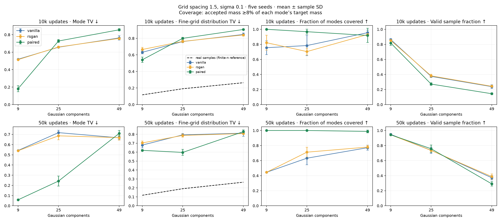
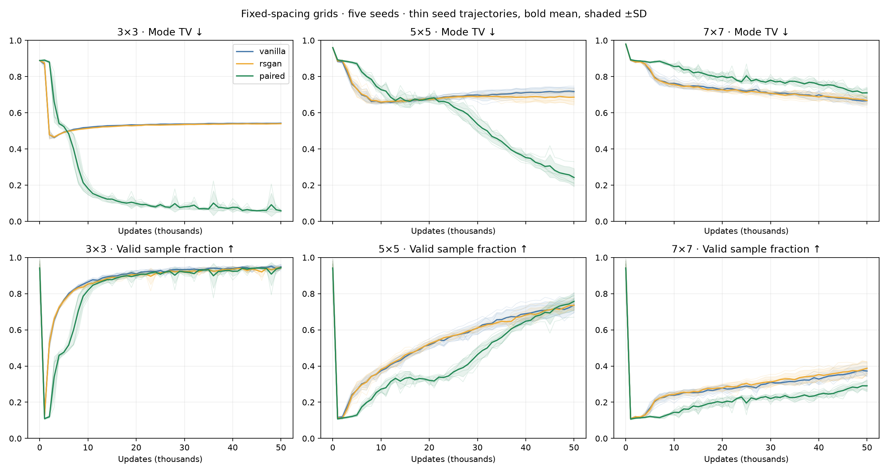
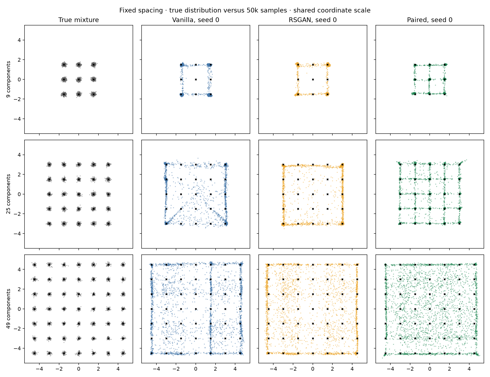

# Fixed-spacing Gaussian-grid sweep

3×3, 5×5 and 7×7 grids (9, 25, 49 equally weighted components), centered at the origin, spacing 1.5 on each axis, sigma 0.1 per axis. Larger grids expand outward; no coordinate normalization. Adjacent centers remain 15 sigma apart and 3-sigma acceptance disks do not overlap.

45 new unconditional training trajectories: vanilla, RSGAN and paired × five seeds × three grid sizes. Same original MLPs, latent dimension 16, widths 128, batch 256, Adam 0.0002 with betas (0.5,0.999), one D and one G update per step. Train to 50k; retain fixed 10,000-point evaluation draws at 10k and 50k. Coarse metrics every 1k. No method-specific tuning. The trainer is a frozen fork of the original with only the center layout changed (standalone ring CLI removed). Four local CPU workers, one torch thread each.

## Findings

At 50k, paired beats both baselines on mode TV and fine-grid TV in all five matched seeds for 3×3 and 5×5. On 3×3, paired covers all nine modes under both thresholds in every seed; vanilla and RSGAN each cover four at 50k and concentrate on the corners. On 5×5, paired covers 25/25 at the relative threshold in every seed and 25/25 at the original 1% threshold in four seeds (22/25 in seed 4). Baseline original-threshold coverage averages 7.2 and 7.8 modes.

This advantage is budget-dependent: at 10k paired is behind the baselines on mean mode TV and fine-grid TV for 5×5, then overtakes them by 50k. On 7×7 paired remains behind at 50k: mean mode TV 0.710 versus 0.667 vanilla and 0.668 RSGAN; valid fraction 29.1% versus 37.2% and 38.8%. Its relative coverage averages 48.4/49, but original-threshold coverage only 6.8/49: it reaches many neighborhoods weakly while generating most points between modes. This is not successful recovery of the 49-component density.

The sample panels show broad interior coverage for paired on the largest grid, while baselines emphasize edges and selected modes. At 50k all three have poor density fit there. Fine-grid mean rankings at 50k are unchanged at cell widths 0.025, 0.05 and 0.1. All models remain far from the real-sample density reference, including where paired wins mode balance.

Paired mode TV on 7×7 is still improving through the endpoint (0.856, 0.802, 0.780, 0.756, 0.710 at 10k increments); no plateau or eventual winner is established. No training beyond the agreed 50k budget, architecture increase, normalization, or method-specific tuning was performed.

## Metrics and controls

Mode TV = ½(Σ|accepted mass per nearest mode − 1/K| + invalid fraction). Acceptance radius is 0.3. Invalid target mass is zero; true Gaussian tails put about 1.1% outside the acceptance disks, so the real distribution itself does not score exactly zero. All generated samples remain in the denominator.

Report both original coverage (at least 1% of ALL generated points) and target-relative coverage (at least 8% of the ideal 1/K mass). The latter preserves the original eight-mode cutoff as a fraction of target mass. The 1% cutoff is increasingly strict: it requires 9%, 25%, 49% of target mass on these grids. Mode TV, per-mode mass and sample plots remain more informative than thresholded coverage.

Fine-grid TV additionally measures density placement and shape: exact Gaussian-mixture probabilities in 0.05×0.05 cells over [-5.5,5.5]² plus an outside category versus generated sample counts. Every size uses the same unscaled spatial grid. A reference from 200 independent true-mixture draws of 10,000 points accounts for its nonzero finite-sample score; the interval is real-sampling variability, not uncertainty over GAN training. Cell widths 0.025 and 0.1 are retained as sensitivity checks.

Although local separation is held fixed, expanding the grid increases coordinate range, distribution variance, and modes per fixed-size batch/network. These are the intended fixed-spacing scaling conditions; results do not isolate mode count from global extent or capacity. The 10k and 50k endpoints share a trajectory, and methods share seed-specific initialization/noise streams.

## Results

Mean ± sample SD over five seeds. Relative coverage uses 8% of target mass.

| Modes | Updates | Method | Mode TV ↓ | Fine-grid TV ↓ | Valid samples | Coverage ≥1% | Relative coverage | Full relative-coverage seeds |
|---:|---:|---|---:|---:|---:|---:|---:|---:|
| 9 | 10000 | vanilla | 0.519 ± 0.003 | 0.631 ± 0.017 | 86.4% | 4.8/9 | 6.8/9 | 0/5 |
| 9 | 10000 | rsgan | 0.514 ± 0.002 | 0.665 ± 0.025 | 85.3% | 6.4/9 | 7.4/9 | 0/5 |
| 9 | 10000 | paired | 0.181 ± 0.034 | 0.541 ± 0.033 | 81.9% | 9.0/9 | 9.0/9 | 5/5 |
| 9 | 50000 | vanilla | 0.542 ± 0.001 | 0.679 ± 0.031 | 94.9% | 4.0/9 | 4.0/9 | 0/5 |
| 9 | 50000 | rsgan | 0.540 ± 0.002 | 0.703 ± 0.022 | 94.3% | 4.0/9 | 4.0/9 | 0/5 |
| 9 | 50000 | paired | 0.058 ± 0.006 | 0.621 ± 0.010 | 94.3% | 9.0/9 | 9.0/9 | 5/5 |
| 25 | 10000 | vanilla | 0.657 ± 0.005 | 0.761 ± 0.013 | 37.5% | 15.2/25 | 19.6/25 | 0/5 |
| 25 | 10000 | rsgan | 0.659 ± 0.009 | 0.763 ± 0.016 | 38.2% | 14.6/25 | 17.6/25 | 0/5 |
| 25 | 10000 | paired | 0.728 ± 0.017 | 0.800 ± 0.013 | 27.2% | 12.4/25 | 24.2/25 | 2/5 |
| 25 | 50000 | vanilla | 0.718 ± 0.023 | 0.794 ± 0.015 | 73.7% | 7.2/25 | 15.8/25 | 0/5 |
| 25 | 50000 | rsgan | 0.686 ± 0.039 | 0.787 ± 0.020 | 73.5% | 7.8/25 | 17.8/25 | 0/5 |
| 25 | 50000 | paired | 0.242 ± 0.050 | 0.597 ± 0.034 | 75.8% | 24.4/25 | 25.0/25 | 5/5 |
| 49 | 10000 | vanilla | 0.763 ± 0.025 | 0.847 ± 0.019 | 23.8% | 3.6/49 | 46.8/49 | 1/5 |
| 49 | 10000 | rsgan | 0.757 ± 0.012 | 0.841 ± 0.013 | 24.3% | 3.8/49 | 45.6/49 | 0/5 |
| 49 | 10000 | paired | 0.856 ± 0.013 | 0.907 ± 0.008 | 14.4% | 0.0/49 | 45.0/49 | 1/5 |
| 49 | 50000 | vanilla | 0.667 ± 0.017 | 0.813 ± 0.035 | 37.2% | 11.8/49 | 37.8/49 | 0/5 |
| 49 | 50000 | rsgan | 0.668 ± 0.024 | 0.808 ± 0.007 | 38.8% | 12.8/49 | 38.2/49 | 0/5 |
| 49 | 50000 | paired | 0.710 ± 0.028 | 0.829 ± 0.019 | 29.1% | 6.8/49 | 48.4/49 | 3/5 |

## Real-sample reference

| Modes | Fine-grid TV mean | Central 95% interval |
|---:|---:|---|
| 9 | 0.1174 | 0.1114–0.1234 |
| 25 | 0.1910 | 0.1858–0.1968 |
| 49 | 0.2638 | 0.2588–0.2695 |

## Samples and per-mode mass

- [All-seed samples at 10k](samples_10k.png)
- [All-seed samples at 50k](samples_50k.png)
- [Accepted mass at 10k](accepted_mass_10k.png)
- [Accepted mass at 50k](accepted_mass_50k.png)
- [Spatial mode-mass maps at 10k](mode_mass_maps_10k.png)
- [Spatial mode-mass maps at 50k](mode_mass_maps_50k.png)

Mode indices run left-to-right along each row, from the lowest y to highest y. The sample panels use the same coordinate limits for all grid sizes. Seed 0 is displayed for illustration; the all-seed panels and mean±SD use every seed.

## Reproduce and verification

Run `uv run python -m paired_discriminator.grid_mode_sweep` with fresh output directories. Configs are `configs/grid3-50k.json`, `grid5-50k.json`, `grid7-50k.json`. The launcher refuses overwrites. Build this report with `uv run python -m paired_discriminator.grid_mode_sweep_report results/grid-mode-count-v1`. All 90 endpoints are recalculated from saved sample arrays and checked against training logs; source snapshots and sample hashes are verified. Full metrics, thresholds, source snapshots, grid-resolution sensitivity, and checkpoints are retained. No prior results are overwritten.
