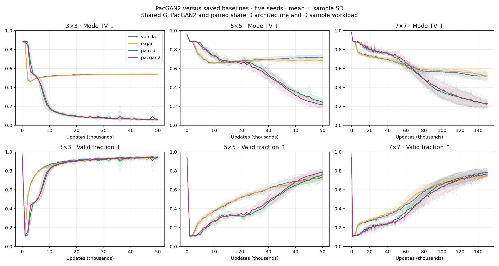
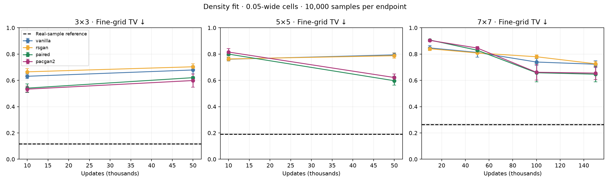
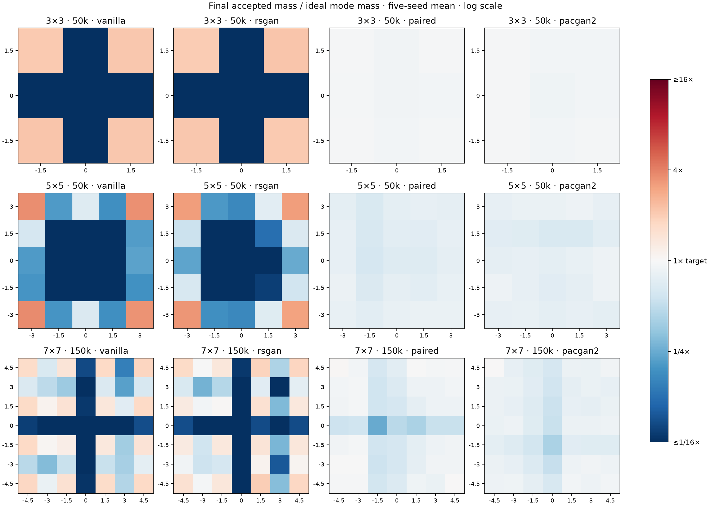
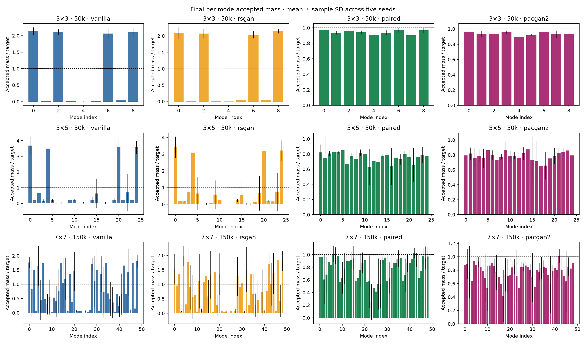

# PacGAN2 on fixed-spacing Gaussian grids

Fifteen new PacGAN2 trajectories: seeds 0–4 on 3×3 and 5×5 through 50k, and 7×7 through 150k. Reuse all vanilla, RSGAN and paired baselines from experiments #15–16. Evaluate 10k/50k for every grid and additionally 100k/150k for 7×7. Endpoints on a trajectory are not independent trials.

## Findings

PacGAN2 closely tracks paired’s learning curves, including the slower early progress on larger grids. Both strongly improve final mode allocation over vanilla and RSGAN. There is no consistent overall winner between PacGAN2 and paired across these metrics and budgets.

At 50k on 3×3, mode TV is 0.064 ± 0.010 PacGAN2 versus 0.058 ± 0.006 paired; both cover all nine modes under both thresholds in every seed. Fine-grid TV slightly favors PacGAN2 on average (0.599 versus 0.621), with mixed seed-level outcomes. On 5×5, PacGAN2 improves mode TV (0.216 versus 0.242, winning 4/5 matched seeds), while paired improves fine-grid TV (0.597 versus 0.622, winning 4/5). Both recover all 25 modes at the relative threshold in every seed, and at the original 1% threshold in four of five seeds.

On 7×7, PacGAN2 also starts behind the unary baselines, then overtakes them with more training. At 150k its mode TV is 0.229 ± 0.042 versus paired’s 0.231 ± 0.045, vanilla’s 0.520 and RSGAN’s 0.519. The near-equal mean hides seed variation: paired has lower mode TV in 4/5 matched seeds, while PacGAN2’s larger win on seed 0 offsets those differences. Fine-grid TV is 0.655 PacGAN2 versus 0.647 paired, both far above the true-mixture sampling reference of 0.264. Original-threshold coverage averages 43.2/49 versus 41.4/49; each reaches all 49 in only one seed. Samples still show narrow clusters and bridges.

Interpretation: the gains observed here do not require our real–fake reference arrangement; same-source packing produces very similar improvements with the same joint D architecture. This does not establish an identical mechanism or rule out benefits on other tasks. It makes PacGAN2 a necessary baseline for subsequent claims. No method-specific tuning was performed, and the G-step discriminator workload is smaller for PacGAN2.

## Method and workload

[PacGAN](https://arxiv.org/pdf/1712.04086) with pack size 2, applied to our existing BCE GAN; this is not a reproduction of the paper’s architecture or dataset settings. Each pack contains two independent draws from the same source (real or generated), without mode matching. D predicts whether a pack is real. G uses non-saturating BCE targeting real, differentiating through both members.

| Per training step | Vanilla | RSGAN | Paired | PacGAN2 |
|---|---:|---:|---:|---:|
| D real / fake points | 256 / 256 | 256 / 256 | 256 / 256 | 256 / 256 |
| D network input rows | 512 unary | 512 unary | 256 mixed pairs | 256 same-source packs |
| D BCE decisions | 512 | 256 differences | 256 | 256 |
| G generated points with gradients | 256 | 256 | 256 | 256 |
| D input rows during G update | 256 unary | 512 unary | 256 mixed pairs | 128 fake packs |
| G real references used | 0 | 256 | 256 | 0 |
| D parameters | 17,025 | 17,025 | 17,281 | 17,281 |

Every step has one D optimizer update and one G optimizer update; an additional 256 fake points are generated without gradients for D. All methods share G (16→128→128→2, 18,946 parameters), Adam lr 0.0002, betas (0.5,0.999), batch 256 and independent seed-specific sampling streams. Paired and PacGAN2 share the exact 4→128→128→1 D architecture and initialization. Hidden activations are LeakyReLU(0.2). PacGAN2 D averages BCE over 128 real-real and 128 fake-fake packs; G averages over 128 fake-fake packs. Real-G and slot draws are retained but unused for PacGAN2. The G-step D workload differs; this is not exactly matched total compute.

Grid spacing 1.5, sigma 0.1, no coordinate normalization or class labels. Four local CPU workers with one torch thread each. Fixed 10,000-point evaluation noise per seed; coarse metrics every 1k; sample arrays and full checkpoints at requested endpoints.

## Results

Mean ± sample SD across five seeds. Mode TV penalizes accepted mass imbalance and invalid points. Validity uses radius 0.3; Gaussian tails mean the true distribution does not have perfect validity. Coverage counts modes receiving ≥1% of all samples, or ≥8% of ideal 1/K mass (the much more lenient relative threshold). Fine-grid TV uses exact mixture probabilities in 0.05-wide cells over [-5.5,5.5]² plus an outside category. The real-sample reference accounts for finite-sample noise and is not a training uncertainty interval.

| Modes | Updates | Method | Mode TV ↓ | Fine-grid TV ↓ | Valid | Coverage ≥1% | Relative coverage |
|---:|---:|---|---:|---:|---:|---:|---:|
| 9 | 10k | vanilla | 0.519 ± 0.003 | 0.631 ± 0.017 | 86.4% | 4.8/9 | 6.8/9 |
| 9 | 10k | rsgan | 0.514 ± 0.002 | 0.665 ± 0.025 | 85.3% | 6.4/9 | 7.4/9 |
| 9 | 10k | paired | 0.181 ± 0.034 | 0.541 ± 0.033 | 81.9% | 9.0/9 | 9.0/9 |
| 9 | 10k | pacgan2 | 0.190 ± 0.022 | 0.533 ± 0.022 | 81.0% | 9.0/9 | 9.0/9 |
| 9 | 50k | vanilla | 0.542 ± 0.001 | 0.679 ± 0.031 | 94.9% | 4.0/9 | 4.0/9 |
| 9 | 50k | rsgan | 0.540 ± 0.002 | 0.703 ± 0.022 | 94.3% | 4.0/9 | 4.0/9 |
| 9 | 50k | paired | 0.058 ± 0.006 | 0.621 ± 0.010 | 94.3% | 9.0/9 | 9.0/9 |
| 9 | 50k | pacgan2 | 0.064 ± 0.010 | 0.599 ± 0.050 | 93.7% | 9.0/9 | 9.0/9 |
| 25 | 10k | vanilla | 0.657 ± 0.005 | 0.761 ± 0.013 | 37.5% | 15.2/25 | 19.6/25 |
| 25 | 10k | rsgan | 0.659 ± 0.009 | 0.763 ± 0.016 | 38.2% | 14.6/25 | 17.6/25 |
| 25 | 10k | paired | 0.728 ± 0.017 | 0.800 ± 0.013 | 27.2% | 12.4/25 | 24.2/25 |
| 25 | 10k | pacgan2 | 0.741 ± 0.029 | 0.815 ± 0.026 | 25.9% | 11.0/25 | 23.4/25 |
| 25 | 50k | vanilla | 0.718 ± 0.023 | 0.794 ± 0.015 | 73.7% | 7.2/25 | 15.8/25 |
| 25 | 50k | rsgan | 0.686 ± 0.039 | 0.787 ± 0.020 | 73.5% | 7.8/25 | 17.8/25 |
| 25 | 50k | paired | 0.242 ± 0.050 | 0.597 ± 0.034 | 75.8% | 24.4/25 | 25.0/25 |
| 25 | 50k | pacgan2 | 0.216 ± 0.034 | 0.622 ± 0.028 | 78.4% | 24.6/25 | 25.0/25 |
| 49 | 10k | vanilla | 0.763 ± 0.025 | 0.847 ± 0.019 | 23.8% | 3.6/49 | 46.8/49 |
| 49 | 10k | rsgan | 0.757 ± 0.012 | 0.841 ± 0.013 | 24.3% | 3.8/49 | 45.6/49 |
| 49 | 10k | paired | 0.856 ± 0.013 | 0.907 ± 0.008 | 14.4% | 0.0/49 | 45.0/49 |
| 49 | 10k | pacgan2 | 0.854 ± 0.015 | 0.904 ± 0.010 | 14.6% | 0.0/49 | 43.0/49 |
| 49 | 50k | vanilla | 0.667 ± 0.017 | 0.813 ± 0.035 | 37.2% | 11.8/49 | 37.8/49 |
| 49 | 50k | rsgan | 0.668 ± 0.024 | 0.808 ± 0.007 | 38.8% | 12.8/49 | 38.2/49 |
| 49 | 50k | paired | 0.710 ± 0.028 | 0.829 ± 0.019 | 29.1% | 6.8/49 | 48.4/49 |
| 49 | 50k | pacgan2 | 0.731 ± 0.017 | 0.846 ± 0.011 | 26.9% | 4.8/49 | 46.8/49 |
| 49 | 100k | vanilla | 0.564 ± 0.035 | 0.739 ± 0.025 | 66.8% | 18.2/49 | 38.6/49 |
| 49 | 100k | rsgan | 0.578 ± 0.022 | 0.780 ± 0.013 | 66.1% | 16.8/49 | 37.0/49 |
| 49 | 100k | paired | 0.352 ± 0.062 | 0.658 ± 0.070 | 65.5% | 33.6/49 | 47.6/49 |
| 49 | 100k | pacgan2 | 0.370 ± 0.091 | 0.662 ± 0.058 | 63.3% | 34.0/49 | 48.4/49 |
| 49 | 150k | vanilla | 0.520 ± 0.042 | 0.723 ± 0.026 | 76.3% | 21.0/49 | 34.4/49 |
| 49 | 150k | rsgan | 0.519 ± 0.056 | 0.726 ± 0.018 | 74.8% | 21.0/49 | 35.0/49 |
| 49 | 150k | paired | 0.231 ± 0.045 | 0.647 ± 0.058 | 78.2% | 41.4/49 | 47.8/49 |
| 49 | 150k | pacgan2 | 0.229 ± 0.042 | 0.655 ± 0.048 | 77.7% | 43.2/49 | 48.4/49 |

## Matched-seed comparisons

Negative differences favor PacGAN2. Seeds pair initialization and random streams, not identical trajectories.

| Modes | Updates | Metric | Against | PacGAN2 wins | Mean PacGAN2 − other |
|---:|---:|---|---|---:|---:|
| 9 | 10k | mode_tv | vanilla | 5/5 | -0.3291 |
| 9 | 10k | spatial_tv | vanilla | 5/5 | -0.0980 |
| 9 | 10k | mode_tv | rsgan | 5/5 | -0.3240 |
| 9 | 10k | spatial_tv | rsgan | 5/5 | -0.1319 |
| 9 | 10k | mode_tv | paired | 2/5 | +0.0085 |
| 9 | 10k | spatial_tv | paired | 3/5 | -0.0078 |
| 9 | 50k | mode_tv | vanilla | 5/5 | -0.4782 |
| 9 | 50k | spatial_tv | vanilla | 5/5 | -0.0804 |
| 9 | 50k | mode_tv | rsgan | 5/5 | -0.4756 |
| 9 | 50k | spatial_tv | rsgan | 5/5 | -0.1048 |
| 9 | 50k | mode_tv | paired | 2/5 | +0.0060 |
| 9 | 50k | spatial_tv | paired | 3/5 | -0.0220 |
| 25 | 10k | mode_tv | vanilla | 0/5 | +0.0843 |
| 25 | 10k | spatial_tv | vanilla | 0/5 | +0.0544 |
| 25 | 10k | mode_tv | rsgan | 0/5 | +0.0814 |
| 25 | 10k | spatial_tv | rsgan | 0/5 | +0.0523 |
| 25 | 10k | mode_tv | paired | 2/5 | +0.0132 |
| 25 | 10k | spatial_tv | paired | 2/5 | +0.0156 |
| 25 | 50k | mode_tv | vanilla | 5/5 | -0.5018 |
| 25 | 50k | spatial_tv | vanilla | 5/5 | -0.1721 |
| 25 | 50k | mode_tv | rsgan | 5/5 | -0.4705 |
| 25 | 50k | spatial_tv | rsgan | 5/5 | -0.1657 |
| 25 | 50k | mode_tv | paired | 4/5 | -0.0265 |
| 25 | 50k | spatial_tv | paired | 1/5 | +0.0245 |
| 49 | 10k | mode_tv | vanilla | 0/5 | +0.0909 |
| 49 | 10k | spatial_tv | vanilla | 0/5 | +0.0576 |
| 49 | 10k | mode_tv | rsgan | 0/5 | +0.0968 |
| 49 | 10k | spatial_tv | rsgan | 0/5 | +0.0637 |
| 49 | 10k | mode_tv | paired | 2/5 | -0.0021 |
| 49 | 10k | spatial_tv | paired | 2/5 | -0.0025 |
| 49 | 50k | mode_tv | vanilla | 0/5 | +0.0639 |
| 49 | 50k | spatial_tv | vanilla | 1/5 | +0.0335 |
| 49 | 50k | mode_tv | rsgan | 0/5 | +0.0625 |
| 49 | 50k | spatial_tv | rsgan | 0/5 | +0.0377 |
| 49 | 50k | mode_tv | paired | 2/5 | +0.0208 |
| 49 | 50k | spatial_tv | paired | 2/5 | +0.0165 |
| 49 | 100k | mode_tv | vanilla | 5/5 | -0.1934 |
| 49 | 100k | spatial_tv | vanilla | 5/5 | -0.0778 |
| 49 | 100k | mode_tv | rsgan | 5/5 | -0.2075 |
| 49 | 100k | spatial_tv | rsgan | 5/5 | -0.1180 |
| 49 | 100k | mode_tv | paired | 2/5 | +0.0185 |
| 49 | 100k | spatial_tv | paired | 2/5 | +0.0037 |
| 49 | 150k | mode_tv | vanilla | 5/5 | -0.2910 |
| 49 | 150k | spatial_tv | vanilla | 5/5 | -0.0675 |
| 49 | 150k | mode_tv | rsgan | 5/5 | -0.2899 |
| 49 | 150k | spatial_tv | rsgan | 5/5 | -0.0706 |
| 49 | 150k | mode_tv | paired | 1/5 | -0.0019 |
| 49 | 150k | spatial_tv | paired | 3/5 | +0.0084 |

## All-seed sample panels

- [3×3, 10k](samples_grid3_10k.png)
- [3×3, 50k](samples_grid3_50k.png)
- [5×5, 10k](samples_grid5_10k.png)
- [5×5, 50k](samples_grid5_50k.png)
- [7×7, 10k](samples_grid7_10k.png)
- [7×7, 50k](samples_grid7_50k.png)
- [7×7, 100k](samples_grid7_100k.png)
- [7×7, 150k](samples_grid7_150k.png)

## Verification and reproduction

All 160 endpoint metrics were recomputed from saved samples and checked against logs. All source snapshot hashes and configs were checked. 115 endpoints, including all 40 PacGAN2 endpoints, regenerate bit-for-bit from checkpoints; the original 45 baseline 10k sample arrays have no retained matching checkpoint. Optimizer step counters match every replayed endpoint. All six RNG states match paired at each of the 25 mutually retained checkpoints, confirming equal sampling-stream consumption. Every trajectory has its full expected 1k evaluation sequence. Sample hashes and analysis source are retained. Existing baseline files were read without modification.

Run `uv run python -m paired_discriminator.grid_pacgan_run` with fresh output directories, then `uv run python -m paired_discriminator.grid_pacgan_report results/grid-pacgan2-comparison-v1`. The launcher refuses overwrites. Configs reuse `grid3-50k.json`, `grid5-50k.json`, `grid7-150k.json`. Tests verify identical initialization, exact packing/sample counts, D fake detachment and gradients through both G pack members.
