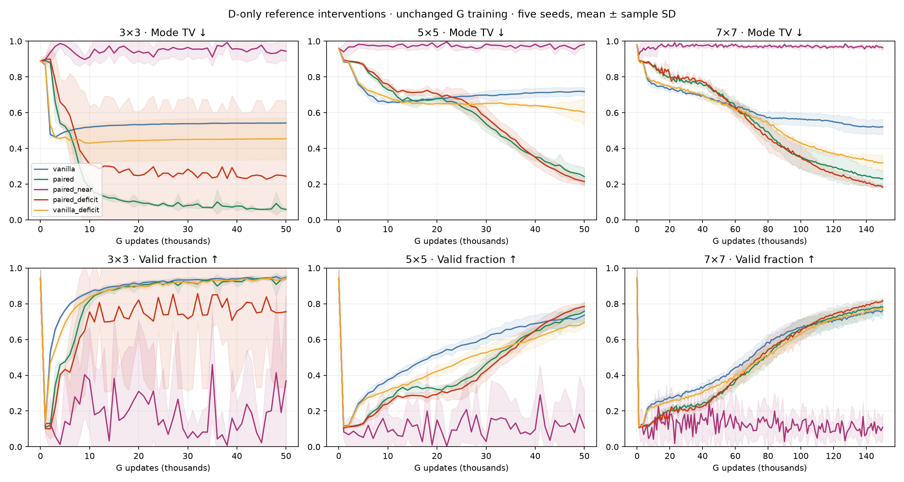
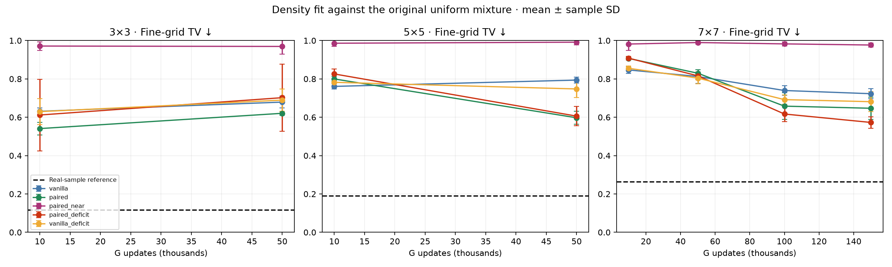
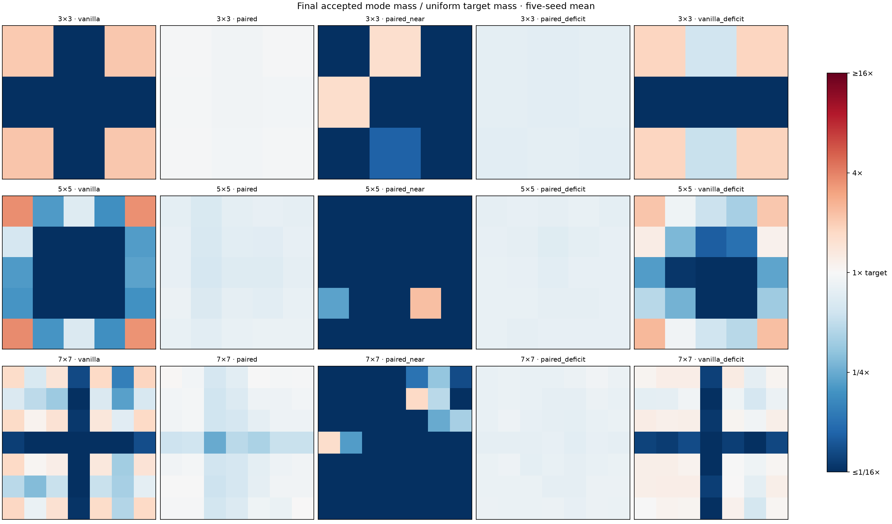
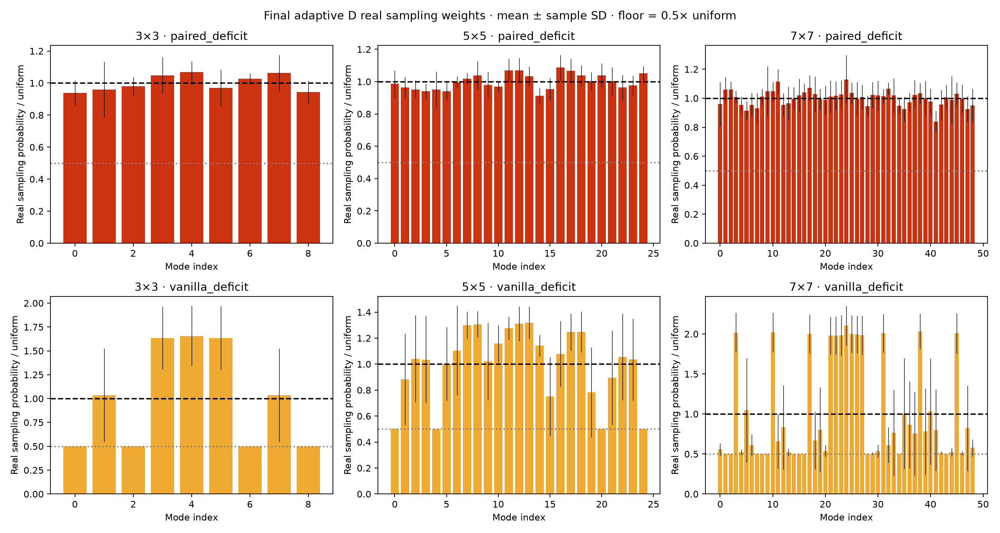

# Nearby and underrepresented-mode references on Gaussian grids

45 new runs: paired_near, paired_deficit and vanilla_deficit × seeds 0–4 × 3×3/5×5/7×7. Only D real sampling/pairing changes; G references stay random and uniform. Original D256/G256, architectures, optimizer settings and budgets. Smaller grids run to 50k; 7×7 to 150k. Existing random paired/vanilla and other historical methods are reused. Sample and update counts match, but exact matching adds substantial CPU work; compute is not matched. [Prespecified protocol](PROTOCOL.md).

## Findings

The useful signal comes from emphasizing underrepresented modes, not from the D-only nearby matching tested here. Adaptive sampling improves final mean mode TV for vanilla on every grid and for paired on 5×5/7×7, but destabilizes one paired 3×3 seed. Neither policy is a universal improvement.

Nearby paired performs poorly: final mean mode TV is 0.944 on 3×3, 0.982 on 5×5, 0.963 on 7×7. The corresponding random-paired scores are 0.058, 0.242, 0.231. The matching diagnostics confirm reduced pair distances and the real-real audit is consistent with chance source-role prediction. However, D learns on matched pairs while G uses independent random references; the result may reflect that context mismatch and does not reject nearby pairing in both phases. One-to-one matching also cannot make every reference local after G collapses, because it must retain the full real batch.

On 7×7 at 150k, adaptive paired improves mode TV 0.231→0.183 and fine-grid TV 0.647→0.573. It wins those metrics in 4/5 and 4/5 matched seeds, respectively. Original-threshold coverage improves 41.4→49.0 of 49 modes; all 49 clear that threshold in all five adaptive-paired seeds, versus one original-paired seed. Adaptive vanilla also benefits substantially: mode TV 0.520→0.320, fine-grid TV 0.723→0.681. Thus an appreciable part of the benefit comes from the real-sampling rule itself, not uniquely from joint inputs. Paired remains ahead of the adaptive vanilla control at this endpoint. Both remain above the real-sample fine-grid reference of 0.264.

On 5×5 at 50k, adaptive paired improves mode TV 0.242→0.214, with all 25 modes above the original 1% threshold in all five seeds. But fine-grid TV slightly worsens (0.597→0.606). Adaptive vanilla improves mode TV 0.718→0.603 while remaining far behind paired. On 3×3, adaptive vanilla improves mode allocation (two seeds reach six modes rather than four), without improving mean fine-grid TV. Adaptive paired has four full-coverage seeds and one catastrophic failure: seed 1 has zero valid samples at 50k, raising mean mode TV to 0.245 versus 0.058. Generated coordinates and losses remain finite; the failure is retained, not excluded.

Interpretation: prioritizing missing modes is a promising synthetic-data intervention, with meaningful benefits beyond ordinary paired training on 7×7. It uses known Gaussian geometry and changes D’s real training distribution, so it is not a pure reference-association test or a ready-made image method. The vanilla control uses the same algorithm driven by its own G, not the same realized weights. Paired-deficit also retains uniform G references, introducing a D/G context difference. No mixture strength or EMA tuning was performed, and the seed failure and mixed density rankings matter. Further tests could isolate the phase choice, but none were added to this run.

## Policies and controls

**Nearby paired:** minimum-sum squared-Euclidean-distance one-to-one matching of the original uniform real batch to the generated batch. Every point appears once, both marginals remain unchanged, fake order is retained, and A/B slots are randomized as before. Matching biases the association; it does not resample easier real points. D trains on near pairs, while G trains with random pairs, so their pair-context distributions differ.

**Underrepresented-mode sampling:** use the known Gaussian centers and acceptance radius to track accepted generator mass q_k with an EMA (decay 0.99, initialized at 1/K). Each step uses its previous EMA to set d_k=max(1/K−q_k,0), then samples real modes with w_k=0.5/K+0.5d_k/Σd. Use uniform fallback when all deficits vanish. Fresh Gaussian noise retains sigma 0.1. Update the estimate from the existing D fake batch; no extra G samples or evaluation-noise feedback. Invalid mass remains in the denominator. Every mode has probability at least 0.5/K. Equal accepted mass across modes produces uniform weights; this does not guarantee stability. Log estimates and weights.

**Vanilla control:** applies the same adaptive rule to its own generator. This controls the sampling algorithm, not an identical weight trajectory. The deficit policy changes the real training distribution, unlike nearby matching. Paired-deficit also has a context difference: G’s references remain uniform while D’s real samples are weighted. Metrics always evaluate against the original uniform mixture. Differences between near and deficit arms therefore do not isolate pairing distance.

## Real-versus-real diagnostic

Nearby matching uses symmetric costs; swapping source batches produces the same matched edges in the structural test. A separate learned diagnostic trains D for 2,000 steps on two independent real source batches (5×5, three seeds), then evaluates 51,200 fresh pairs per seed. Source-role accuracy should be 50%. Standard errors below are across 200 batches, allowing within-batch dependence.

| Seed | Held-out accuracy | Batch-based SE |
|---:|---:|---:|
| 0 | 49.05% | 0.53% |
| 1 | 49.96% | 0.49% |
| 2 | 49.69% | 0.69% |

The diagnostic is consistent with chance; it does not prove absence of every possible source-role signal. It applies to nearby matching, not adaptive reweighting, whose purpose is to change the real sampling distribution.

## Metrics and results

Mean ± sample SD across five seeds. Mode TV = ½(Σ|accepted mass−1/K|+invalid mass), radius 0.3, all generated samples in denominator. Original coverage requires ≥1% of all samples per mode; relative coverage requires ≥8% of ideal 1/K mass. Fine-grid TV measures density using exact mixture probabilities in 0.05-wide cells over [-5.5,5.5]² plus an outside category. Real-sample calibration accounts for sampling noise, not training uncertainty.

| Modes | Updates | Method | Mode TV ↓ | Fine-grid TV ↓ | Valid | Coverage ≥1% | Relative coverage |
|---:|---:|---|---:|---:|---:|---:|---:|
| 9 | 10k | vanilla | 0.519 ± 0.003 | 0.631 ± 0.017 | 86.4% | 4.8/9 | 6.8/9 |
| 9 | 10k | rsgan | 0.514 ± 0.002 | 0.665 ± 0.025 | 85.3% | 6.4/9 | 7.4/9 |
| 9 | 10k | paired | 0.181 ± 0.034 | 0.541 ± 0.033 | 81.9% | 9.0/9 | 9.0/9 |
| 9 | 10k | pacgan2 | 0.190 ± 0.022 | 0.533 ± 0.022 | 81.0% | 9.0/9 | 9.0/9 |
| 9 | 10k | dual_slot | 0.185 ± 0.010 | 0.512 ± 0.028 | 81.5% | 9.0/9 | 9.0/9 |
| 9 | 10k | paired_near | 0.911 ± 0.050 | 0.971 ± 0.022 | 37.3% | 0.8/9 | 0.8/9 |
| 9 | 10k | paired_deficit | 0.312 ± 0.324 | 0.612 ± 0.186 | 75.4% | 7.4/9 | 7.4/9 |
| 9 | 10k | vanilla_deficit | 0.429 ± 0.109 | 0.629 ± 0.067 | 83.7% | 7.0/9 | 7.6/9 |
| 9 | 50k | vanilla | 0.542 ± 0.001 | 0.679 ± 0.031 | 94.9% | 4.0/9 | 4.0/9 |
| 9 | 50k | rsgan | 0.540 ± 0.002 | 0.703 ± 0.022 | 94.3% | 4.0/9 | 4.0/9 |
| 9 | 50k | paired | 0.058 ± 0.006 | 0.621 ± 0.010 | 94.3% | 9.0/9 | 9.0/9 |
| 9 | 50k | pacgan2 | 0.064 ± 0.010 | 0.599 ± 0.050 | 93.7% | 9.0/9 | 9.0/9 |
| 9 | 50k | dual_slot | 0.073 ± 0.032 | 0.602 ± 0.052 | 92.9% | 9.0/9 | 9.0/9 |
| 9 | 50k | paired_near | 0.944 ± 0.056 | 0.969 ± 0.041 | 36.8% | 0.6/9 | 0.6/9 |
| 9 | 50k | paired_deficit | 0.245 ± 0.422 | 0.702 ± 0.174 | 75.5% | 7.2/9 | 7.2/9 |
| 9 | 50k | vanilla_deficit | 0.454 ± 0.117 | 0.689 ± 0.058 | 94.4% | 4.8/9 | 4.8/9 |
| 25 | 10k | vanilla | 0.657 ± 0.005 | 0.761 ± 0.013 | 37.5% | 15.2/25 | 19.6/25 |
| 25 | 10k | rsgan | 0.659 ± 0.009 | 0.763 ± 0.016 | 38.2% | 14.6/25 | 17.6/25 |
| 25 | 10k | paired | 0.728 ± 0.017 | 0.800 ± 0.013 | 27.2% | 12.4/25 | 24.2/25 |
| 25 | 10k | pacgan2 | 0.741 ± 0.029 | 0.815 ± 0.026 | 25.9% | 11.0/25 | 23.4/25 |
| 25 | 10k | dual_slot | 0.742 ± 0.045 | 0.813 ± 0.037 | 25.8% | 11.4/25 | 24.0/25 |
| 25 | 10k | paired_near | 0.975 ± 0.023 | 0.986 ± 0.017 | 8.3% | 0.6/25 | 0.8/25 |
| 25 | 10k | paired_deficit | 0.760 ± 0.028 | 0.826 ± 0.027 | 24.0% | 9.8/25 | 25.0/25 |
| 25 | 10k | vanilla_deficit | 0.685 ± 0.013 | 0.782 ± 0.015 | 31.5% | 13.4/25 | 22.6/25 |
| 25 | 50k | vanilla | 0.718 ± 0.023 | 0.794 ± 0.015 | 73.7% | 7.2/25 | 15.8/25 |
| 25 | 50k | rsgan | 0.686 ± 0.039 | 0.787 ± 0.020 | 73.5% | 7.8/25 | 17.8/25 |
| 25 | 50k | paired | 0.242 ± 0.050 | 0.597 ± 0.034 | 75.8% | 24.4/25 | 25.0/25 |
| 25 | 50k | pacgan2 | 0.216 ± 0.034 | 0.622 ± 0.028 | 78.4% | 24.6/25 | 25.0/25 |
| 25 | 50k | dual_slot | 0.211 ± 0.026 | 0.647 ± 0.035 | 79.0% | 24.0/25 | 25.0/25 |
| 25 | 50k | paired_near | 0.982 ± 0.020 | 0.992 ± 0.015 | 10.5% | 0.6/25 | 0.6/25 |
| 25 | 50k | paired_deficit | 0.214 ± 0.022 | 0.606 ± 0.050 | 78.6% | 25.0/25 | 25.0/25 |
| 25 | 50k | vanilla_deficit | 0.603 ± 0.075 | 0.748 ± 0.045 | 69.6% | 10.2/25 | 19.8/25 |
| 49 | 10k | vanilla | 0.763 ± 0.025 | 0.847 ± 0.019 | 23.8% | 3.6/49 | 46.8/49 |
| 49 | 10k | rsgan | 0.757 ± 0.012 | 0.841 ± 0.013 | 24.3% | 3.8/49 | 45.6/49 |
| 49 | 10k | paired | 0.856 ± 0.013 | 0.907 ± 0.008 | 14.4% | 0.0/49 | 45.0/49 |
| 49 | 10k | pacgan2 | 0.854 ± 0.015 | 0.904 ± 0.010 | 14.6% | 0.0/49 | 43.0/49 |
| 49 | 10k | dual_slot | 0.871 ± 0.006 | 0.915 ± 0.005 | 12.9% | 0.0/49 | 42.4/49 |
| 49 | 10k | paired_near | 0.964 ± 0.046 | 0.982 ± 0.033 | 4.2% | 0.6/49 | 7.8/49 |
| 49 | 10k | paired_deficit | 0.859 ± 0.012 | 0.908 ± 0.010 | 14.1% | 0.0/49 | 41.6/49 |
| 49 | 10k | vanilla_deficit | 0.779 ± 0.010 | 0.855 ± 0.013 | 22.1% | 3.4/49 | 46.6/49 |
| 49 | 50k | vanilla | 0.667 ± 0.017 | 0.813 ± 0.035 | 37.2% | 11.8/49 | 37.8/49 |
| 49 | 50k | rsgan | 0.668 ± 0.024 | 0.808 ± 0.007 | 38.8% | 12.8/49 | 38.2/49 |
| 49 | 50k | paired | 0.710 ± 0.028 | 0.829 ± 0.019 | 29.1% | 6.8/49 | 48.4/49 |
| 49 | 50k | pacgan2 | 0.731 ± 0.017 | 0.846 ± 0.011 | 26.9% | 4.8/49 | 46.8/49 |
| 49 | 50k | dual_slot | 0.720 ± 0.031 | 0.829 ± 0.018 | 28.0% | 5.4/49 | 47.6/49 |
| 49 | 50k | paired_near | 0.976 ± 0.011 | 0.990 ± 0.008 | 7.8% | 1.0/49 | 1.6/49 |
| 49 | 50k | paired_deficit | 0.697 ± 0.032 | 0.816 ± 0.020 | 30.3% | 7.0/49 | 46.6/49 |
| 49 | 50k | vanilla_deficit | 0.661 ± 0.030 | 0.804 ± 0.029 | 34.4% | 11.4/49 | 39.6/49 |
| 49 | 100k | vanilla | 0.564 ± 0.035 | 0.739 ± 0.025 | 66.8% | 18.2/49 | 38.6/49 |
| 49 | 100k | rsgan | 0.578 ± 0.022 | 0.780 ± 0.013 | 66.1% | 16.8/49 | 37.0/49 |
| 49 | 100k | paired | 0.352 ± 0.062 | 0.658 ± 0.070 | 65.5% | 33.6/49 | 47.6/49 |
| 49 | 100k | pacgan2 | 0.370 ± 0.091 | 0.662 ± 0.058 | 63.3% | 34.0/49 | 48.4/49 |
| 49 | 100k | dual_slot | 0.352 ± 0.060 | 0.674 ± 0.038 | 65.5% | 38.0/49 | 46.8/49 |
| 49 | 100k | paired_near | 0.976 ± 0.013 | 0.983 ± 0.010 | 10.4% | 1.0/49 | 1.6/49 |
| 49 | 100k | paired_deficit | 0.351 ± 0.054 | 0.617 ± 0.039 | 64.9% | 41.0/49 | 49.0/49 |
| 49 | 100k | vanilla_deficit | 0.430 ± 0.012 | 0.692 ± 0.025 | 63.2% | 27.0/49 | 41.2/49 |
| 49 | 150k | vanilla | 0.520 ± 0.042 | 0.723 ± 0.026 | 76.3% | 21.0/49 | 34.4/49 |
| 49 | 150k | rsgan | 0.519 ± 0.056 | 0.726 ± 0.018 | 74.8% | 21.0/49 | 35.0/49 |
| 49 | 150k | paired | 0.231 ± 0.045 | 0.647 ± 0.058 | 78.2% | 41.4/49 | 47.8/49 |
| 49 | 150k | pacgan2 | 0.229 ± 0.042 | 0.655 ± 0.048 | 77.7% | 43.2/49 | 48.4/49 |
| 49 | 150k | dual_slot | 0.209 ± 0.036 | 0.595 ± 0.059 | 80.1% | 44.8/49 | 46.6/49 |
| 49 | 150k | paired_near | 0.963 ± 0.016 | 0.977 ± 0.011 | 10.9% | 1.6/49 | 2.6/49 |
| 49 | 150k | paired_deficit | 0.183 ± 0.010 | 0.573 ± 0.030 | 81.7% | 49.0/49 | 49.0/49 |
| 49 | 150k | vanilla_deficit | 0.320 ± 0.045 | 0.681 ± 0.052 | 77.3% | 33.0/49 | 39.2/49 |

## Matching diagnostics

Cumulative mean batch RMS distance before/after matching at the final endpoint, averaged across five seeds. This is a geometric check, not a distribution-quality metric.

| Grid | Random pairing RMS | Matched RMS |
|---|---:|---:|
| 3×3 | 2.435 | 2.292 |
| 5×5 | 4.122 | 3.847 |
| 7×7 | 5.971 | 5.457 |

## All-seed samples

- [3×3, 10k](samples_grid3_10k.png)
- [3×3, 50k](samples_grid3_50k.png)
- [5×5, 10k](samples_grid5_10k.png)
- [5×5, 50k](samples_grid5_50k.png)
- [7×7, 10k](samples_grid7_10k.png)
- [7×7, 50k](samples_grid7_50k.png)
- [7×7, 100k](samples_grid7_100k.png)
- [7×7, 150k](samples_grid7_150k.png)

## Verification and reproduction

All 320 retained endpoints verified from saved arrays, including 120 new endpoints that regenerate bit-for-bit from checkpoints and 200 reused endpoints whose hashes match the prior verified report. Source hashes, configurations and optimizer step counts checked. G real/noise/slot/evaluation and D-noise RNG states match original baselines at all 75 mutually retained checkpoints. The real sampling stream also matches for nearby arms and changes for deficit arms as intended. Diagnostics verify normalized weights, the uniform floor and reduced near-pair distance.

Run `uv run python -m paired_discriminator.grid_reference_audit`, then `uv run python -m paired_discriminator.grid_reference_run`, then `uv run python -m paired_discriminator.grid_reference_report results/grid-reference-comparison-v1`. Launchers refuse existing outputs. SciPy provides exact assignment; dependencies are locked. Full matched-seed differences, source, sample arrays and metrics are retained. Checkpoints remain local and ignored by Git.
