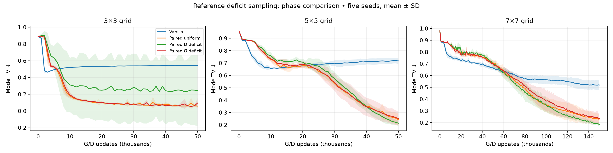
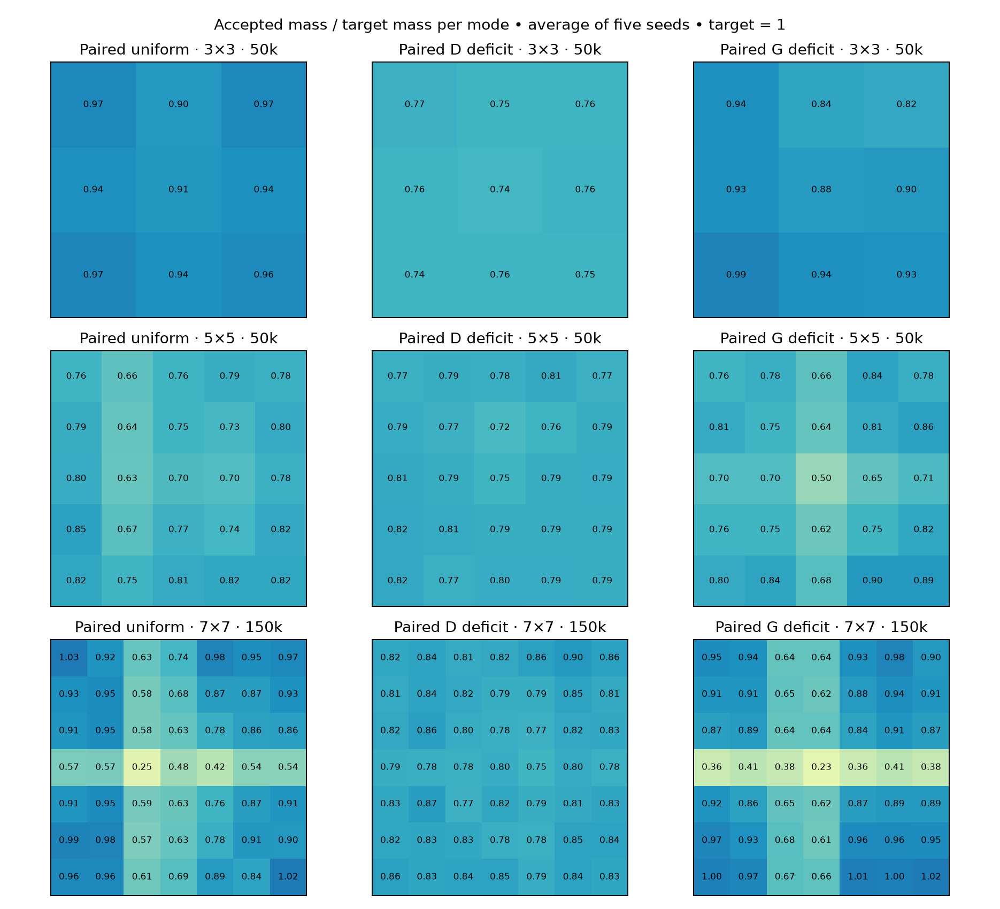

# G-only deficit references on grids

D samples real points uniformly; only paired G references are deficit-weighted. Same EMA .99 and 50% uniform floor as D-only experiment. Five seeds; no new vanilla training.

G-only weighting does not reproduce D-only gains. At 7×7/150k it loses to D-only on both TV measures in all five matched seeds. Versus original paired, results are mixed: 3/5 wins on each TV measure, with nearly identical mean mode TV and coverage. The 3×3 D-only mean includes the previously observed failed seed.

## Final endpoints

Mean ± sample SD. Coverage uses ≥1% of all generated samples per mode.

| Grid | Method | Mode TV ↓ | Fine density TV ↓ | Valid mass ↑ | Coverage ↑ | Full coverage seeds |
|---|---|---:|---:|---:|---:|---:|
| 3×3 | Vanilla | 0.5424 ± 0.0011 | 0.6790 ± 0.0310 | 0.9485 ± 0.0136 | 4.0/9 | 0/5 |
| 3×3 | rsgan | 0.5399 ± 0.0018 | 0.7033 ± 0.0220 | 0.9434 ± 0.0050 | 4.0/9 | 0/5 |
| 3×3 | Paired uniform | 0.0582 ± 0.0058 | 0.6205 ± 0.0096 | 0.9431 ± 0.0054 | 9.0/9 | 5/5 |
| 3×3 | pacgan2 | 0.0643 ± 0.0103 | 0.5986 ± 0.0501 | 0.9371 ± 0.0100 | 9.0/9 | 5/5 |
| 3×3 | dual_slot | 0.0727 ± 0.0324 | 0.6024 ± 0.0524 | 0.9287 ± 0.0332 | 9.0/9 | 5/5 |
| 3×3 | paired_near | 0.9438 ± 0.0556 | 0.9692 ± 0.0409 | 0.3684 ± 0.4783 | 0.6/9 | 0/5 |
| 3×3 | Paired D deficit | 0.2447 ± 0.4222 | 0.7021 ± 0.1744 | 0.7555 ± 0.4223 | 7.2/9 | 4/5 |
| 3×3 | vanilla_deficit | 0.4539 ± 0.1166 | 0.6894 ± 0.0582 | 0.9441 ± 0.0108 | 4.8/9 | 0/5 |
| 3×3 | Paired G deficit | 0.0945 ± 0.0569 | 0.7216 ± 0.0786 | 0.9073 ± 0.0577 | 9.0/9 | 5/5 |
| 5×5 | Vanilla | 0.7176 ± 0.0235 | 0.7938 ± 0.0152 | 0.7366 ± 0.0413 | 7.2/25 | 0/5 |
| 5×5 | rsgan | 0.6863 ± 0.0388 | 0.7874 ± 0.0196 | 0.7350 ± 0.0249 | 7.8/25 | 0/5 |
| 5×5 | Paired uniform | 0.2423 ± 0.0499 | 0.5972 ± 0.0339 | 0.7577 ± 0.0499 | 24.4/25 | 4/5 |
| 5×5 | pacgan2 | 0.2158 ± 0.0340 | 0.6217 ± 0.0277 | 0.7843 ± 0.0339 | 24.6/25 | 4/5 |
| 5×5 | dual_slot | 0.2105 ± 0.0262 | 0.6469 ± 0.0355 | 0.7895 ± 0.0261 | 24.0/25 | 4/5 |
| 5×5 | paired_near | 0.9816 ± 0.0202 | 0.9915 ± 0.0148 | 0.1046 ± 0.2025 | 0.6/25 | 0/5 |
| 5×5 | Paired D deficit | 0.2144 ± 0.0217 | 0.6058 ± 0.0500 | 0.7856 ± 0.0217 | 25.0/25 | 5/5 |
| 5×5 | vanilla_deficit | 0.6025 ± 0.0755 | 0.7476 ± 0.0454 | 0.6962 ± 0.0267 | 10.2/25 | 0/5 |
| 5×5 | Paired G deficit | 0.2513 ± 0.0566 | 0.6381 ± 0.0221 | 0.7503 ± 0.0572 | 23.6/25 | 3/5 |
| 7×7 | Vanilla | 0.5201 ± 0.0416 | 0.7227 ± 0.0262 | 0.7635 ± 0.0324 | 21.0/49 | 0/5 |
| 7×7 | rsgan | 0.5190 ± 0.0560 | 0.7258 ± 0.0181 | 0.7478 ± 0.0110 | 21.0/49 | 0/5 |
| 7×7 | Paired uniform | 0.2310 ± 0.0452 | 0.6469 ± 0.0584 | 0.7816 ± 0.0433 | 41.4/49 | 1/5 |
| 7×7 | pacgan2 | 0.2291 ± 0.0419 | 0.6552 ± 0.0485 | 0.7765 ± 0.0419 | 43.2/49 | 1/5 |
| 7×7 | dual_slot | 0.2089 ± 0.0356 | 0.5951 ± 0.0587 | 0.8014 ± 0.0297 | 44.8/49 | 2/5 |
| 7×7 | paired_near | 0.9630 ± 0.0163 | 0.9767 ± 0.0113 | 0.1093 ± 0.0774 | 1.6/49 | 0/5 |
| 7×7 | Paired D deficit | 0.1830 ± 0.0100 | 0.5729 ± 0.0300 | 0.8170 ± 0.0101 | 49.0/49 | 5/5 |
| 7×7 | vanilla_deficit | 0.3196 ± 0.0454 | 0.6812 ± 0.0518 | 0.7730 ± 0.0268 | 33.0/49 | 0/5 |
| 7×7 | Paired G deficit | 0.2348 ± 0.0436 | 0.6245 ± 0.0542 | 0.7769 ± 0.0359 | 41.0/49 | 1/5 |

Verification: 40 exact checkpoint replays; 25 D/noise RNG comparisons; historical mode and fine-density metrics recomputed. All failures retained. Full endpoint and learning-curve data in CSV files.
