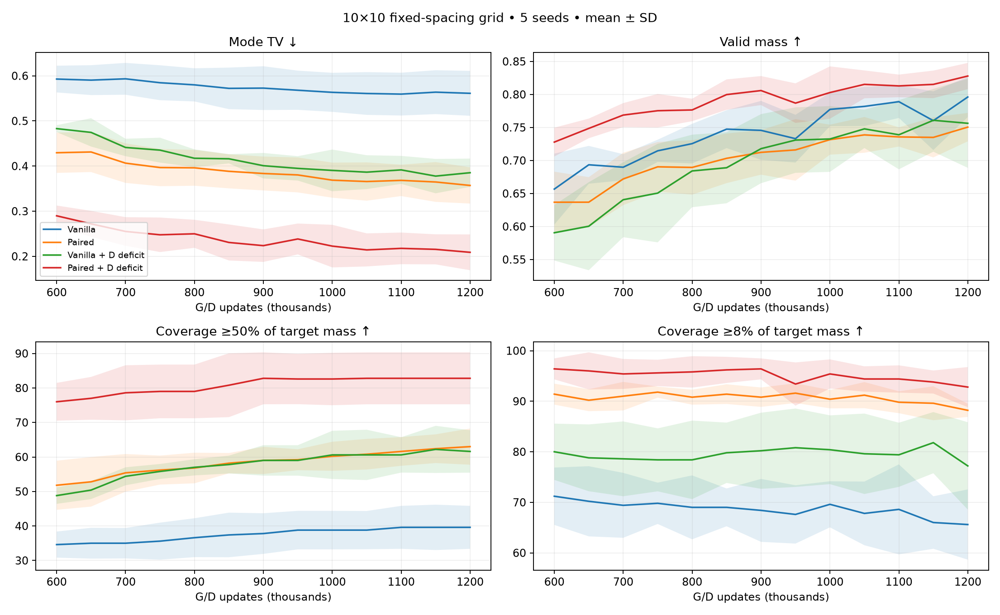
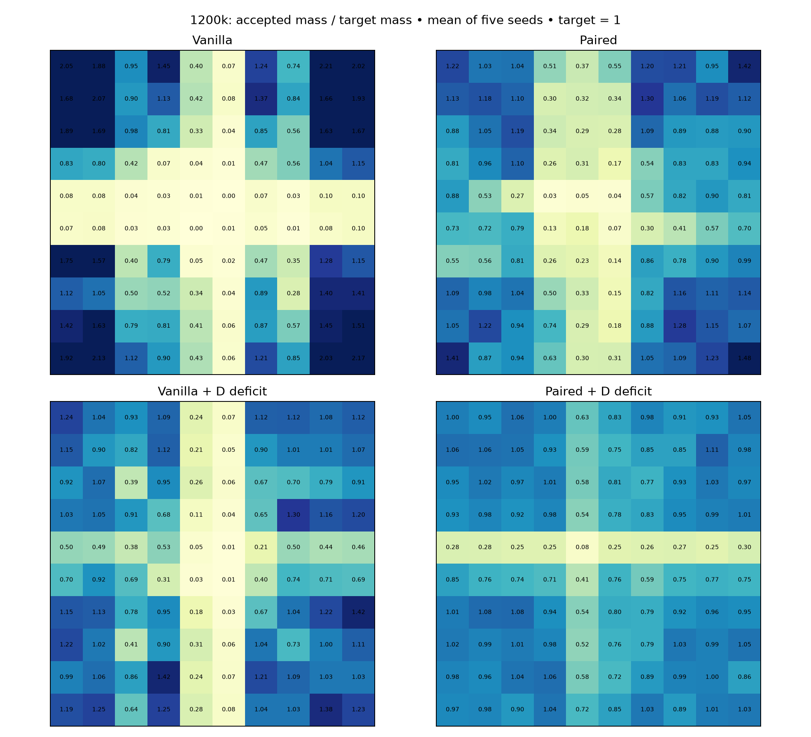
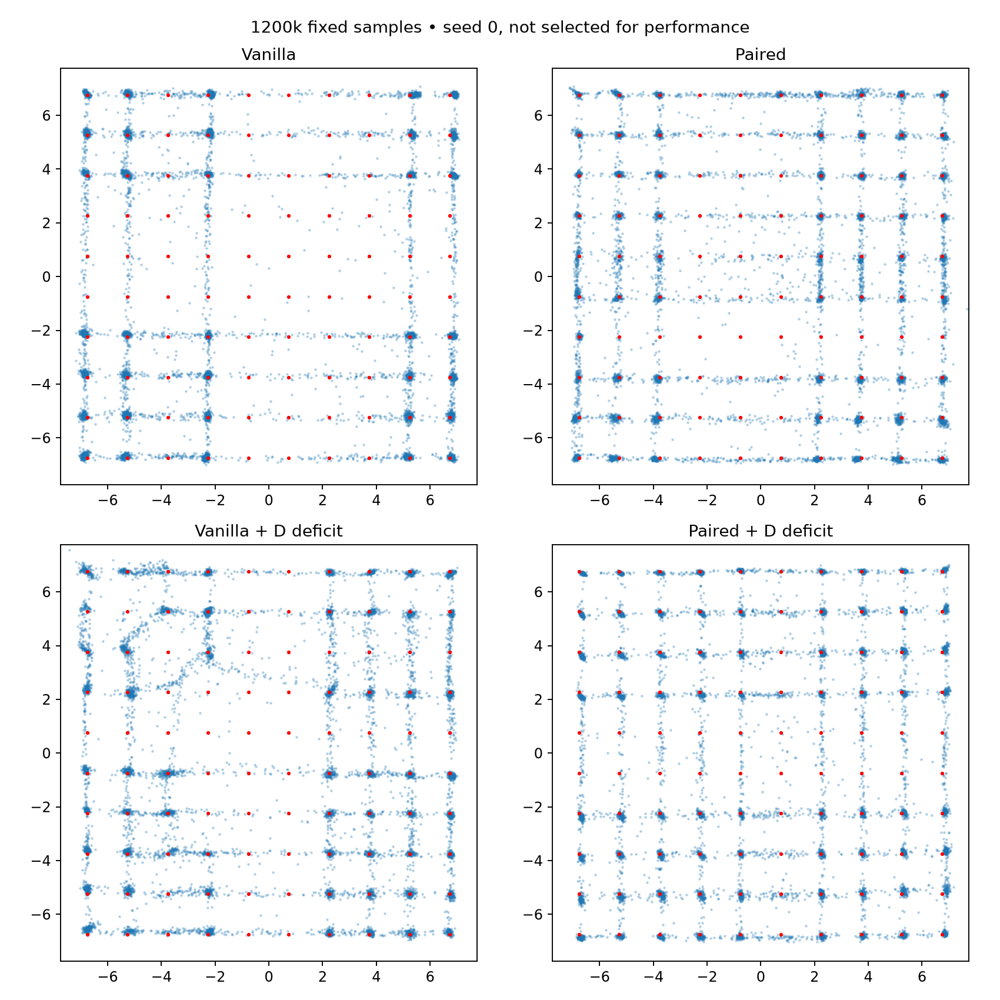

# 10×10 grid: D-only deficit sampling

100 Gaussian modes; spacing 1.5, sigma .1, centers span ±6.75. Five seeds through 1200k. Same networks, losses, batches and deficit rule as prior grids.

Coverage ≥1% is retained in CSVs but now equals the entire target mass per mode. The tables emphasize ≥50% and ≥8% of target mass; the latter is the existing lenient relative criterion.

Density TV uses 0.05 cells over [-7.75,7.75]² plus outside mass, expanded to encompass all 100 modes. Do not directly compare density TV across mode counts without the finite-sample real reference.

True-mixture 10k-sample reference: mean mode TV 0.0452, fine-density TV 0.3622.

## 600,000 updates

Mean ± sample SD across five seeds.

| Method | Mode TV ↓ | Fine TV ↓ | Valid mass ↑ | Coverage ≥50% target | Coverage ≥8% target | Full ≥50% seeds |
|---|---:|---:|---:|---:|---:|---:|
| Vanilla | 0.5928 ± 0.0296 | 0.7755 ± 0.0216 | 0.6566 ± 0.0537 | 34.6/100 | 71.2/100 | 0/5 |
| Paired | 0.4295 ± 0.0447 | 0.7018 ± 0.0155 | 0.6368 ± 0.0463 | 51.8/100 | 91.4/100 | 0/5 |
| Vanilla + D deficit | 0.4830 ± 0.0076 | 0.7384 ± 0.0135 | 0.5905 ± 0.0420 | 48.8/100 | 80.0/100 | 0/5 |
| Paired + D deficit | 0.2898 ± 0.0228 | 0.6406 ± 0.0584 | 0.7278 ± 0.0218 | 76.0/100 | 96.4/100 | 0/5 |

## 650,000 updates

Mean ± sample SD across five seeds.

| Method | Mode TV ↓ | Fine TV ↓ | Valid mass ↑ | Coverage ≥50% target | Coverage ≥8% target | Full ≥50% seeds |
|---|---:|---:|---:|---:|---:|---:|
| Vanilla | 0.5904 ± 0.0331 | 0.7612 ± 0.0297 | 0.6934 ± 0.0286 | 35.0/100 | 70.2/100 | 0/5 |
| Paired | 0.4312 ± 0.0445 | 0.7271 ± 0.0328 | 0.6368 ± 0.0379 | 52.8/100 | 90.2/100 | 0/5 |
| Vanilla + D deficit | 0.4746 ± 0.0314 | 0.7370 ± 0.0397 | 0.6004 ± 0.0666 | 50.4/100 | 78.8/100 | 0/5 |
| Paired + D deficit | 0.2719 ± 0.0288 | 0.6249 ± 0.0362 | 0.7485 ± 0.0149 | 77.0/100 | 96.0/100 | 0/5 |

## 700,000 updates

Mean ± sample SD across five seeds.

| Method | Mode TV ↓ | Fine TV ↓ | Valid mass ↑ | Coverage ≥50% target | Coverage ≥8% target | Full ≥50% seeds |
|---|---:|---:|---:|---:|---:|---:|
| Vanilla | 0.5933 ± 0.0353 | 0.7888 ± 0.0351 | 0.6898 ± 0.0198 | 35.0/100 | 69.4/100 | 0/5 |
| Paired | 0.4065 ± 0.0438 | 0.6811 ± 0.0278 | 0.6720 ± 0.0397 | 55.4/100 | 91.0/100 | 0/5 |
| Vanilla + D deficit | 0.4412 ± 0.0193 | 0.7139 ± 0.0408 | 0.6405 ± 0.0567 | 54.4/100 | 78.6/100 | 0/5 |
| Paired + D deficit | 0.2551 ± 0.0317 | 0.6201 ± 0.0457 | 0.7687 ± 0.0182 | 78.6/100 | 95.4/100 | 0/5 |

## 750,000 updates

Mean ± sample SD across five seeds.

| Method | Mode TV ↓ | Fine TV ↓ | Valid mass ↑ | Coverage ≥50% target | Coverage ≥8% target | Full ≥50% seeds |
|---|---:|---:|---:|---:|---:|---:|
| Vanilla | 0.5847 ± 0.0387 | 0.7629 ± 0.0343 | 0.7146 ± 0.0169 | 35.6/100 | 69.8/100 | 0/5 |
| Paired | 0.3967 ± 0.0413 | 0.6693 ± 0.0163 | 0.6904 ± 0.0376 | 56.2/100 | 91.8/100 | 0/5 |
| Vanilla + D deficit | 0.4353 ± 0.0276 | 0.7287 ± 0.0348 | 0.6506 ± 0.0746 | 55.8/100 | 78.4/100 | 0/5 |
| Paired + D deficit | 0.2477 ± 0.0382 | 0.6106 ± 0.0319 | 0.7753 ± 0.0254 | 79.0/100 | 95.6/100 | 0/5 |

## 800,000 updates

Mean ± sample SD across five seeds.

| Method | Mode TV ↓ | Fine TV ↓ | Valid mass ↑ | Coverage ≥50% target | Coverage ≥8% target | Full ≥50% seeds |
|---|---:|---:|---:|---:|---:|---:|
| Vanilla | 0.5799 ± 0.0368 | 0.7542 ± 0.0117 | 0.7255 ± 0.0300 | 36.6/100 | 69.0/100 | 0/5 |
| Paired | 0.3961 ± 0.0397 | 0.6798 ± 0.0324 | 0.6895 ± 0.0413 | 56.8/100 | 90.8/100 | 0/5 |
| Vanilla + D deficit | 0.4173 ± 0.0198 | 0.7097 ± 0.0358 | 0.6841 ± 0.0549 | 57.0/100 | 78.4/100 | 0/5 |
| Paired + D deficit | 0.2499 ± 0.0311 | 0.5993 ± 0.0245 | 0.7765 ± 0.0170 | 79.0/100 | 95.8/100 | 0/5 |

## 850,000 updates

Mean ± sample SD across five seeds.

| Method | Mode TV ↓ | Fine TV ↓ | Valid mass ↑ | Coverage ≥50% target | Coverage ≥8% target | Full ≥50% seeds |
|---|---:|---:|---:|---:|---:|---:|
| Vanilla | 0.5722 ± 0.0461 | 0.7417 ± 0.0165 | 0.7474 ± 0.0287 | 37.4/100 | 69.0/100 | 0/5 |
| Paired | 0.3883 ± 0.0378 | 0.6758 ± 0.0350 | 0.7032 ± 0.0375 | 58.2/100 | 91.4/100 | 0/5 |
| Vanilla + D deficit | 0.4161 ± 0.0102 | 0.6990 ± 0.0544 | 0.6890 ± 0.0538 | 57.8/100 | 79.8/100 | 0/5 |
| Paired + D deficit | 0.2307 ± 0.0399 | 0.6006 ± 0.0385 | 0.7998 ± 0.0231 | 80.8/100 | 96.2/100 | 0/5 |

## 900,000 updates

Mean ± sample SD across five seeds.

| Method | Mode TV ↓ | Fine TV ↓ | Valid mass ↑ | Coverage ≥50% target | Coverage ≥8% target | Full ≥50% seeds |
|---|---:|---:|---:|---:|---:|---:|
| Vanilla | 0.5727 ± 0.0485 | 0.7647 ± 0.0134 | 0.7456 ± 0.0446 | 37.8/100 | 68.4/100 | 0/5 |
| Paired | 0.3835 ± 0.0376 | 0.6972 ± 0.0142 | 0.7123 ± 0.0338 | 59.0/100 | 90.8/100 | 0/5 |
| Vanilla + D deficit | 0.4008 ± 0.0283 | 0.6900 ± 0.0331 | 0.7179 ± 0.0523 | 59.0/100 | 80.2/100 | 0/5 |
| Paired + D deficit | 0.2236 ± 0.0361 | 0.5835 ± 0.0319 | 0.8059 ± 0.0220 | 82.8/100 | 96.4/100 | 0/5 |

## 950,000 updates

Mean ± sample SD across five seeds.

| Method | Mode TV ↓ | Fine TV ↓ | Valid mass ↑ | Coverage ≥50% target | Coverage ≥8% target | Full ≥50% seeds |
|---|---:|---:|---:|---:|---:|---:|
| Vanilla | 0.5680 ± 0.0435 | 0.7757 ± 0.0278 | 0.7330 ± 0.0361 | 38.8/100 | 67.6/100 | 0/5 |
| Paired | 0.3803 ± 0.0387 | 0.6827 ± 0.0359 | 0.7160 ± 0.0466 | 59.2/100 | 91.6/100 | 0/5 |
| Vanilla + D deficit | 0.3949 ± 0.0270 | 0.6809 ± 0.0266 | 0.7309 ± 0.0496 | 59.0/100 | 80.8/100 | 0/5 |
| Paired + D deficit | 0.2384 ± 0.0342 | 0.6217 ± 0.0753 | 0.7868 ± 0.0300 | 82.6/100 | 93.4/100 | 0/5 |

## 1,000,000 updates

Mean ± sample SD across five seeds.

| Method | Mode TV ↓ | Fine TV ↓ | Valid mass ↑ | Coverage ≥50% target | Coverage ≥8% target | Full ≥50% seeds |
|---|---:|---:|---:|---:|---:|---:|
| Vanilla | 0.5634 ± 0.0433 | 0.7297 ± 0.0231 | 0.7774 ± 0.0255 | 38.8/100 | 69.6/100 | 0/5 |
| Paired | 0.3687 ± 0.0389 | 0.6722 ± 0.0298 | 0.7315 ± 0.0227 | 60.2/100 | 90.4/100 | 0/5 |
| Vanilla + D deficit | 0.3904 ± 0.0462 | 0.6918 ± 0.0430 | 0.7325 ± 0.0498 | 60.6/100 | 80.4/100 | 0/5 |
| Paired + D deficit | 0.2226 ± 0.0472 | 0.6135 ± 0.0391 | 0.8029 ± 0.0397 | 82.6/100 | 95.4/100 | 0/5 |

## 1,050,000 updates

Mean ± sample SD across five seeds.

| Method | Mode TV ↓ | Fine TV ↓ | Valid mass ↑ | Coverage ≥50% target | Coverage ≥8% target | Full ≥50% seeds |
|---|---:|---:|---:|---:|---:|---:|
| Vanilla | 0.5608 ± 0.0474 | 0.7303 ± 0.0099 | 0.7819 ± 0.0297 | 38.8/100 | 67.8/100 | 0/5 |
| Paired | 0.3657 ± 0.0425 | 0.6585 ± 0.0317 | 0.7387 ± 0.0271 | 60.8/100 | 91.2/100 | 0/5 |
| Vanilla + D deficit | 0.3865 ± 0.0375 | 0.6811 ± 0.0241 | 0.7479 ± 0.0290 | 60.6/100 | 79.6/100 | 0/5 |
| Paired + D deficit | 0.2142 ± 0.0366 | 0.5923 ± 0.0422 | 0.8153 ± 0.0211 | 82.8/100 | 94.4/100 | 0/5 |

## 1,100,000 updates

Mean ± sample SD across five seeds.

| Method | Mode TV ↓ | Fine TV ↓ | Valid mass ↑ | Coverage ≥50% target | Coverage ≥8% target | Full ≥50% seeds |
|---|---:|---:|---:|---:|---:|---:|
| Vanilla | 0.5594 ± 0.0475 | 0.7280 ± 0.0284 | 0.7890 ± 0.0246 | 39.6/100 | 68.6/100 | 0/5 |
| Paired | 0.3683 ± 0.0348 | 0.6813 ± 0.0330 | 0.7356 ± 0.0145 | 61.6/100 | 89.8/100 | 0/5 |
| Vanilla + D deficit | 0.3915 ± 0.0310 | 0.6904 ± 0.0573 | 0.7389 ± 0.0523 | 60.6/100 | 79.4/100 | 0/5 |
| Paired + D deficit | 0.2176 ± 0.0351 | 0.6118 ± 0.0428 | 0.8129 ± 0.0171 | 82.8/100 | 94.4/100 | 0/5 |

## 1,150,000 updates

Mean ± sample SD across five seeds.

| Method | Mode TV ↓ | Fine TV ↓ | Valid mass ↑ | Coverage ≥50% target | Coverage ≥8% target | Full ≥50% seeds |
|---|---:|---:|---:|---:|---:|---:|
| Vanilla | 0.5638 ± 0.0486 | 0.7599 ± 0.0498 | 0.7603 ± 0.0444 | 39.6/100 | 66.0/100 | 0/5 |
| Paired | 0.3647 ± 0.0441 | 0.6724 ± 0.0319 | 0.7349 ± 0.0303 | 62.4/100 | 89.6/100 | 0/5 |
| Vanilla + D deficit | 0.3777 ± 0.0381 | 0.6644 ± 0.0462 | 0.7608 ± 0.0475 | 62.2/100 | 81.8/100 | 0/5 |
| Paired + D deficit | 0.2154 ± 0.0333 | 0.6246 ± 0.0392 | 0.8152 ± 0.0209 | 82.8/100 | 93.8/100 | 0/5 |

## 1,200,000 updates

Mean ± sample SD across five seeds.

| Method | Mode TV ↓ | Fine TV ↓ | Valid mass ↑ | Coverage ≥50% target | Coverage ≥8% target | Full ≥50% seeds |
|---|---:|---:|---:|---:|---:|---:|
| Vanilla | 0.5612 ± 0.0498 | 0.7436 ± 0.0188 | 0.7961 ± 0.0303 | 39.6/100 | 65.6/100 | 0/5 |
| Paired | 0.3570 ± 0.0401 | 0.6548 ± 0.0167 | 0.7505 ± 0.0215 | 63.0/100 | 88.2/100 | 0/5 |
| Vanilla + D deficit | 0.3853 ± 0.0313 | 0.6670 ± 0.0286 | 0.7563 ± 0.0675 | 61.6/100 | 77.2/100 | 0/5 |
| Paired + D deficit | 0.2088 ± 0.0397 | 0.6248 ± 0.0224 | 0.8279 ± 0.0199 | 82.8/100 | 92.8/100 | 0/5 |

Heatmaps average seeds; they do not imply every seed covers every mode.

Verification: 260 exact endpoint replays, 130 unchanged G/noise RNG checks. Source hashes and optimizer counts verified.
