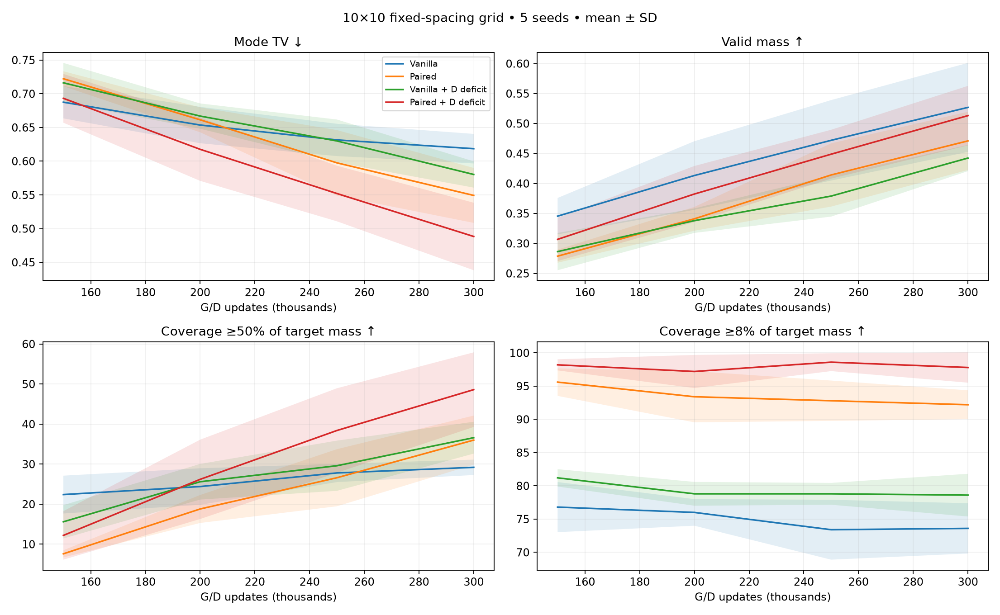
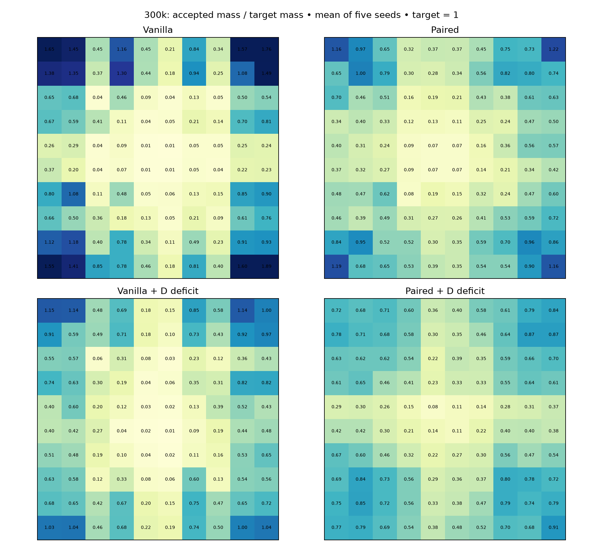
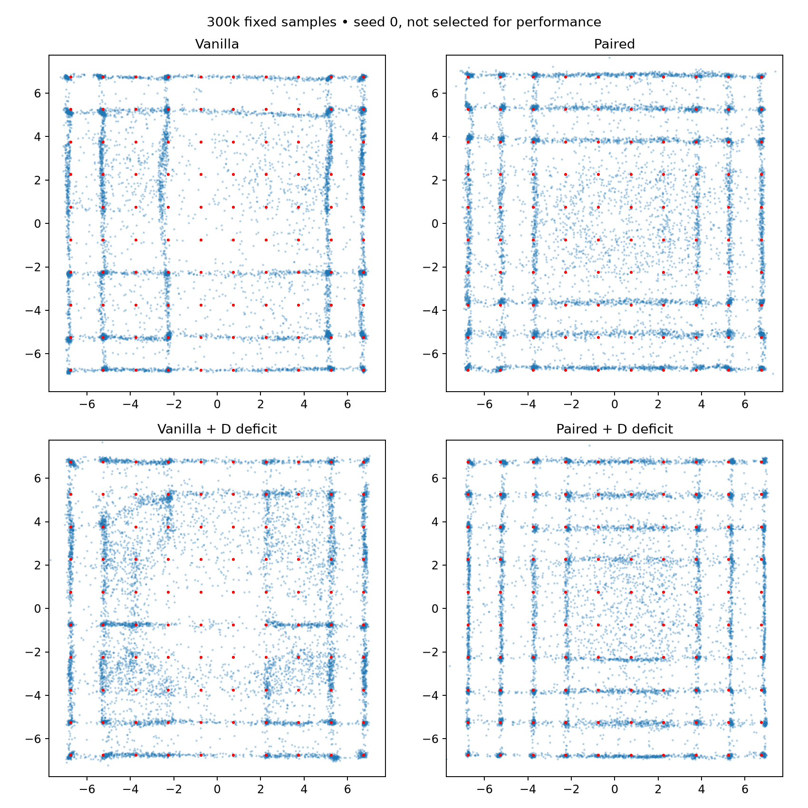

# 10×10 grid: D-only deficit sampling

100 Gaussian modes; spacing 1.5, sigma .1, centers span ±6.75. Five seeds through 300k. Same networks, losses, batches and deficit rule as prior grids.

Coverage ≥1% is retained in CSVs but now equals the entire target mass per mode. The tables emphasize ≥50% and ≥8% of target mass; the latter is the existing lenient relative criterion.

Density TV uses 0.05 cells over [-7.75,7.75]² plus outside mass, expanded to encompass all 100 modes. Do not directly compare density TV across mode counts without the finite-sample real reference.

True-mixture 10k-sample reference: mean mode TV 0.0452, fine-density TV 0.3622.

At 300k, paired + D deficit beats each other method on both TV measures in all five matched seeds. It improves substantially over 150k but does not yet fit the full mixture: no seed reaches half-target coverage for all modes. These are exact continuations, with all 150k starting sample arrays verified against the original runs.

## 150,000 updates

Mean ± sample SD across five seeds.

| Method | Mode TV ↓ | Fine TV ↓ | Valid mass ↑ | Coverage ≥50% target | Coverage ≥8% target | Full ≥50% seeds |
|---|---:|---:|---:|---:|---:|---:|
| Vanilla | 0.6875 ± 0.0240 | 0.8420 ± 0.0077 | 0.3455 ± 0.0304 | 22.4/100 | 76.8/100 | 0/5 |
| Paired | 0.7223 ± 0.0111 | 0.8533 ± 0.0098 | 0.2787 ± 0.0109 | 7.6/100 | 95.6/100 | 0/5 |
| Vanilla + D deficit | 0.7163 ± 0.0295 | 0.8626 ± 0.0167 | 0.2863 ± 0.0311 | 15.6/100 | 81.2/100 | 0/5 |
| Paired + D deficit | 0.6932 ± 0.0362 | 0.8355 ± 0.0207 | 0.3068 ± 0.0362 | 12.2/100 | 98.2/100 | 0/5 |

## 200,000 updates

Mean ± sample SD across five seeds.

| Method | Mode TV ↓ | Fine TV ↓ | Valid mass ↑ | Coverage ≥50% target | Coverage ≥8% target | Full ≥50% seeds |
|---|---:|---:|---:|---:|---:|---:|
| Vanilla | 0.6536 ± 0.0270 | 0.8262 ± 0.0220 | 0.4133 ± 0.0572 | 24.4/100 | 76.0/100 | 0/5 |
| Paired | 0.6614 ± 0.0185 | 0.8308 ± 0.0087 | 0.3410 ± 0.0198 | 18.8/100 | 93.4/100 | 0/5 |
| Vanilla + D deficit | 0.6669 ± 0.0187 | 0.8285 ± 0.0104 | 0.3380 ± 0.0204 | 25.6/100 | 78.8/100 | 0/5 |
| Paired + D deficit | 0.6176 ± 0.0468 | 0.8010 ± 0.0264 | 0.3824 ± 0.0468 | 26.2/100 | 97.2/100 | 0/5 |

## 250,000 updates

Mean ± sample SD across five seeds.

| Method | Mode TV ↓ | Fine TV ↓ | Valid mass ↑ | Coverage ≥50% target | Coverage ≥8% target | Full ≥50% seeds |
|---|---:|---:|---:|---:|---:|---:|
| Vanilla | 0.6315 ± 0.0239 | 0.8073 ± 0.0301 | 0.4720 ± 0.0671 | 27.8/100 | 73.4/100 | 0/5 |
| Paired | 0.5975 ± 0.0486 | 0.7861 ± 0.0322 | 0.4142 ± 0.0528 | 26.6/100 | 92.8/100 | 0/5 |
| Vanilla + D deficit | 0.6300 ± 0.0318 | 0.8214 ± 0.0229 | 0.3790 ± 0.0342 | 29.6/100 | 78.8/100 | 0/5 |
| Paired + D deficit | 0.5521 ± 0.0412 | 0.7704 ± 0.0299 | 0.4489 ± 0.0407 | 38.4/100 | 98.6/100 | 0/5 |

## 300,000 updates

Mean ± sample SD across five seeds.

| Method | Mode TV ↓ | Fine TV ↓ | Valid mass ↑ | Coverage ≥50% target | Coverage ≥8% target | Full ≥50% seeds |
|---|---:|---:|---:|---:|---:|---:|
| Vanilla | 0.6186 ± 0.0219 | 0.7875 ± 0.0121 | 0.5269 ± 0.0742 | 29.2/100 | 73.6/100 | 0/5 |
| Paired | 0.5492 ± 0.0407 | 0.7653 ± 0.0125 | 0.4710 ± 0.0486 | 36.0/100 | 92.2/100 | 0/5 |
| Vanilla + D deficit | 0.5803 ± 0.0195 | 0.7823 ± 0.0268 | 0.4424 ± 0.0218 | 36.6/100 | 78.6/100 | 0/5 |
| Paired + D deficit | 0.4883 ± 0.0500 | 0.7151 ± 0.0270 | 0.5132 ± 0.0496 | 48.6/100 | 97.8/100 | 0/5 |

Heatmaps average seeds; they do not imply every seed covers every mode.

Verification: 80 exact endpoint replays, 40 unchanged G/noise RNG checks. Source hashes and optimizer counts verified.
