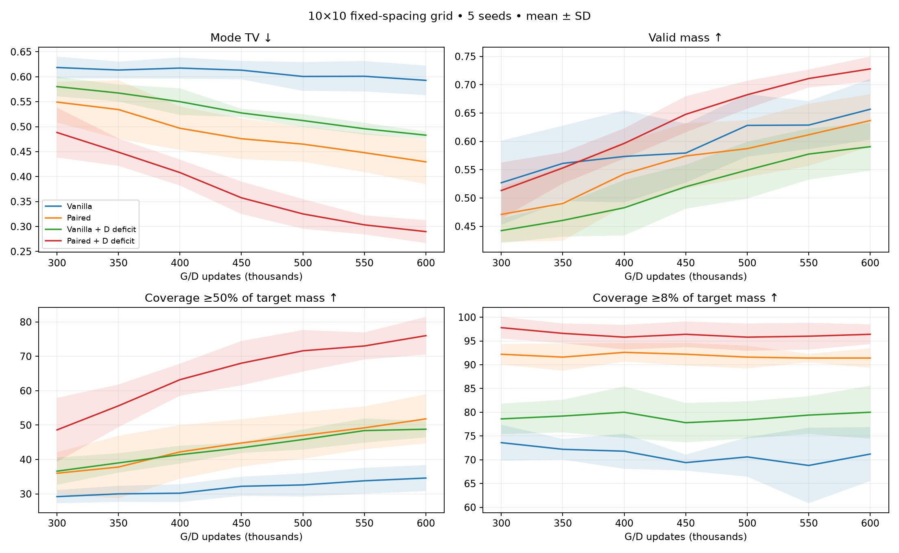
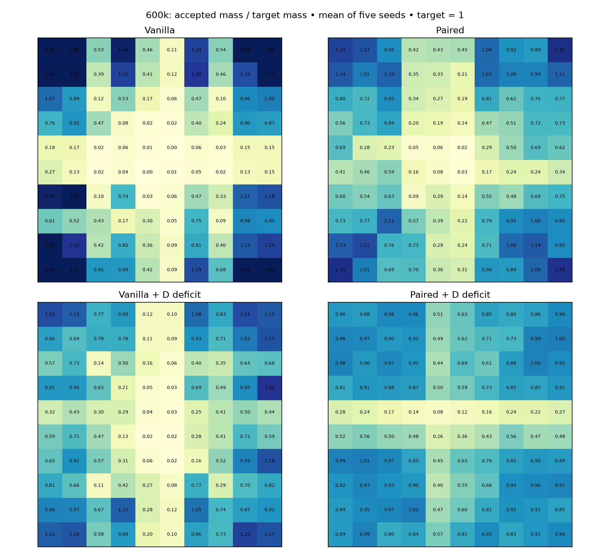
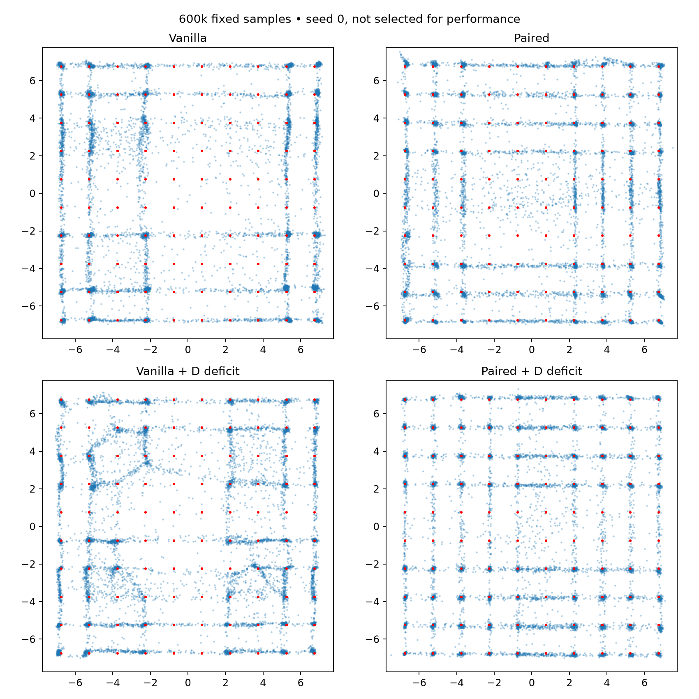

# 10×10 grid: D-only deficit sampling

100 Gaussian modes; spacing 1.5, sigma .1, centers span ±6.75. Five seeds through 600k. Same networks, losses, batches and deficit rule as prior grids.

Coverage ≥1% is retained in CSVs but now equals the entire target mass per mode. The tables emphasize ≥50% and ≥8% of target mass; the latter is the existing lenient relative criterion.

Density TV uses 0.05 cells over [-7.75,7.75]² plus outside mass, expanded to encompass all 100 modes. Do not directly compare density TV across mode counts without the finite-sample real reference.

True-mixture 10k-sample reference: mean mode TV 0.0452, fine-density TV 0.3622.

## 300,000 updates

Mean ± sample SD across five seeds.

| Method | Mode TV ↓ | Fine TV ↓ | Valid mass ↑ | Coverage ≥50% target | Coverage ≥8% target | Full ≥50% seeds |
|---|---:|---:|---:|---:|---:|---:|
| Vanilla | 0.6186 ± 0.0219 | 0.7875 ± 0.0121 | 0.5269 ± 0.0742 | 29.2/100 | 73.6/100 | 0/5 |
| Paired | 0.5492 ± 0.0407 | 0.7653 ± 0.0125 | 0.4710 ± 0.0486 | 36.0/100 | 92.2/100 | 0/5 |
| Vanilla + D deficit | 0.5803 ± 0.0195 | 0.7823 ± 0.0268 | 0.4424 ± 0.0218 | 36.6/100 | 78.6/100 | 0/5 |
| Paired + D deficit | 0.4883 ± 0.0500 | 0.7151 ± 0.0270 | 0.5132 ± 0.0496 | 48.6/100 | 97.8/100 | 0/5 |

## 350,000 updates

Mean ± sample SD across five seeds.

| Method | Mode TV ↓ | Fine TV ↓ | Valid mass ↑ | Coverage ≥50% target | Coverage ≥8% target | Full ≥50% seeds |
|---|---:|---:|---:|---:|---:|---:|
| Vanilla | 0.6135 ± 0.0169 | 0.7840 ± 0.0159 | 0.5611 ± 0.0666 | 30.0/100 | 72.2/100 | 0/5 |
| Paired | 0.5343 ± 0.0588 | 0.7671 ± 0.0475 | 0.4903 ± 0.0660 | 37.8/100 | 91.6/100 | 0/5 |
| Vanilla + D deficit | 0.5674 ± 0.0171 | 0.7893 ± 0.0170 | 0.4605 ± 0.0288 | 39.0/100 | 79.2/100 | 0/5 |
| Paired + D deficit | 0.4489 ± 0.0274 | 0.7227 ± 0.0177 | 0.5530 ± 0.0275 | 55.6/100 | 96.6/100 | 0/5 |

## 400,000 updates

Mean ± sample SD across five seeds.

| Method | Mode TV ↓ | Fine TV ↓ | Valid mass ↑ | Coverage ≥50% target | Coverage ≥8% target | Full ≥50% seeds |
|---|---:|---:|---:|---:|---:|---:|
| Vanilla | 0.6174 ± 0.0212 | 0.7886 ± 0.0239 | 0.5733 ± 0.0812 | 30.2/100 | 71.8/100 | 0/5 |
| Paired | 0.4968 ± 0.0436 | 0.7384 ± 0.0215 | 0.5425 ± 0.0566 | 42.2/100 | 92.6/100 | 0/5 |
| Vanilla + D deficit | 0.5501 ± 0.0266 | 0.7879 ± 0.0463 | 0.4828 ± 0.0489 | 41.4/100 | 80.0/100 | 0/5 |
| Paired + D deficit | 0.4080 ± 0.0259 | 0.6845 ± 0.0098 | 0.5964 ± 0.0266 | 63.2/100 | 95.8/100 | 0/5 |

## 450,000 updates

Mean ± sample SD across five seeds.

| Method | Mode TV ↓ | Fine TV ↓ | Valid mass ↑ | Coverage ≥50% target | Coverage ≥8% target | Full ≥50% seeds |
|---|---:|---:|---:|---:|---:|---:|
| Vanilla | 0.6132 ± 0.0184 | 0.8070 ± 0.0326 | 0.5793 ± 0.0521 | 32.2/100 | 69.4/100 | 0/5 |
| Paired | 0.4758 ± 0.0409 | 0.7216 ± 0.0227 | 0.5742 ± 0.0578 | 44.8/100 | 92.2/100 | 0/5 |
| Vanilla + D deficit | 0.5275 ± 0.0084 | 0.7685 ± 0.0253 | 0.5198 ± 0.0388 | 43.4/100 | 77.8/100 | 0/5 |
| Paired + D deficit | 0.3575 ± 0.0324 | 0.6590 ± 0.0541 | 0.6477 ± 0.0318 | 68.0/100 | 96.4/100 | 0/5 |

## 500,000 updates

Mean ± sample SD across five seeds.

| Method | Mode TV ↓ | Fine TV ↓ | Valid mass ↑ | Coverage ≥50% target | Coverage ≥8% target | Full ≥50% seeds |
|---|---:|---:|---:|---:|---:|---:|
| Vanilla | 0.6006 ± 0.0289 | 0.7667 ± 0.0125 | 0.6281 ± 0.0551 | 32.6/100 | 70.6/100 | 0/5 |
| Paired | 0.4650 ± 0.0354 | 0.7264 ± 0.0275 | 0.5871 ± 0.0502 | 47.0/100 | 91.6/100 | 0/5 |
| Vanilla + D deficit | 0.5123 ± 0.0127 | 0.7665 ± 0.0253 | 0.5493 ± 0.0501 | 45.8/100 | 78.4/100 | 0/5 |
| Paired + D deficit | 0.3252 ± 0.0297 | 0.6606 ± 0.0376 | 0.6822 ± 0.0246 | 71.6/100 | 95.8/100 | 0/5 |

## 550,000 updates

Mean ± sample SD across five seeds.

| Method | Mode TV ↓ | Fine TV ↓ | Valid mass ↑ | Coverage ≥50% target | Coverage ≥8% target | Full ≥50% seeds |
|---|---:|---:|---:|---:|---:|---:|
| Vanilla | 0.6010 ± 0.0305 | 0.7886 ± 0.0444 | 0.6287 ± 0.0424 | 33.8/100 | 68.8/100 | 0/5 |
| Paired | 0.4479 ± 0.0390 | 0.7192 ± 0.0448 | 0.6115 ± 0.0549 | 49.2/100 | 91.4/100 | 0/5 |
| Vanilla + D deficit | 0.4958 ± 0.0118 | 0.7453 ± 0.0186 | 0.5775 ± 0.0452 | 48.4/100 | 79.4/100 | 0/5 |
| Paired + D deficit | 0.3033 ± 0.0191 | 0.6127 ± 0.0130 | 0.7109 ± 0.0158 | 73.0/100 | 96.0/100 | 0/5 |

## 600,000 updates

Mean ± sample SD across five seeds.

| Method | Mode TV ↓ | Fine TV ↓ | Valid mass ↑ | Coverage ≥50% target | Coverage ≥8% target | Full ≥50% seeds |
|---|---:|---:|---:|---:|---:|---:|
| Vanilla | 0.5928 ± 0.0296 | 0.7755 ± 0.0216 | 0.6566 ± 0.0537 | 34.6/100 | 71.2/100 | 0/5 |
| Paired | 0.4295 ± 0.0447 | 0.7018 ± 0.0155 | 0.6368 ± 0.0463 | 51.8/100 | 91.4/100 | 0/5 |
| Vanilla + D deficit | 0.4830 ± 0.0076 | 0.7384 ± 0.0135 | 0.5905 ± 0.0420 | 48.8/100 | 80.0/100 | 0/5 |
| Paired + D deficit | 0.2898 ± 0.0228 | 0.6406 ± 0.0584 | 0.7278 ± 0.0218 | 76.0/100 | 96.4/100 | 0/5 |

Heatmaps average seeds; they do not imply every seed covers every mode.

Verification: 140 exact endpoint replays, 70 unchanged G/noise RNG checks. Source hashes and optimizer counts verified.
