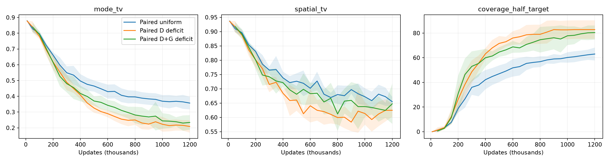

# Paired deficit sampling in both D and G

Five fresh seeds; 1.2M updates. Mean ± SD curves. Existing paired baselines reused.

| Method | Mode TV | Fine TV | Half-target coverage |
|---|---:|---:|---:|
| Paired uniform | 0.3570 | 0.6548 | 63.0000 |
| Paired D deficit | 0.2088 | 0.6248 | 82.8000 |
| Paired D+G deficit | 0.2340 | 0.6475 | 80.4000 |

Verified 120 checkpoint replays and 5 final noise/slot/eval RNG comparisons. G reference RNG intentionally differs because weighted sampling replaces uniform sampling.
