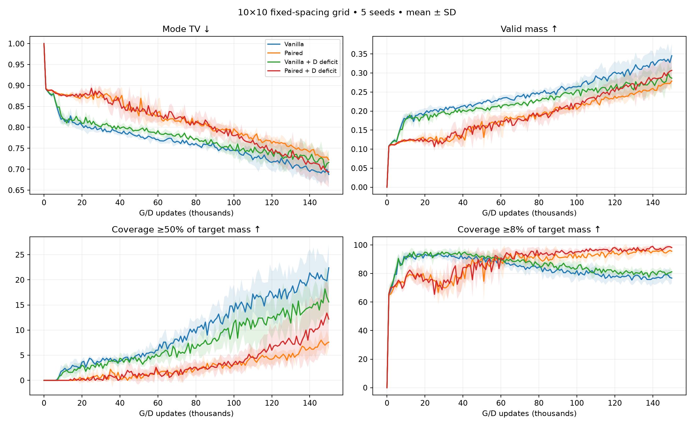
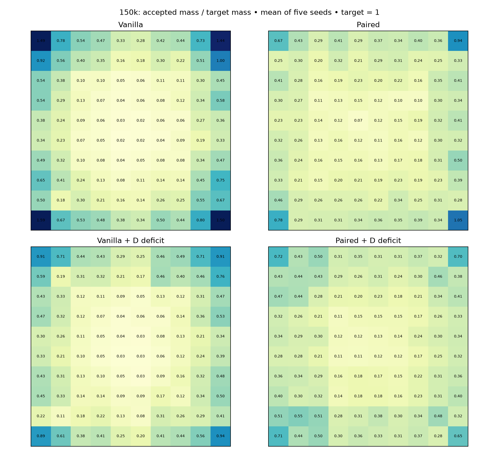
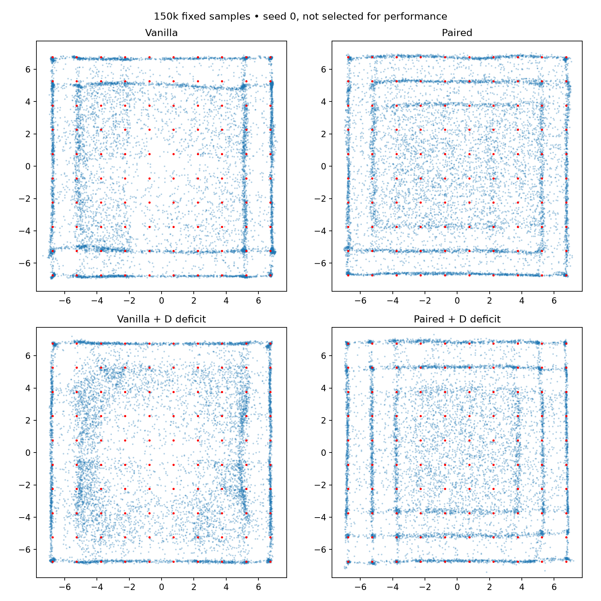

# 10×10 grid: D-only deficit sampling

100 Gaussian modes; spacing 1.5, sigma .1, centers span ±6.75. Five seeds through 150k. Same networks, losses, batches and deficit rule as prior grids.

Coverage ≥1% is retained in CSVs but now equals the entire target mass per mode. The tables emphasize ≥50% and ≥8% of target mass; the latter is the existing lenient relative criterion.

Density TV uses 0.05 cells over [-7.75,7.75]² plus outside mass, expanded to encompass all 100 modes. Do not directly compare density TV across mode counts without the finite-sample real reference.

True-mixture 10k-sample reference: mean mode TV 0.0452, fine-density TV 0.3622.

## 10,000 updates

Mean ± sample SD across five seeds.

| Method | Mode TV ↓ | Fine TV ↓ | Valid mass ↑ | Coverage ≥50% target | Coverage ≥8% target | Full ≥50% seeds |
|---|---:|---:|---:|---:|---:|---:|
| Vanilla | 0.8216 ± 0.0125 | 0.9065 ± 0.0068 | 0.1785 ± 0.0122 | 2.0/100 | 90.0/100 | 0/5 |
| Paired | 0.8791 ± 0.0027 | 0.9368 ± 0.0026 | 0.1209 ± 0.0027 | 0.0/100 | 77.4/100 | 0/5 |
| Vanilla + D deficit | 0.8204 ± 0.0166 | 0.9073 ± 0.0098 | 0.1796 ± 0.0166 | 1.6/100 | 92.0/100 | 0/5 |
| Paired + D deficit | 0.8773 ± 0.0036 | 0.9357 ± 0.0014 | 0.1227 ± 0.0036 | 0.0/100 | 77.8/100 | 0/5 |

## 50,000 updates

Mean ± sample SD across five seeds.

| Method | Mode TV ↓ | Fine TV ↓ | Valid mass ↑ | Coverage ≥50% target | Coverage ≥8% target | Full ≥50% seeds |
|---|---:|---:|---:|---:|---:|---:|
| Vanilla | 0.7821 ± 0.0115 | 0.8903 ± 0.0119 | 0.2194 ± 0.0129 | 5.2/100 | 88.2/100 | 0/5 |
| Paired | 0.8275 ± 0.0190 | 0.9101 ± 0.0128 | 0.1725 ± 0.0190 | 1.2/100 | 90.8/100 | 0/5 |
| Vanilla + D deficit | 0.7931 ± 0.0047 | 0.8912 ± 0.0044 | 0.2069 ± 0.0047 | 4.4/100 | 92.2/100 | 0/5 |
| Paired + D deficit | 0.8392 ± 0.0352 | 0.9168 ± 0.0202 | 0.1608 ± 0.0352 | 1.4/100 | 87.2/100 | 0/5 |

## 100,000 updates

Mean ± sample SD across five seeds.

| Method | Mode TV ↓ | Fine TV ↓ | Valid mass ↑ | Coverage ≥50% target | Coverage ≥8% target | Full ≥50% seeds |
|---|---:|---:|---:|---:|---:|---:|
| Vanilla | 0.7456 ± 0.0133 | 0.8726 ± 0.0158 | 0.2635 ± 0.0182 | 13.6/100 | 82.0/100 | 0/5 |
| Paired | 0.7963 ± 0.0155 | 0.8961 ± 0.0113 | 0.2047 ± 0.0165 | 3.2/100 | 90.8/100 | 0/5 |
| Vanilla + D deficit | 0.7452 ± 0.0197 | 0.8691 ± 0.0078 | 0.2552 ± 0.0201 | 11.4/100 | 83.4/100 | 0/5 |
| Paired + D deficit | 0.7798 ± 0.0186 | 0.8876 ± 0.0110 | 0.2202 ± 0.0186 | 3.4/100 | 95.2/100 | 0/5 |

## 150,000 updates

Mean ± sample SD across five seeds.

| Method | Mode TV ↓ | Fine TV ↓ | Valid mass ↑ | Coverage ≥50% target | Coverage ≥8% target | Full ≥50% seeds |
|---|---:|---:|---:|---:|---:|---:|
| Vanilla | 0.6875 ± 0.0240 | 0.8420 ± 0.0077 | 0.3455 ± 0.0304 | 22.4/100 | 76.8/100 | 0/5 |
| Paired | 0.7223 ± 0.0111 | 0.8533 ± 0.0098 | 0.2787 ± 0.0109 | 7.6/100 | 95.6/100 | 0/5 |
| Vanilla + D deficit | 0.7163 ± 0.0295 | 0.8626 ± 0.0167 | 0.2863 ± 0.0311 | 15.6/100 | 81.2/100 | 0/5 |
| Paired + D deficit | 0.6932 ± 0.0362 | 0.8355 ± 0.0207 | 0.3068 ± 0.0362 | 12.2/100 | 98.2/100 | 0/5 |

Heatmaps average seeds; they do not imply every seed covers every mode.

Verification: 80 exact endpoint replays, 40 unchanged G/noise RNG checks. Source hashes and optimizer counts verified.
