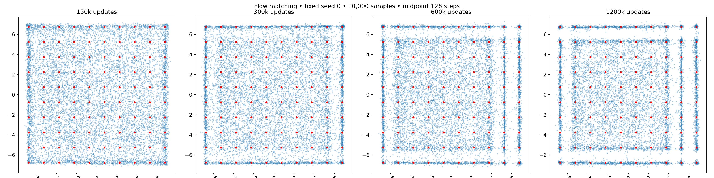

# Straight-line flow matching on the 10×10 grid

Five seeds; independent standard-normal noise and uniform real points. Time-uniform velocity MSE; two 128-wide SiLU layers; batch 256; Adam lr .0002, betas (.5,.999). No labels or deficit sampling. Explicit midpoint ODE solver.

| Updates | Solver steps (NFE=2×steps) | Mode TV | Fine TV | Valid mass | Half-target coverage |
|---|---:|---:|---:|---:|---:|
| 150000 | 64 | 0.8181 | 0.9027 | 0.1819 | 2.2000 |
| 150000 | 128 | 0.8181 | 0.9028 | 0.1819 | 2.2000 |
| 150000 | 256 | 0.8181 | 0.9028 | 0.1819 | 2.2000 |
| 300000 | 64 | 0.7688 | 0.8688 | 0.2323 | 5.2000 |
| 300000 | 128 | 0.7689 | 0.8688 | 0.2322 | 5.2000 |
| 300000 | 256 | 0.7689 | 0.8687 | 0.2323 | 5.2000 |
| 600000 | 64 | 0.7179 | 0.8410 | 0.2827 | 10.6000 |
| 600000 | 128 | 0.7178 | 0.8410 | 0.2828 | 10.6000 |
| 600000 | 256 | 0.7179 | 0.8410 | 0.2828 | 10.6000 |
| 1200000 | 64 | 0.6168 | 0.7753 | 0.3843 | 24.8000 |
| 1200000 | 128 | 0.6166 | 0.7753 | 0.3845 | 24.8000 |
| 1200000 | 256 | 0.6166 | 0.7752 | 0.3845 | 24.8000 |

Training time and sampling time per seed/checkpoint are recorded in all_metrics.json. Equal update counts do not imply equal GAN compute budgets. Solver comparisons reuse identical noise.
