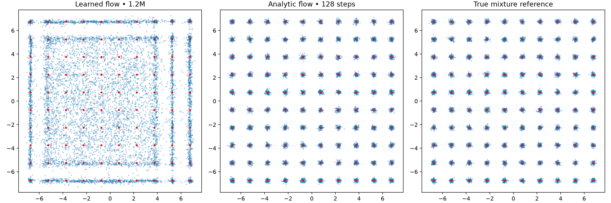

# Exact flow velocity diagnostic

For x0 ~ N(0,I), x1 ~ uniform mixture N(mu_k,sigma² I), independent, and x_t=(1-t)x0+t*x1:

s²=(1-t)²+t² sigma²; w_k(x,t)=softmax_k(-||x-t mu_k||²/(2s²)); mu_bar=sum_k w_k mu_k.

v(x,t)=mu_bar + [t sigma²-(1-t)]/s² × (x-t mu_bar).

This is E[x1-x0 | x_t=x], the exact regression target averaged over all compatible pairs. It uses the known target mixture: a diagnostic oracle, not a learned baseline. Endpoint identities v(x,0)=-x and v(x,1)=x checked.

| Solver steps | Mode TV | Fine TV | Valid mass | Half-target coverage |
|---|---:|---:|---:|---:|
| 64 | 0.0461 | 0.3690 | 0.9881 | 100 |
| 128 | 0.0461 | 0.3683 | 0.9884 | 100 |
| 256 | 0.0460 | 0.3682 | 0.9885 | 100 |

Learned-field error uses 20k points drawn from the true interpolation marginal at each time, seed-0 learned checkpoint. Full values in metrics.json.

| t | Velocity RMSE per coordinate | Oracle velocity RMS |
|---|---:|---:|
| 0.0 | 0.1256 | 1.0068 |
| 0.25 | 0.0601 | 3.0781 |
| 0.5 | 0.0882 | 4.0292 |
| 0.75 | 0.7850 | 4.3515 |
| 0.9 | 0.6761 | 4.3870 |
| 0.95 | 0.4019 | 4.3492 |
| 0.98 | 0.2430 | 4.3325 |
| 0.99 | 0.2460 | 4.3308 |
| 1.0 | 0.2885 | 4.3315 |
