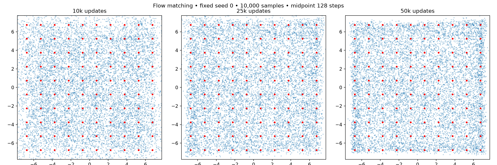

# Straight-line flow matching on the 10×10 grid

Five seeds; independent standard-normal noise and uniform real points. Time-uniform velocity MSE; two 128-wide SiLU layers; batch 256; Adam lr .0002, betas (.5,.999). No labels or deficit sampling. Explicit midpoint ODE solver.

| Updates | Solver steps (NFE=2×steps) | Mode TV | Fine TV | Valid mass | Half-target coverage |
|---|---:|---:|---:|---:|---:|
| 10000 | 64 | 0.8831 | 0.9398 | 0.1169 | 0.0000 |
| 10000 | 128 | 0.8831 | 0.9398 | 0.1169 | 0.0000 |
| 10000 | 256 | 0.8831 | 0.9398 | 0.1169 | 0.0000 |
| 25000 | 64 | 0.8682 | 0.9322 | 0.1318 | 0.0000 |
| 25000 | 128 | 0.8682 | 0.9321 | 0.1318 | 0.0000 |
| 25000 | 256 | 0.8682 | 0.9321 | 0.1318 | 0.0000 |
| 50000 | 64 | 0.8575 | 0.9248 | 0.1425 | 0.0000 |
| 50000 | 128 | 0.8575 | 0.9248 | 0.1425 | 0.0000 |
| 50000 | 256 | 0.8576 | 0.9248 | 0.1424 | 0.0000 |

Training time and sampling time per seed/checkpoint are recorded in all_metrics.json. Equal update counts do not imply equal GAN compute budgets. Solver comparisons reuse identical noise.
