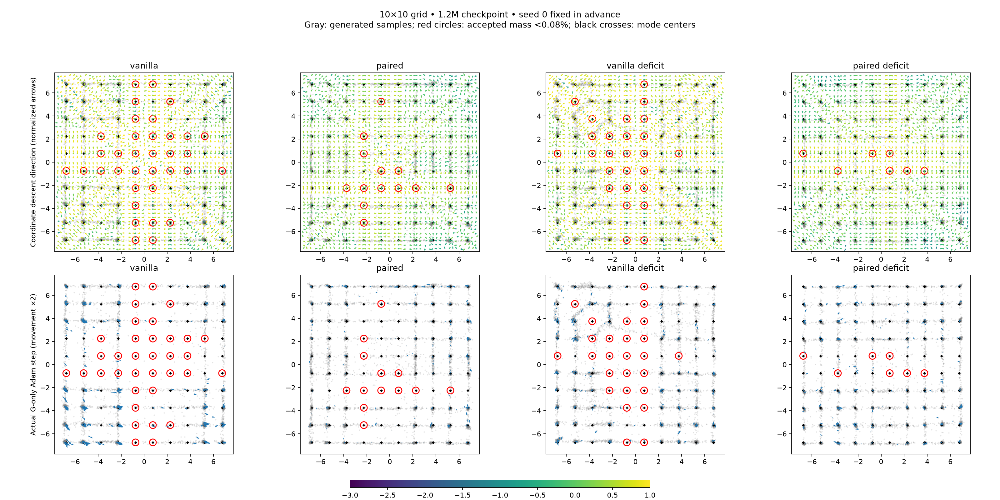

# Frozen-discriminator gradient diagnostic

All four methods, seed 0 fixed in advance, at 1.2M updates. No training files modified.
Top: negative gradient of generator BCE with respect to fake coordinates on a 45×45 grid. Paired averages 128 common uniform real references and both slot assignments. Arrows normalized; color shows magnitude. This is a Monte Carlo diagnostic, not a reconstructed training trajectory.
Bottom: displacement of fixed latent samples after one G-only update on a copied checkpoint, with original Adam moments restored, batch 256 and D frozen. Common diagnostic random draws across arms. Arrows magnified 2×, same scale across methods. This omits the preceding D update of a normal training round. Adam momentum can disagree with instantaneous coordinate gradients.
Red circles: modes below 0.0008 accepted mass in the fixed 10k sample evaluation (not necessarily zero probability). Gray samples and marked modes are pre-update. Raw arrays retained in NPZ files. Seed 0 alone cannot establish a general explanation of missing modes.

