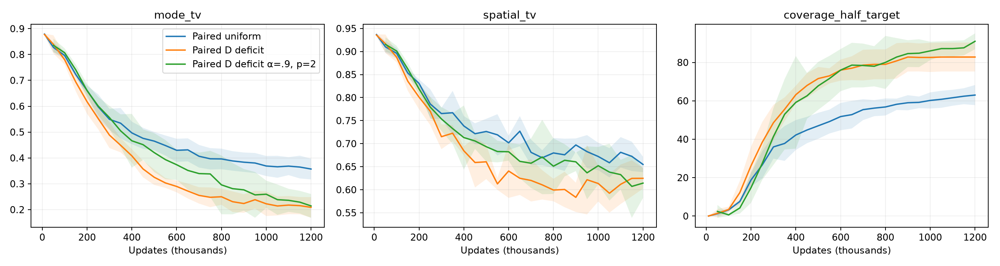

# Stronger paired D-only deficit sampling

Five fresh seeds; 1.2M updates. Mean ± SD curves. Existing paired baselines reused.

| Method | Mode TV | Fine TV | Half-target coverage |
|---|---:|---:|---:|
| Paired uniform | 0.3570 | 0.6548 | 63.0000 |
| Paired D deficit | 0.2088 | 0.6248 | 82.8000 |
| Paired D deficit α=.9, p=2 | 0.2143 | 0.6143 | 91.0000 |

Verified 120 checkpoint replays and 5 final noise/slot/eval RNG comparisons. Uniform G reference RNG also matches the D-only baseline.
