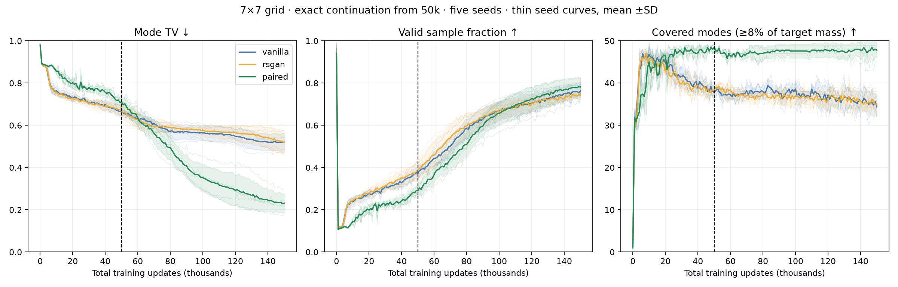
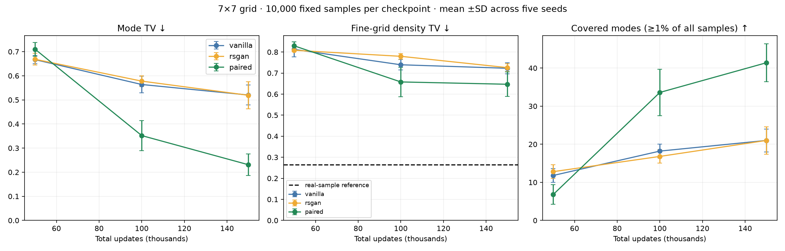
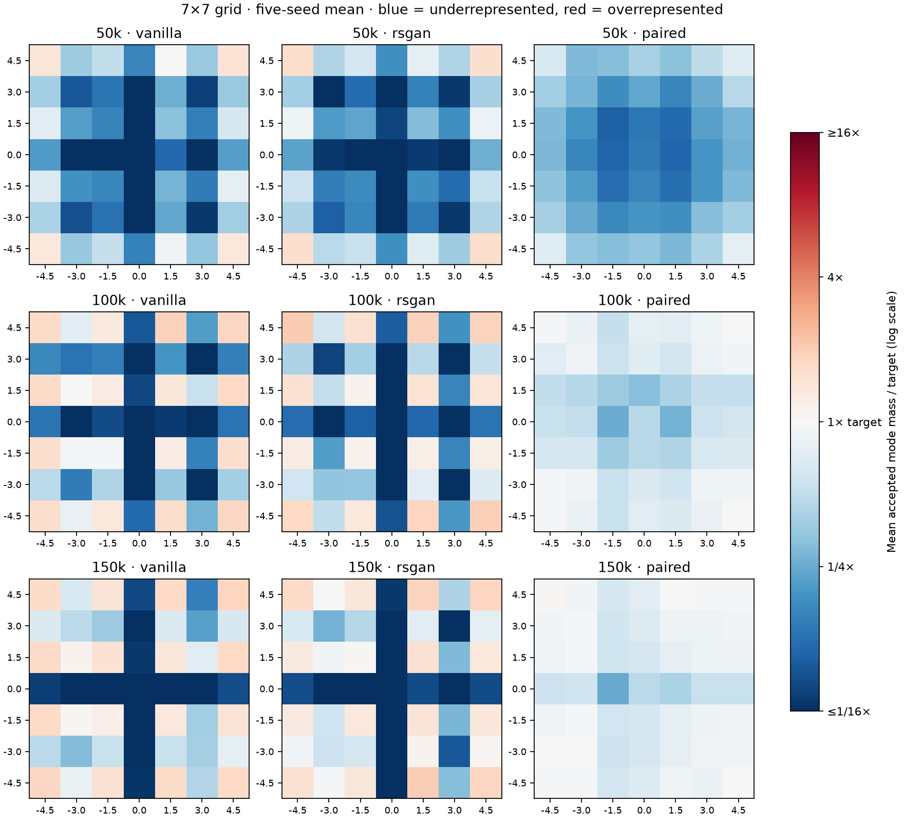

# 7×7 grid: exact continuation to 150k

Continue all fifteen original 7×7 trajectories (vanilla, RSGAN, paired; seeds 0–4) from 50k for another 100k updates. Evaluate total updates 100k and 150k; retain 50k as the baseline. No restarts, architecture changes, rescaling, or tuning.

Spacing 1.5, Gaussian sigma 0.1, extent ±4.5, latent 16, G/D width 128, batch 256, Adam 0.0002 with betas (0.5,0.999), one D and G update per iteration. Restore both models, Adam states and all explicit RNG streams. Recreate the same fixed 10,000-point noise draw, verify its 50k samples exactly, then restore the saved RNG states before further training. An uninterrupted-versus-split test confirms bit-exact weights, optimizer states, RNGs and final samples for all three methods.

A new directory preserves the original 50k artifacts. Extension training_seconds/wall_seconds measure only this continuation. Coarse metrics remain evaluated every 1k; full sample arrays and full checkpoints are saved at 100k and 150k. All 45 reported endpoint sample arrays are regenerated bit-for-bit from their checkpoints, and metrics are recomputed from samples. Source snapshots and all 15 resume checkpoint hashes are checked.

## Findings

The ranking reverses with more training. Paired mean mode TV decreases from 0.710 at 50k to 0.352 at 100k and 0.231 at 150k, versus vanilla 0.667 → 0.564 → 0.520 and RSGAN 0.668 → 0.578 → 0.519. Paired beats both baselines on mode TV in all five matched seeds at both new endpoints. At 150k it also wins fine-grid density TV in all five matched seeds; at 100k it wins 4/5 versus vanilla and 5/5 versus RSGAN.

At 150k, original-threshold coverage averages 41.4/49 for paired versus 21.0/49 for each baseline. Relative coverage averages 47.8/49 versus 34.4 and 35.0. Valid fractions are 78.2% paired, 76.4% vanilla and 74.8% RSGAN. Thus the advantage is principally allocation across modes rather than a large difference in total accepted mass. The baselines retain severe interior deficits; paired places much more mass in the interior.

Recovery is incomplete: only one paired seed covers all 49 modes at the original 1% cutoff at 150k. Paired fine-grid TV is 0.647, well above the real-sample reference 0.264; the plots show imperfect Gaussian spread and bridges. Its mean fine-grid TV changes only modestly from 0.658 at 100k, while coarse mode TV continues improving. These untuned trajectories establish a late advantage in this setup, not a universal convergence rate or eventual equilibrium.

## Metrics

Mode TV = ½(Σ|accepted mass − 1/49| + invalid fraction), with acceptance radius 0.3 around the nearest center. Invalid target mass is zero; true Gaussian tails yield approximately 1.1% invalid samples. No renormalization of accepted samples. Report both ≥1% of all generated samples and ≥8% of target mode mass coverage; the latter cutoff is 0.08/49. At 49 modes the original 1% cutoff requires 49% of ideal mode mass, so the two measures answer different questions.

Fine-grid TV compares empirical probability in fixed 0.05×0.05 cells on [-5.5,5.5]² plus an outside category to exact Gaussian-mixture cell probabilities. Its real-sample reference is reused from the original grid audit (200 independent draws, 10,000 samples each). It detects misplaced mass and incorrect Gaussian spread as well as mode imbalance.

## Endpoints

Mean ± sample SD across five seeds. Endpoints share training trajectories and fixed evaluation noise; they are not independent runs.

| Updates | Method | Mode TV ↓ | Fine-grid TV ↓ | Valid samples | Coverage ≥1% | Relative coverage |
|---:|---|---:|---:|---:|---:|---:|
| 50000 | vanilla | 0.667 ± 0.017 | 0.813 ± 0.035 | 37.2% | 11.8/49 | 37.8/49 |
| 50000 | rsgan | 0.668 ± 0.024 | 0.808 ± 0.007 | 38.8% | 12.8/49 | 38.2/49 |
| 50000 | paired | 0.710 ± 0.028 | 0.829 ± 0.019 | 29.1% | 6.8/49 | 48.4/49 |
| 100000 | vanilla | 0.564 ± 0.035 | 0.739 ± 0.025 | 66.8% | 18.2/49 | 38.6/49 |
| 100000 | rsgan | 0.578 ± 0.022 | 0.780 ± 0.013 | 66.1% | 16.8/49 | 37.0/49 |
| 100000 | paired | 0.352 ± 0.062 | 0.658 ± 0.070 | 65.5% | 33.6/49 | 47.6/49 |
| 150000 | vanilla | 0.520 ± 0.042 | 0.723 ± 0.026 | 76.3% | 21.0/49 | 34.4/49 |
| 150000 | rsgan | 0.519 ± 0.056 | 0.726 ± 0.018 | 74.8% | 21.0/49 | 35.0/49 |
| 150000 | paired | 0.231 ± 0.045 | 0.647 ± 0.058 | 78.2% | 41.4/49 | 47.8/49 |

Real fine-grid TV reference: 0.2638, central 95% interval [0.2588378615565815, 0.2695222137007108]. This describes real-sample variation, not uncertainty over training.

## Samples

- [50k: all seeds](samples_50k.png)
- [100k: all seeds](samples_100k.png)
- [150k: all seeds](samples_150k.png)

## Reproduce

Run `uv run python -m paired_discriminator.grid_extension_run` with fresh output directories and the retained original checkpoints. Config: `configs/grid7-150k.json`. Build this report with `uv run python -m paired_discriminator.grid_extension_report results/grid7-extension-comparison-v1`. Checkpoints are ignored by Git but retained locally; source snapshots, sample arrays, metrics and graphics are retained. This is a fixed-architecture, fixed-batch, untuned comparison, not a general ranking of GAN objectives.
