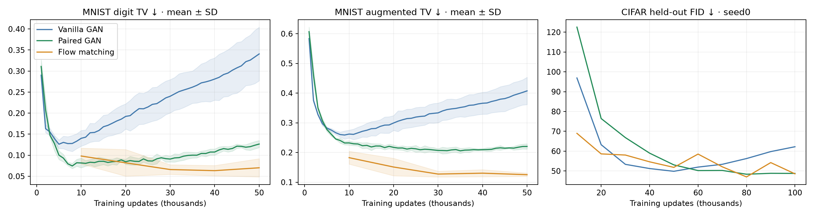
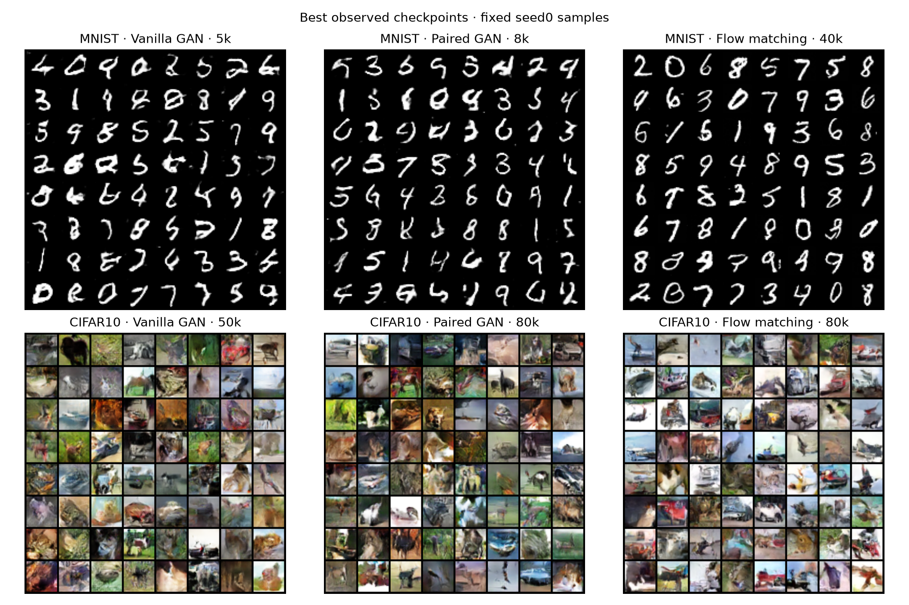
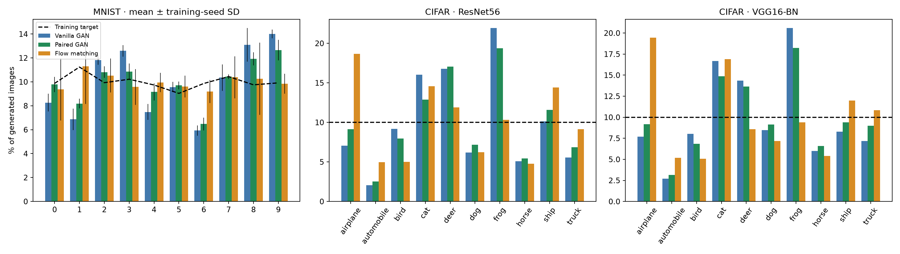
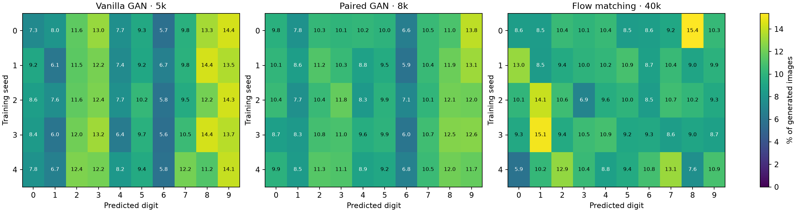

# Best observed checkpoints: vanilla GAN, paired GAN, flow matching

Final comparison.

Unconditional, uniform real sampling, original GAN architectures; no deficit sampling. MNIST: five training seeds (0–4). CIFAR-10: seed 0 only. Each evaluation uses 10,000 generated images.

## Selection rule

MNIST selects one common step per method minimizing the mean of the five individual digit TVs. CIFAR selects minimum held-out-reference FID. Every metric in each primary row comes from that selected step. No seed selection and no metric-by-metric mixing. Raw flow weights, midpoint64 (128 network evaluations/image).

These are retrospective best observed results. The CIFAR test reference is used for checkpoint selection, so it is not an untouched final test. GAN MNIST evaluations occur every1k through50k; flow every10k. The shared-interval comparison below controls that search-frequency difference. GAN snapshots at intermediate1k steps were not retained, but their original metrics and sample grids were; selected5k/8k results are logged evaluations, not freshly regenerated models.

## MNIST — selected by digit balance

| Method | Updates | Digit TV ↓ | Digits ≥1% | Acceptance ≥.9 ↑ | Augmented TV ↓ |
|---|---:|---:|---:|---:|---:|
| Vanilla GAN | 5,000 | 0.1261 ± 0.0100 | 10.0 | 0.7222 ± 0.0039 | 0.2824 ± 0.0027 |
| Paired GAN | 8,000 | 0.0745 ± 0.0062 | 10.0 | 0.7604 ± 0.0084 | 0.2404 ± 0.0087 |
| Flow matching | 40,000 | 0.0633 ± 0.0123 | 10.0 | 0.9007 ± 0.0072 | 0.1304 ± 0.0118 |

Mean ± sample SD across seeds. Digit TV measures mismatch to empirical MNIST training frequencies. Augmented TV adds rejected (confidence<.9) samples as an extra category. Confidence is a classifier proxy, not calibrated image quality; neither metric measures within-digit diversity.

### Individual training seeds

| Method | Seed | Digit TV | Accepted TV | Acceptance |
|---|---:|---:|---:|---:|
| Vanilla GAN | 0 | 0.1270 | 0.2790 | 0.7268 |
| Vanilla GAN | 1 | 0.1198 | 0.2841 | 0.7198 |
| Vanilla GAN | 2 | 0.1190 | 0.2800 | 0.7262 |
| Vanilla GAN | 3 | 0.1431 | 0.2844 | 0.7197 |
| Vanilla GAN | 4 | 0.1216 | 0.2845 | 0.7186 |
| Paired GAN | 0 | 0.0691 | 0.2474 | 0.7558 |
| Paired GAN | 1 | 0.0752 | 0.2318 | 0.7691 |
| Paired GAN | 2 | 0.0794 | 0.2436 | 0.7564 |
| Paired GAN | 3 | 0.0814 | 0.2303 | 0.7697 |
| Paired GAN | 4 | 0.0673 | 0.2488 | 0.7512 |
| Flow matching | 0 | 0.0717 | 0.1449 | 0.8943 |
| Flow matching | 1 | 0.0549 | 0.1230 | 0.9082 |
| Flow matching | 2 | 0.0541 | 0.1144 | 0.9084 |
| Flow matching | 3 | 0.0548 | 0.1353 | 0.8938 |
| Flow matching | 4 | 0.0808 | 0.1344 | 0.8986 |

### Selection sensitivity

| Method | Shared10k-grid best step | Digit TV | Best augmented-TV step | Augmented TV | Digit TV there |
|---|---:|---:|---:|---:|---:|
| Vanilla GAN | 10,000 | 0.1401 | 9,000 | 0.2589 | 0.1333 |
| Paired GAN | 10,000 | 0.0815 | 35,000 | 0.2057 | 0.1000 |
| Flow matching | 40,000 | 0.0633 | 50,000 | 0.1253 | 0.0700 |

## CIFAR-10 — selected by FID

| Method | Updates | FID ↓ | KID ↓ | Precision ↑ | Recall ↑ | ResNet TV ↓ | VGG TV ↓ |
|---|---:|---:|---:|---:|---:|---:|---:|
| Vanilla GAN | 50,000 | 49.85 | 0.03705 | 0.585 | 0.338 | 0.2488 | 0.2163 |
| Paired GAN | 80,000 | 48.37 | 0.03387 | 0.571 | 0.340 | 0.2089 | 0.1673 |
| Flow matching | 80,000 | 47.02 | 0.03786 | 0.617 | 0.338 | 0.1988 | 0.1915 |

One training seed; these differences do not establish a seed-robust ranking. FID/KID use the same held-out Inception reference; classifier identities are checked below. Class balance can improve without improved within-class coverage.

### CIFAR classifier diagnostics at the FID-selected checkpoints

| Method | VGG acceptance | VGG augmented TV | ResNet acceptance | ResNet augmented TV | Evaluator agreement |
|---|---:|---:|---:|---:|---:|
| Vanilla GAN | 0.7502 | 0.3546 | 0.6358 | 0.4315 | 0.5811 |
| Paired GAN | 0.7423 | 0.3130 | 0.6215 | 0.4267 | 0.5843 |
| Flow matching | 0.7325 | 0.3487 | 0.6096 | 0.4214 | 0.5789 |

## Training curves

## Fixed seed0 samples at selected steps

Original fixed sample grids; seed0 was not chosen for performance. GAN and flow noise spaces differ.

## Predicted category mass

MNIST error bars are training-seed SD. Reported TVs average individual seed scores, not the averaged category distribution. The seed heatmaps expose biases hidden by pooling.

## Budgets

Checkpoint selection is not a compute-matched comparison. All use batch128. Flow consumes128 real draws/update; vanilla GAN D consumes128; paired GAN consumes128 in D plus128 G references. Flow performs one velocity-network optimization/update; GAN performs D and G optimizations. Flow sampling uses128 network evaluations/image versus one generator evaluation for GAN. Architecture, optimizer and runtime differ.

| Dataset / method | Selected real draws | Selected training updates |
|---|---:|---:|
| MNIST / Vanilla GAN | 640,000 | 5,000 |
| MNIST / Paired GAN | 2,048,000 | 8,000 |
| MNIST / Flow matching | 5,120,000 | 40,000 |
| CIFAR / Vanilla GAN | 6,400,000 | 50,000 |
| CIFAR / Paired GAN | 20,480,000 | 80,000 |
| CIFAR / Flow matching | 10,240,000 | 80,000 |

### Flow cumulative training budget

| Dataset / seed | Final updates | Training seconds | Total real draws |
|---|---:|---:|---:|
| mnist / 0 | 50,000 | 1407.4 | 6,400,000 |
| mnist / 1 | 50,000 | 1417.5 | 6,400,000 |
| mnist / 2 | 50,000 | 1418.4 | 6,400,000 |
| mnist / 3 | 50,000 | 1400.2 | 6,400,000 |
| mnist / 4 | 50,000 | 1385.4 | 6,400,000 |
| cifar10 / 0 | 100,000 | 3040.2 | 12,800,000 |

Times include original10k training and continuations, exclude sampling/evaluation, and sum GPU training time rather than wall-clock time. The complete search budget exceeds the selected-checkpoint budget above.

### Solver sensitivity at selected flow checkpoints

| Dataset (seed0) | Checkpoint | Midpoint steps | Digit TV / FID | Acceptance / recall |
|---|---:|---:|---:|---:|
| mnist | 40,000 | 64 | 0.07167 | 0.89430 |
| mnist | 40,000 | 128 | 0.07177 | 0.89430 |
| cifar10 | 80,000 | 64 | 47.01808 | 0.33820 |
| cifar10 | 80,000 | 128 | 46.89076 | 0.33860 |

Solver checks use identical fixed noise; primary selection stays midpoint64. These seed0 checks do not replace the five-seed MNIST mean.

### Resume provenance

Original10k results are preserved. Training source, optimizer settings and data are unchanged. Where Modal assigned A10 versus A10G, hardware_migration.json records the name transition and a replay of the original10k first128 float samples with maximum absolute error below.001. Model, optimizer and explicit RNG state were restored; no cross-GPU bitwise-continuation claim is made.
- mnist seed4: NVIDIA A10G → NVIDIA A10; replay max error 0.
- cifar10 seed0: NVIDIA A10 → NVIDIA A10G; replay max error 0.
