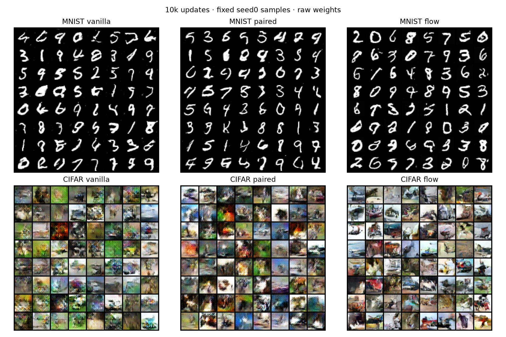
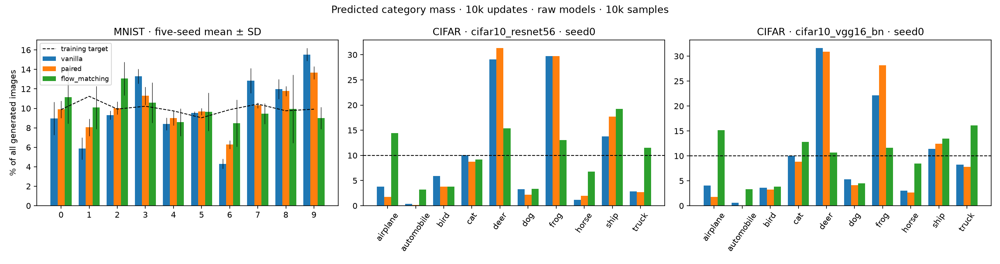

# Unconditional flow matching on MNIST and CIFAR (#35)

Completed initial10k-update pilot: MNIST seeds0–4 and CIFAR seed0. Uniform real sampling, no labels or deficit. Independent-pair straight-line velocity MSE. Raw weights and midpoint64 are primary; no checkpoint or seed selection. Baseline GANs are existing original10k endpoints; no GAN retraining.

## MNIST

Five-seed mean ± sample SD; 10,000 samples per seed.

| Method | Digit TV ↓ | Digits ≥1% | Accepted digits ≥1% | Acceptance ↑ | Augmented TV ↓ |
|---|---:|---:|---:|---:|---:|
| vanilla | 0.1401 ± 0.0187 | 10.0 | 10.0 | 0.7630 ± 0.0020 | 0.2621 ± 0.0133 |
| paired | 0.0815 ± 0.0115 | 10.0 | 10.0 | 0.7730 ± 0.0062 | 0.2323 ± 0.0071 |
| flow_matching | 0.0980 ± 0.0189 | 10.0 | 10.0 | 0.8589 ± 0.0088 | 0.1826 ± 0.0217 |

The original frozen classifier and empirical training digit proportions are unchanged. Confidence ≥.9 is an uncalibrated proxy. Accepted mass uses all generated images as denominator. Digit coverage requires ≥1% per digit, not merely a nonzero count. No within-digit diversity conclusion.

### Flow individual seeds

| Seed | Digit TV | Coverage | Acceptance | Augmented TV |
|---|---:|---:|---:|---:|
| 0 | 0.1177 | 10 | 0.8681 | 0.1964 |
| 1 | 0.0905 | 10 | 0.8643 | 0.1679 |
| 2 | 0.1174 | 10 | 0.8619 | 0.2117 |
| 3 | 0.0751 | 10 | 0.8544 | 0.1577 |
| 4 | 0.0892 | 10 | 0.8459 | 0.1794 |

## CIFAR

Seed0 only, 10,000 generated images. Official held-out test reference for image metrics.

| Method | Held-out FID ↓ | KID ↓ | Precision ↑ | Recall ↑ | ResNet class TV ↓ | VGG class TV ↓ |
|---|---:|---:|---:|---:|---:|---:|
| vanilla | 96.90 | 0.08597 | 0.710 | 0.040 | 0.4265 | 0.3523 |
| paired | 122.54 | 0.10853 | 0.627 | 0.007 | 0.4874 | 0.4150 |
| flow_matching | 68.99 | 0.06025 | 0.641 | 0.140 | 0.2358 | 0.1984 |

### Classifier diagnostics

| Method | Evaluator agreement | ResNet acceptance ≥.9 | VGG acceptance ≥.9 | ResNet accepted TV ↓ | VGG accepted TV ↓ |
|---|---:|---:|---:|---:|---:|
| vanilla | 0.5292 | 0.5770 | 0.6953 | 0.5985 | 0.5035 |
| paired | 0.5350 | 0.5778 | 0.6703 | 0.6162 | 0.5577 |
| flow_matching | 0.4967 | 0.5421 | 0.6650 | 0.4771 | 0.3566 |

Training-reference FID/KID and full classifier confidence diagnostics remain in summary.json. Use matching reference sets when comparing with older pilot tables. CIFAR has one seed; classifier predictions on generated images can be wrong, and class balance is not within-class diversity.

## Solver sensitivity (seed0)

| Dataset | Midpoint steps | NFE/image | Main metric | Confidence acceptance / recall | Sampling seconds |
|---|---:|---:|---:|---:|---:|
| mnist | 64 | 128 | digit TV 0.1177 | 0.8681 | 78.6 |
| mnist | 128 | 256 | digit TV 0.1174 | 0.8683 | 157.5 |
| cifar10 | 64 | 128 | FID 68.99 | 0.1403 | 91.7 |
| cifar10 | 128 | 256 | FID 69.01 | 0.1380 | 182.9 |

Same fixed noise within each solver check. All samples are integrated without clipping; endpoint conversion to uint8 rounds/clamps exactly as GAN evaluation does. Out-of-range pixel fractions and first-batch float replay checks are retained.

## Compute and architecture

Three-scale convolutional U-Net, widths32/64/128, GroupNorm/SiLU residual blocks and sinusoidal time embedding. 1,168,929 parameters for MNIST, 1,170,083 for CIFAR. No attention or pretrained features. Adam .0002, betas(.9,.999), warmup500, batch128. Same full training splits and normalization as GANs. No augmentation.

| Dataset / seed | Training seconds | Real draws | Evaluation seconds (all solvers) |
|---|---:|---:|---:|
| mnist / 0 | 281.2 | 1,280,000 | 239.5 |
| mnist / 1 | 281.4 | 1,280,000 | 80.4 |
| mnist / 2 | 278.8 | 1,280,000 | 80.2 |
| mnist / 3 | 279.0 | 1,280,000 | 80.1 |
| mnist / 4 | 252.3 | 1,280,000 | 67.0 |
| cifar10 / 0 | 332.7 | 1,280,000 | 360.1 |

Flow matches GAN D real draws at10k (1.28M), but paired GAN additionally uses G references. Architectures and optimizer updates differ. Sampling uses128 velocity-network evaluations per image instead of one GAN generator pass. These are matched-data/update endpoints, not equal-compute results. Full evaluation is at10k rather than every1k; every1k preview uses only16 midpoint steps.

## Samples

Fixed seed0, raw weights, 10k updates; no selection for quality.

## Verification

Four local tests passed. CUDA20 versus10+10 updates match model, EMA, optimizer, explicit RNG states and losses for both datasets; intervening sampling is neutral. All six jobs complete, eight final evaluation records, source hashes and first-batch replays verified. Frozen classifier/reference identities match the GAN evaluations. No extra training or commits.

## Predicted category mass

## Interpretation

At10k, flow retains all ten MNIST digits across five seeds. Its raw digit TV is between the original vanilla and paired means; confidence acceptance and confidence-augmented TV are better than both. This early checkpoint does not yet test the late imbalance observed in vanilla at50k. On CIFAR seed0, flow improves10k FID/KID, feature recall and raw class balance versus both original GANs, but precision is below vanilla and classifier agreement is only about50%. These mixed metrics and one seed do not establish general superiority or preservation of within-class diversity. This is an untuned image-flow pilot.

A result-export helper initially failed on epoch-zero file timestamps in the Modal mount. The archive helper was repaired and collection rerun; training and evaluation were unchanged.
