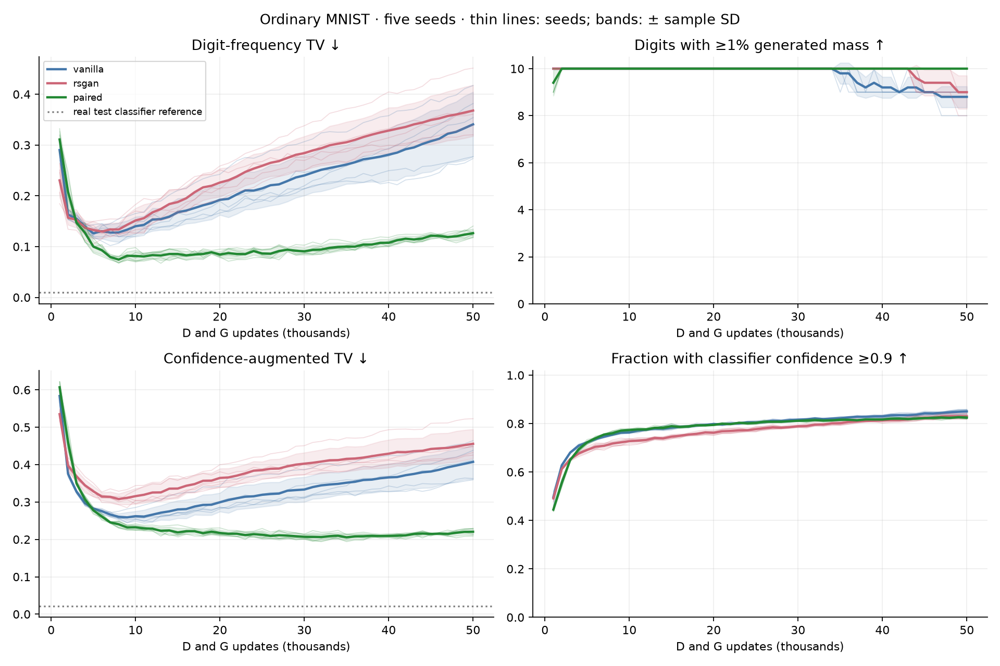
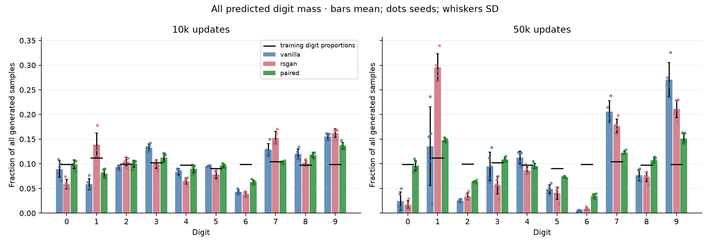
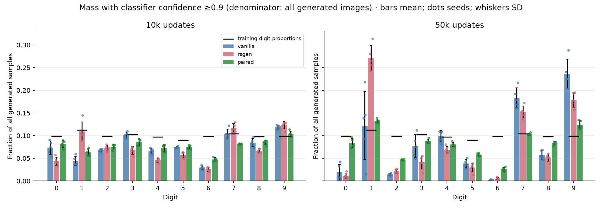
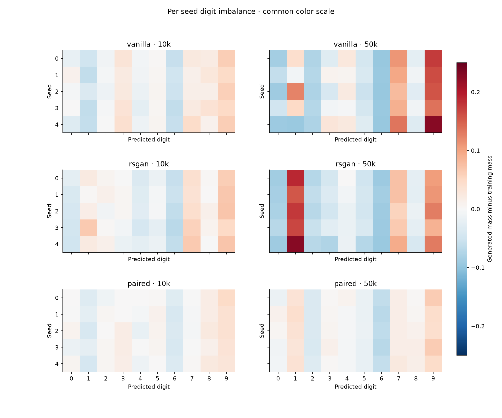
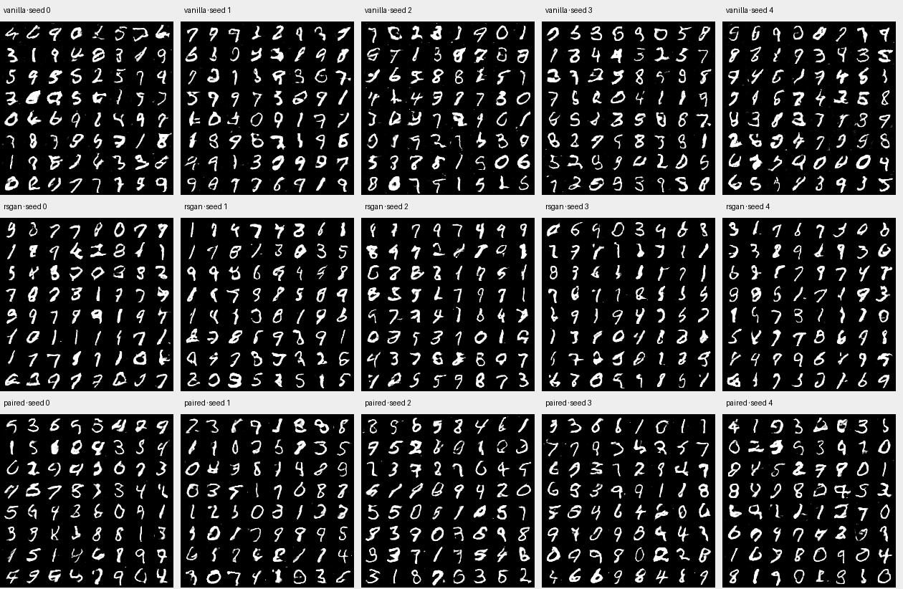
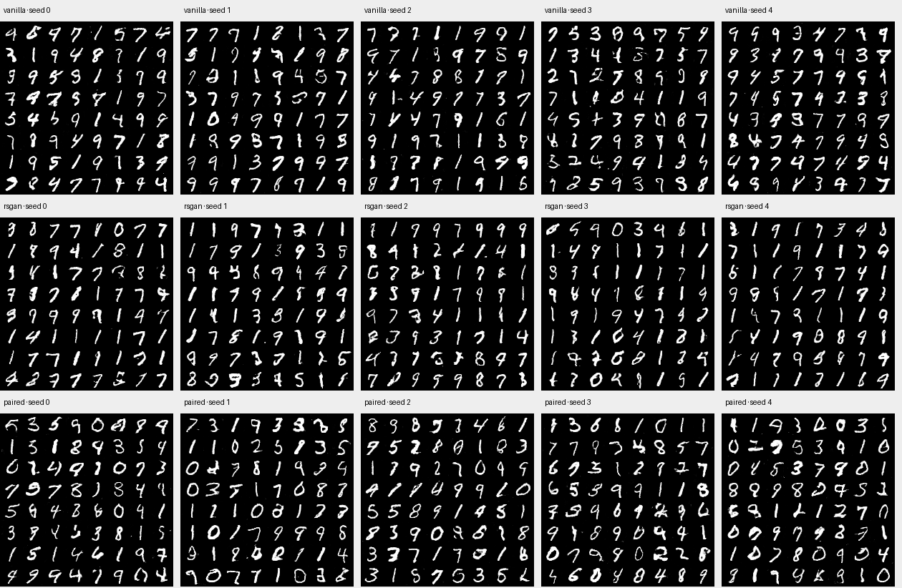
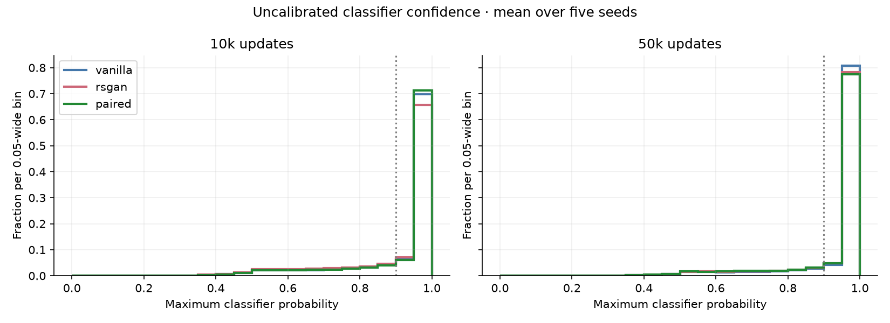

# MNIST: matched vanilla, RSGAN and paired

Five seeds per method, unconditional native 28×28 images, 50k D and G updates, evaluation every 1k. G architecture and update batch are identical across methods. Digit labels are used only for evaluation.

[Protocol](../../docs/MNIST.md) · [Raw metrics](metrics.csv) · [Machine-readable summary](summary.json)

## Endpoint summaries

Mean ± sample standard deviation across five training seeds. Coverage requires at least 1% of all generated images per digit. Confidence-filtered metrics use a fixed 0.9 classifier threshold.

| Updates | Method | Digit coverage /10 | Mode TV ↓ | Confidence-filtered coverage /10 | Confidence acceptance % | Confidence-augmented TV ↓ |
|---|---|---:|---:|---:|---:|---:|
| 10k | vanilla | 10.000 ± 0.000 | 0.140 ± 0.019 | 10.000 ± 0.000 | 76.304 ± 0.199 | 0.262 ± 0.013 |
| 10k | rsgan | 10.000 ± 0.000 | 0.151 ± 0.024 | 10.000 ± 0.000 | 72.754 ± 1.069 | 0.316 ± 0.021 |
| 10k | paired | 10.000 ± 0.000 | 0.082 ± 0.011 | 10.000 ± 0.000 | 77.300 ± 0.619 | 0.232 ± 0.007 |
| 50k | vanilla | 8.800 ± 0.447 | 0.341 ± 0.064 | 8.400 ± 0.548 | 85.026 ± 0.905 | 0.407 ± 0.046 |
| 50k | rsgan | 9.000 ± 0.707 | 0.368 ± 0.050 | 8.600 ± 0.548 | 83.090 ± 1.017 | 0.456 ± 0.039 |
| 50k | paired | 10.000 ± 0.000 | 0.126 ± 0.008 | 10.000 ± 0.000 | 82.458 ± 0.511 | 0.220 ± 0.009 |

## Individual endpoints

| Method | Seed | Updates | Digit coverage | Mode TV | Confidence coverage | Confidence acceptance | Confidence-augmented TV |
|---|---:|---:|---:|---:|---:|---:|---:|
| vanilla | 0 | 10000 | 10 | 0.1423 | 10 | 76.43% | 0.2601 |
| vanilla | 1 | 10000 | 10 | 0.1245 | 10 | 76.04% | 0.2532 |
| vanilla | 2 | 10000 | 10 | 0.1193 | 10 | 76.39% | 0.2572 |
| vanilla | 3 | 10000 | 10 | 0.1494 | 10 | 76.51% | 0.2545 |
| vanilla | 4 | 10000 | 10 | 0.1652 | 10 | 76.15% | 0.2854 |
| rsgan | 0 | 10000 | 10 | 0.1331 | 10 | 73.80% | 0.2950 |
| rsgan | 1 | 10000 | 10 | 0.1264 | 10 | 72.57% | 0.3037 |
| rsgan | 2 | 10000 | 10 | 0.1448 | 10 | 73.51% | 0.3043 |
| rsgan | 3 | 10000 | 10 | 0.1828 | 10 | 72.83% | 0.3314 |
| rsgan | 4 | 10000 | 10 | 0.1701 | 10 | 71.06% | 0.3439 |
| paired | 0 | 10000 | 10 | 0.0713 | 10 | 77.31% | 0.2415 |
| paired | 1 | 10000 | 10 | 0.0722 | 10 | 78.03% | 0.2245 |
| paired | 2 | 10000 | 10 | 0.0980 | 10 | 77.13% | 0.2333 |
| paired | 3 | 10000 | 10 | 0.0777 | 10 | 77.65% | 0.2260 |
| paired | 4 | 10000 | 10 | 0.0885 | 10 | 76.38% | 0.2362 |
| vanilla | 0 | 50000 | 9 | 0.3540 | 8 | 85.46% | 0.4126 |
| vanilla | 1 | 50000 | 9 | 0.2773 | 9 | 83.84% | 0.3627 |
| vanilla | 2 | 50000 | 9 | 0.3817 | 8 | 85.77% | 0.4382 |
| vanilla | 3 | 50000 | 9 | 0.2734 | 9 | 84.28% | 0.3594 |
| vanilla | 4 | 50000 | 8 | 0.4172 | 8 | 85.78% | 0.4642 |
| rsgan | 0 | 50000 | 9 | 0.3673 | 8 | 83.94% | 0.4494 |
| rsgan | 1 | 50000 | 10 | 0.3399 | 9 | 82.51% | 0.4326 |
| rsgan | 2 | 50000 | 9 | 0.3606 | 9 | 83.01% | 0.4479 |
| rsgan | 3 | 50000 | 9 | 0.3202 | 9 | 81.76% | 0.4256 |
| rsgan | 4 | 50000 | 8 | 0.4515 | 8 | 84.23% | 0.5229 |
| paired | 0 | 50000 | 10 | 0.1277 | 10 | 82.39% | 0.2282 |
| paired | 1 | 50000 | 10 | 0.1219 | 10 | 83.10% | 0.2140 |
| paired | 2 | 50000 | 10 | 0.1186 | 10 | 82.85% | 0.2087 |
| paired | 3 | 50000 | 10 | 0.1404 | 10 | 81.91% | 0.2296 |
| paired | 4 | 50000 | 10 | 0.1239 | 10 | 82.04% | 0.2218 |

## Random fixed-noise samples

The same 64 fixed latent vectors are used for all methods/seeds/checkpoints. These grids are not confidence-selected.

### 10k

### 50k

## Samples grouped by predicted digit

Rows are predicted digits 0–9, with the first ten matching samples in fixed random evaluation order. They are not ranked by quality or confidence. Inspect for malformed digits, classifier errors, and repeated styles.

| Method / seed | 10k | 50k |
|---|---|---|
| vanilla / 0 | [Gallery](../mnist-v1/vanilla_seed0/by_predicted_digit_010000.png) | [Gallery](../mnist-v1/vanilla_seed0/by_predicted_digit_050000.png) |
| vanilla / 1 | [Gallery](../mnist-v1/vanilla_seed1/by_predicted_digit_010000.png) | [Gallery](../mnist-v1/vanilla_seed1/by_predicted_digit_050000.png) |
| vanilla / 2 | [Gallery](../mnist-v1/vanilla_seed2/by_predicted_digit_010000.png) | [Gallery](../mnist-v1/vanilla_seed2/by_predicted_digit_050000.png) |
| vanilla / 3 | [Gallery](../mnist-v1/vanilla_seed3/by_predicted_digit_010000.png) | [Gallery](../mnist-v1/vanilla_seed3/by_predicted_digit_050000.png) |
| vanilla / 4 | [Gallery](../mnist-v1/vanilla_seed4/by_predicted_digit_010000.png) | [Gallery](../mnist-v1/vanilla_seed4/by_predicted_digit_050000.png) |
| rsgan / 0 | [Gallery](rsgan_seed0/by_predicted_digit_010000.png) | [Gallery](rsgan_seed0/by_predicted_digit_050000.png) |
| rsgan / 1 | [Gallery](rsgan_seed1/by_predicted_digit_010000.png) | [Gallery](rsgan_seed1/by_predicted_digit_050000.png) |
| rsgan / 2 | [Gallery](rsgan_seed2/by_predicted_digit_010000.png) | [Gallery](rsgan_seed2/by_predicted_digit_050000.png) |
| rsgan / 3 | [Gallery](rsgan_seed3/by_predicted_digit_010000.png) | [Gallery](rsgan_seed3/by_predicted_digit_050000.png) |
| rsgan / 4 | [Gallery](rsgan_seed4/by_predicted_digit_010000.png) | [Gallery](rsgan_seed4/by_predicted_digit_050000.png) |
| paired / 0 | [Gallery](../mnist-v1/paired_seed0/by_predicted_digit_010000.png) | [Gallery](../mnist-v1/paired_seed0/by_predicted_digit_050000.png) |
| paired / 1 | [Gallery](../mnist-v1/paired_seed1/by_predicted_digit_010000.png) | [Gallery](../mnist-v1/paired_seed1/by_predicted_digit_050000.png) |
| paired / 2 | [Gallery](../mnist-v1/paired_seed2/by_predicted_digit_010000.png) | [Gallery](../mnist-v1/paired_seed2/by_predicted_digit_050000.png) |
| paired / 3 | [Gallery](../mnist-v1/paired_seed3/by_predicted_digit_010000.png) | [Gallery](../mnist-v1/paired_seed3/by_predicted_digit_050000.png) |
| paired / 4 | [Gallery](../mnist-v1/paired_seed4/by_predicted_digit_010000.png) | [Gallery](../mnist-v1/paired_seed4/by_predicted_digit_050000.png) |

## Evaluator and interpretation

The classifier was selected at epoch 8 using a 10k validation subset of the training split, after learning on the other 50k. Official-test accuracy is **99.14%**. It never supplies GAN gradients. Its checkpoint is frozen and hashed.

On official test images, classifier-based mode TV is 0.0094, confidence acceptance is 98.33%, and confidence-augmented TV is 0.0216. True-label sampling from the training proportions at n=10,000 gives average TV 0.0121, with central 95% interval [0.0066, 0.0187] over 1,000 draws.

MNIST is not exactly class balanced; the target is its empirical training-label distribution. Mode TV is half the sum of absolute differences between predicted generated proportions and that target. Confidence-augmented TV adds a rejected bucket with ideal target mass zero; real images can therefore have a nonzero score. Confidence is uncalibrated and can be wrong on generated images. These are digit-category proxies, not a proof of fidelity or within-digit style diversity.

Repeated checkpoints use the same evaluation noise and are correlated. Five seeds quantify training variability for this configuration, not generality over architectures or hyperparameters. No checkpoint selection or hyperparameter retuning was performed for this matched RSGAN extension. Evaluation data and classifier have shared research history; this is not untouched validation.

## Reproducibility and cost

| Method | Seed | Recorded training minutes | GPU |
|---|---:|---:|---|
| vanilla | 0 | 9.51 | NVIDIA A10 |
| vanilla | 1 | 9.35 | NVIDIA A10 |
| vanilla | 2 | 8.30 | NVIDIA A10G |
| vanilla | 3 | 9.36 | NVIDIA A10 |
| vanilla | 4 | 8.33 | NVIDIA A10G |
| rsgan | 0 | 11.19 | NVIDIA A10 |
| rsgan | 1 | 11.25 | NVIDIA A10 |
| rsgan | 2 | 11.20 | NVIDIA A10 |
| rsgan | 3 | 11.19 | NVIDIA A10 |
| rsgan | 4 | 11.11 | NVIDIA A10 |
| paired | 0 | 8.08 | NVIDIA A10 |
| paired | 1 | 7.50 | NVIDIA A10G |
| paired | 2 | 8.11 | NVIDIA A10 |
| paired | 3 | 8.10 | NVIDIA A10 |
| paired | 4 | 8.13 | NVIDIA A10 |

Training timings exclude evaluation and most checkpoint I/O. Same real/fake counts and optimizer updates do not imply equal D FLOPs: paired processes two channels jointly into the same hidden width. No wider-D or larger-D-batch arm is included here.

Seven local MNIST tests and the RSGAN CUDA gate passed. All 750 evaluation records passed configuration/reference/source checks. The sole archived trainer source difference is enabling RSGAN in METHODS. Original vanilla/paired artifacts are reused unchanged. Full checkpoints remain on Modal. Evaluation timing was not instrumented separately, so training time is not total GPU cost. Generator architecture and inference work per image are unchanged across methods.

## RSGAN comparison

RSGAN uses shared unary scores with pairwise logistic discriminator loss and the flipped generator target. The generator and unary discriminator initialize identically to vanilla for each seed. Primary endpoints were fixed at 10k and 50k before results; no checkpoint or seed selection. All reported aggregates average individual-seed metrics, not pooled distributions.

At 10k, paired has lower digit TV than RSGAN in 5/5 matched seeds and lower confidence-augmented TV in 5/5.
At 50k, paired has lower digit TV than RSGAN in 5/5 matched seeds and lower confidence-augmented TV in 5/5.

Visual inspection: RSGAN concentrates on 1, 7 and 9 at 50k and underrepresents 0, 2, 5 and 6. Paired has broader digit representation but still contains malformed/ambiguous samples. Neither classifier confidence nor these grids establishes complete image fidelity or within-digit diversity. RSGAN recorded 55.94 A10 training minutes total (11.19 per seed); evaluations and startup/I/O add unmeasured cost. Archived baseline timings include both A10 and A10G, so these are descriptive timings rather than a controlled speed benchmark.

Launcher packaging and verification restart/device-comparison issues were repaired before full training dispatch. No duplicate training jobs were launched. Small verification attempts and container startup/I/O are not included in recorded training time.
