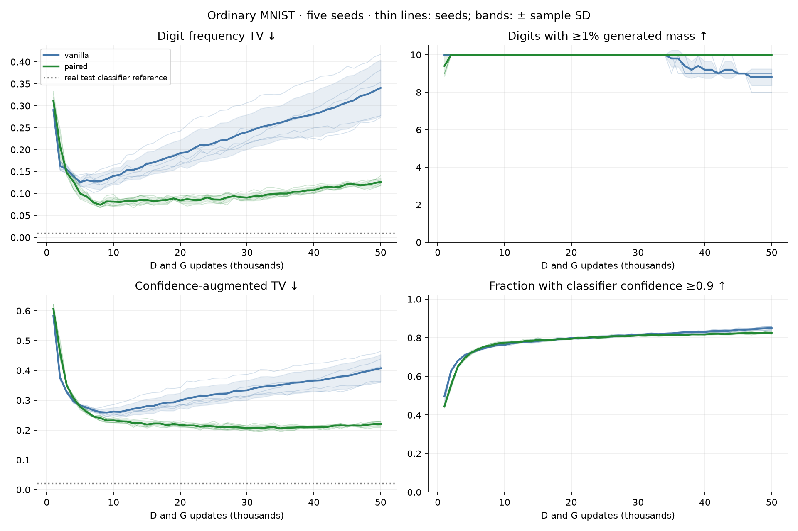
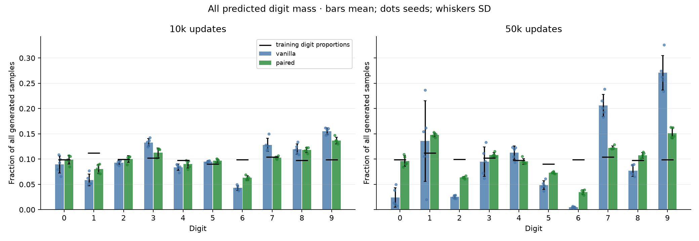
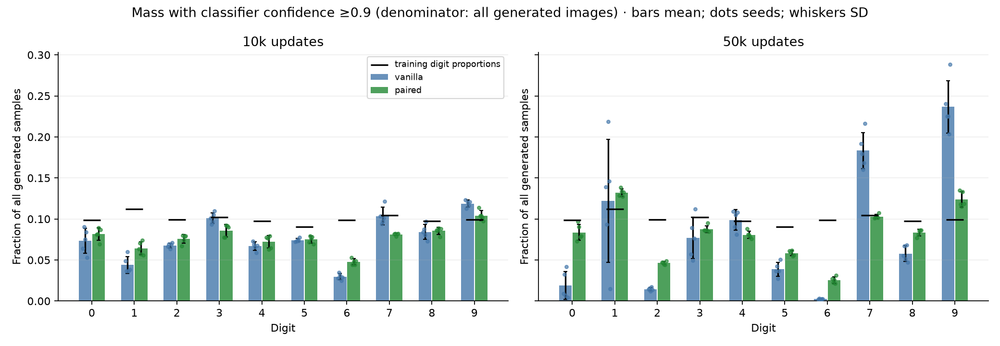
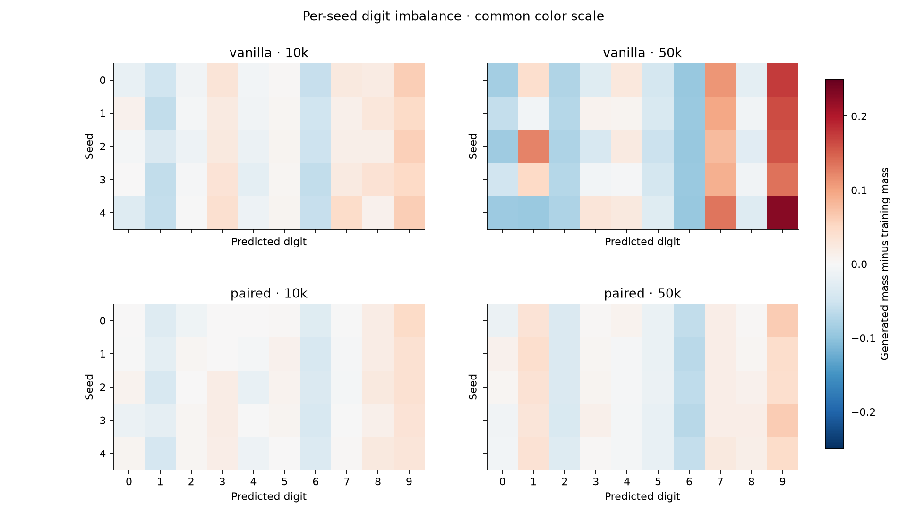
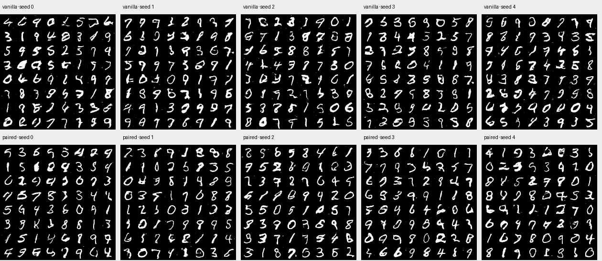
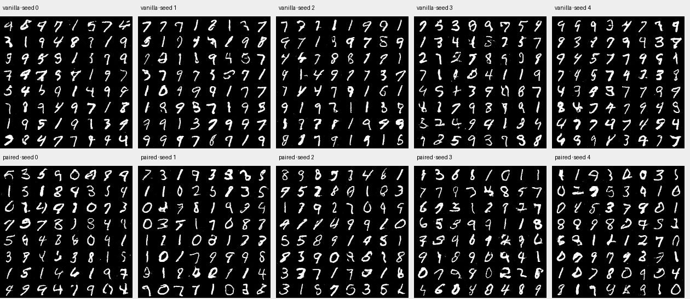
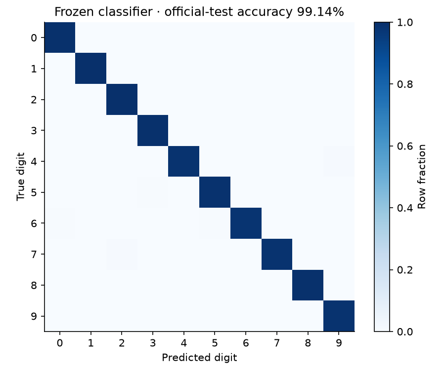
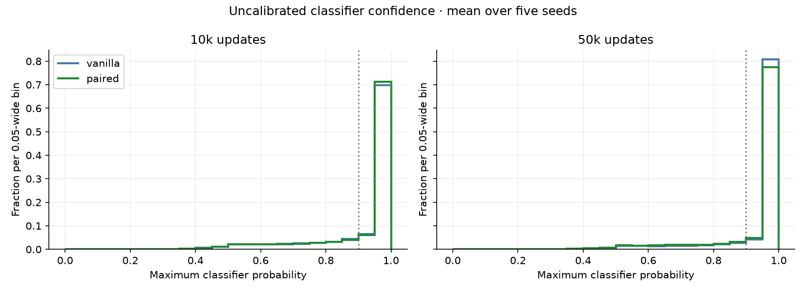

# Ordinary MNIST: vanilla versus paired

Five seeds per method, unconditional native 28×28 images, 50k D and G updates, evaluation every 1k. G architecture and update batch are identical between methods. Digit labels are used only for evaluation.

[Protocol](../../docs/MNIST.md) · [Raw metrics](metrics.csv) · [Machine-readable summary](summary.json)

## Findings

At 10k, all-ten-digit coverage is achieved by 5/5 vanilla and 5/5 paired runs. At 50k it is 0/5 vanilla versus 5/5 paired. Coverage means at least 1% generated mass per digit; it does not mean that undercovered digits never appear.

Paired has lower digit-frequency TV in 5/5 matched seeds at 10k and 5/5 at 50k. Mean TV at 50k is 0.341 for vanilla and 0.126 for paired.

At 50k, mean confidence acceptance is 85.0% for vanilla and 82.5% for paired. Paired has lower confidence-augmented TV in 5/5 seeds. This distinguishes distribution balance from overall classifier confidence; neither is a complete fidelity metric.

The late digit imbalance is not visible from early coverage alone. Inspect the complete trajectories, per-digit masses, and random samples. This supports ordinary MNIST as an informative representation test in this configuration, without establishing a general ranking across architectures or a mechanism for the difference.

| Method / seed at 50k | Digits below 1% raw mass | Digits below 1% confidence-filtered mass |
|---|---|---|
| vanilla / 0 | 6 | 0, 6 |
| vanilla / 1 | 6 | 6 |
| vanilla / 2 | 6 | 0, 6 |
| vanilla / 3 | 6 | 6 |
| vanilla / 4 | 0, 6 | 0, 6 |
| paired / 0 | none | none |
| paired / 1 | none | none |
| paired / 2 | none | none |
| paired / 3 | none | none |
| paired / 4 | none | none |

## Endpoint summaries

Mean ± sample standard deviation across five training seeds. Coverage requires at least 1% of all generated images per digit. Confidence-filtered metrics use a fixed 0.9 classifier threshold.

| Updates | Method | Digit coverage /10 | Mode TV ↓ | Confidence-filtered coverage /10 | Confidence acceptance % | Confidence-augmented TV ↓ |
|---|---|---:|---:|---:|---:|---:|
| 10k | vanilla | 10.000 ± 0.000 | 0.140 ± 0.019 | 10.000 ± 0.000 | 76.304 ± 0.199 | 0.262 ± 0.013 |
| 10k | paired | 10.000 ± 0.000 | 0.082 ± 0.011 | 10.000 ± 0.000 | 77.300 ± 0.619 | 0.232 ± 0.007 |
| 50k | vanilla | 8.800 ± 0.447 | 0.341 ± 0.064 | 8.400 ± 0.548 | 85.026 ± 0.905 | 0.407 ± 0.046 |
| 50k | paired | 10.000 ± 0.000 | 0.126 ± 0.008 | 10.000 ± 0.000 | 82.458 ± 0.511 | 0.220 ± 0.009 |

## Individual endpoints

| Method | Seed | Updates | Digit coverage | Mode TV | Confidence coverage | Confidence acceptance | Confidence-augmented TV |
|---|---:|---:|---:|---:|---:|---:|---:|
| vanilla | 0 | 10000 | 10 | 0.1423 | 10 | 76.43% | 0.2601 |
| vanilla | 1 | 10000 | 10 | 0.1245 | 10 | 76.04% | 0.2532 |
| vanilla | 2 | 10000 | 10 | 0.1193 | 10 | 76.39% | 0.2572 |
| vanilla | 3 | 10000 | 10 | 0.1494 | 10 | 76.51% | 0.2545 |
| vanilla | 4 | 10000 | 10 | 0.1652 | 10 | 76.15% | 0.2854 |
| paired | 0 | 10000 | 10 | 0.0713 | 10 | 77.31% | 0.2415 |
| paired | 1 | 10000 | 10 | 0.0722 | 10 | 78.03% | 0.2245 |
| paired | 2 | 10000 | 10 | 0.0980 | 10 | 77.13% | 0.2333 |
| paired | 3 | 10000 | 10 | 0.0777 | 10 | 77.65% | 0.2260 |
| paired | 4 | 10000 | 10 | 0.0885 | 10 | 76.38% | 0.2362 |
| vanilla | 0 | 50000 | 9 | 0.3540 | 8 | 85.46% | 0.4126 |
| vanilla | 1 | 50000 | 9 | 0.2773 | 9 | 83.84% | 0.3627 |
| vanilla | 2 | 50000 | 9 | 0.3817 | 8 | 85.77% | 0.4382 |
| vanilla | 3 | 50000 | 9 | 0.2734 | 9 | 84.28% | 0.3594 |
| vanilla | 4 | 50000 | 8 | 0.4172 | 8 | 85.78% | 0.4642 |
| paired | 0 | 50000 | 10 | 0.1277 | 10 | 82.39% | 0.2282 |
| paired | 1 | 50000 | 10 | 0.1219 | 10 | 83.10% | 0.2140 |
| paired | 2 | 50000 | 10 | 0.1186 | 10 | 82.85% | 0.2087 |
| paired | 3 | 50000 | 10 | 0.1404 | 10 | 81.91% | 0.2296 |
| paired | 4 | 50000 | 10 | 0.1239 | 10 | 82.04% | 0.2218 |

## Random fixed-noise samples

The same 64 fixed latent vectors are used for all methods/seeds/checkpoints. These grids are not confidence-selected.

### 10k

### 50k

## Samples grouped by predicted digit

Rows are predicted digits 0–9, with the first ten matching samples in fixed random evaluation order. They are not ranked by quality or confidence. Inspect for malformed digits, classifier errors, and repeated styles.

| Method / seed | 10k | 50k |
|---|---|---|
| vanilla / 0 | [Gallery](vanilla_seed0/by_predicted_digit_010000.png) | [Gallery](vanilla_seed0/by_predicted_digit_050000.png) |
| vanilla / 1 | [Gallery](vanilla_seed1/by_predicted_digit_010000.png) | [Gallery](vanilla_seed1/by_predicted_digit_050000.png) |
| vanilla / 2 | [Gallery](vanilla_seed2/by_predicted_digit_010000.png) | [Gallery](vanilla_seed2/by_predicted_digit_050000.png) |
| vanilla / 3 | [Gallery](vanilla_seed3/by_predicted_digit_010000.png) | [Gallery](vanilla_seed3/by_predicted_digit_050000.png) |
| vanilla / 4 | [Gallery](vanilla_seed4/by_predicted_digit_010000.png) | [Gallery](vanilla_seed4/by_predicted_digit_050000.png) |
| paired / 0 | [Gallery](paired_seed0/by_predicted_digit_010000.png) | [Gallery](paired_seed0/by_predicted_digit_050000.png) |
| paired / 1 | [Gallery](paired_seed1/by_predicted_digit_010000.png) | [Gallery](paired_seed1/by_predicted_digit_050000.png) |
| paired / 2 | [Gallery](paired_seed2/by_predicted_digit_010000.png) | [Gallery](paired_seed2/by_predicted_digit_050000.png) |
| paired / 3 | [Gallery](paired_seed3/by_predicted_digit_010000.png) | [Gallery](paired_seed3/by_predicted_digit_050000.png) |
| paired / 4 | [Gallery](paired_seed4/by_predicted_digit_010000.png) | [Gallery](paired_seed4/by_predicted_digit_050000.png) |

## Evaluator and interpretation

The classifier was selected at epoch 8 using a 10k validation subset of the training split, after learning on the other 50k. Official-test accuracy is **99.14%**. It never supplies GAN gradients. Its checkpoint is frozen and hashed.

On official test images, classifier-based mode TV is 0.0094, confidence acceptance is 98.33%, and confidence-augmented TV is 0.0216. True-label sampling from the training proportions at n=10,000 gives average TV 0.0121, with central 95% interval [0.0066, 0.0187] over 1,000 draws.

MNIST is not exactly class balanced; the target is its empirical training-label distribution. Mode TV is half the sum of absolute differences between predicted generated proportions and that target. Confidence-augmented TV adds a rejected bucket with ideal target mass zero; real images can therefore have a nonzero score. Confidence is uncalibrated and can be wrong on generated images. These are digit-category proxies, not a proof of fidelity or within-digit style diversity.

Repeated checkpoints use the same evaluation noise and are correlated. Five seeds quantify training variability for this configuration, not generality over architectures or hyperparameters. No GAN selection or hyperparameter retuning uses the test set.

## Reproducibility and cost

| Method | Seed | Recorded training minutes | GPU |
|---|---:|---:|---|
| vanilla | 0 | 9.51 | NVIDIA A10 |
| vanilla | 1 | 9.35 | NVIDIA A10 |
| vanilla | 2 | 8.30 | NVIDIA A10G |
| vanilla | 3 | 9.36 | NVIDIA A10 |
| vanilla | 4 | 8.33 | NVIDIA A10G |
| paired | 0 | 8.08 | NVIDIA A10 |
| paired | 1 | 7.50 | NVIDIA A10G |
| paired | 2 | 8.11 | NVIDIA A10 |
| paired | 3 | 8.10 | NVIDIA A10 |
| paired | 4 | 8.13 | NVIDIA A10 |

Training timings exclude evaluation and most checkpoint I/O. Same real/fake counts and optimizer updates do not imply equal D FLOPs: paired processes two channels jointly into the same hidden width. No wider-D or larger-D-batch arm is included here.

63 local tests passed. CUDA checks established exact resume, identical G initialization, and identical training with versus without evaluation. All 500 evaluation records passed configuration/reference/source checks. Full G/D checkpoints every 10k and final optimizer/RNG states are retained locally/Modal; Git excludes large tensors and raw arrays.
