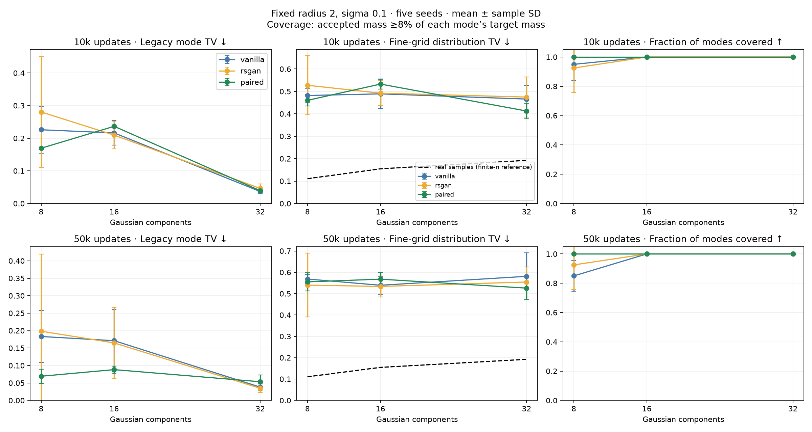
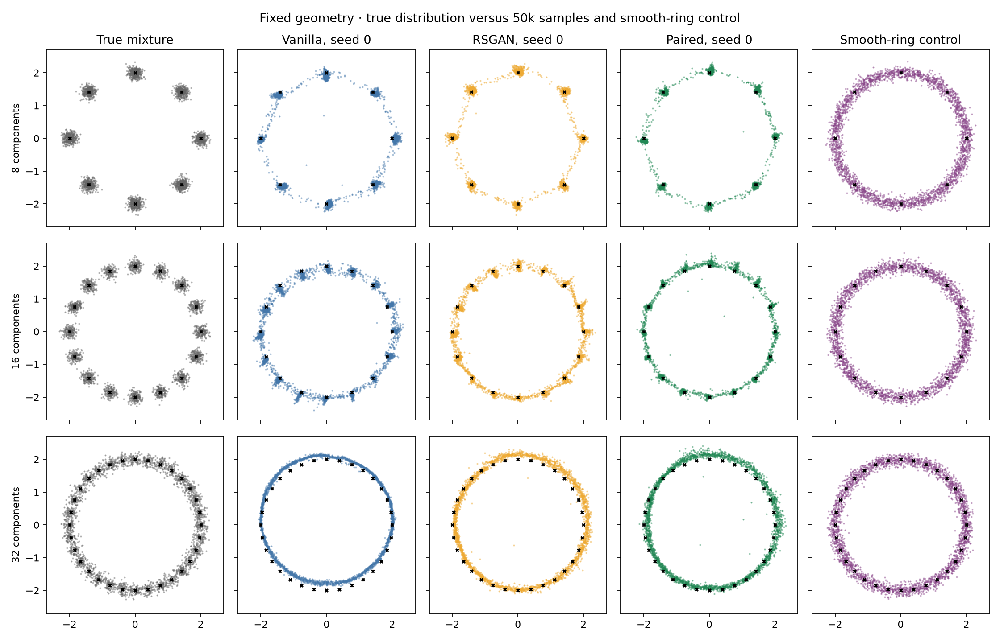

# Ring mode-count sweep

8, 16 and 32 equally weighted isotropic Gaussian components on a radius-2 ring, sigma 0.1 per axis. Original vanilla, RSGAN and paired objectives/networks; five seeds, 50k updates with retained 10k draws. Existing 8-mode runs reused unchanged; 30 new runs for 16/32 modes.

## Findings

At 16 components, all methods cover all modes in all five seeds at both endpoints, even with the original 1% cutoff. Paired has lower average legacy mode TV at 50k (0.088 versus 0.171 vanilla and 0.165 RSGAN), but worse fine-grid TV (0.568 versus 0.539 and 0.534). At 10k paired is worse on both mean metrics than the baselines.

At 32 components, every method covers all modes at both endpoints. At 50k paired has slightly worse legacy mode TV (0.0535 versus 0.0381 vanilla and 0.0347 RSGAN), but lower mean fine-grid TV (0.526 versus 0.581 and 0.554). All remain far from the real-sample fine-grid reference of 0.192. Samples show thin rings and imperfect component structure, so full reported coverage is not evidence that all Gaussian densities have been reproduced.

The new fine-grid audit also qualifies the original 8-mode result: at 50k paired has clearly better coarse mode balance, but fine-grid TV is similar across methods (0.555 paired, 0.568 vanilla, 0.540 RSGAN; real reference 0.111). The 8-mode coverage finding remains valid; it is not a full-density fidelity result. Mean fine-grid TV worsens from 10k to 50k in every method/mode-count combination at the primary 0.05 cell width. Thin or shifted clusters, bridges and insufficient Gaussian spread are visible in the plots.

Adding components at fixed radius changes the geometry enough that it is not monotonically harder on coarse coverage. A future separation-preserving sweep would address a different question and would need to control for the accompanying change in data scale or Gaussian width. No such additional training is included here. Grid-width sensitivity at 0.025, 0.05 and 0.1 is retained in grid_sensitivity.json.

## Protocol and interpretation limits

Only component count changes. Increasing count also reduces separation and samples per component at fixed batch size: this is a fixed-geometry stress test, not an isolated causal test of number of modes. Adjacent means are 1.531, 0.780 and 0.392 apart (15.31, 7.80 and 3.92 sigma). Networks, learning rate, 256-sample batches, 1:1 updates, latent dimension and evaluation draws are unchanged. CPU training, one thread per run; four independent workers. Runtime is not a matched-compute benchmark against historical runs.

Legacy valid mass is assigned to the nearest mean when within 3 sigma; legacy mode TV includes an invalid category with target zero. The old 1%-of-all-samples coverage cutoff is retained, but corresponds to 8%, 16% and 32% of a component’s target mass as count increases. The main coverage comparison instead fixes this fraction at 8% of target mass (cutoffs 1%, 0.5%, 0.25%). Coverage remains a coarse threshold and should not replace distributional metrics.

At 32 components the 3-sigma acceptance disks overlap. A smooth ring may score well without producing the specified Gaussian density. Fine-grid TV therefore bins all samples into fixed 0.05×0.05 cells on [-3,3]² plus an outside category, and compares their mass with exact Gaussian-mixture cell probabilities computed via the normal CDF. It includes spatial shape within and between components. The same grid applies to every mode count. Finite samples make its ideal-distribution score nonzero: 200 independent real draws of 10,000 points provide the reference mean and central 95% interval. This interval describes real-sample variability, not training uncertainty.

## Endpoint results

Mean ± sample SD across five training seeds. Relative coverage uses ≥8% of target mass.

| Modes | Updates | Method | Legacy mode TV ↓ | Fine-grid TV ↓ | Relative coverage | Full-coverage seeds |
|---:|---:|---|---:|---:|---:|---:|
| 8 | 10000 | vanilla | 0.226 ± 0.072 | 0.482 ± 0.031 | 7.6/8 | 4/5 |
| 8 | 10000 | rsgan | 0.281 ± 0.170 | 0.527 ± 0.131 | 7.4/8 | 4/5 |
| 8 | 10000 | paired | 0.169 ± 0.003 | 0.460 ± 0.026 | 8.0/8 | 5/5 |
| 8 | 50000 | vanilla | 0.183 ± 0.074 | 0.568 ± 0.021 | 6.8/8 | 1/5 |
| 8 | 50000 | rsgan | 0.198 ± 0.220 | 0.540 ± 0.149 | 7.4/8 | 4/5 |
| 8 | 50000 | paired | 0.069 ± 0.020 | 0.555 ± 0.043 | 8.0/8 | 5/5 |
| 16 | 10000 | vanilla | 0.216 ± 0.038 | 0.489 ± 0.064 | 16.0/16 | 5/5 |
| 16 | 10000 | rsgan | 0.210 ± 0.042 | 0.492 ± 0.056 | 16.0/16 | 5/5 |
| 16 | 10000 | paired | 0.236 ± 0.002 | 0.533 ± 0.023 | 16.0/16 | 5/5 |
| 16 | 50000 | vanilla | 0.171 ± 0.089 | 0.539 ± 0.042 | 16.0/16 | 5/5 |
| 16 | 50000 | rsgan | 0.165 ± 0.102 | 0.534 ± 0.049 | 16.0/16 | 5/5 |
| 16 | 50000 | paired | 0.088 ± 0.010 | 0.568 ± 0.033 | 16.0/16 | 5/5 |
| 32 | 10000 | vanilla | 0.037 ± 0.006 | 0.466 ± 0.061 | 32.0/32 | 5/5 |
| 32 | 10000 | rsgan | 0.046 ± 0.014 | 0.475 ± 0.090 | 32.0/32 | 5/5 |
| 32 | 10000 | paired | 0.039 ± 0.004 | 0.413 ± 0.035 | 32.0/32 | 5/5 |
| 32 | 50000 | vanilla | 0.038 ± 0.011 | 0.581 ± 0.110 | 32.0/32 | 5/5 |
| 32 | 50000 | rsgan | 0.035 ± 0.012 | 0.554 ± 0.070 | 32.0/32 | 5/5 |
| 32 | 50000 | paired | 0.054 ± 0.019 | 0.526 ± 0.055 | 32.0/32 | 5/5 |

## Real-distribution and smooth-ring controls

| Modes | Real fine-grid TV mean | Real central 95% | Smooth-ring fine-grid TV | Smooth-ring legacy TV |
|---:|---:|---|---:|---:|
| 8 | 0.1106 | [0.10570249429979374, 0.1165523034896338] | 0.7072 | 0.6360 |
| 16 | 0.1547 | [0.1483031335312402, 0.16072530672749877] | 0.5152 | 0.2862 |
| 32 | 0.1924 | [0.18639269113956808, 0.19768746247370922] | 0.2620 | 0.0257 |

## Samples and accepted mass

- [10k samples, every seed](samples_10k.png)
- [50k samples, every seed](samples_50k.png)
- [10k accepted mass](accepted_mass_10k.png)
- [50k accepted mass](accepted_mass_50k.png)

## Reproduce

Run `uv run python -m paired_discriminator.ring_mode_sweep` in a fresh output version; it refuses to overwrite existing results. Build this report with `uv run python -m paired_discriminator.ring_mode_sweep_report results/ring-mode-count-v1`. Configurations: `configs/ring16-50k.json` and `configs/ring32-50k.json`. Source snapshots and sample hashes are verified; all 90 endpoint metrics are recomputed from saved samples. No GAN architecture or objective changes.
