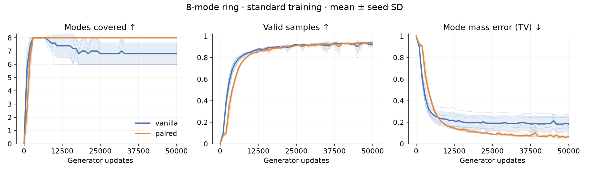
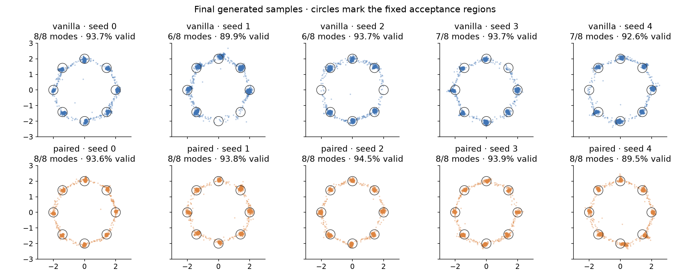
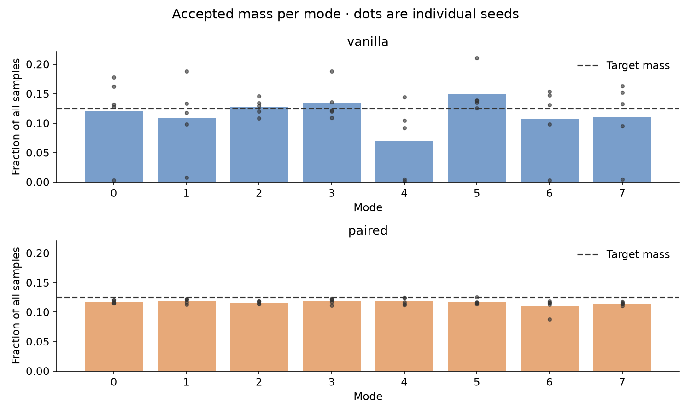

# Vanilla versus paired discriminator: eight-mode ring

5 paired seeds; 50,000 generator updates per run; batch 256; CPU threads 1; device cpu.

Results are at the prespecified final step, not each run's best checkpoint. Intervals below are sample standard deviations across seeds, not confidence intervals.

| Method | Modes covered | Valid samples | Mode TV ↓ | Mean training time | D parameters |
|---|---:|---:|---:|---:|---:|
| vanilla | 6.80 ± 0.84 | 92.7% ± 1.6% | 0.183 ± 0.074 | 45.9 s | 17,025 |
| paired | 8.00 ± 0.00 | 93.1% ± 2.0% | 0.069 ± 0.020 | 43.8 s | 17,281 |

## First-pilot interpretation

Paired covered every mode in 5/5 seeds; vanilla in 1/5. Paired had lower final mode TV in 5/5 matched seeds. Assess this alongside the validity figures above: coverage, mass balance, and concentration near the target centers are distinct outcomes.

The result warrants replication and equal-budget tuning; five seeds and one configuration do not establish general superiority or explain the mechanism.

| Seed | Vanilla coverage | Paired coverage | Vanilla TV | Paired TV |
|---|---:|---:|---:|---:|
| 0 | 8 | 8 | 0.100 | 0.064 |
| 1 | 6 | 8 | 0.250 | 0.062 |
| 2 | 6 | 8 | 0.272 | 0.055 |
| 3 | 7 | 8 | 0.151 | 0.061 |
| 4 | 7 | 8 | 0.142 | 0.105 |

## Definitions

Data: 8 equally weighted isotropic Gaussians, ring radius 2.0, per-axis standard deviation 0.1. Evaluation uses 10,000 fixed latent draws, separate from training randomness.

A sample is valid within 3.0σ of its nearest center. Coverage requires at least 1% of all evaluation samples per mode. Per-mode mass includes only valid samples. TV compares these masses plus an invalid category to uniform target weights and zero invalid mass. Even true 2-D Gaussians have about 1.1% of their mass outside a 3σ radius, so their finite-sample validity is not 100%.

## Controls and limits

Both methods share the generator architecture, initial generator weights, independent matched real/noise streams, optimizer settings, batch size, 1:1 update ratio, and seed list. The paired discriminator has two extra input features and slightly more parameters. Both use mean BCE for discriminator decisions and a non-saturating generator loss. Vanilla makes two unary decisions per real/fake pair; paired makes one randomized-slot decision. Equal update counts do not imply equal FLOPs. Timing excludes evaluations and checkpoint I/O.

This is one untuned configuration on an easy synthetic distribution; it is not evidence of general superiority or of a particular gradient mechanism. Seed-level comparisons matter.

## Plots

