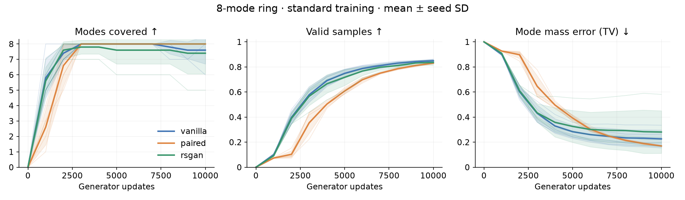
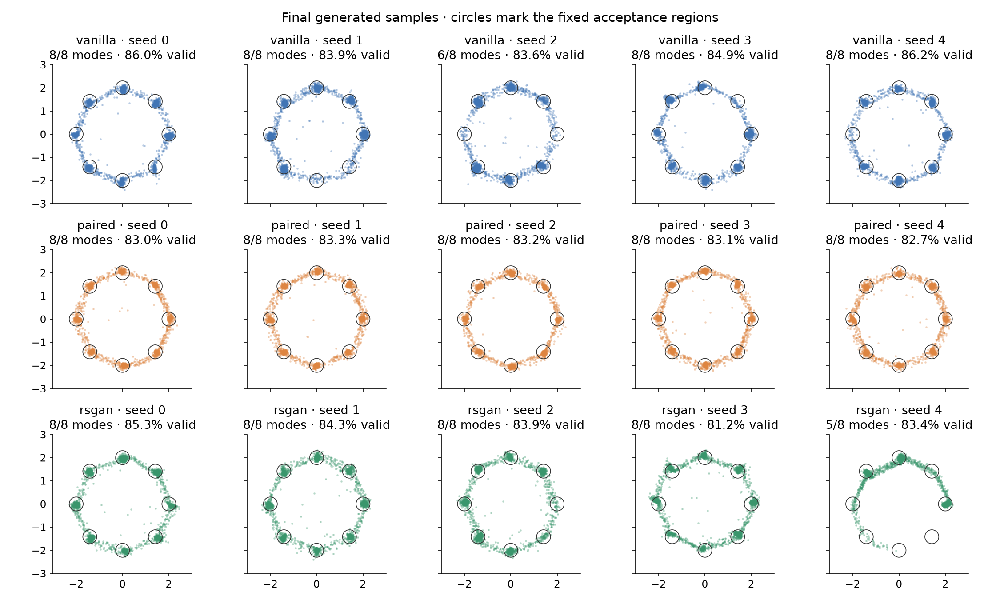
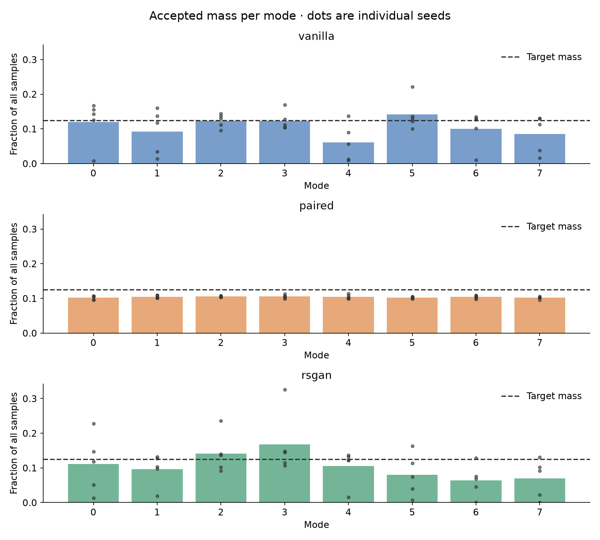

# GAN comparison: eight-mode ring

5 paired seeds; 10,000 generator updates per run; batch 256; CPU threads 1; device cpu.

Results are at the prespecified final step, not each run's best checkpoint. Intervals below are sample standard deviations across seeds, not confidence intervals.

| Method | Modes covered | Valid samples | Mode TV ↓ | Mean training time | D parameters |
|---|---:|---:|---:|---:|---:|
| vanilla | 7.60 ± 0.89 | 84.9% ± 1.2% | 0.226 ± 0.072 | 9.2 s | 17,025 |
| paired | 8.00 ± 0.00 | 83.1% ± 0.3% | 0.169 ± 0.003 | 8.8 s | 17,281 |
| rsgan | 7.40 ± 1.34 | 83.6% ± 1.5% | 0.281 ± 0.170 | 10.1 s | 17,025 |

## Definitions

Data: 8 equally weighted isotropic Gaussians, ring radius 2.0, per-axis standard deviation 0.1. Evaluation uses 10,000 fixed latent draws, separate from training randomness.

A sample is valid within 3.0σ of its nearest center. Coverage requires at least 1% of all evaluation samples per mode. Per-mode mass includes only valid samples. TV compares these masses plus an invalid category to uniform target weights and zero invalid mass. Even true 2-D Gaussians have about 1.1% of their mass outside a 3σ radius, so their finite-sample validity is not 100%.

## Controls and limits

All methods share the generator architecture, initial generator weights, independent matched real/noise streams, optimizer settings, batch size, 1:1 update ratio, and seed list. The paired discriminator has two extra input features and slightly more parameters. All use mean BCE for discriminator decisions and a non-saturating generator loss. Vanilla makes two unary decisions per real/fake pair; paired makes one randomized-slot decision. RSGAN uses BCE on C(real) − C(fake), with target 1 for D and 0 for G. Equal update counts do not imply equal FLOPs. Timing excludes evaluations and checkpoint I/O.

This is one untuned configuration on an easy synthetic distribution; it is not evidence of general superiority or of a particular gradient mechanism. Seed-level comparisons matter.

## Plots

