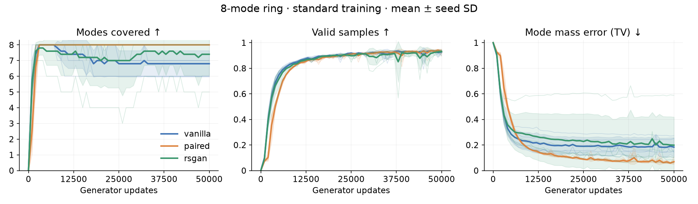
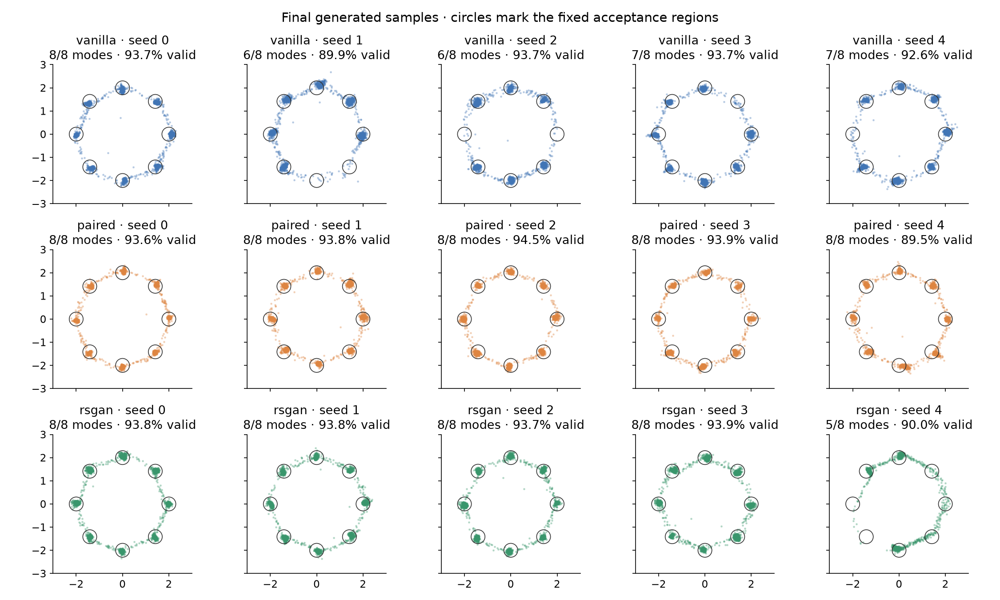

# Relativistic GAN comparison

RSGAN uses a shared unary critic C and logit C(real) − C(fake). D minimizes BCE with target 1; G minimizes BCE with target 0. This matches the [author's RSGAN implementation](https://github.com/AlexiaJM/RelativisticGAN#to-add-relativism-to-your-own-gans-in-pytorch-you-can-use-pieces-of-code-from-below). This is not the batch-average RaSGAN variant.

Same five seeds, initial generator weights, data/noise streams, optimizer, batch size, and evaluation draws. RSGAN and vanilla also have identical initial critic weights and 17,025 critic parameters; paired has 17,281. No method-specific tuning. Each D update sees 256 real and 256 fake samples. RSGAN makes 256 relative decisions, paired 256 joint decisions, and vanilla 512 unary decisions. Equal update budgets are not equal FLOPs.

RSGAN is trained once to 50k, with the prespecified 10k evaluation retained. These are two training budgets on the same trajectories, not independent arms. Existing vanilla/paired results are reused unchanged. No best-checkpoint selection.

Mean ± sample SD across seeds:

| Updates | Method | Modes covered | Valid samples | Mode TV ↓ |
|---:|---|---:|---:|---:|
| 10,000 | vanilla | 7.60 ± 0.89 | 84.9% ± 1.2% | 0.226 ± 0.072 |
| 10,000 | paired | 8.00 ± 0.00 | 83.1% ± 0.3% | 0.169 ± 0.003 |
| 10,000 | rsgan | 7.40 ± 1.34 | 83.6% ± 1.5% | 0.281 ± 0.170 |
| 50,000 | vanilla | 6.80 ± 0.84 | 92.7% ± 1.6% | 0.183 ± 0.074 |
| 50,000 | paired | 8.00 ± 0.00 | 93.1% ± 2.0% | 0.069 ± 0.020 |
| 50,000 | rsgan | 7.40 ± 1.34 | 93.0% ± 1.7% | 0.198 ± 0.220 |

## Individual seeds

| Updates | Method | Seed | Coverage | Valid samples | Mode TV |
|---:|---|---:|---:|---:|---:|
| 10000 | vanilla | 0 | 8 | 86.0% | 0.176 |
| 10000 | vanilla | 1 | 8 | 83.9% | 0.262 |
| 10000 | vanilla | 2 | 6 | 83.6% | 0.335 |
| 10000 | vanilla | 3 | 8 | 84.9% | 0.193 |
| 10000 | vanilla | 4 | 8 | 86.2% | 0.164 |
| 10000 | paired | 0 | 8 | 83.0% | 0.170 |
| 10000 | paired | 1 | 8 | 83.3% | 0.167 |
| 10000 | paired | 2 | 8 | 83.2% | 0.168 |
| 10000 | paired | 3 | 8 | 83.1% | 0.169 |
| 10000 | paired | 4 | 8 | 82.7% | 0.173 |
| 10000 | rsgan | 0 | 8 | 85.3% | 0.196 |
| 10000 | rsgan | 1 | 8 | 84.3% | 0.169 |
| 10000 | rsgan | 2 | 8 | 83.9% | 0.238 |
| 10000 | rsgan | 3 | 8 | 81.2% | 0.219 |
| 10000 | rsgan | 4 | 5 | 83.4% | 0.581 |
| 50000 | vanilla | 0 | 8 | 93.7% | 0.100 |
| 50000 | vanilla | 1 | 6 | 89.9% | 0.250 |
| 50000 | vanilla | 2 | 6 | 93.7% | 0.272 |
| 50000 | vanilla | 3 | 7 | 93.7% | 0.151 |
| 50000 | vanilla | 4 | 7 | 92.6% | 0.142 |
| 50000 | paired | 0 | 8 | 93.6% | 0.064 |
| 50000 | paired | 1 | 8 | 93.8% | 0.062 |
| 50000 | paired | 2 | 8 | 94.5% | 0.055 |
| 50000 | paired | 3 | 8 | 93.9% | 0.061 |
| 50000 | paired | 4 | 8 | 89.5% | 0.105 |
| 50000 | rsgan | 0 | 8 | 93.8% | 0.103 |
| 50000 | rsgan | 1 | 8 | 93.8% | 0.063 |
| 50000 | rsgan | 2 | 8 | 93.7% | 0.155 |
| 50000 | rsgan | 3 | 8 | 93.9% | 0.083 |
| 50000 | rsgan | 4 | 5 | 90.0% | 0.588 |

## Late window: 40k–50k

Average within each seed over recorded evaluations, then across seeds. These correlated evaluations are not extra replicates.

| Method | Coverage | Valid samples | Mode TV |
|---|---:|---:|---:|
| vanilla | 6.80 | 92.7% | 0.187 |
| paired | 8.00 | 93.1% | 0.070 |
| rsgan | 7.42 | 91.4% | 0.211 |

## Figures and data

[10k report](10k/REPORT.md) · [50k report](50k/REPORT.md) · [All seed endpoints](endpoints.csv)

This remains one untuned synthetic task. Metrics assess mode coverage, accepted mass balance, and proximity to centers, not full within-mode distribution quality. Results do not establish general superiority or the mechanism responsible.
